# IO流（java.io包）

- 概念

&ensp;&ensp;&ensp;&ensp;- 在JAVA中把不同的输入/输出源（键盘、文件、网络等）抽象表述为“流”。

&ensp;&ensp;&ensp;&ensp;- 简单来说就是对程序而言的：input读取数据、output输出数据操作

&ensp;&ensp;&ensp;&ensp;- 分类

&ensp;&ensp;&ensp;&ensp;&ensp;&ensp;&ensp;&ensp;- 处理数据单位

&ensp;&ensp;&ensp;&ensp;&ensp;&ensp;&ensp;&ensp;&ensp;&ensp;&ensp;&ensp;- 字节流：一次读或写1字节的数据，也就是8位二进制，常见的有：视频、音频、图片、PDF、Excel

&ensp;&ensp;&ensp;&ensp;&ensp;&ensp;&ensp;&ensp;&ensp;&ensp;&ensp;&ensp;- 字符流：一次读或写1个字符，也就是至少1字节的数据（汉字是有占2-3字节的），也就是大于8位的二进制。常见的有文本.txt

&ensp;&ensp;&ensp;&ensp;&ensp;&ensp;&ensp;&ensp;&ensp;&ensp;&ensp;&ensp;- 两者区别

&ensp;&ensp;&ensp;&ensp;&ensp;&ensp;&ensp;&ensp;&ensp;&ensp;&ensp;&ensp;&ensp;&ensp;&ensp;&ensp;- 字节流和字符流操作的本质区别只有一个：字节流是原生的操作，字符流是经过处理后的操作。

&ensp;&ensp;&ensp;&ensp;&ensp;&ensp;&ensp;&ensp;&ensp;&ensp;&ensp;&ensp;&ensp;&ensp;&ensp;&ensp;- 字节流和字符流的区别在于数据处理单位的不同。一个是1字节一个2字节。

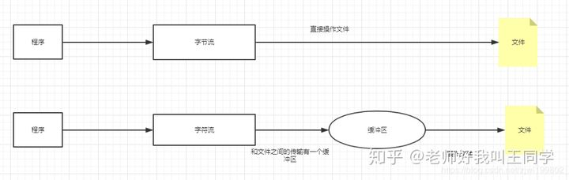

&ensp;&ensp;&ensp;&ensp;&ensp;&ensp;&ensp;&ensp;&ensp;&ensp;&ensp;&ensp;- 问题

&ensp;&ensp;&ensp;&ensp;&ensp;&ensp;&ensp;&ensp;&ensp;&ensp;&ensp;&ensp;&ensp;&ensp;&ensp;&ensp;- 字节流处理数据已经够用了，为什么还需要字符流

&ensp;&ensp;&ensp;&ensp;&ensp;&ensp;&ensp;&ensp;&ensp;&ensp;&ensp;&ensp;&ensp;&ensp;&ensp;&ensp;&ensp;&ensp;&ensp;&ensp;因为字节读取多字节标识的东西的时候，很可能会出现乱码情况，例如中文的汉字（汉字是有占2-3字节的）就可能出现乱码情况，然而字符流就完美解决了这个问题。

&ensp;&ensp;&ensp;&ensp;&ensp;&ensp;&ensp;&ensp;- 数据的流向方向

&ensp;&ensp;&ensp;&ensp;&ensp;&ensp;&ensp;&ensp;&ensp;&ensp;&ensp;&ensp;- 输入流：硬盘数据读入程序中。相对程序而言的，外部传入数据给程序需要借助输入流。

&ensp;&ensp;&ensp;&ensp;&ensp;&ensp;&ensp;&ensp;&ensp;&ensp;&ensp;&ensp;- 输出流：程序写出到硬盘上，相对程序而言的，程序把数据传输到外部需要借助输出流。

&ensp;&ensp;&ensp;&ensp;&ensp;&ensp;&ensp;&ensp;- 功能不同

&ensp;&ensp;&ensp;&ensp;&ensp;&ensp;&ensp;&ensp;&ensp;&ensp;&ensp;&ensp;- 节点流

&ensp;&ensp;&ensp;&ensp;&ensp;&ensp;&ensp;&ensp;&ensp;&ensp;&ensp;&ensp;&ensp;&ensp;&ensp;&ensp;- 节点流：可以从或向一个特定的地方（节点）读写数据

&ensp;&ensp;&ensp;&ensp;&ensp;&ensp;&ensp;&ensp;&ensp;&ensp;&ensp;&ensp;- 包装流（处理流）

&ensp;&ensp;&ensp;&ensp;&ensp;&ensp;&ensp;&ensp;&ensp;&ensp;&ensp;&ensp;&ensp;&ensp;&ensp;&ensp;- 包装流（处理流）简单理解：用来包装字节流。对节点流包装进行处理，增加了一些功能。是一种典型的装饰器设计模式。

&ensp;&ensp;&ensp;&ensp;&ensp;&ensp;&ensp;&ensp;&ensp;&ensp;&ensp;&ensp;&ensp;&ensp;&ensp;&ensp;- 处理流：又称高级流或包装流，处理流对一个已存在的流进行连接，通过封装后的流来进行读写。

&ensp;&ensp;&ensp;&ensp;&ensp;&ensp;&ensp;&ensp;&ensp;&ensp;&ensp;&ensp;- 图片

&ensp;&ensp;&ensp;&ensp;&ensp;&ensp;&ensp;&ensp;&ensp;&ensp;&ensp;&ensp;&ensp;&ensp;&ensp;&ensp;- 节点流直接通过程序操作数据源


&ensp;&ensp;&ensp;&ensp;&ensp;&ensp;&ensp;&ensp;&ensp;&ensp;&ensp;&ensp;&ensp;&ensp;&ensp;&ensp;- 包装流通过包装后，在通过节点流操作数据

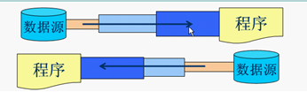

&ensp;&ensp;&ensp;&ensp;- 结构图


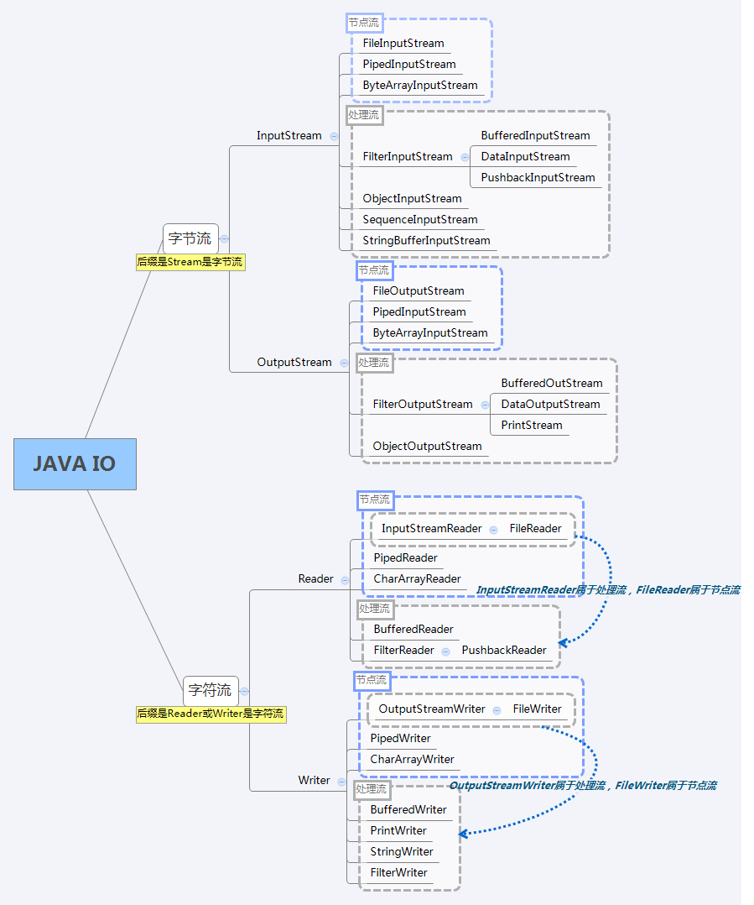

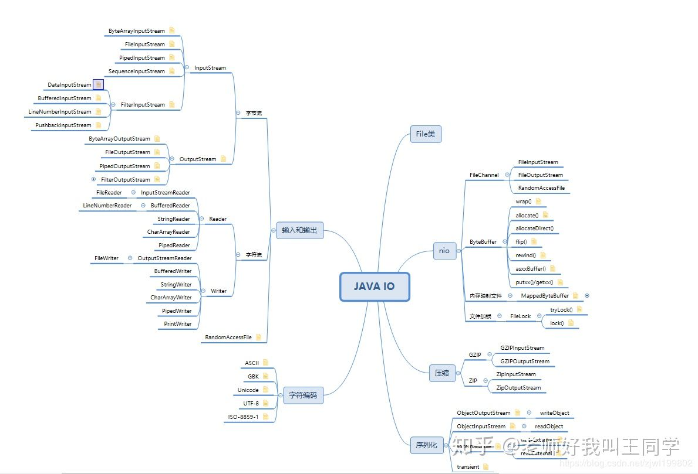

- 字节流、字符流内容

&ensp;&ensp;&ensp;&ensp;- 概念

&ensp;&ensp;&ensp;&ensp;&ensp;&ensp;&ensp;&ensp;- 按照处理数据单位划分为：字节流、字符流

&ensp;&ensp;&ensp;&ensp;&ensp;&ensp;&ensp;&ensp;- [处理数据单位](https://www.wolai.com/pLwaGi2r2usfHfNHMkHig1)

&ensp;&ensp;&ensp;&ensp;- 字节流

&ensp;&ensp;&ensp;&ensp;&ensp;&ensp;&ensp;&ensp;- 概念

&ensp;&ensp;&ensp;&ensp;&ensp;&ensp;&ensp;&ensp;&ensp;&ensp;&ensp;&ensp;- 按照流向方向划分为：输入流、输出流

&ensp;&ensp;&ensp;&ensp;&ensp;&ensp;&ensp;&ensp;&ensp;&ensp;&ensp;&ensp;- [数据的流向方向](https://www.wolai.com/jRorPtonvwnATmw76aGEik)

&ensp;&ensp;&ensp;&ensp;&ensp;&ensp;&ensp;&ensp;- 输入流（InputStream抽象类）

&ensp;&ensp;&ensp;&ensp;&ensp;&ensp;&ensp;&ensp;&ensp;&ensp;&ensp;&ensp;- 思路

&ensp;&ensp;&ensp;&ensp;&ensp;&ensp;&ensp;&ensp;&ensp;&ensp;&ensp;&ensp;&ensp;&ensp;&ensp;&ensp;- InputStream这个抽象类是表示输入字节流的所有类的超类。掌握这个就基本上掌握其他的类了

&ensp;&ensp;&ensp;&ensp;&ensp;&ensp;&ensp;&ensp;&ensp;&ensp;&ensp;&ensp;- 概念

&ensp;&ensp;&ensp;&ensp;&ensp;&ensp;&ensp;&ensp;&ensp;&ensp;&ensp;&ensp;&ensp;&ensp;&ensp;&ensp;- 按照功能不同划分为：节点流、包装流

&ensp;&ensp;&ensp;&ensp;&ensp;&ensp;&ensp;&ensp;&ensp;&ensp;&ensp;&ensp;&ensp;&ensp;&ensp;&ensp;- [功能不同](https://www.wolai.com/aLHT2nvXub7p911MQ4V8mj)

&ensp;&ensp;&ensp;&ensp;&ensp;&ensp;&ensp;&ensp;&ensp;&ensp;&ensp;&ensp;- 常用方法（InputStream抽象类）

&ensp;&ensp;&ensp;&ensp;&ensp;&ensp;&ensp;&ensp;&ensp;&ensp;&ensp;&ensp;&ensp;&ensp;&ensp;&ensp;- 这里以文件输入流为例，它是该抽象类的一个常用子类

```Java
    public static void main(String[] args) throws IOException {
        // test.txt文件中内容为”1234567890“，文件放在当前项目下
        InputStream in = new FileInputStream("test.txt");
        // 读取一个字节：返回的49是ascii码，对应的是0（读取1个字符）
        int read = in.read();
        // 读取指定长度字节位数，返回读取的字节数（读取8个字符）
        byte[] bytes = new byte[8];
        int read1 = in.read(bytes);
        // 读取指定长度字节位数，返回读取的字节数（读取最后1个字符）
        byte[] bytes1 = new byte[8];
        int read2 = in.read(bytes1, 2, 4);
        // 测试输入流是否支持mark和reset方法
        boolean b = in.markSupported();
        // 下一个可以读取（或者跳过的）字节数量估值
        int read3 = in.available();
        // 关闭流
        in.close();
    }
```


&ensp;&ensp;&ensp;&ensp;&ensp;&ensp;&ensp;&ensp;&ensp;&ensp;&ensp;&ensp;- 节点流

&ensp;&ensp;&ensp;&ensp;&ensp;&ensp;&ensp;&ensp;&ensp;&ensp;&ensp;&ensp;&ensp;&ensp;&ensp;&ensp;- 概念

&ensp;&ensp;&ensp;&ensp;&ensp;&ensp;&ensp;&ensp;&ensp;&ensp;&ensp;&ensp;&ensp;&ensp;&ensp;&ensp;&ensp;&ensp;&ensp;&ensp;- [节点流：可以从或向一个特定的地方（节点）读写数据](https://www.wolai.com/MZhKz2DELXfRD3ZNCnGhM)

&ensp;&ensp;&ensp;&ensp;&ensp;&ensp;&ensp;&ensp;&ensp;&ensp;&ensp;&ensp;&ensp;&ensp;&ensp;&ensp;- 思路

&ensp;&ensp;&ensp;&ensp;&ensp;&ensp;&ensp;&ensp;&ensp;&ensp;&ensp;&ensp;&ensp;&ensp;&ensp;&ensp;&ensp;&ensp;&ensp;&ensp;- 这几个类使用场景略有不同

&ensp;&ensp;&ensp;&ensp;&ensp;&ensp;&ensp;&ensp;&ensp;&ensp;&ensp;&ensp;&ensp;&ensp;&ensp;&ensp;&ensp;&ensp;&ensp;&ensp;- 主要从抽象父类开始学习，主要弄懂常用的类即可，另外几个类大同小异

&ensp;&ensp;&ensp;&ensp;&ensp;&ensp;&ensp;&ensp;&ensp;&ensp;&ensp;&ensp;&ensp;&ensp;&ensp;&ensp;&ensp;&ensp;&ensp;&ensp;- 结构图

&ensp;&ensp;&ensp;&ensp;&ensp;&ensp;&ensp;&ensp;&ensp;&ensp;&ensp;&ensp;&ensp;&ensp;&ensp;&ensp;&ensp;&ensp;&ensp;&ensp;&ensp;&ensp;&ensp;&ensp;- 相关结构图请看上面的[结构图](https://www.wolai.com/9ppP3ymScY8zd6SXHHJwsQ)

&ensp;&ensp;&ensp;&ensp;&ensp;&ensp;&ensp;&ensp;&ensp;&ensp;&ensp;&ensp;&ensp;&ensp;&ensp;&ensp;&ensp;&ensp;&ensp;&ensp;&ensp;&ensp;&ensp;&ensp;- 继承的接口AutoCloseable说明这个流是可以被自动关闭的，来自1.7之后的新特性“自动关闭IO流”。

&ensp;&ensp;&ensp;&ensp;&ensp;&ensp;&ensp;&ensp;&ensp;&ensp;&ensp;&ensp;&ensp;&ensp;&ensp;&ensp;&ensp;&ensp;&ensp;&ensp;&ensp;&ensp;&ensp;&ensp;- “自动关闭IO流”相关语法可以自行百度，或者参考[这篇文章](https://blog.csdn.net/sunnyzyq/article/details/85112440)。

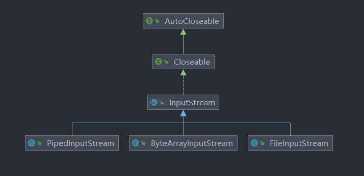

&ensp;&ensp;&ensp;&ensp;&ensp;&ensp;&ensp;&ensp;&ensp;&ensp;&ensp;&ensp;&ensp;&ensp;&ensp;&ensp;- FileInputStream、ByteArrayInputStream、PipedInputStream

&ensp;&ensp;&ensp;&ensp;&ensp;&ensp;&ensp;&ensp;&ensp;&ensp;&ensp;&ensp;&ensp;&ensp;&ensp;&ensp;&ensp;&ensp;&ensp;&ensp;- 基本都是父类方法，只是某些使用场景略有不同

&ensp;&ensp;&ensp;&ensp;&ensp;&ensp;&ensp;&ensp;&ensp;&ensp;&ensp;&ensp;&ensp;&ensp;&ensp;&ensp;&ensp;&ensp;&ensp;&ensp;- 文件：FileInputStream，读文件内容的时候使用

&ensp;&ensp;&ensp;&ensp;&ensp;&ensp;&ensp;&ensp;&ensp;&ensp;&ensp;&ensp;&ensp;&ensp;&ensp;&ensp;&ensp;&ensp;&ensp;&ensp;- 字节数组：ByteArrayInputStream，读取字节数组的时候使用

&ensp;&ensp;&ensp;&ensp;&ensp;&ensp;&ensp;&ensp;&ensp;&ensp;&ensp;&ensp;&ensp;&ensp;&ensp;&ensp;&ensp;&ensp;&ensp;&ensp;- 管道流：PipedInputStream

&ensp;&ensp;&ensp;&ensp;&ensp;&ensp;&ensp;&ensp;&ensp;&ensp;&ensp;&ensp;&ensp;&ensp;&ensp;&ensp;&ensp;&ensp;&ensp;&ensp;&ensp;&ensp;&ensp;&ensp;- 管道流使用场景：PipedInputStream，多线程环境下使用，实现线程之间数据传输

&ensp;&ensp;&ensp;&ensp;&ensp;&ensp;&ensp;&ensp;&ensp;&ensp;&ensp;&ensp;&ensp;&ensp;&ensp;&ensp;&ensp;&ensp;&ensp;&ensp;&ensp;&ensp;&ensp;&ensp;- 管道流使用场景：主要用于线程之间的数据传输，传输媒介是内存。

&ensp;&ensp;&ensp;&ensp;&ensp;&ensp;&ensp;&ensp;&ensp;&ensp;&ensp;&ensp;&ensp;&ensp;&ensp;&ensp;&ensp;&ensp;&ensp;&ensp;&ensp;&ensp;&ensp;&ensp;- [管道流](https://www.wolai.com/2zS8HMaU8GvfrKofomdWi4)（多线程场景使用）

&ensp;&ensp;&ensp;&ensp;&ensp;&ensp;&ensp;&ensp;&ensp;&ensp;&ensp;&ensp;- 包装流

&ensp;&ensp;&ensp;&ensp;&ensp;&ensp;&ensp;&ensp;&ensp;&ensp;&ensp;&ensp;&ensp;&ensp;&ensp;&ensp;- 概念

&ensp;&ensp;&ensp;&ensp;&ensp;&ensp;&ensp;&ensp;&ensp;&ensp;&ensp;&ensp;&ensp;&ensp;&ensp;&ensp;&ensp;&ensp;&ensp;&ensp;- [包装流（处理流）简单理解：用来包装字节流。对节点流包装进行处理，增加了一些功能。是一种典型的装饰器设计模式。](https://www.wolai.com/ebRWc9ENYDU5tMzv3dtoFm)

&ensp;&ensp;&ensp;&ensp;&ensp;&ensp;&ensp;&ensp;&ensp;&ensp;&ensp;&ensp;&ensp;&ensp;&ensp;&ensp;- 思路

&ensp;&ensp;&ensp;&ensp;&ensp;&ensp;&ensp;&ensp;&ensp;&ensp;&ensp;&ensp;&ensp;&ensp;&ensp;&ensp;&ensp;&ensp;&ensp;&ensp;- 结构图

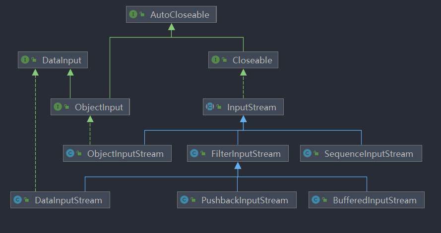

&ensp;&ensp;&ensp;&ensp;&ensp;&ensp;&ensp;&ensp;&ensp;&ensp;&ensp;&ensp;&ensp;&ensp;&ensp;&ensp;- SequenceInputStream序列流

&ensp;&ensp;&ensp;&ensp;&ensp;&ensp;&ensp;&ensp;&ensp;&ensp;&ensp;&ensp;&ensp;&ensp;&ensp;&ensp;&ensp;&ensp;&ensp;&ensp;应用场景为：多个文件合并到一个文件的场景。（注意看构造器）

&ensp;&ensp;&ensp;&ensp;&ensp;&ensp;&ensp;&ensp;&ensp;&ensp;&ensp;&ensp;&ensp;&ensp;&ensp;&ensp;- ObjectInputStream对象反序列化流

&ensp;&ensp;&ensp;&ensp;&ensp;&ensp;&ensp;&ensp;&ensp;&ensp;&ensp;&ensp;&ensp;&ensp;&ensp;&ensp;&ensp;&ensp;&ensp;&ensp;- 概念

&ensp;&ensp;&ensp;&ensp;&ensp;&ensp;&ensp;&ensp;&ensp;&ensp;&ensp;&ensp;&ensp;&ensp;&ensp;&ensp;&ensp;&ensp;&ensp;&ensp;&ensp;&ensp;&ensp;&ensp;> ObjectInputStream反序列化先前使用ObjectOutputStream编写的原始数据和对象


&ensp;&ensp;&ensp;&ensp;&ensp;&ensp;&ensp;&ensp;&ensp;&ensp;&ensp;&ensp;&ensp;&ensp;&ensp;&ensp;&ensp;&ensp;&ensp;&ensp;&ensp;&ensp;&ensp;&ensp;- 用于对象的反序列化，反序列化对象必须实现了Serializable接口

&ensp;&ensp;&ensp;&ensp;&ensp;&ensp;&ensp;&ensp;&ensp;&ensp;&ensp;&ensp;&ensp;&ensp;&ensp;&ensp;&ensp;&ensp;&ensp;&ensp;- 常用方法

```Java
        // 序列化存储列表对象
        ObjectOutputStream out = new ObjectOutputStream(new FileOutputStream("test.txt"));
        out.writeObject(Arrays.asList(1, 2, 3));
        // 反序列化
        ObjectInputStream in = new ObjectInputStream(new FileInputStream("test.txt"));
        Object o = in.readObject();
        // 还有很多read方法，都大同小异        
```


&ensp;&ensp;&ensp;&ensp;&ensp;&ensp;&ensp;&ensp;&ensp;&ensp;&ensp;&ensp;&ensp;&ensp;&ensp;&ensp;&ensp;&ensp;&ensp;&ensp;- 序列化、反序列化概念

&ensp;&ensp;&ensp;&ensp;&ensp;&ensp;&ensp;&ensp;&ensp;&ensp;&ensp;&ensp;&ensp;&ensp;&ensp;&ensp;&ensp;&ensp;&ensp;&ensp;&ensp;&ensp;&ensp;&ensp;序列化：将Java对象保存到硬盘上

&ensp;&ensp;&ensp;&ensp;&ensp;&ensp;&ensp;&ensp;&ensp;&ensp;&ensp;&ensp;&ensp;&ensp;&ensp;&ensp;&ensp;&ensp;&ensp;&ensp;&ensp;&ensp;&ensp;&ensp;反序列化：从硬盘上转换成Java对象

&ensp;&ensp;&ensp;&ensp;&ensp;&ensp;&ensp;&ensp;&ensp;&ensp;&ensp;&ensp;&ensp;&ensp;&ensp;&ensp;&ensp;&ensp;&ensp;&ensp;- 参考

&ensp;&ensp;&ensp;&ensp;&ensp;&ensp;&ensp;&ensp;&ensp;&ensp;&ensp;&ensp;&ensp;&ensp;&ensp;&ensp;&ensp;&ensp;&ensp;&ensp;&ensp;&ensp;&ensp;&ensp;[java IO笔记(序列化与ObjectInputStream、ObjectOutputStream) - moonfish - 博客园 (cnblogs.com)](https://www.cnblogs.com/moonfish1994/p/10222427.html)

&ensp;&ensp;&ensp;&ensp;&ensp;&ensp;&ensp;&ensp;&ensp;&ensp;&ensp;&ensp;&ensp;&ensp;&ensp;&ensp;&ensp;&ensp;&ensp;&ensp;&ensp;&ensp;&ensp;&ensp;[序列化和反序列化 - 知乎 (zhihu.com)](https://zhuanlan.zhihu.com/p/183763564)

&ensp;&ensp;&ensp;&ensp;&ensp;&ensp;&ensp;&ensp;&ensp;&ensp;&ensp;&ensp;&ensp;&ensp;&ensp;&ensp;&ensp;&ensp;&ensp;&ensp;&ensp;&ensp;&ensp;&ensp;[java序列化，看这篇就够了 - 9龙 - 博客园 (cnblogs.com)](https://www.cnblogs.com/9dragon/p/10901448.html)

&ensp;&ensp;&ensp;&ensp;&ensp;&ensp;&ensp;&ensp;&ensp;&ensp;&ensp;&ensp;&ensp;&ensp;&ensp;&ensp;&ensp;&ensp;&ensp;&ensp;&ensp;&ensp;&ensp;&ensp;[小伙子，你真的搞懂 transient 关键字了吗？ - 知乎 (zhihu.com)](https://zhuanlan.zhihu.com/p/58422235)

&ensp;&ensp;&ensp;&ensp;&ensp;&ensp;&ensp;&ensp;&ensp;&ensp;&ensp;&ensp;&ensp;&ensp;&ensp;&ensp;&ensp;&ensp;&ensp;&ensp;&ensp;&ensp;&ensp;&ensp;[Java transient关键字使用小记 - Alexia(minmin) - 博客园 (cnblogs.com)](https://www.cnblogs.com/lanxuezaipiao/p/3369962.html)

&ensp;&ensp;&ensp;&ensp;&ensp;&ensp;&ensp;&ensp;&ensp;&ensp;&ensp;&ensp;&ensp;&ensp;&ensp;&ensp;- FilterInputStream过滤流

&ensp;&ensp;&ensp;&ensp;&ensp;&ensp;&ensp;&ensp;&ensp;&ensp;&ensp;&ensp;&ensp;&ensp;&ensp;&ensp;&ensp;&ensp;&ensp;&ensp;- BufferedInputStream缓冲输入流

&ensp;&ensp;&ensp;&ensp;&ensp;&ensp;&ensp;&ensp;&ensp;&ensp;&ensp;&ensp;&ensp;&ensp;&ensp;&ensp;&ensp;&ensp;&ensp;&ensp;&ensp;&ensp;&ensp;&ensp;- 概念

&ensp;&ensp;&ensp;&ensp;&ensp;&ensp;&ensp;&ensp;&ensp;&ensp;&ensp;&ensp;&ensp;&ensp;&ensp;&ensp;&ensp;&ensp;&ensp;&ensp;&ensp;&ensp;&ensp;&ensp;&ensp;&ensp;&ensp;&ensp;> `BufferedInputStream`为另一个输入流添加了功能，即缓冲输入和支持`mark`和`reset`方法的功能。


&ensp;&ensp;&ensp;&ensp;&ensp;&ensp;&ensp;&ensp;&ensp;&ensp;&ensp;&ensp;&ensp;&ensp;&ensp;&ensp;&ensp;&ensp;&ensp;&ensp;&ensp;&ensp;&ensp;&ensp;&ensp;&ensp;&ensp;&ensp;- 缓冲输入流，用于包装输入流，提升读取数据的效率

&ensp;&ensp;&ensp;&ensp;&ensp;&ensp;&ensp;&ensp;&ensp;&ensp;&ensp;&ensp;&ensp;&ensp;&ensp;&ensp;&ensp;&ensp;&ensp;&ensp;&ensp;&ensp;&ensp;&ensp;- 代码示例

```Java
        // 使用“缓冲输入流”包装“文件输入流”提升读取效率
        BufferedInputStream in = new BufferedInputStream(new FileInputStream("test.txt"));

```


&ensp;&ensp;&ensp;&ensp;&ensp;&ensp;&ensp;&ensp;&ensp;&ensp;&ensp;&ensp;&ensp;&ensp;&ensp;&ensp;&ensp;&ensp;&ensp;&ensp;- DataInputStream数据流

&ensp;&ensp;&ensp;&ensp;&ensp;&ensp;&ensp;&ensp;&ensp;&ensp;&ensp;&ensp;&ensp;&ensp;&ensp;&ensp;&ensp;&ensp;&ensp;&ensp;&ensp;&ensp;&ensp;&ensp;- 概念

&ensp;&ensp;&ensp;&ensp;&ensp;&ensp;&ensp;&ensp;&ensp;&ensp;&ensp;&ensp;&ensp;&ensp;&ensp;&ensp;&ensp;&ensp;&ensp;&ensp;&ensp;&ensp;&ensp;&ensp;&ensp;&ensp;&ensp;&ensp;> 数据输入流允许应用程序以独立于机器的方式从底层输入流读取原始Java数据类型。 应用程序使用数据输出流来写入稍后可以被数据输入流读取的数据。


&ensp;&ensp;&ensp;&ensp;&ensp;&ensp;&ensp;&ensp;&ensp;&ensp;&ensp;&ensp;&ensp;&ensp;&ensp;&ensp;&ensp;&ensp;&ensp;&ensp;&ensp;&ensp;&ensp;&ensp;&ensp;&ensp;&ensp;&ensp;- 主要用于读取输入流中的数据，直接读取到指定的类型

&ensp;&ensp;&ensp;&ensp;&ensp;&ensp;&ensp;&ensp;&ensp;&ensp;&ensp;&ensp;&ensp;&ensp;&ensp;&ensp;&ensp;&ensp;&ensp;&ensp;&ensp;&ensp;&ensp;&ensp;- 代码

```Java
        // 使用“数据输入流”包装“文件输入流”读取数据，可以直接读取到指定的类型数据
        DataInputStream in = new DataInputStream(new FileInputStream("test.txt"));
        // 读取长整型
        long l = in.readLong();
        // 还可以读取其他类型数据
```


&ensp;&ensp;&ensp;&ensp;&ensp;&ensp;&ensp;&ensp;- 输出流（OutputStream抽象类）

&ensp;&ensp;&ensp;&ensp;&ensp;&ensp;&ensp;&ensp;&ensp;&ensp;&ensp;&ensp;- 思路

&ensp;&ensp;&ensp;&ensp;&ensp;&ensp;&ensp;&ensp;&ensp;&ensp;&ensp;&ensp;&ensp;&ensp;&ensp;&ensp;- 基本上和上面的输入流差不多，这里不再一一介绍所有的类，只保留大概的结构

&ensp;&ensp;&ensp;&ensp;&ensp;&ensp;&ensp;&ensp;&ensp;&ensp;&ensp;&ensp;- 概念

&ensp;&ensp;&ensp;&ensp;&ensp;&ensp;&ensp;&ensp;&ensp;&ensp;&ensp;&ensp;&ensp;&ensp;&ensp;&ensp;- 输出流基本和上面输入流差不多，只是变成了将程序数据写入到硬盘上

&ensp;&ensp;&ensp;&ensp;&ensp;&ensp;&ensp;&ensp;&ensp;&ensp;&ensp;&ensp;- 常用方法（OutputStream抽象类）

&ensp;&ensp;&ensp;&ensp;&ensp;&ensp;&ensp;&ensp;&ensp;&ensp;&ensp;&ensp;&ensp;&ensp;&ensp;&ensp;- 这里以文件输入流为例，它是该抽象类的一个常用子类

```Java
        // 写出流，写出数据到test.txt文件中
        OutputStream out = new FileOutputStream("test.txt");
        // 写出指定的ascii字符到文件中（数字1）
        out.write(49);
        // 写出指定的字节数组（数字234567890）
        byte[] bytes = {50, 51, 52, 53, 54, 55, 56, 57, 48};
        out.write(bytes);
        // 写出指定的字节数组，指定了偏移量与长度（字符ABC）
        byte[] bytes1 = {63, 64, 65, 66, 67};
        out.write(bytes1, 2, 3);
        // 刷新
        out.flush();
        // 关闭
        out.close();
```


&ensp;&ensp;&ensp;&ensp;&ensp;&ensp;&ensp;&ensp;&ensp;&ensp;&ensp;&ensp;- 节点流

&ensp;&ensp;&ensp;&ensp;&ensp;&ensp;&ensp;&ensp;&ensp;&ensp;&ensp;&ensp;&ensp;&ensp;&ensp;&ensp;- 概念

&ensp;&ensp;&ensp;&ensp;&ensp;&ensp;&ensp;&ensp;&ensp;&ensp;&ensp;&ensp;&ensp;&ensp;&ensp;&ensp;&ensp;&ensp;&ensp;&ensp;- 常用的几个输出字节流分别是FileOutputStream、ByteOutputStream、PipedOutputStream

&ensp;&ensp;&ensp;&ensp;&ensp;&ensp;&ensp;&ensp;&ensp;&ensp;&ensp;&ensp;&ensp;&ensp;&ensp;&ensp;&ensp;&ensp;&ensp;&ensp;- 结构图

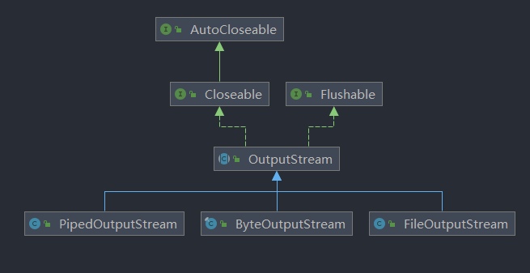

&ensp;&ensp;&ensp;&ensp;&ensp;&ensp;&ensp;&ensp;&ensp;&ensp;&ensp;&ensp;&ensp;&ensp;&ensp;&ensp;- FileOutputStream、ByteOutputStream、PipedOutputStream

&ensp;&ensp;&ensp;&ensp;&ensp;&ensp;&ensp;&ensp;&ensp;&ensp;&ensp;&ensp;&ensp;&ensp;&ensp;&ensp;&ensp;&ensp;&ensp;&ensp;- 常用方法都大同小异，只是使用场景略有不同

&ensp;&ensp;&ensp;&ensp;&ensp;&ensp;&ensp;&ensp;&ensp;&ensp;&ensp;&ensp;&ensp;&ensp;&ensp;&ensp;&ensp;&ensp;&ensp;&ensp;[管道流使用场景：主要用于线程之间的数据传输，传输媒介是内存。](https://www.wolai.com/wZWq35QGsmAX95moBZNsjc)

&ensp;&ensp;&ensp;&ensp;&ensp;&ensp;&ensp;&ensp;&ensp;&ensp;&ensp;&ensp;- 包装流

&ensp;&ensp;&ensp;&ensp;&ensp;&ensp;&ensp;&ensp;&ensp;&ensp;&ensp;&ensp;&ensp;&ensp;&ensp;&ensp;- 概念

&ensp;&ensp;&ensp;&ensp;&ensp;&ensp;&ensp;&ensp;&ensp;&ensp;&ensp;&ensp;&ensp;&ensp;&ensp;&ensp;&ensp;&ensp;&ensp;&ensp;- 常用的几个包装流如下所示，尤其是PrintStream

&ensp;&ensp;&ensp;&ensp;&ensp;&ensp;&ensp;&ensp;&ensp;&ensp;&ensp;&ensp;&ensp;&ensp;&ensp;&ensp;&ensp;&ensp;&ensp;&ensp;- 结构图


&ensp;&ensp;&ensp;&ensp;&ensp;&ensp;&ensp;&ensp;&ensp;&ensp;&ensp;&ensp;&ensp;&ensp;&ensp;&ensp;- ObjectOutputStream对象序列化流

&ensp;&ensp;&ensp;&ensp;&ensp;&ensp;&ensp;&ensp;&ensp;&ensp;&ensp;&ensp;&ensp;&ensp;&ensp;&ensp;&ensp;&ensp;&ensp;&ensp;- 和[ObjectInputStream对象反序列化流](https://www.wolai.com/pjzWStwSh1i99BN9Z3Ezjw)相对应，只不过这个是输出流

&ensp;&ensp;&ensp;&ensp;&ensp;&ensp;&ensp;&ensp;&ensp;&ensp;&ensp;&ensp;&ensp;&ensp;&ensp;&ensp;- FilterOutputStream过滤流

&ensp;&ensp;&ensp;&ensp;&ensp;&ensp;&ensp;&ensp;&ensp;&ensp;&ensp;&ensp;&ensp;&ensp;&ensp;&ensp;&ensp;&ensp;&ensp;&ensp;- 思路

&ensp;&ensp;&ensp;&ensp;&ensp;&ensp;&ensp;&ensp;&ensp;&ensp;&ensp;&ensp;&ensp;&ensp;&ensp;&ensp;&ensp;&ensp;&ensp;&ensp;&ensp;&ensp;&ensp;&ensp;- 和[FilterInputStream过滤流](https://www.wolai.com/drCuACaV6mwr7w9j364ocd)相对应，唯一不同的是PrintStream打印流，所以重点只看不一样的PrintStream打印流。

&ensp;&ensp;&ensp;&ensp;&ensp;&ensp;&ensp;&ensp;&ensp;&ensp;&ensp;&ensp;&ensp;&ensp;&ensp;&ensp;&ensp;&ensp;&ensp;&ensp;- PrintStream打印流

&ensp;&ensp;&ensp;&ensp;&ensp;&ensp;&ensp;&ensp;&ensp;&ensp;&ensp;&ensp;&ensp;&ensp;&ensp;&ensp;&ensp;&ensp;&ensp;&ensp;&ensp;&ensp;&ensp;&ensp;- 概念

&ensp;&ensp;&ensp;&ensp;&ensp;&ensp;&ensp;&ensp;&ensp;&ensp;&ensp;&ensp;&ensp;&ensp;&ensp;&ensp;&ensp;&ensp;&ensp;&ensp;&ensp;&ensp;&ensp;&ensp;&ensp;&ensp;&ensp;&ensp;> `PrintStream`为另一个输出流添加了功能，即能够方便地打印各种数据值的表示。


&ensp;&ensp;&ensp;&ensp;&ensp;&ensp;&ensp;&ensp;&ensp;&ensp;&ensp;&ensp;&ensp;&ensp;&ensp;&ensp;&ensp;&ensp;&ensp;&ensp;&ensp;&ensp;&ensp;&ensp;&ensp;&ensp;&ensp;&ensp;- 这个流就是我们经常使用的System.out.println();中使用的流。

&ensp;&ensp;&ensp;&ensp;&ensp;&ensp;&ensp;&ensp;&ensp;&ensp;&ensp;&ensp;&ensp;&ensp;&ensp;&ensp;&ensp;&ensp;&ensp;&ensp;&ensp;&ensp;&ensp;&ensp;- 常用方法

```Java
        // 第一种方式，使用系统类的属性，数据将会输出到Console控制台，并且会自动刷新
        PrintStream out = System.out;
        out.println("123");
        out.println("abc");
        out.printf("num: %d", 123);
        out.format("num: %.2f", 123.456);

        // 第二章方式，自己创建，数据会输入到指定文件
        PrintStream p = new PrintStream("test.txt");
        // 不带换行
        p.print(123);
        // 带上换行
        p.println("abc");
        // 格式化
        p.printf("num:%d", 123);
        // 格式化
        p.format("num: %.2f", 123.456);
```


&ensp;&ensp;&ensp;&ensp;&ensp;&ensp;&ensp;&ensp;&ensp;&ensp;&ensp;&ensp;&ensp;&ensp;&ensp;&ensp;&ensp;&ensp;&ensp;&ensp;- DataOutputStream数据流

&ensp;&ensp;&ensp;&ensp;&ensp;&ensp;&ensp;&ensp;&ensp;&ensp;&ensp;&ensp;&ensp;&ensp;&ensp;&ensp;&ensp;&ensp;&ensp;&ensp;- BufferedOutputStream缓冲流

&ensp;&ensp;&ensp;&ensp;- 字符流

&ensp;&ensp;&ensp;&ensp;&ensp;&ensp;&ensp;&ensp;- 思路

&ensp;&ensp;&ensp;&ensp;&ensp;&ensp;&ensp;&ensp;&ensp;&ensp;&ensp;&ensp;和上面字节流差不多，不过使用的常见不太一样，所以下面就不再一一写出了。

&ensp;&ensp;&ensp;&ensp;&ensp;&ensp;&ensp;&ensp;- 输入流（Reader）

&ensp;&ensp;&ensp;&ensp;&ensp;&ensp;&ensp;&ensp;&ensp;&ensp;&ensp;&ensp;- 节点流

&ensp;&ensp;&ensp;&ensp;&ensp;&ensp;&ensp;&ensp;&ensp;&ensp;&ensp;&ensp;&ensp;&ensp;&ensp;&ensp;- 概念

&ensp;&ensp;&ensp;&ensp;&ensp;&ensp;&ensp;&ensp;&ensp;&ensp;&ensp;&ensp;&ensp;&ensp;&ensp;&ensp;&ensp;&ensp;&ensp;&ensp;- 需要注意的是在字符流中，没有字节数组流（ByteArrayInputStream）只有字符数组流（CharArrayReader）

&ensp;&ensp;&ensp;&ensp;&ensp;&ensp;&ensp;&ensp;&ensp;&ensp;&ensp;&ensp;&ensp;&ensp;&ensp;&ensp;&ensp;&ensp;&ensp;&ensp;- FileReader是节点流，但是他的父类InputStreamReader是包装流

&ensp;&ensp;&ensp;&ensp;&ensp;&ensp;&ensp;&ensp;&ensp;&ensp;&ensp;&ensp;&ensp;&ensp;&ensp;&ensp;&ensp;&ensp;&ensp;&ensp;- 结构图

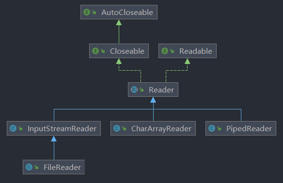

&ensp;&ensp;&ensp;&ensp;&ensp;&ensp;&ensp;&ensp;&ensp;&ensp;&ensp;&ensp;&ensp;&ensp;&ensp;&ensp;- InputStreamReader字符输入流（字节流到字符流的桥梁）

&ensp;&ensp;&ensp;&ensp;&ensp;&ensp;&ensp;&ensp;&ensp;&ensp;&ensp;&ensp;&ensp;&ensp;&ensp;&ensp;&ensp;&ensp;&ensp;&ensp;- FileReader文件流

&ensp;&ensp;&ensp;&ensp;&ensp;&ensp;&ensp;&ensp;&ensp;&ensp;&ensp;&ensp;&ensp;&ensp;&ensp;&ensp;&ensp;&ensp;&ensp;&ensp;&ensp;&ensp;&ensp;&ensp;- 使用场景：文件字符输读取

&ensp;&ensp;&ensp;&ensp;&ensp;&ensp;&ensp;&ensp;&ensp;&ensp;&ensp;&ensp;&ensp;&ensp;&ensp;&ensp;- CharArrayReader字符数组流

&ensp;&ensp;&ensp;&ensp;&ensp;&ensp;&ensp;&ensp;&ensp;&ensp;&ensp;&ensp;&ensp;&ensp;&ensp;&ensp;&ensp;&ensp;&ensp;&ensp;- 使用场景：字符数组读取

&ensp;&ensp;&ensp;&ensp;&ensp;&ensp;&ensp;&ensp;&ensp;&ensp;&ensp;&ensp;&ensp;&ensp;&ensp;&ensp;- PipedReader管道流

&ensp;&ensp;&ensp;&ensp;&ensp;&ensp;&ensp;&ensp;&ensp;&ensp;&ensp;&ensp;&ensp;&ensp;&ensp;&ensp;&ensp;&ensp;&ensp;&ensp;[管道流使用场景：主要用于线程之间的数据传输，传输媒介是内存。](https://www.wolai.com/wZWq35QGsmAX95moBZNsjc)

&ensp;&ensp;&ensp;&ensp;&ensp;&ensp;&ensp;&ensp;&ensp;&ensp;&ensp;&ensp;- 包装流

&ensp;&ensp;&ensp;&ensp;&ensp;&ensp;&ensp;&ensp;&ensp;&ensp;&ensp;&ensp;&ensp;&ensp;&ensp;&ensp;- 概念

&ensp;&ensp;&ensp;&ensp;&ensp;&ensp;&ensp;&ensp;&ensp;&ensp;&ensp;&ensp;&ensp;&ensp;&ensp;&ensp;&ensp;&ensp;&ensp;&ensp;- 几个流方法都差不多，不过使用场景各有不同

&ensp;&ensp;&ensp;&ensp;&ensp;&ensp;&ensp;&ensp;&ensp;&ensp;&ensp;&ensp;&ensp;&ensp;&ensp;&ensp;&ensp;&ensp;&ensp;&ensp;- 结构图

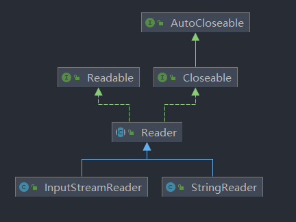

&ensp;&ensp;&ensp;&ensp;&ensp;&ensp;&ensp;&ensp;&ensp;&ensp;&ensp;&ensp;&ensp;&ensp;&ensp;&ensp;- StringReader字符串流

&ensp;&ensp;&ensp;&ensp;&ensp;&ensp;&ensp;&ensp;&ensp;&ensp;&ensp;&ensp;&ensp;&ensp;&ensp;&ensp;&ensp;&ensp;&ensp;&ensp;- 读取字符串使用

&ensp;&ensp;&ensp;&ensp;&ensp;&ensp;&ensp;&ensp;&ensp;&ensp;&ensp;&ensp;&ensp;&ensp;&ensp;&ensp;- InputStreamReader字符输入流（字节流到字符流的桥梁）

&ensp;&ensp;&ensp;&ensp;&ensp;&ensp;&ensp;&ensp;&ensp;&ensp;&ensp;&ensp;&ensp;&ensp;&ensp;&ensp;&ensp;&ensp;&ensp;&ensp;> InputStreamReader是从字节流到字符流的桥：它读取字节，并使用指定的`charset`将其解码为[字符](https://www.mklab.cn/onlineapi/jdk_8_cn/java/nio/charset/Charset.html) 。 它使用的字符集可以由名称指定，也可以被明确指定，或者可以接受平台的默认字符集。


&ensp;&ensp;&ensp;&ensp;&ensp;&ensp;&ensp;&ensp;&ensp;&ensp;&ensp;&ensp;&ensp;&ensp;&ensp;&ensp;&ensp;&ensp;&ensp;&ensp;- 将字节流转换到字符流。

&ensp;&ensp;&ensp;&ensp;&ensp;&ensp;&ensp;&ensp;- 输出流（Writer）

&ensp;&ensp;&ensp;&ensp;&ensp;&ensp;&ensp;&ensp;&ensp;&ensp;&ensp;&ensp;- 节点流

&ensp;&ensp;&ensp;&ensp;&ensp;&ensp;&ensp;&ensp;&ensp;&ensp;&ensp;&ensp;&ensp;&ensp;&ensp;&ensp;- 概念

&ensp;&ensp;&ensp;&ensp;&ensp;&ensp;&ensp;&ensp;&ensp;&ensp;&ensp;&ensp;&ensp;&ensp;&ensp;&ensp;&ensp;&ensp;&ensp;&ensp;- 同上类似

&ensp;&ensp;&ensp;&ensp;&ensp;&ensp;&ensp;&ensp;&ensp;&ensp;&ensp;&ensp;&ensp;&ensp;&ensp;&ensp;&ensp;&ensp;&ensp;&ensp;- FileWriter是节点流，但父类OutputStreamWriter是包装流

&ensp;&ensp;&ensp;&ensp;&ensp;&ensp;&ensp;&ensp;&ensp;&ensp;&ensp;&ensp;&ensp;&ensp;&ensp;&ensp;&ensp;&ensp;&ensp;&ensp;- 结构图

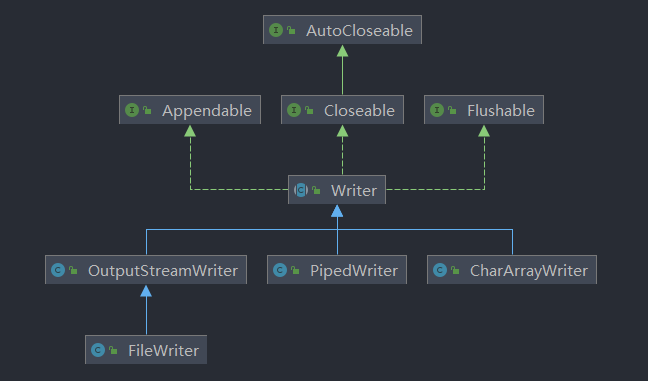

&ensp;&ensp;&ensp;&ensp;&ensp;&ensp;&ensp;&ensp;&ensp;&ensp;&ensp;&ensp;&ensp;&ensp;&ensp;&ensp;- CharArrayWriter字符数组流

&ensp;&ensp;&ensp;&ensp;&ensp;&ensp;&ensp;&ensp;&ensp;&ensp;&ensp;&ensp;&ensp;&ensp;&ensp;&ensp;&ensp;&ensp;&ensp;&ensp;- 使用场景：字符数组写出

&ensp;&ensp;&ensp;&ensp;&ensp;&ensp;&ensp;&ensp;&ensp;&ensp;&ensp;&ensp;&ensp;&ensp;&ensp;&ensp;- PipedWriter管道流

&ensp;&ensp;&ensp;&ensp;&ensp;&ensp;&ensp;&ensp;&ensp;&ensp;&ensp;&ensp;&ensp;&ensp;&ensp;&ensp;&ensp;&ensp;&ensp;&ensp;[管道流使用场景：主要用于线程之间的数据传输，传输媒介是内存。](https://www.wolai.com/wZWq35QGsmAX95moBZNsjc)

&ensp;&ensp;&ensp;&ensp;&ensp;&ensp;&ensp;&ensp;&ensp;&ensp;&ensp;&ensp;&ensp;&ensp;&ensp;&ensp;- OutputStreamWriter字符输出流（字节流到字符流的桥梁）

&ensp;&ensp;&ensp;&ensp;&ensp;&ensp;&ensp;&ensp;&ensp;&ensp;&ensp;&ensp;&ensp;&ensp;&ensp;&ensp;&ensp;&ensp;&ensp;&ensp;- FileWriter文件流

&ensp;&ensp;&ensp;&ensp;&ensp;&ensp;&ensp;&ensp;&ensp;&ensp;&ensp;&ensp;&ensp;&ensp;&ensp;&ensp;&ensp;&ensp;&ensp;&ensp;&ensp;&ensp;&ensp;&ensp;使用场景：文件字符输写出

&ensp;&ensp;&ensp;&ensp;&ensp;&ensp;&ensp;&ensp;&ensp;&ensp;&ensp;&ensp;- 包装流

&ensp;&ensp;&ensp;&ensp;&ensp;&ensp;&ensp;&ensp;&ensp;&ensp;&ensp;&ensp;&ensp;&ensp;&ensp;&ensp;- 概念

&ensp;&ensp;&ensp;&ensp;&ensp;&ensp;&ensp;&ensp;&ensp;&ensp;&ensp;&ensp;&ensp;&ensp;&ensp;&ensp;&ensp;&ensp;&ensp;&ensp;- FileWriter是节点流，但父类OutputStreamWriter是包装流

&ensp;&ensp;&ensp;&ensp;&ensp;&ensp;&ensp;&ensp;&ensp;&ensp;&ensp;&ensp;&ensp;&ensp;&ensp;&ensp;&ensp;&ensp;&ensp;&ensp;- 结构图

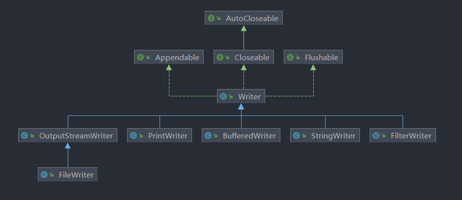

&ensp;&ensp;&ensp;&ensp;&ensp;&ensp;&ensp;&ensp;&ensp;&ensp;&ensp;&ensp;&ensp;&ensp;&ensp;&ensp;- BufferedWriter

&ensp;&ensp;&ensp;&ensp;&ensp;&ensp;&ensp;&ensp;&ensp;&ensp;&ensp;&ensp;&ensp;&ensp;&ensp;&ensp;&ensp;&ensp;&ensp;&ensp;> 将对象的格式表示打印到文本输出流。


&ensp;&ensp;&ensp;&ensp;&ensp;&ensp;&ensp;&ensp;&ensp;&ensp;&ensp;&ensp;&ensp;&ensp;&ensp;&ensp;&ensp;&ensp;&ensp;&ensp;- 缓冲流

&ensp;&ensp;&ensp;&ensp;&ensp;&ensp;&ensp;&ensp;&ensp;&ensp;&ensp;&ensp;&ensp;&ensp;&ensp;&ensp;- PrintWriter

&ensp;&ensp;&ensp;&ensp;&ensp;&ensp;&ensp;&ensp;&ensp;&ensp;&ensp;&ensp;&ensp;&ensp;&ensp;&ensp;&ensp;&ensp;&ensp;&ensp;> 将对象的格式表示打印到文本输出流。 


&ensp;&ensp;&ensp;&ensp;&ensp;&ensp;&ensp;&ensp;&ensp;&ensp;&ensp;&ensp;&ensp;&ensp;&ensp;&ensp;&ensp;&ensp;&ensp;&ensp;- 和PrintStream类似，但是他不会自动刷新

&ensp;&ensp;&ensp;&ensp;&ensp;&ensp;&ensp;&ensp;&ensp;&ensp;&ensp;&ensp;&ensp;&ensp;&ensp;&ensp;- StringWriter

&ensp;&ensp;&ensp;&ensp;&ensp;&ensp;&ensp;&ensp;&ensp;&ensp;&ensp;&ensp;&ensp;&ensp;&ensp;&ensp;&ensp;&ensp;&ensp;&ensp;> 在字符串缓冲区中收集其输出的字符流，然后可以用于构造字符串。


&ensp;&ensp;&ensp;&ensp;&ensp;&ensp;&ensp;&ensp;&ensp;&ensp;&ensp;&ensp;&ensp;&ensp;&ensp;&ensp;&ensp;&ensp;&ensp;&ensp;- 读取字符串使用

&ensp;&ensp;&ensp;&ensp;&ensp;&ensp;&ensp;&ensp;&ensp;&ensp;&ensp;&ensp;&ensp;&ensp;&ensp;&ensp;- OutputStreamWriter

&ensp;&ensp;&ensp;&ensp;&ensp;&ensp;&ensp;&ensp;&ensp;&ensp;&ensp;&ensp;&ensp;&ensp;&ensp;&ensp;&ensp;&ensp;&ensp;&ensp;- FilterWriter

&ensp;&ensp;&ensp;&ensp;&ensp;&ensp;&ensp;&ensp;&ensp;&ensp;&ensp;&ensp;&ensp;&ensp;&ensp;&ensp;&ensp;&ensp;&ensp;&ensp;&ensp;&ensp;&ensp;&ensp;- 方便写出字符文件

- 知识扩展

&ensp;&ensp;&ensp;&ensp;- 字符编码

&ensp;&ensp;&ensp;&ensp;&ensp;&ensp;&ensp;&ensp;- 概念

&ensp;&ensp;&ensp;&ensp;&ensp;&ensp;&ensp;&ensp;&ensp;&ensp;&ensp;&ensp;- 字符

&ensp;&ensp;&ensp;&ensp;&ensp;&ensp;&ensp;&ensp;&ensp;&ensp;&ensp;&ensp;&ensp;&ensp;&ensp;&ensp;> 字符（Character）：一个字符是一个单位的字形、类字形单位或符号的基本信息。说的简单点字符是各种文字和符号的总称。


&ensp;&ensp;&ensp;&ensp;&ensp;&ensp;&ensp;&ensp;&ensp;&ensp;&ensp;&ensp;- 字符集

&ensp;&ensp;&ensp;&ensp;&ensp;&ensp;&ensp;&ensp;&ensp;&ensp;&ensp;&ensp;&ensp;&ensp;&ensp;&ensp;> 字符集（Character Set）：是指多个字符的集合。


&ensp;&ensp;&ensp;&ensp;&ensp;&ensp;&ensp;&ensp;&ensp;&ensp;&ensp;&ensp;&ensp;&ensp;&ensp;&ensp;常见的字符集：GBK字符集、Unicode字符集

&ensp;&ensp;&ensp;&ensp;&ensp;&ensp;&ensp;&ensp;&ensp;&ensp;&ensp;&ensp;- 字符编码

&ensp;&ensp;&ensp;&ensp;&ensp;&ensp;&ensp;&ensp;&ensp;&ensp;&ensp;&ensp;&ensp;&ensp;&ensp;&ensp;> 字符编码（Character Encoding）：字符编码是指一种映射规则，根据这个映射规则可以将某个字符映射成其他形式的数据以便在计算机中存储和传输。


&ensp;&ensp;&ensp;&ensp;&ensp;&ensp;&ensp;&ensp;&ensp;&ensp;&ensp;&ensp;&ensp;&ensp;&ensp;&ensp;- 简单来说就是一个表，表里面存储了很多字符。可以通过映射关系找到对应的字符。例如ASCII码中字符'A'对应的值为65。

&ensp;&ensp;&ensp;&ensp;&ensp;&ensp;&ensp;&ensp;- ASCII码

&ensp;&ensp;&ensp;&ensp;&ensp;&ensp;&ensp;&ensp;&ensp;&ensp;&ensp;&ensp;> 在ASCII编码中，0~31 是控制字符如换行回车删除等，32~126 是可打印字符，


&ensp;&ensp;&ensp;&ensp;&ensp;&ensp;&ensp;&ensp;&ensp;&ensp;&ensp;&ensp;- 存储了128个字符，就是8个1。

&ensp;&ensp;&ensp;&ensp;&ensp;&ensp;&ensp;&ensp;&ensp;&ensp;&ensp;&ensp;- 图片

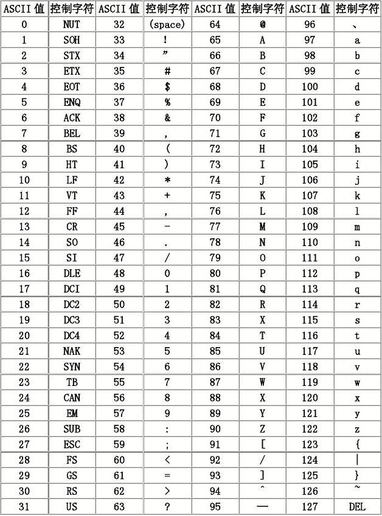

&ensp;&ensp;&ensp;&ensp;&ensp;&ensp;&ensp;&ensp;- GB2312、GBK、GB18030

&ensp;&ensp;&ensp;&ensp;&ensp;&ensp;&ensp;&ensp;&ensp;&ensp;&ensp;&ensp;- GB2312

&ensp;&ensp;&ensp;&ensp;&ensp;&ensp;&ensp;&ensp;&ensp;&ensp;&ensp;&ensp;&ensp;&ensp;&ensp;&ensp;- GB2312编码是第一个汉字编码国家标准

&ensp;&ensp;&ensp;&ensp;&ensp;&ensp;&ensp;&ensp;&ensp;&ensp;&ensp;&ensp;&ensp;&ensp;&ensp;&ensp;- GB2312能表示的汉字只有6000多个，但是中国的汉字有10万之多，所以GB2312字符集还是不够用，于是GBK出现了。

&ensp;&ensp;&ensp;&ensp;&ensp;&ensp;&ensp;&ensp;&ensp;&ensp;&ensp;&ensp;- GBK

&ensp;&ensp;&ensp;&ensp;&ensp;&ensp;&ensp;&ensp;&ensp;&ensp;&ensp;&ensp;&ensp;&ensp;&ensp;&ensp;- GBK是对GB1212的扩展，也是占用2个字节。

&ensp;&ensp;&ensp;&ensp;&ensp;&ensp;&ensp;&ensp;&ensp;&ensp;&ensp;&ensp;&ensp;&ensp;&ensp;&ensp;- GBK 包括了 GB2312 的所有内容，同时又增加了近20000个新的汉字（包括繁体字）和符号。

&ensp;&ensp;&ensp;&ensp;&ensp;&ensp;&ensp;&ensp;&ensp;&ensp;&ensp;&ensp;- GB18030

&ensp;&ensp;&ensp;&ensp;&ensp;&ensp;&ensp;&ensp;&ensp;&ensp;&ensp;&ensp;&ensp;&ensp;&ensp;&ensp;- GB18030采用变长编码，可以是1个字节、2个字节和4个字节。是对GB2312和GBK的扩展，完全兼容两者。

&ensp;&ensp;&ensp;&ensp;&ensp;&ensp;&ensp;&ensp;- Unicode字符集

&ensp;&ensp;&ensp;&ensp;&ensp;&ensp;&ensp;&ensp;&ensp;&ensp;&ensp;&ensp;> ASCII码字符集，总共才能容纳256个字符，对于全世界各国语言来说，很难全部包含在内，所有后来就出现了Unicode字符集。


&ensp;&ensp;&ensp;&ensp;&ensp;&ensp;&ensp;&ensp;&ensp;&ensp;&ensp;&ensp;> Unicode字符集是一个很大的字符集合，现在的规模可以容纳100多万个符号。


&ensp;&ensp;&ensp;&ensp;&ensp;&ensp;&ensp;&ensp;&ensp;&ensp;&ensp;&ensp;- 简单理解：是一个很大的字符集

&ensp;&ensp;&ensp;&ensp;&ensp;&ensp;&ensp;&ensp;&ensp;&ensp;&ensp;&ensp;- UTF-8

&ensp;&ensp;&ensp;&ensp;&ensp;&ensp;&ensp;&ensp;&ensp;&ensp;&ensp;&ensp;&ensp;&ensp;&ensp;&ensp;> UTF-8（8-bit Unicode Transformation Format）是一种针对Unicode的可变长度字符编码规则，又称万国码。


&ensp;&ensp;&ensp;&ensp;&ensp;&ensp;&ensp;&ensp;&ensp;&ensp;&ensp;&ensp;&ensp;&ensp;&ensp;&ensp;> 互联网的普及，强烈要求出现一种统一的编码方式。UTF-8就是在互联网上使用最广的一种Unicode的实现方式。其他实现方式还包括UTF-16和UTF-32，不过在互联网上基本不用。重复一遍，这里的关系是：UTF-8编码是Unicode的实现方式之一。


&ensp;&ensp;&ensp;&ensp;&ensp;&ensp;&ensp;&ensp;&ensp;&ensp;&ensp;&ensp;&ensp;&ensp;&ensp;&ensp;- 是Unicode的一种实现方式

&ensp;&ensp;&ensp;&ensp;&ensp;&ensp;&ensp;&ensp;- iso-8859-1

&ensp;&ensp;&ensp;&ensp;&ensp;&ensp;&ensp;&ensp;&ensp;&ensp;&ensp;&ensp;> ISO-8859-1 是**大多数浏览器默认的字符集** 


&ensp;&ensp;&ensp;&ensp;&ensp;&ensp;&ensp;&ensp;- 参考

&ensp;&ensp;&ensp;&ensp;&ensp;&ensp;&ensp;&ensp;&ensp;&ensp;&ensp;&ensp;[字符、字符集、字符编码的基础知识科普 - 知乎 (zhihu.com)](https://zhuanlan.zhihu.com/p/260192496)

&ensp;&ensp;&ensp;&ensp;- File文件类

&ensp;&ensp;&ensp;&ensp;&ensp;&ensp;&ensp;&ensp;- 常用的一些方法，忘记时候查api即可

```Java
        // 创建一个文件
        File f = new File("test.txt");
        // 相关常量（unix和Windows下体哦那个上不同的路径分隔符（':'和';'）、默认分隔符（'/'和'\\'））
        String pathSeparator = f.pathSeparator;
        char pathSeparatorChar = f.pathSeparatorChar;
        String separator = f.separator;
        char separatorChar = f.separatorChar;
        /* 常用方法 */
        // 增加：创建文件、创建文件夹
        f.createNewFile();
        File tempFile = File.createTempFile("test", "txt");
        File tempFile1 = File.createTempFile("test", "txt", new File("/"));
        f.mkdir();
        f.mkdirs();
        // 修改：设置文件相关属性
        boolean renameTo = f.renameTo(new File("test2.txt"));
        boolean b = f.setReadOnly();
        boolean b1 = f.setReadable(true);
        boolean b2 = f.setWritable(true);
        boolean b3 = f.setWritable(true, true);
        boolean b4 = f.setLastModified(System.currentTimeMillis());
        boolean b5 = f.setExecutable(true);
        boolean b6 = f.setExecutable(true, true);
        // 删除
        f.delete();
        f.deleteOnExit();
        // 查询：文件相关属性
        boolean file = f.isFile();
        boolean directory = f.isDirectory();
        boolean absolute = f.isAbsolute();
        boolean hidden = f.isHidden();
        boolean exists = f.exists();
        long length = f.length();
        File absoluteFile = f.getAbsoluteFile();
        String absolutePath = f.getAbsolutePath();
        File canonicalFile = f.getCanonicalFile();
        String canonicalPath = f.getCanonicalPath();
        String name = f.getName();
        String parent = f.getParent();
        File parentFile = f.getParentFile();
        String path = f.getPath();
        URI uri = f.toURI();
        Path path1 = f.toPath();
```


&ensp;&ensp;&ensp;&ensp;- 序列化

&ensp;&ensp;&ensp;&ensp;&ensp;&ensp;&ensp;&ensp;[ObjectInputStream对象反序列化流](https://www.wolai.com/pjzWStwSh1i99BN9Z3Ezjw)

- NIO（New IO或者non-blocking IO）

&ensp;&ensp;&ensp;&ensp;- 概念

&ensp;&ensp;&ensp;&ensp;&ensp;&ensp;&ensp;&ensp;> java.nio全称java non-blocking IO（实际上是 new io）


&ensp;&ensp;&ensp;&ensp;- 参考

&ensp;&ensp;&ensp;&ensp;&ensp;&ensp;&ensp;&ensp;[真正理解NIO - 简书 (jianshu.com)](https://www.jianshu.com/p/362b365e1bcc)

- 参考

&ensp;&ensp;&ensp;&ensp;[JAVA IO流 - 屌丝迷途 - 博客园 (cnblogs.com)](https://www.cnblogs.com/l2rf/p/5320010.html)

&ensp;&ensp;&ensp;&ensp;[一文带你看懂JAVA IO流，史上最全面的IO教学啦 - 知乎 (zhihu.com)](https://zhuanlan.zhihu.com/p/99609337)

