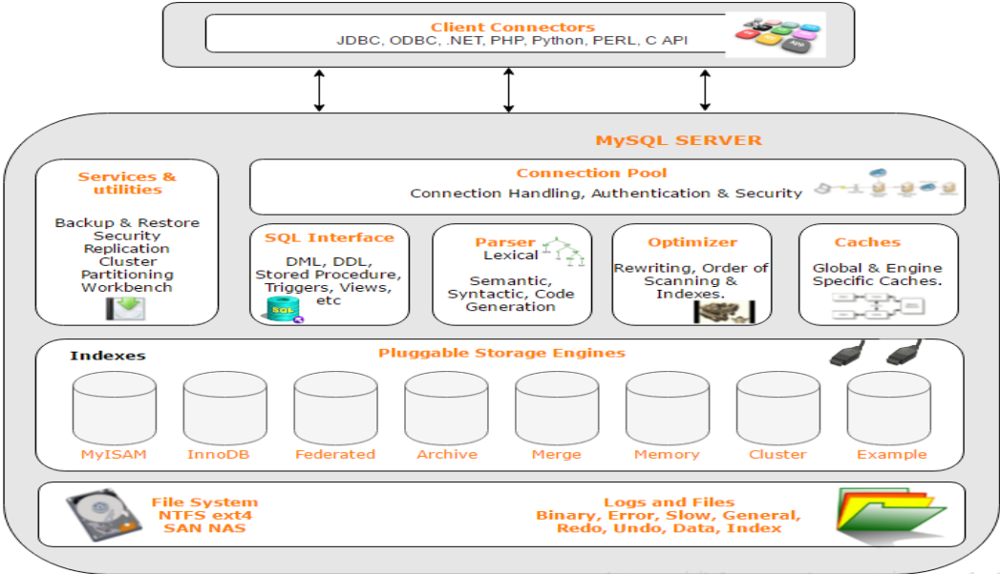

# MySQL

- 环境安装

&ensp;&ensp;&ensp;&ensp;- 数据库环境安装

&ensp;&ensp;&ensp;&ensp;&ensp;&ensp;&ensp;&ensp;[MySQL 下载安装_长生的梦呓-CSDN博客](https://blog.csdn.net/weixin_44034328/article/details/106391993)

&ensp;&ensp;&ensp;&ensp;- 数据库管理工具（DataGrip）

&ensp;&ensp;&ensp;&ensp;&ensp;&ensp;&ensp;&ensp;基本的DataGrip使用（有中文插件）

&ensp;&ensp;&ensp;&ensp;&ensp;&ensp;&ensp;&ensp;[DataGrip，一款数据库客户端工具，IDEA的兄弟是真香！](https://www.cnblogs.com/louis-liu-oneself/p/13427716.html)

- SQL语句

&ensp;&ensp;&ensp;&ensp;- 思路

&ensp;&ensp;&ensp;&ensp;&ensp;&ensp;&ensp;&ensp;- 直接整理了各个相关数据的操作，需要有一定的数据库基础，进行相关知识的查漏补缺。

&ensp;&ensp;&ensp;&ensp;&ensp;&ensp;&ensp;&ensp;- 以下知识点某些是按照mysql进行整理的，不同的数据库可能有所区别。

&ensp;&ensp;&ensp;&ensp;&ensp;&ensp;&ensp;&ensp;- 语法格式备注

&ensp;&ensp;&ensp;&ensp;&ensp;&ensp;&ensp;&ensp;&ensp;&ensp;&ensp;&ensp;在下文中，可能会用到相关的语法格式。详情可以查看下面的图片

&ensp;&ensp;&ensp;&ensp;&ensp;&ensp;&ensp;&ensp;&ensp;&ensp;&ensp;&ensp;- "[]"代表可选部分（可以加也可以不加）

&ensp;&ensp;&ensp;&ensp;&ensp;&ensp;&ensp;&ensp;&ensp;&ensp;&ensp;&ensp;- "{}"代表必须部分（一定需要添加）

&ensp;&ensp;&ensp;&ensp;&ensp;&ensp;&ensp;&ensp;&ensp;&ensp;&ensp;&ensp;- "*"代表查询所有字段

&ensp;&ensp;&ensp;&ensp;&ensp;&ensp;&ensp;&ensp;&ensp;&ensp;&ensp;&ensp;- "<字段列表>"代表字段列表

&ensp;&ensp;&ensp;&ensp;&ensp;&ensp;&ensp;&ensp;&ensp;&ensp;&ensp;&ensp;- |  代表

&ensp;&ensp;&ensp;&ensp;&ensp;&ensp;&ensp;&ensp;&ensp;&ensp;&ensp;&ensp;- 参考


&ensp;&ensp;&ensp;&ensp;&ensp;&ensp;&ensp;&ensp;&ensp;&ensp;&ensp;&ensp;&ensp;&ensp;&ensp;&ensp;

&ensp;&ensp;&ensp;&ensp;- DDL（数据定义语言）

&ensp;&ensp;&ensp;&ensp;&ensp;&ensp;&ensp;&ensp;- 概念

&ensp;&ensp;&ensp;&ensp;&ensp;&ensp;&ensp;&ensp;&ensp;&ensp;&ensp;&ensp;> 主要的命令有CREATE、ALTER、DROP等，DDL主要是用在定义或改变表（TABLE）的结构，数据类型，表之间的链接和约束等初始化工作上，他们大多在建立表时使用


&ensp;&ensp;&ensp;&ensp;&ensp;&ensp;&ensp;&ensp;- 库（DATABASE）

```SQL
# 建库
CREATE {DATABASE | SCHEMA} [IF NOT EXISTS] db_name
# 建库
CREATE DATABASE 数据库名;
# 修改库
ALTER {DATABASE | SCHEMA} [db_name]
# 修改库相关信息
ALTER DATABASE 库名 选项信息
# 删库
DROP {DATABASE | SCHEMA} [IF EXISTS] db_name
# 删库
drop database 数据库名;

```


```SQL
# 使用指定库
use 数据库名
# 查看所有数据库
show databases;

```


&ensp;&ensp;&ensp;&ensp;&ensp;&ensp;&ensp;&ensp;- 表（TABLE）

&ensp;&ensp;&ensp;&ensp;&ensp;&ensp;&ensp;&ensp;&ensp;&ensp;&ensp;&ensp;- 创建表

&ensp;&ensp;&ensp;&ensp;&ensp;&ensp;&ensp;&ensp;&ensp;&ensp;&ensp;&ensp;&ensp;&ensp;&ensp;&ensp;- mysql建表时候相关数据类型参考：[MySQL 数据类型 ](https://www.runoob.com/mysql/mysql-data-types.html)

```sql
# 创建表
CREATE TABLE table_name (column_name column_type);
# 创建表
CREATE TABLE table_name
(
column_name1 data_type(size),
column_name2 data_type(size),
column_name3 data_type(size),
....
);
# 创建表前先判断是否存在
CREATE [TEMPORARY] TABLE [IF NOT EXISTS] tbl_name
# 创建表前先判断是否存在
CREATE TABLE IF NOT EXISTS table_name (column_name column_type);
# 创建临时表
CREATE TEMPORARY TABLE tb_name(这里和创建普通表一样，普通的表语句);
```


&ensp;&ensp;&ensp;&ensp;&ensp;&ensp;&ensp;&ensp;&ensp;&ensp;&ensp;&ensp;&ensp;&ensp;&ensp;&ensp;- 建表举例

&ensp;&ensp;&ensp;&ensp;&ensp;&ensp;&ensp;&ensp;&ensp;&ensp;&ensp;&ensp;&ensp;&ensp;&ensp;&ensp;&ensp;&ensp;&ensp;&ensp;举例：创建一张user表，“`”符号是用于去除关键字

```SQL
DROP TABLE IF EXISTS `user`;
CREATE TABLE `user` (
  `user_id` bigint(20) NOT NULL AUTO_INCREMENT,
  `user_name` varchar(20) DEFAULT NULL,
  `user_password` varchar(20) DEFAULT NULL,
  `user_age` int(10) DEFAULT NULL,
  `user_phone` varchar(20) DEFAULT NULL,
  `user_email` varchar(50) DEFAULT NULL,
  PRIMARY KEY (`user_id`)
) ENGINE=InnoDB AUTO_INCREMENT=9 DEFAULT CHARSET=utf8mb4;
```


&ensp;&ensp;&ensp;&ensp;&ensp;&ensp;&ensp;&ensp;&ensp;&ensp;&ensp;&ensp;&ensp;&ensp;&ensp;&ensp;- 创建并且复制表

&ensp;&ensp;&ensp;&ensp;&ensp;&ensp;&ensp;&ensp;&ensp;&ensp;&ensp;&ensp;&ensp;&ensp;&ensp;&ensp;&ensp;&ensp;&ensp;&ensp;- 可以复制表结构，并且可以拷贝表中的指定数据。[MySQL 复制表 ](https://www.runoob.com/mysql/mysql-clone-tables.html)

&ensp;&ensp;&ensp;&ensp;&ensp;&ensp;&ensp;&ensp;&ensp;&ensp;&ensp;&ensp;&ensp;&ensp;&ensp;&ensp;&ensp;&ensp;&ensp;&ensp;- **注意** ：前一种方式是不会复制主键类型，索引的，而后一种方式是把旧表的所有字段类型都复制到新表。

```SQL
# 复制表（不包括主键、索引）
create table table_name_new as (select * from table_name_old); 
create table 表名称 as select ......;
# 复制表（包括主键、索引）
create table table_name_new like table_name_old;

```


&ensp;&ensp;&ensp;&ensp;&ensp;&ensp;&ensp;&ensp;&ensp;&ensp;&ensp;&ensp;&ensp;&ensp;&ensp;&ensp;&ensp;&ensp;&ensp;&ensp;- 举例

```SQL
# 复制表结构、数据
create table table_name_new as 
(select * from table_name_old);
# 仅仅复制表结构
create table table_name_new as 
(select * from table_name_old where 1=2);
CREATE TABLE tb_name2 SELECT * FROM tb_name;
# 复制表指定列
CREATE TABLE tb_name2 SELECT id,name FROM tb_name;
```


```SQL
# 复制表结构、数据、主键、索引
create table table_name_new like table_name_old;
```


&ensp;&ensp;&ensp;&ensp;&ensp;&ensp;&ensp;&ensp;&ensp;&ensp;&ensp;&ensp;- 操作表

```SQL
# 删除表
DROP [TEMPORARY] TABLE [IF EXISTS]
# 删除表
DROP TABLE table_name;
# 删除表
DROP TABLE IF EXISTS tb_name;
# 修改表
ALTER TABLE tb_name ADD[CHANGE,RENAME,DROP] ...要更改的内容...

```


```SQL
# 查看数据库中可用的表
SHOW TABLES;
# 查看指定表结构
desc table_name;
DESCRIBE table_name;
SHOW COLUMNS in tb_name; 


```


&ensp;&ensp;&ensp;&ensp;&ensp;&ensp;&ensp;&ensp;&ensp;&ensp;&ensp;&ensp;- 清空表数据（TRUNCATE）

```SQL
# 清空表（仅仅删除表中数据）
truncate table table_name;
```


&ensp;&ensp;&ensp;&ensp;&ensp;&ensp;&ensp;&ensp;- 索引（INDEX）

&ensp;&ensp;&ensp;&ensp;&ensp;&ensp;&ensp;&ensp;&ensp;&ensp;&ensp;&ensp;> MySQL索引的建立对于MySQL的高效运行是很重要的，索引可以大大提高MySQL的检索速度。


&ensp;&ensp;&ensp;&ensp;&ensp;&ensp;&ensp;&ensp;&ensp;&ensp;&ensp;&ensp;> 拿汉语字典的目录页（索引）打比方，我们可以按拼音、笔画、偏旁部首等排序的目录（索引）快速查找到需要的字。


```SQL
# 创建索引
CREATE INDEX 索引名称 ON 表名(字段名);
CREATE INDEX indexName ON table_name (column_name)
# 为主键创建一个索引
-- 创建主键索引
ALTER TABLE 表名 ADD PRIMARY KEY 索引名称(字段名);
ALTER TABLE test ADD PRIMARY KEY i_id(id);

# 修改表结构(添加索引)
ALTER table tableName ADD INDEX indexName(columnName)

-- 删除索引
DROP INDEX [indexName] ON mytable; 
DROP INDEX 索引名称 ON 表名;

-- 查看索引
SHOW INDEX FROM 表名;

```


&ensp;&ensp;&ensp;&ensp;&ensp;&ensp;&ensp;&ensp;&ensp;&ensp;&ensp;&ensp;- 示例

```SQL
# 创建索引
CREATE INDEX i_email ON staffs(email);
# 创建表的时候直接指定索引
CREATE TABLE mytable(  
  ID INT NOT NULL,    
  username VARCHAR(16) NOT NULL,  
  INDEX [indexName] (username(length))  
);  
# 删除索引
DROP INDEX i_email ON staffs;

```


&ensp;&ensp;&ensp;&ensp;&ensp;&ensp;&ensp;&ensp;&ensp;&ensp;&ensp;&ensp;- 参考

&ensp;&ensp;&ensp;&ensp;&ensp;&ensp;&ensp;&ensp;&ensp;&ensp;&ensp;&ensp;&ensp;&ensp;&ensp;&ensp;[MySQL 索引 | 菜鸟教程 (runoob.com)](https://www.runoob.com/mysql/mysql-index.html)

&ensp;&ensp;&ensp;&ensp;&ensp;&ensp;&ensp;&ensp;- 视图（View）

&ensp;&ensp;&ensp;&ensp;&ensp;&ensp;&ensp;&ensp;&ensp;&ensp;&ensp;&ensp;> MySQL 视图（View）是一种虚拟存在的表，同真实表一样，视图也由列和行构成，但视图并不实际存在于数据库中。行和列的数据来自于定义视图的查询中所使用的表，并且还是在使用视图时动态生成的。


&ensp;&ensp;&ensp;&ensp;&ensp;&ensp;&ensp;&ensp;&ensp;&ensp;&ensp;&ensp;- 简单来说，使用的时候把视图当成一张表就行，视图里面就是查询语句。

```SQL
# 创建视图
CREATE VIEW <视图名> AS <SELECT语句>
# 创建视图
CREATE VIEW v_staffs AS SELECT * FROM staffs;
# 更新视图，会同步更新基本表数据
UPDATE v_staffs SET salary = salary + 1000 WHERE uid = 1;
# 删除视图
DROP VIEW v_staffs;

```


&ensp;&ensp;&ensp;&ensp;- DQL（数据查询语言）

&ensp;&ensp;&ensp;&ensp;&ensp;&ensp;&ensp;&ensp;- 查询列

&ensp;&ensp;&ensp;&ensp;&ensp;&ensp;&ensp;&ensp;&ensp;&ensp;&ensp;&ensp;- 通配符 *

&ensp;&ensp;&ensp;&ensp;&ensp;&ensp;&ensp;&ensp;&ensp;&ensp;&ensp;&ensp;- 指定字段

&ensp;&ensp;&ensp;&ensp;&ensp;&ensp;&ensp;&ensp;&ensp;&ensp;&ensp;&ensp;- 别名AS（可以用到列/表后面，可以省略AS）

&ensp;&ensp;&ensp;&ensp;&ensp;&ensp;&ensp;&ensp;&ensp;&ensp;&ensp;&ensp;- 前n条top（注意：Top是在sql server中的，mysql中可以用[限定条数（Limit）](https://www.wolai.com/qx2YTv8iZFdu7JVv4YbZD6)实现）

&ensp;&ensp;&ensp;&ensp;&ensp;&ensp;&ensp;&ensp;&ensp;&ensp;&ensp;&ensp;- 去重distinct（查询不同列）

```SQL
# 使用通配符*查询所有数据
SELECT * FROM table_name;
# 查询指定字段（1列或多列）
SELECT column_name1, column_name2 FROM table_name;
# 查询指定列，并设置别名为："列名"
SELECT column_name AS 列名 FROM table_name;
# 查询数据并去重
SELECT DISTINCT * FROM table_name;
# 查询前10条（Sql Server中的关键字）
SELECT top 10 * FROM table_name;

```


&ensp;&ensp;&ensp;&ensp;&ensp;&ensp;&ensp;&ensp;- Where条件

&ensp;&ensp;&ensp;&ensp;&ensp;&ensp;&ensp;&ensp;&ensp;&ensp;&ensp;&ensp;- 在条件中也可以嵌套子的sql查询语句

&ensp;&ensp;&ensp;&ensp;&ensp;&ensp;&ensp;&ensp;&ensp;&ensp;&ensp;&ensp;- 注意：where条件不仅仅只用于查询中，修改、删除也可以使用

&ensp;&ensp;&ensp;&ensp;&ensp;&ensp;&ensp;&ensp;&ensp;&ensp;&ensp;&ensp;- 运算符（算数、比较、逻辑）

&ensp;&ensp;&ensp;&ensp;&ensp;&ensp;&ensp;&ensp;&ensp;&ensp;&ensp;&ensp;&ensp;&ensp;&ensp;&ensp;- 运算符在下面中会用到，详情看[参考](https://www.wolai.com/hhrsLLXK3eG1D2wLA6BD8c)

&ensp;&ensp;&ensp;&ensp;&ensp;&ensp;&ensp;&ensp;&ensp;&ensp;&ensp;&ensp;&ensp;&ensp;&ensp;&ensp;- 参考

&ensp;&ensp;&ensp;&ensp;&ensp;&ensp;&ensp;&ensp;&ensp;&ensp;&ensp;&ensp;&ensp;&ensp;&ensp;&ensp;&ensp;&ensp;&ensp;&ensp;[SQL 运算符_w3cschool](https://www.w3cschool.cn/sql/sql-81o531s1.html)

&ensp;&ensp;&ensp;&ensp;&ensp;&ensp;&ensp;&ensp;&ensp;&ensp;&ensp;&ensp;- 等于（=）

&ensp;&ensp;&ensp;&ensp;&ensp;&ensp;&ensp;&ensp;&ensp;&ensp;&ensp;&ensp;&ensp;&ensp;&ensp;&ensp;- 将会查询出列值一致的数据，也可以设置为不等于。

```SQL
SELECT * FROM t_user 
WHERE user_username='root' AND user_password='1234';
```


&ensp;&ensp;&ensp;&ensp;&ensp;&ensp;&ensp;&ensp;&ensp;&ensp;&ensp;&ensp;- 模糊查询（like）

&ensp;&ensp;&ensp;&ensp;&ensp;&ensp;&ensp;&ensp;&ensp;&ensp;&ensp;&ensp;&ensp;&ensp;&ensp;&ensp;- 使用%代表模糊，下面代表前后模糊

```SQL
SELECT * FROM t_user 
WHERE user_username like '%root%'
```


&ensp;&ensp;&ensp;&ensp;&ensp;&ensp;&ensp;&ensp;&ensp;&ensp;&ensp;&ensp;- 或、与（and、or）

&ensp;&ensp;&ensp;&ensp;&ensp;&ensp;&ensp;&ensp;&ensp;&ensp;&ensp;&ensp;&ensp;&ensp;&ensp;&ensp;- 可以使用或OR、与AND进行条件判断。

&ensp;&ensp;&ensp;&ensp;&ensp;&ensp;&ensp;&ensp;&ensp;&ensp;&ensp;&ensp;&ensp;&ensp;&ensp;&ensp;- OR代表或者，前后只要成立一个即可。

&ensp;&ensp;&ensp;&ensp;&ensp;&ensp;&ensp;&ensp;&ensp;&ensp;&ensp;&ensp;&ensp;&ensp;&ensp;&ensp;- AND代表与，前面和后面同时成立才行。

```SQL
SELECT field1, field2,...fieldN FROM table_name1, table_name2...
[WHERE condition1 [AND [OR]] condition2.....
```


&ensp;&ensp;&ensp;&ensp;&ensp;&ensp;&ensp;&ensp;&ensp;&ensp;&ensp;&ensp;- in

&ensp;&ensp;&ensp;&ensp;&ensp;&ensp;&ensp;&ensp;&ensp;&ensp;&ensp;&ensp;&ensp;&ensp;&ensp;&ensp;包含，只要在里面即可。

```SQL
SELECT column_name(s)
FROM table_name
WHERE column_name IN (value1,value2,...);
```


&ensp;&ensp;&ensp;&ensp;&ensp;&ensp;&ensp;&ensp;&ensp;&ensp;&ensp;&ensp;- 在两者之间（between）

```SQL
SELECT column_name(s)
FROM table_name
WHERE column_name BETWEEN value1 AND value2;
```


&ensp;&ensp;&ensp;&ensp;&ensp;&ensp;&ensp;&ensp;&ensp;&ensp;&ensp;&ensp;- 空（is null）

```SQL
# 空
SELECT * FROM t_user 
where create_time is not null;
```


&ensp;&ensp;&ensp;&ensp;&ensp;&ensp;&ensp;&ensp;&ensp;&ensp;&ensp;&ensp;- 非（not）

```SQL
# 不在两者之间
SELECT column_name(s)
FROM table_name
WHERE column_name NOT BETWEEN value1 AND value2;
# 非空
SELECT * FROM t_user 
where create_time is not null;
```


&ensp;&ensp;&ensp;&ensp;&ensp;&ensp;&ensp;&ensp;&ensp;&ensp;&ensp;&ensp;- 正则

```SQL
# 正则查询非上海的数据
select id,name address 
from user_table
where address regexp '[^shanghai]'
```


&ensp;&ensp;&ensp;&ensp;&ensp;&ensp;&ensp;&ensp;- 分组查询（Group By）

&ensp;&ensp;&ensp;&ensp;&ensp;&ensp;&ensp;&ensp;&ensp;&ensp;&ensp;&ensp;- 概念

&ensp;&ensp;&ensp;&ensp;&ensp;&ensp;&ensp;&ensp;&ensp;&ensp;&ensp;&ensp;&ensp;&ensp;&ensp;&ensp;- 用于分组查询

&ensp;&ensp;&ensp;&ensp;&ensp;&ensp;&ensp;&ensp;&ensp;&ensp;&ensp;&ensp;&ensp;&ensp;&ensp;&ensp;- 相关的聚合函数只能同

&ensp;&ensp;&ensp;&ensp;&ensp;&ensp;&ensp;&ensp;&ensp;&ensp;&ensp;&ensp;&ensp;&ensp;&ensp;&ensp;- Having可以放聚合函数，用于筛选出聚合函数的条件（如果能放在where中的条件请放到where字句中，而不要放到having中，这样可以提高查询速度）

&ensp;&ensp;&ensp;&ensp;&ensp;&ensp;&ensp;&ensp;&ensp;&ensp;&ensp;&ensp;- 基础语法

```SQL
SELECT column_name, function(column_name)
FROM table_name
WHERE column_name operator value
GROUP BY column_name;

```


```SQL
# 按照用户名分组查询
select username, count(username) as 使用该用户名的个数
from findart_client
group by username;
```


&ensp;&ensp;&ensp;&ensp;&ensp;&ensp;&ensp;&ensp;&ensp;&ensp;&ensp;&ensp;&ensp;&ensp;&ensp;&ensp;默认使用select的时候，什么都不分组就是一种分组（分1组），所以也可以使用聚合函数

```SQL
# 查询总条数
SELECT COUNT(*) FROM table_name;
```


&ensp;&ensp;&ensp;&ensp;&ensp;&ensp;&ensp;&ensp;&ensp;&ensp;&ensp;&ensp;- 常用聚合函数

&ensp;&ensp;&ensp;&ensp;&ensp;&ensp;&ensp;&ensp;&ensp;&ensp;&ensp;&ensp;&ensp;&ensp;&ensp;&ensp;- 同的数据库可能内置了不同的函数，详情查看相关文档，这里仅仅列出常用的mysql函数

&ensp;&ensp;&ensp;&ensp;&ensp;&ensp;&ensp;&ensp;&ensp;&ensp;&ensp;&ensp;&ensp;&ensp;&ensp;&ensp;- 常用的：AVG()、COUNT()、MAX()、MIN()、SUM()

&ensp;&ensp;&ensp;&ensp;&ensp;&ensp;&ensp;&ensp;&ensp;&ensp;&ensp;&ensp;&ensp;&ensp;&ensp;&ensp;- 注意：聚合函数查询出来的结果列，只能是分组后的列、聚合函数

&ensp;&ensp;&ensp;&ensp;&ensp;&ensp;&ensp;&ensp;&ensp;&ensp;&ensp;&ensp;&ensp;&ensp;&ensp;&ensp;- 参考

&ensp;&ensp;&ensp;&ensp;&ensp;&ensp;&ensp;&ensp;&ensp;&ensp;&ensp;&ensp;&ensp;&ensp;&ensp;&ensp;&ensp;&ensp;&ensp;&ensp;[SQL 函数](https://www.w3school.com.cn/sql/sql_functions.asp)

&ensp;&ensp;&ensp;&ensp;&ensp;&ensp;&ensp;&ensp;&ensp;&ensp;&ensp;&ensp;- 分组查询条件（Having）

&ensp;&ensp;&ensp;&ensp;&ensp;&ensp;&ensp;&ensp;&ensp;&ensp;&ensp;&ensp;&ensp;&ensp;&ensp;&ensp;> 在 SQL 中增加 HAVING 子句原因是，WHERE 关键字无法与合计函数一起使用。


&ensp;&ensp;&ensp;&ensp;&ensp;&ensp;&ensp;&ensp;&ensp;&ensp;&ensp;&ensp;&ensp;&ensp;&ensp;&ensp;- 在having中可以使用聚合函数

```SQL
SELECT column_name, aggregate_function(column_name)
FROM table_name
WHERE column_name operator value
GROUP BY column_name
HAVING aggregate_function(column_name) operator value
```


```SQL
# 查询个数大于2的用户名
select username, count(*) as 使用该用户名的个数
from findart_client
group by username
having 2 < count(username);
```


&ensp;&ensp;&ensp;&ensp;&ensp;&ensp;&ensp;&ensp;- 排序查询（Order By）

&ensp;&ensp;&ensp;&ensp;&ensp;&ensp;&ensp;&ensp;&ensp;&ensp;&ensp;&ensp;- DESC降序

&ensp;&ensp;&ensp;&ensp;&ensp;&ensp;&ensp;&ensp;&ensp;&ensp;&ensp;&ensp;- ASE默认升序

```SQL
SELECT field1, field2,...fieldN FROM table_name1, table_name2...
ORDER BY field1 [ASC [DESC][默认 ASC]], [field2...] [ASC [DESC][默认 ASC]]
```


```SQL
# 根据id降序查询（如果不加上desc，默认就是ase升序排序）
select *
from findart_client
order by id desc;

```


&ensp;&ensp;&ensp;&ensp;&ensp;&ensp;&ensp;&ensp;- 关联查询

&ensp;&ensp;&ensp;&ensp;&ensp;&ensp;&ensp;&ensp;&ensp;&ensp;&ensp;&ensp;- 连接图


&ensp;&ensp;&ensp;&ensp;&ensp;&ensp;&ensp;&ensp;&ensp;&ensp;&ensp;&ensp;- 左连接（Left Join）


&ensp;&ensp;&ensp;&ensp;&ensp;&ensp;&ensp;&ensp;&ensp;&ensp;&ensp;&ensp;&ensp;&ensp;&ensp;&ensp;- LEFT JOIN（左连接）：获取左表所有记录，即使右表没有对应匹配的记录。

&ensp;&ensp;&ensp;&ensp;&ensp;&ensp;&ensp;&ensp;&ensp;&ensp;&ensp;&ensp;&ensp;&ensp;&ensp;&ensp;- 最常用的就是左连接，因为我们看书也是从左往右，所以习惯用左关联。

```SQL
# 左连接
SELECT column_name(s)
FROM table1
LEFT JOIN table2
ON table1.column_name=table2.column_name;
# 作用同上（某些数据库中也称左连接为：左外连接）
SELECT column_name(s)
FROM table1
LEFT OUTER JOIN table2
ON table1.column_name=table2.column_name;

```


&ensp;&ensp;&ensp;&ensp;&ensp;&ensp;&ensp;&ensp;&ensp;&ensp;&ensp;&ensp;&ensp;&ensp;&ensp;&ensp;- 举例

```SQL
# 左连接
SELECT *
FROM sys_user
LEFT JOIN sys_dept
ON sys_user.dept_id = sys_dept.dept_id
# 作用同上
SELECT *
FROM sys_user
LEFT OUTER JOIN sys_dept
ON sys_user.dept_id = sys_dept.dept_id
```


&ensp;&ensp;&ensp;&ensp;&ensp;&ensp;&ensp;&ensp;&ensp;&ensp;&ensp;&ensp;- 右连接（Right Join）


&ensp;&ensp;&ensp;&ensp;&ensp;&ensp;&ensp;&ensp;&ensp;&ensp;&ensp;&ensp;&ensp;&ensp;&ensp;&ensp;- RIGHT JOIN（右连接）： 与 LEFT JOIN 相反，用于获取右表所有记录，即使左表没有对应匹配的记录，则结果为 NULL。

```SQL
# 右连接
SELECT column_name(s)
FROM table1
RIGHT JOIN table2
ON table1.column_name=table2.column_name;
# 同上
SELECT column_name(s)
FROM table1
RIGHT OUTER JOIN table2
ON table1.column_name=table2.column_name;

```


&ensp;&ensp;&ensp;&ensp;&ensp;&ensp;&ensp;&ensp;&ensp;&ensp;&ensp;&ensp;&ensp;&ensp;&ensp;&ensp;- 举例

```SQL
# 右连接
SELECT *
FROM sys_user
right JOIN sys_dept
ON sys_user.dept_id = sys_dept.dept_id
# 同上
SELECT *
FROM sys_user
right OUTER join sys_dept
ON sys_user.dept_id = sys_dept.dept_id
```


&ensp;&ensp;&ensp;&ensp;&ensp;&ensp;&ensp;&ensp;&ensp;&ensp;&ensp;&ensp;- 内连接（Inner Join）


&ensp;&ensp;&ensp;&ensp;&ensp;&ensp;&ensp;&ensp;&ensp;&ensp;&ensp;&ensp;&ensp;&ensp;&ensp;&ensp;- INNER JOIN（内连接,或等值连接）：获取两个表中字段匹配关系的记录。

&ensp;&ensp;&ensp;&ensp;&ensp;&ensp;&ensp;&ensp;&ensp;&ensp;&ensp;&ensp;&ensp;&ensp;&ensp;&ensp;- INNER JOIN 关键字在表中存在至少一个匹配时返回行。

```SQL
# 内连接
SELECT column_name(s)
FROM table1
INNER JOIN table2
ON table1.column_name=table2.column_name;
# 同上
SELECT column_name(s)
FROM table1
JOIN table2
ON table1.column_name=table2.column_name;

```


&ensp;&ensp;&ensp;&ensp;&ensp;&ensp;&ensp;&ensp;&ensp;&ensp;&ensp;&ensp;&ensp;&ensp;&ensp;&ensp;- 举例

```SQL
# 右连接
SELECT *
FROM sys_user
INNER  JOIN sys_dept
ON sys_user.dept_id = sys_dept.dept_id
# 同上
SELECT *
FROM sys_user
join sys_dept
ON sys_user.dept_id = sys_dept.dept_id
```


&ensp;&ensp;&ensp;&ensp;&ensp;&ensp;&ensp;&ensp;&ensp;&ensp;&ensp;&ensp;- 全连接（Full Join）


&ensp;&ensp;&ensp;&ensp;&ensp;&ensp;&ensp;&ensp;&ensp;&ensp;&ensp;&ensp;&ensp;&ensp;&ensp;&ensp;- 只要左表（table1）和右表（table2）其中一个表中存在匹配，则返回行.

&ensp;&ensp;&ensp;&ensp;&ensp;&ensp;&ensp;&ensp;&ensp;&ensp;&ensp;&ensp;&ensp;&ensp;&ensp;&ensp;- 结合了 LEFT JOIN 和 RIGHT JOIN 的结果。

&ensp;&ensp;&ensp;&ensp;&ensp;&ensp;&ensp;&ensp;&ensp;&ensp;&ensp;&ensp;&ensp;&ensp;&ensp;&ensp;- 在MySQL中没有全连接，不过可以使用[联盟查询（UNION）](https://www.wolai.com/c22ANCuwqLP4NzK6GMpCFw)

```SQL
SELECT column_name(s)
FROM table1
FULL OUTER JOIN table2
ON table1.column_name=table2.column_name;
# 同上
SELECT column_name(s)
FROM table1
FULL OUTER JOIN table2
ON table1.column_name=table2.column_name;
```


&ensp;&ensp;&ensp;&ensp;&ensp;&ensp;&ensp;&ensp;&ensp;&ensp;&ensp;&ensp;- 联盟查询（UNION）

&ensp;&ensp;&ensp;&ensp;&ensp;&ensp;&ensp;&ensp;&ensp;&ensp;&ensp;&ensp;&ensp;&ensp;&ensp;&ensp;- UNION 操作符查询两张表中的数据（仅仅查出不同的值）

```SQL
SELECT column_name(s) FROM table1
UNION
SELECT column_name(s) FROM table2;
```


&ensp;&ensp;&ensp;&ensp;&ensp;&ensp;&ensp;&ensp;&ensp;&ensp;&ensp;&ensp;&ensp;&ensp;&ensp;&ensp;- UNION 操作符查询两张表中的数据（可以查出相同的值）

```SQL
SELECT column_name(s) FROM table1
UNION ALL
SELECT column_name(s) FROM table2;
```


&ensp;&ensp;&ensp;&ensp;&ensp;&ensp;&ensp;&ensp;&ensp;&ensp;&ensp;&ensp;&ensp;&ensp;&ensp;&ensp;- 举例

```SQL
# 仅仅查出不同的值
SELECT * FROM sys_user
union
select * from sys_user;
# 可以查出相同的值
SELECT * FROM sys_user
union all
select * from sys_user;
```


&ensp;&ensp;&ensp;&ensp;&ensp;&ensp;&ensp;&ensp;&ensp;&ensp;&ensp;&ensp;- 参考

&ensp;&ensp;&ensp;&ensp;&ensp;&ensp;&ensp;&ensp;&ensp;&ensp;&ensp;&ensp;&ensp;&ensp;&ensp;&ensp;[MySQL 连接的使用 ](https://www.runoob.com/mysql/mysql-join.html)

&ensp;&ensp;&ensp;&ensp;&ensp;&ensp;&ensp;&ensp;- 限定条数（Limit）

```SQL
# 限定：查询n条
select <列名>,<列名>,...from <表名> limit <参数值>;
# 限定：查询n条
select * from findart_client limit n
# 限定：第一个参数表示offset从第几行数据开始查，第二个参数表示rows查几条数据
select <列名>,<列名>,...from <表名> limit <参数值offset>,<参数值rows>;
# 偏移：n代表偏移位置
select * from findart_client limit 1 offset n

```


&ensp;&ensp;&ensp;&ensp;&ensp;&ensp;&ensp;&ensp;&ensp;&ensp;&ensp;&ensp;- 举例

```SQL
# 限定：查询1条
select * from findart_client limit 1
# 限定：查询三条
select * from findart_client limit 3
# 限定：查询从第1条开始（下标开始为0），共2条数据
select * from findart_client limit 0,2
# 限定：查询从第2条开始，共2条数据
select * from findart_client limit 1,2
# 偏移：0为不偏移
select * from findart_client limit 1 offset 0
# 偏移：1条数据
select * from findart_client limit 1 offset 0
```


&ensp;&ensp;&ensp;&ensp;&ensp;&ensp;&ensp;&ensp;- 复制表数据（select into）

&ensp;&ensp;&ensp;&ensp;&ensp;&ensp;&ensp;&ensp;&ensp;&ensp;&ensp;&ensp;可以从老的表中复制数据到新表中去，当然也可以将查询出来的数据插入到指定表中去

```SQL
# 复制表数据
SELECT *
INTO new_table_name
FROM old_table_name;
# 将指定数据复制到指定表
SELECT username, password
INTO new_user_table
FROM old_user_table t1
INNER JOIN dept_table t2 ON t2.id = t1.dept_id where t2.name = '管理员'

```


&ensp;&ensp;&ensp;&ensp;&ensp;&ensp;&ensp;&ensp;&ensp;&ensp;&ensp;&ensp;- 参考

&ensp;&ensp;&ensp;&ensp;&ensp;&ensp;&ensp;&ensp;&ensp;&ensp;&ensp;&ensp;&ensp;&ensp;&ensp;&ensp;[SQL SELECT INTO 语句](https://www.runoob.com/sql/sql-select-into.html)、[SQL SELECT INTO 语句](https://www.w3school.com.cn/sql/sql_select_into.asp)

&ensp;&ensp;&ensp;&ensp;&ensp;&ensp;&ensp;&ensp;- mysql常用函数操作

&ensp;&ensp;&ensp;&ensp;&ensp;&ensp;&ensp;&ensp;&ensp;&ensp;&ensp;&ensp;- 下列仅列出常用的函数，其他的一些函数用到的时候查看[参考](https://www.wolai.com/vfc5PELeDt6wgyXrLqfoxj)文档。

&ensp;&ensp;&ensp;&ensp;&ensp;&ensp;&ensp;&ensp;&ensp;&ensp;&ensp;&ensp;- 字符串

```SQL
# 字符串拼接
SELECT CONCAT('abc', '123', 'ABC');
# 字符串截取
SELECT SUBSTR('abc', 1, 2);
# 字符串转大写
SELECT UCASE('abc');
SELECT UPPER('abc');
# 字符串转小写
SELECT LCASE('ABC');
SELECT LOWER('ABC');
# 日期格式化
SELECT DATE_FORMAT('2011-11-11 11:11:11','%Y-%m-%d %H:%m:%s');

```


&ensp;&ensp;&ensp;&ensp;&ensp;&ensp;&ensp;&ensp;&ensp;&ensp;&ensp;&ensp;- 数字

```SQL
# 数值格式化
SELECT FORMAT(12.3456, 2)
```


&ensp;&ensp;&ensp;&ensp;&ensp;&ensp;&ensp;&ensp;&ensp;&ensp;&ensp;&ensp;- 日期

```SQL
# 当前日期
SELECT CURDATE();
SELECT CURRENT_DATE();
# 当前时间
SELECT CURRENT_TIME();
SELECT CURTIME();
# 当前日期和时间
SELECT CURRENT_TIMESTAMP();
SELECT NOW();
# 字符串提取日期值
SELECT DATE('2017-06-15);

```


&ensp;&ensp;&ensp;&ensp;&ensp;&ensp;&ensp;&ensp;&ensp;&ensp;&ensp;&ensp;- 高级

```SQL
# 查询当前数据库版本
SELECT VERSION();
# 查看当前的数据库
SELECT DATABASE();
# 当前用户
select CURRENT_USER();
select SESSION_USER();
select SYSTEM_USER();
select USER();
# if语句
select IF(1=1,'1确实等于1', '1不等于1');
# if语句如果是null
select IF(null, '是null值了');
# if语句，如果是否为null
select ISNULL(null);
# 查看当前时间
SELECT NOW();

```


&ensp;&ensp;&ensp;&ensp;&ensp;&ensp;&ensp;&ensp;&ensp;&ensp;&ensp;&ensp;- 参考

&ensp;&ensp;&ensp;&ensp;&ensp;&ensp;&ensp;&ensp;&ensp;&ensp;&ensp;&ensp;&ensp;&ensp;&ensp;&ensp;[MySQL 函数 | 菜鸟教程 (runoob.com)](https://www.runoob.com/mysql/mysql-functions.html)

&ensp;&ensp;&ensp;&ensp;- DML（数据操纵语言）

&ensp;&ensp;&ensp;&ensp;&ensp;&ensp;&ensp;&ensp;- 增加（insert）

&ensp;&ensp;&ensp;&ensp;&ensp;&ensp;&ensp;&ensp;&ensp;&ensp;&ensp;&ensp;- 基本插入

```SQL
# 插入单行（没有指定列名，必须插入所有的列）
INSERT INTO table_name
VALUES (value1,value2,value3,...);
# 插入单行（指定列）
INSERT INTO table_name (column1,column2,column3)
VALUES (value1,value2,value3);
# 插入多行
INSERT INTO table_name (column1,column2,column3)
VALUES (value1,value2,value3),
(value1,value2,value3),
(value1,value2,value3);

```


&ensp;&ensp;&ensp;&ensp;&ensp;&ensp;&ensp;&ensp;&ensp;&ensp;&ensp;&ensp;&ensp;&ensp;&ensp;&ensp;- 举例

```SQL
# 插入单行（仅有指定列都会被插入进去）
INSERT INTO `user` VALUES ('1', '张三', '1', '1', '1', '1');
INSERT INTO `user` VALUES ('2', '李四', '2', '2', null, null);
INSERT INTO `user` VALUES ('3', '王五', '3', '3', null, null);
# 插入多行
INSERT INTO tb_name VALUES (NULL,'张三'),
(NULL,'张四'),
(NULL,'张五');
# 插入查询出来的数据（从表a_table中查询出来的数据，插入到表a_table_bak 中）
insert 
into a_table_bak (id, cuno, cunm)
select id, cuno, cunm 
from a_table;

```


&ensp;&ensp;&ensp;&ensp;&ensp;&ensp;&ensp;&ensp;&ensp;&ensp;&ensp;&ensp;- 复制表数据

&ensp;&ensp;&ensp;&ensp;&ensp;&ensp;&ensp;&ensp;&ensp;&ensp;&ensp;&ensp;&ensp;&ensp;&ensp;&ensp;- 复制表数据还有另一种方式：[复制表数据（select into）](https://www.wolai.com/4FKyCDVmaaJyzzgb3sum31)

```SQL
# 复制表数据（插入查询出来的数据）
INSERT INTO tb_name(name,score) SELECT name,score FROM tb_name2;
```


&ensp;&ensp;&ensp;&ensp;&ensp;&ensp;&ensp;&ensp;- 删除（delete）

```SQL
# 删除符合where条件的数据
DELETE FROM table_name
WHERE some_column=some_value;

```


&ensp;&ensp;&ensp;&ensp;&ensp;&ensp;&ensp;&ensp;&ensp;&ensp;&ensp;&ensp;- 举例

```SQL
# 举例
delete from user where user_id = 1;
```


&ensp;&ensp;&ensp;&ensp;&ensp;&ensp;&ensp;&ensp;- 修改（update）

&ensp;&ensp;&ensp;&ensp;&ensp;&ensp;&ensp;&ensp;&ensp;&ensp;&ensp;&ensp;- 修改的时候一定要注意是否需要where条件，如果没有where条件将会修改所有指定列数据

```SQL
# 更新单列
UPDATE tablename SET columnName=NewValue [ WHERE condition ]
# 更新多列
UPDATE table_name
SET column1=value1,column2=value2,...
WHERE some_column=some_value;

```


&ensp;&ensp;&ensp;&ensp;&ensp;&ensp;&ensp;&ensp;&ensp;&ensp;&ensp;&ensp;- 举例

```SQL
# 更新单列
UPDATE tb_name SET score=189 WHERE id=2;
# 更新多列
update tb_name 
set user_name='张三',user_password='123456'
where user_id=1;
# 更新表中所有该列数据
UPDATE tb_name SET score=189 WHERE id=2;

```


&ensp;&ensp;&ensp;&ensp;- DCL（数据控制语言）

&ensp;&ensp;&ensp;&ensp;&ensp;&ensp;&ensp;&ensp;- 概念

&ensp;&ensp;&ensp;&ensp;&ensp;&ensp;&ensp;&ensp;&ensp;&ensp;&ensp;&ensp;> 是数据库控制功能。是用来设置或更改数据库用户或角色权限的语句，包括（grant,deny,revoke等）语句。在默认状态下，只有sysadmin,dbcreator,db_owner或db_securityadmin等人员才有权力执行DCL


&ensp;&ensp;&ensp;&ensp;&ensp;&ensp;&ensp;&ensp;- 授权（GRANT）

&ensp;&ensp;&ensp;&ensp;&ensp;&ensp;&ensp;&ensp;&ensp;&ensp;&ensp;&ensp;- 用户管理与授权

```SQL
# 创建用户
CREATE USER '用户名'@'主机名' IDENTIFIED BY '用户密码';
# 切换至mysql库
use mysql;
# 用户查询
SELECT * FROM user;
# 修改密码（5.7以及之后）
SET PASSWORD FOR '用户名'@'主机名' = PASSWORD('新密码');
# 删除用户
DROP USER '用户名'@'主机名';

```


```SQL
# 查询权限
SHOW GRANTS FOR '用户名'@'主机名';
#授予权限
GRANT 权限列表 ON 数据库名.表名 TO '用户名'@'主机名';
#撤销权限
REVOKE 权限列表 ON 数据库名.表名 FROM '用户名'@'主机名';
```


&ensp;&ensp;&ensp;&ensp;&ensp;&ensp;&ensp;&ensp;&ensp;&ensp;&ensp;&ensp;&ensp;&ensp;&ensp;&ensp;- 举例

```SQL
# 创建用户
CREATE USER 'temp_user'@'localhost' IDENTIFIED BY '123456';
# 修改密码
SET PASSWORD FOR 'temp_user'@'localhost' = PASSWORD('654321');
# 删除用户
DROP USER 'temp_user'@'localhost';

```


&ensp;&ensp;&ensp;&ensp;&ensp;&ensp;&ensp;&ensp;&ensp;&ensp;&ensp;&ensp;&ensp;&ensp;&ensp;&ensp;- 参考

&ensp;&ensp;&ensp;&ensp;&ensp;&ensp;&ensp;&ensp;&ensp;&ensp;&ensp;&ensp;&ensp;&ensp;&ensp;&ensp;&ensp;&ensp;&ensp;&ensp;[MySQL-DCL语句-用户管理及授权相关笔记](https://blog.csdn.net/u014268482/article/details/105182513)

&ensp;&ensp;&ensp;&ensp;&ensp;&ensp;&ensp;&ensp;- 回滚（ROLLBACK）

&ensp;&ensp;&ensp;&ensp;&ensp;&ensp;&ensp;&ensp;- 提交（COMMIT）

&ensp;&ensp;&ensp;&ensp;- 参考

&ensp;&ensp;&ensp;&ensp;&ensp;&ensp;&ensp;&ensp;[SQL 教程](https://www.runoob.com/sql/sql-tutorial.html)、[MySQL 教程](https://www.runoob.com/mysql/mysql-tutorial.html)

&ensp;&ensp;&ensp;&ensp;&ensp;&ensp;&ensp;&ensp;SQL练习：[牛客题霸_经典高频编程题库](https://www.nowcoder.com/activity/oj?tab=1)

&ensp;&ensp;&ensp;&ensp;&ensp;&ensp;&ensp;&ensp;[DQL、DML、DDL、DCL的概念与区别 - 范兵 - 博客园 (cnblogs.com)](https://www.cnblogs.com/fan-yuan/p/7879353.html)

- 表设计

&ensp;&ensp;&ensp;&ensp;- ER图

&ensp;&ensp;&ensp;&ensp;&ensp;&ensp;&ensp;&ensp;- 参考


&ensp;&ensp;&ensp;&ensp;- 三大范式

&ensp;&ensp;&ensp;&ensp;- 表关系

&ensp;&ensp;&ensp;&ensp;&ensp;&ensp;&ensp;&ensp;一对一

&ensp;&ensp;&ensp;&ensp;&ensp;&ensp;&ensp;&ensp;一对多

&ensp;&ensp;&ensp;&ensp;&ensp;&ensp;&ensp;&ensp;多对多

&ensp;&ensp;&ensp;&ensp;- 参考

&ensp;&ensp;&ensp;&ensp;&ensp;&ensp;&ensp;&ensp;[数据库设计（一）分析及逻辑设计 - 知乎 (zhihu.com)](https://zhuanlan.zhihu.com/p/98771863)

- MySQL深入

&ensp;&ensp;&ensp;&ensp;- 架构

&ensp;&ensp;&ensp;&ensp;&ensp;&ensp;&ensp;&ensp;问题：MySQL 的查询流程具体是？or  一条SQL语句在MySQL中如何执行的？

&ensp;&ensp;&ensp;&ensp;&ensp;&ensp;&ensp;&ensp;- 架构图



&ensp;&ensp;&ensp;&ensp;- 引擎

&ensp;&ensp;&ensp;&ensp;&ensp;&ensp;&ensp;&ensp;问题：说说MySQL有哪些存储引擎？都有哪些区别？

&ensp;&ensp;&ensp;&ensp;- 事务以及隔离级别

&ensp;&ensp;&ensp;&ensp;- 参考

&ensp;&ensp;&ensp;&ensp;&ensp;&ensp;&ensp;&ensp;[MySQL 三万字精华总结 + 面试100 问，吊打面试官绰绰有余（收藏系列） (qq.com)](https://mp.weixin.qq.com/s/so7zOnDLiyuhFAsf0_tmhA)

&ensp;&ensp;&ensp;&ensp;&ensp;&ensp;&ensp;&ensp;[面试官上来就问MySQL事务，瑟瑟发抖](https://my.oschina.net/u/3828348/blog/4998374)

&ensp;&ensp;&ensp;&ensp;&ensp;&ensp;&ensp;&ensp;[【狂神说Java】MySQL最新教程通俗易懂_哔哩哔哩_bilibili](https://www.bilibili.com/video/BV1NJ411J79W?p=28)

- 资料

&ensp;&ensp;&ensp;&ensp;[MySQL 中文文档 | MySQL 中文网 (mysqlzh.com)](https://www.mysqlzh.com/)

&ensp;&ensp;&ensp;&ensp;[FREE教程 - Oracle数据库学习教程](https://www.oraclejsq.com/)

