# Spring

- 概念

&ensp;&ensp;&ensp;&ensp;- 一般来说我们说的Spring指代的是Spring Framework。他是一个轻量级的非侵入性的框架。用于提升我们开发的效率（非侵入性：使用该框架不需要继承或者实现框架里面的类和接口）

&ensp;&ensp;&ensp;&ensp;- Spring 有很多模块，使用这些模块能够提高我们的开发效率。*（* [6大特征](https://www.wolai.com/iGu311m2so7QYM1RKHE7q)*）* 

&ensp;&ensp;&ensp;&ensp;- 主要最常用的模块如下：

&ensp;&ensp;&ensp;&ensp;&ensp;&ensp;&ensp;&ensp;- 首先是spring-core模块，它提供了IoC依赖注入功能。

&ensp;&ensp;&ensp;&ensp;&ensp;&ensp;&ensp;&ensp;- 然后是spring-aop模块，提供了AOP面向切面编程实现。

&ensp;&ensp;&ensp;&ensp;&ensp;&ensp;&ensp;&ensp;- Spring的优点主要就是IoC和AOP

&ensp;&ensp;&ensp;&ensp;- 6大特征

&ensp;&ensp;&ensp;&ensp;&ensp;&ensp;&ensp;&ensp;1. **核心技术**  ：依赖注入(DI)，AOP，事件，资源，i18n，验证，数据绑定，类型转换，SpEL。

&ensp;&ensp;&ensp;&ensp;&ensp;&ensp;&ensp;&ensp;2. **测试**  ：模拟对象，TestContext框架，Spring MVC 测试，WebTestClient。

&ensp;&ensp;&ensp;&ensp;&ensp;&ensp;&ensp;&ensp;3. **数据访问**  ：事务，DAO支持，JDBC，ORM，编组XML。
&ensp;&ensp;&ensp;&ensp;&ensp;&ensp;&ensp;&ensp;

&ensp;&ensp;&ensp;&ensp;&ensp;&ensp;&ensp;&ensp;4. **Web支持**  : Spring MVC和Spring WebFlux Web框架。
&ensp;&ensp;&ensp;&ensp;&ensp;&ensp;&ensp;&ensp;

&ensp;&ensp;&ensp;&ensp;&ensp;&ensp;&ensp;&ensp;5. **集成**  ：远程处理，JMS，JCA，JMX，电子邮件，任务，调度，缓存。
&ensp;&ensp;&ensp;&ensp;&ensp;&ensp;&ensp;&ensp;

&ensp;&ensp;&ensp;&ensp;&ensp;&ensp;&ensp;&ensp;6. **语言**  ：Kotlin，Groovy，动态语言。

&ensp;&ensp;&ensp;&ensp;&ensp;&ensp;&ensp;&ensp;> Features
&ensp;&ensp;&ensp;&ensp;&ensp;&ensp;&ensp;&ensp;*   [Core technologies](https://docs.spring.io/spring-framework/docs/current/spring-framework-reference/core.html): dependency injection, events, resources, i18n, validation, data binding, type conversion, SpEL, AOP.
&ensp;&ensp;&ensp;&ensp;&ensp;&ensp;&ensp;&ensp;*   [Testing](https://docs.spring.io/spring-framework/docs/current/spring-framework-reference/testing.html): mock objects, TestContext framework, Spring MVC Test, .`WebTestClient<br />`*   [Data Access](https://docs.spring.io/spring-framework/docs/current/spring-framework-reference/data-access.html): transactions, DAO support, JDBC, ORM, Marshalling XML.
&ensp;&ensp;&ensp;&ensp;&ensp;&ensp;&ensp;&ensp;*   [Spring MVC](https://docs.spring.io/spring/docs/current/spring-framework-reference/web.html) and [Spring WebFlux](https://docs.spring.io/spring/docs/current/spring-framework-reference/web-reactive.html) web frameworks.
&ensp;&ensp;&ensp;&ensp;&ensp;&ensp;&ensp;&ensp;*   [Integration](https://docs.spring.io/spring-framework/docs/current/spring-framework-reference/integration.html): remoting, JMS, JCA, JMX, email, tasks, scheduling, cache.
&ensp;&ensp;&ensp;&ensp;&ensp;&ensp;&ensp;&ensp;*   [Languages](https://docs.spring.io/spring-framework/docs/current/spring-framework-reference/languages.html): Kotlin, Groovy, dynamic languages.


&ensp;&ensp;&ensp;&ensp;&ensp;&ensp;&ensp;&ensp;- Spring4核心图

&ensp;&ensp;&ensp;&ensp;&ensp;&ensp;&ensp;&ensp;&ensp;&ensp;&ensp;&ensp;- 该图是老版本的图，新版本有所改动

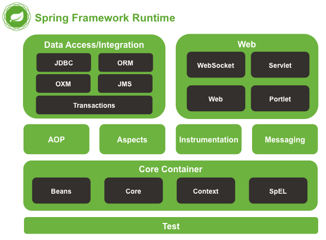

- 核心模块（Core）

&ensp;&ensp;&ensp;&ensp;- IOC容器（控制反转Inversion of Control）

&ensp;&ensp;&ensp;&ensp;&ensp;&ensp;&ensp;&ensp;- 概念

&ensp;&ensp;&ensp;&ensp;&ensp;&ensp;&ensp;&ensp;&ensp;&ensp;&ensp;&ensp;- 控制反转IoC(Inversion of Control)，是一种设计思想！

&ensp;&ensp;&ensp;&ensp;&ensp;&ensp;&ensp;&ensp;&ensp;&ensp;&ensp;&ensp;- Spring针对IoC思想做了实现，也就是DI（依赖注入是实现IoC思想的一种方法）

&ensp;&ensp;&ensp;&ensp;&ensp;&ensp;&ensp;&ensp;&ensp;&ensp;&ensp;&ensp;- 举例DI（依赖注入Dependency Injection）

&ensp;&ensp;&ensp;&ensp;&ensp;&ensp;&ensp;&ensp;&ensp;&ensp;&ensp;&ensp;&ensp;&ensp;&ensp;&ensp;- IoC举例（电脑和用户外接设备）

&ensp;&ensp;&ensp;&ensp;&ensp;&ensp;&ensp;&ensp;&ensp;&ensp;&ensp;&ensp;&ensp;&ensp;&ensp;&ensp;&ensp;&ensp;&ensp;&ensp;- 我用电脑和用户外接设备解释控制反转

&ensp;&ensp;&ensp;&ensp;&ensp;&ensp;&ensp;&ensp;&ensp;&ensp;&ensp;&ensp;&ensp;&ensp;&ensp;&ensp;&ensp;&ensp;&ensp;&ensp;- 对于电脑而言，他无法控制用户将任何外界设备插入电脑，此时电脑就已经将（插入外接设备）控制权转交给了用户（反转），具体插入什么设备的控制权是在用户手上。所以对于电脑而言这就叫控制反转。

&ensp;&ensp;&ensp;&ensp;&ensp;&ensp;&ensp;&ensp;&ensp;&ensp;&ensp;&ensp;&ensp;&ensp;&ensp;&ensp;- DI举例1（还是承接上面的例子）

&ensp;&ensp;&ensp;&ensp;&ensp;&ensp;&ensp;&ensp;&ensp;&ensp;&ensp;&ensp;&ensp;&ensp;&ensp;&ensp;&ensp;&ensp;&ensp;&ensp;- 承接上面的举例。

&ensp;&ensp;&ensp;&ensp;&ensp;&ensp;&ensp;&ensp;&ensp;&ensp;&ensp;&ensp;&ensp;&ensp;&ensp;&ensp;&ensp;&ensp;&ensp;&ensp;- 电脑也不知道用户会插入什么设备，但是不管你插入什么设备，电脑都会将你需要的（依赖的）设备识别出来，供你使用（使用时就已经注入）。这就是依赖注入。

&ensp;&ensp;&ensp;&ensp;&ensp;&ensp;&ensp;&ensp;&ensp;&ensp;&ensp;&ensp;&ensp;&ensp;&ensp;&ensp;- DI举例2（Spring中的DI？）

&ensp;&ensp;&ensp;&ensp;&ensp;&ensp;&ensp;&ensp;&ensp;&ensp;&ensp;&ensp;&ensp;&ensp;&ensp;&ensp;&ensp;&ensp;&ensp;&ensp;- 在没有使用Spring之前，我们都是直接申明变量，然后将new出来的对象赋值给申明的变量。

&ensp;&ensp;&ensp;&ensp;&ensp;&ensp;&ensp;&ensp;&ensp;&ensp;&ensp;&ensp;&ensp;&ensp;&ensp;&ensp;&ensp;&ensp;&ensp;&ensp;- 在使用Spring之后，我们可以通过**配置文件** 或者**注解** ，将相关对象存放到Spring中的IoC容器中，在程序运行期间需要某个对象的时候，IoC容器会动态地将依赖关系注入所需要的对象。

&ensp;&ensp;&ensp;&ensp;&ensp;&ensp;&ensp;&ensp;&ensp;&ensp;&ensp;&ensp;- 工作原理图

&ensp;&ensp;&ensp;&ensp;&ensp;&ensp;&ensp;&ensp;&ensp;&ensp;&ensp;&ensp;&ensp;&ensp;&ensp;&ensp;- Spring中将所有对象都放入IoC容器中，可以说ApplicationContext接口就代表了IoC容器（也可以叫做上下文）。该接口有好几种实现， 从而实现XML配置，也可以使用Java注解进行配置。


&ensp;&ensp;&ensp;&ensp;&ensp;&ensp;&ensp;&ensp;- IoC容器核心架构

&ensp;&ensp;&ensp;&ensp;&ensp;&ensp;&ensp;&ensp;&ensp;&ensp;&ensp;&ensp;- 流程图片

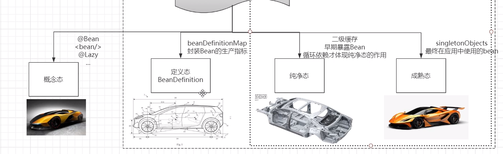


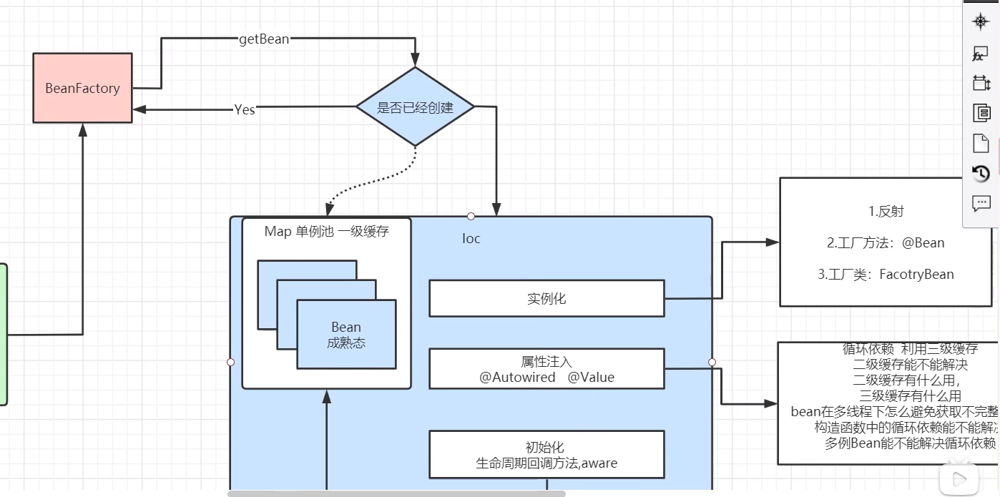

&ensp;&ensp;&ensp;&ensp;&ensp;&ensp;&ensp;&ensp;&ensp;&ensp;&ensp;&ensp;- Bean对象生命周期

&ensp;&ensp;&ensp;&ensp;&ensp;&ensp;&ensp;&ensp;&ensp;&ensp;&ensp;&ensp;&ensp;&ensp;&ensp;&ensp;- 1.实例化

&ensp;&ensp;&ensp;&ensp;&ensp;&ensp;&ensp;&ensp;&ensp;&ensp;&ensp;&ensp;&ensp;&ensp;&ensp;&ensp;&ensp;&ensp;&ensp;&ensp;- 首先是对象的实例化

&ensp;&ensp;&ensp;&ensp;&ensp;&ensp;&ensp;&ensp;&ensp;&ensp;&ensp;&ensp;&ensp;&ensp;&ensp;&ensp;&ensp;&ensp;&ensp;&ensp;- Bean实例化三种方式

&ensp;&ensp;&ensp;&ensp;&ensp;&ensp;&ensp;&ensp;&ensp;&ensp;&ensp;&ensp;&ensp;&ensp;&ensp;&ensp;&ensp;&ensp;&ensp;&ensp;&ensp;&ensp;&ensp;&ensp;- 实例化对象Bean也就是将bean放入IoC容器。（这里实例化对象等于bean）

&ensp;&ensp;&ensp;&ensp;&ensp;&ensp;&ensp;&ensp;&ensp;&ensp;&ensp;&ensp;&ensp;&ensp;&ensp;&ensp;&ensp;&ensp;&ensp;&ensp;&ensp;&ensp;&ensp;&ensp;- 三种方式：构造器（反射获取）、静态工厂方法、实例工厂（工厂类）。

&ensp;&ensp;&ensp;&ensp;&ensp;&ensp;&ensp;&ensp;&ensp;&ensp;&ensp;&ensp;&ensp;&ensp;&ensp;&ensp;&ensp;&ensp;&ensp;&ensp;&ensp;&ensp;&ensp;&ensp;- xml代码

```XML
    <!-- 第一种：使用构造器实例化bean对象 -->
    <bean id="user1" class="com.shengjava.demo.pojo.User"></bean>

    <!-- 第二种：静态工厂方法实例化bean对象 -->
    <bean id="user2" class="com.shengjava.demo.factory.UserFactory"
          factory-method="getInstance"/>

    <!-- 第三种：实例工厂方法实例化bean对象 -->
    <bean id="customer"
          factory-bean="customerFactory"
          factory-method="getInstance"/>
    <!-- 需要创建出实例工厂 -->
    <bean id="customerFactory" class="com.shengjava.demo.factory.CustomerFactory"/>
```


&ensp;&ensp;&ensp;&ensp;&ensp;&ensp;&ensp;&ensp;&ensp;&ensp;&ensp;&ensp;&ensp;&ensp;&ensp;&ensp;&ensp;&ensp;&ensp;&ensp;&ensp;&ensp;&ensp;&ensp;- 参考

&ensp;&ensp;&ensp;&ensp;&ensp;&ensp;&ensp;&ensp;&ensp;&ensp;&ensp;&ensp;&ensp;&ensp;&ensp;&ensp;&ensp;&ensp;&ensp;&ensp;&ensp;&ensp;&ensp;&ensp;&ensp;&ensp;&ensp;&ensp;[Spring Framework 中文文档 - 1.3.2. 实例化 bean](https://www.docs4dev.com/docs/zh/spring-framework/5.1.3.RELEASE/reference/core.html#:~:text=1.3.2. 实例化 bean) 

&ensp;&ensp;&ensp;&ensp;&ensp;&ensp;&ensp;&ensp;&ensp;&ensp;&ensp;&ensp;&ensp;&ensp;&ensp;&ensp;&ensp;&ensp;&ensp;&ensp;&ensp;&ensp;&ensp;&ensp;&ensp;&ensp;&ensp;&ensp;[【Spring】（3.1）实例化bean对象（三种方式）_长生的梦呓](https://blog.csdn.net/weixin_44034328/article/details/105326861)

&ensp;&ensp;&ensp;&ensp;&ensp;&ensp;&ensp;&ensp;&ensp;&ensp;&ensp;&ensp;&ensp;&ensp;&ensp;&ensp;- 2.对属性进行注入

&ensp;&ensp;&ensp;&ensp;&ensp;&ensp;&ensp;&ensp;&ensp;&ensp;&ensp;&ensp;&ensp;&ensp;&ensp;&ensp;&ensp;&ensp;&ensp;&ensp;可能会产生循环依赖问题。[Spring如何解决循环依赖的？](https://www.wolai.com/ig4czZVYii5byj5FZQ4oXj)

```XML
    <!-- xml实现 -->
    <!-- 没有使用自动装配之前，我们需要自己手动注入对象到People对象的属性中（使用People类的无参构造器） -->
    <bean id="peopleBefore" class="com.shengjava.demo.pojo.People" init-method="getDog" destroy-method="getDog">
        <property name="cat" ref="cat"></property>
        <property name="dog" ref="dog"></property>
    </bean>
```


&ensp;&ensp;&ensp;&ensp;&ensp;&ensp;&ensp;&ensp;&ensp;&ensp;&ensp;&ensp;&ensp;&ensp;&ensp;&ensp;&ensp;&ensp;&ensp;&ensp;注解实现：@Autowired

&ensp;&ensp;&ensp;&ensp;&ensp;&ensp;&ensp;&ensp;&ensp;&ensp;&ensp;&ensp;&ensp;&ensp;&ensp;&ensp;&ensp;&ensp;&ensp;&ensp;- Spring如何解决循环依赖的？

&ensp;&ensp;&ensp;&ensp;&ensp;&ensp;&ensp;&ensp;&ensp;&ensp;&ensp;&ensp;&ensp;&ensp;&ensp;&ensp;&ensp;&ensp;&ensp;&ensp;&ensp;&ensp;&ensp;&ensp;

&ensp;&ensp;&ensp;&ensp;&ensp;&ensp;&ensp;&ensp;&ensp;&ensp;&ensp;&ensp;&ensp;&ensp;&ensp;&ensp;- 3.初始化

```XML
<!-- xml实现 -->
<bean id="user1" class="com.t.User" init-method="initXxx()" ></bean>
```


&ensp;&ensp;&ensp;&ensp;&ensp;&ensp;&ensp;&ensp;&ensp;&ensp;&ensp;&ensp;&ensp;&ensp;&ensp;&ensp;&ensp;&ensp;&ensp;&ensp;注解实现：[@PostConstruct、@PreDestroy（构建、销毁执行）](https://www.wolai.com/axtNNKJuCJzBLnbUiQYQvN)

&ensp;&ensp;&ensp;&ensp;&ensp;&ensp;&ensp;&ensp;&ensp;&ensp;&ensp;&ensp;&ensp;&ensp;&ensp;&ensp;&ensp;&ensp;&ensp;&ensp;扩展：也可以通过实现InitializingBean接口。

&ensp;&ensp;&ensp;&ensp;&ensp;&ensp;&ensp;&ensp;&ensp;&ensp;&ensp;&ensp;&ensp;&ensp;&ensp;&ensp;- 4.销毁

```XML
<!-- xml实现 -->
<bean id="user1" class="com.t.User" destroy-method="destroyXxx()" ></bean>
```


&ensp;&ensp;&ensp;&ensp;&ensp;&ensp;&ensp;&ensp;&ensp;&ensp;&ensp;&ensp;&ensp;&ensp;&ensp;&ensp;&ensp;&ensp;&ensp;&ensp;注解实现：[@PostConstruct、@PreDestroy（构建、销毁执行）](https://www.wolai.com/axtNNKJuCJzBLnbUiQYQvN)

&ensp;&ensp;&ensp;&ensp;&ensp;&ensp;&ensp;&ensp;&ensp;&ensp;&ensp;&ensp;- 参考

&ensp;&ensp;&ensp;&ensp;&ensp;&ensp;&ensp;&ensp;&ensp;&ensp;&ensp;&ensp;&ensp;&ensp;&ensp;&ensp;[Spring IOC容器核心架构原理](https://www.bilibili.com/video/BV1S5411K7Df)

&ensp;&ensp;&ensp;&ensp;&ensp;&ensp;&ensp;&ensp;- Bean依赖注入（对象属性的依赖注入）

&ensp;&ensp;&ensp;&ensp;&ensp;&ensp;&ensp;&ensp;&ensp;&ensp;&ensp;&ensp;- 基于构造器

&ensp;&ensp;&ensp;&ensp;&ensp;&ensp;&ensp;&ensp;&ensp;&ensp;&ensp;&ensp;- 基于Setter方法

&ensp;&ensp;&ensp;&ensp;&ensp;&ensp;&ensp;&ensp;&ensp;&ensp;&ensp;&ensp;- 依赖详细配置

&ensp;&ensp;&ensp;&ensp;&ensp;&ensp;&ensp;&ensp;&ensp;&ensp;&ensp;&ensp;&ensp;&ensp;&ensp;&ensp;- 依赖关系详细配置请参考：[1.4.2. 依赖性和详细配置](https://www.docs4dev.com/docs/zh/spring-framework/5.1.3.RELEASE/reference/core.html#:~:text=1.4.2. 依赖性和详细配置)

&ensp;&ensp;&ensp;&ensp;&ensp;&ensp;&ensp;&ensp;&ensp;&ensp;&ensp;&ensp;- 参考

&ensp;&ensp;&ensp;&ensp;&ensp;&ensp;&ensp;&ensp;&ensp;&ensp;&ensp;&ensp;&ensp;&ensp;&ensp;&ensp;[Spring Framework 中文文档 - 1.4.1. 依赖注入](https://www.docs4dev.com/docs/zh/spring-framework/5.1.3.RELEASE/reference/core.html#:~:text=1.4.1. 依赖注入)

&ensp;&ensp;&ensp;&ensp;&ensp;&ensp;&ensp;&ensp;&ensp;&ensp;&ensp;&ensp;&ensp;&ensp;&ensp;&ensp;[【Spring + Spring MVC + MyBatis】文章目录_长生的梦呓](https://blog.csdn.net/weixin_44034328/article/details/105327341)

&ensp;&ensp;&ensp;&ensp;&ensp;&ensp;&ensp;&ensp;- Bean作用域范围（实例化对象的6大作用域）

&ensp;&ensp;&ensp;&ensp;&ensp;&ensp;&ensp;&ensp;&ensp;&ensp;&ensp;&ensp;- singleton（单例）

&ensp;&ensp;&ensp;&ensp;&ensp;&ensp;&ensp;&ensp;&ensp;&ensp;&ensp;&ensp;- prototype（原型）

&ensp;&ensp;&ensp;&ensp;&ensp;&ensp;&ensp;&ensp;&ensp;&ensp;&ensp;&ensp;- request（请求）

&ensp;&ensp;&ensp;&ensp;&ensp;&ensp;&ensp;&ensp;&ensp;&ensp;&ensp;&ensp;- session（会话）

&ensp;&ensp;&ensp;&ensp;&ensp;&ensp;&ensp;&ensp;&ensp;&ensp;&ensp;&ensp;- application（应用）

&ensp;&ensp;&ensp;&ensp;&ensp;&ensp;&ensp;&ensp;&ensp;&ensp;&ensp;&ensp;- websocket

&ensp;&ensp;&ensp;&ensp;&ensp;&ensp;&ensp;&ensp;&ensp;&ensp;&ensp;&ensp;- 参考

&ensp;&ensp;&ensp;&ensp;&ensp;&ensp;&ensp;&ensp;&ensp;&ensp;&ensp;&ensp;&ensp;&ensp;&ensp;&ensp;[Spring Framework 中文文档 - 1.5. bean 范围](https://www.docs4dev.com/docs/zh/spring-framework/5.1.3.RELEASE/reference/core.html#:~:text=1.5. bean 范围)

&ensp;&ensp;&ensp;&ensp;&ensp;&ensp;&ensp;&ensp;&ensp;&ensp;&ensp;&ensp;&ensp;&ensp;&ensp;&ensp;[【Spring】（3.2）bean对象的作用域_长生的梦呓](https://blog.csdn.net/weixin_44034328/article/details/105326908)

&ensp;&ensp;&ensp;&ensp;&ensp;&ensp;&ensp;&ensp;- 注解配置容器

&ensp;&ensp;&ensp;&ensp;&ensp;&ensp;&ensp;&ensp;&ensp;&ensp;&ensp;&ensp;- 使用Spring不一定要用XML配置文件，也可以使用注解！

&ensp;&ensp;&ensp;&ensp;&ensp;&ensp;&ensp;&ensp;&ensp;&ensp;&ensp;&ensp;- Bean配置

&ensp;&ensp;&ensp;&ensp;&ensp;&ensp;&ensp;&ensp;&ensp;&ensp;&ensp;&ensp;&ensp;&ensp;&ensp;&ensp;- @Configuration（配置）

&ensp;&ensp;&ensp;&ensp;&ensp;&ensp;&ensp;&ensp;&ensp;&ensp;&ensp;&ensp;&ensp;&ensp;&ensp;&ensp;&ensp;&ensp;&ensp;&ensp;声明当前类为配置类，相当于xml形式的Spring配置（类上）

&ensp;&ensp;&ensp;&ensp;&ensp;&ensp;&ensp;&ensp;&ensp;&ensp;&ensp;&ensp;&ensp;&ensp;&ensp;&ensp;&ensp;&ensp;&ensp;&ensp;- 举例代码

```Java
@Configuration
@MapperScan("com.xxx.question.mapper")
public class MybatisPlusConfig {
    /**
     * 分页插件配置
     */
    @Bean
    public PaginationInterceptor paginationInterceptor() {
        PaginationInterceptor paginationInterceptor = new PaginationInterceptor();
        paginationInterceptor.setCountSqlParser(new JsqlParserCountOptimize(true));
        return paginationInterceptor;
    }
}
```


&ensp;&ensp;&ensp;&ensp;&ensp;&ensp;&ensp;&ensp;&ensp;&ensp;&ensp;&ensp;&ensp;&ensp;&ensp;&ensp;&ensp;&ensp;&ensp;&ensp;- 扩展

&ensp;&ensp;&ensp;&ensp;&ensp;&ensp;&ensp;&ensp;&ensp;&ensp;&ensp;&ensp;&ensp;&ensp;&ensp;&ensp;&ensp;&ensp;&ensp;&ensp;&ensp;&ensp;&ensp;&ensp;- 下面这个注解SpringBoot中的注解

&ensp;&ensp;&ensp;&ensp;&ensp;&ensp;&ensp;&ensp;&ensp;&ensp;&ensp;&ensp;&ensp;&ensp;&ensp;&ensp;&ensp;&ensp;&ensp;&ensp;&ensp;&ensp;&ensp;&ensp;- @WishlyConfiguration

&ensp;&ensp;&ensp;&ensp;&ensp;&ensp;&ensp;&ensp;&ensp;&ensp;&ensp;&ensp;&ensp;&ensp;&ensp;&ensp;&ensp;&ensp;&ensp;&ensp;&ensp;&ensp;&ensp;&ensp;&ensp;&ensp;&ensp;&ensp;为@Configuration与@ComponentScan的组合注解，可以替代这两个注解

&ensp;&ensp;&ensp;&ensp;&ensp;&ensp;&ensp;&ensp;&ensp;&ensp;&ensp;&ensp;&ensp;&ensp;&ensp;&ensp;- @Bean（注册bean）

&ensp;&ensp;&ensp;&ensp;&ensp;&ensp;&ensp;&ensp;&ensp;&ensp;&ensp;&ensp;&ensp;&ensp;&ensp;&ensp;&ensp;&ensp;&ensp;&ensp;注解在方法上，声明当前方法的返回值为一个bean，替代xml中的方式（方法上）

&ensp;&ensp;&ensp;&ensp;&ensp;&ensp;&ensp;&ensp;&ensp;&ensp;&ensp;&ensp;&ensp;&ensp;&ensp;&ensp;- @Import（导入）

&ensp;&ensp;&ensp;&ensp;&ensp;&ensp;&ensp;&ensp;&ensp;&ensp;&ensp;&ensp;&ensp;&ensp;&ensp;&ensp;&ensp;&ensp;&ensp;&ensp;用来导入其他的有@Configuration注解的配置类。

&ensp;&ensp;&ensp;&ensp;&ensp;&ensp;&ensp;&ensp;&ensp;&ensp;&ensp;&ensp;&ensp;&ensp;&ensp;&ensp;&ensp;&ensp;&ensp;&ensp;也可以直接再配置类中导入一个类，导入后就实例化bean放到IoC容器中了。

&ensp;&ensp;&ensp;&ensp;&ensp;&ensp;&ensp;&ensp;&ensp;&ensp;&ensp;&ensp;&ensp;&ensp;&ensp;&ensp;- @ComponentScan（组件扫描）

&ensp;&ensp;&ensp;&ensp;&ensp;&ensp;&ensp;&ensp;&ensp;&ensp;&ensp;&ensp;&ensp;&ensp;&ensp;&ensp;&ensp;&ensp;&ensp;&ensp;- 用于对Component进行扫描，相当于xml中的context:component-scan/（类上）

&ensp;&ensp;&ensp;&ensp;&ensp;&ensp;&ensp;&ensp;&ensp;&ensp;&ensp;&ensp;&ensp;&ensp;&ensp;&ensp;&ensp;&ensp;&ensp;&ensp;- 也就是扫描指定包下面的相关[Bean声明注解](https://www.wolai.com/ehBdXKtMoP4qi7qmsHqHRF)。使用了例如@Component注解的类，都会实例化对象并放入IoC容器中交给Spring统一管理。

&ensp;&ensp;&ensp;&ensp;&ensp;&ensp;&ensp;&ensp;&ensp;&ensp;&ensp;&ensp;&ensp;&ensp;&ensp;&ensp;&ensp;&ensp;&ensp;&ensp;- Bean声明注解

&ensp;&ensp;&ensp;&ensp;&ensp;&ensp;&ensp;&ensp;&ensp;&ensp;&ensp;&ensp;&ensp;&ensp;&ensp;&ensp;&ensp;&ensp;&ensp;&ensp;&ensp;&ensp;&ensp;&ensp;- @Component（组件）

&ensp;&ensp;&ensp;&ensp;&ensp;&ensp;&ensp;&ensp;&ensp;&ensp;&ensp;&ensp;&ensp;&ensp;&ensp;&ensp;&ensp;&ensp;&ensp;&ensp;&ensp;&ensp;&ensp;&ensp;&ensp;&ensp;&ensp;&ensp;组件，没有明确的角色。

&ensp;&ensp;&ensp;&ensp;&ensp;&ensp;&ensp;&ensp;&ensp;&ensp;&ensp;&ensp;&ensp;&ensp;&ensp;&ensp;&ensp;&ensp;&ensp;&ensp;&ensp;&ensp;&ensp;&ensp;&ensp;&ensp;&ensp;&ensp;- 这个几个注解都差不多，都是注册bean到IoC容器中，只不过有语义上的区别。底层使用的都是@Component注解。

&ensp;&ensp;&ensp;&ensp;&ensp;&ensp;&ensp;&ensp;&ensp;&ensp;&ensp;&ensp;&ensp;&ensp;&ensp;&ensp;&ensp;&ensp;&ensp;&ensp;&ensp;&ensp;&ensp;&ensp;- @Service（服务业务）

&ensp;&ensp;&ensp;&ensp;&ensp;&ensp;&ensp;&ensp;&ensp;&ensp;&ensp;&ensp;&ensp;&ensp;&ensp;&ensp;&ensp;&ensp;&ensp;&ensp;&ensp;&ensp;&ensp;&ensp;&ensp;&ensp;&ensp;&ensp;在业务逻辑层使用（service业务层）

&ensp;&ensp;&ensp;&ensp;&ensp;&ensp;&ensp;&ensp;&ensp;&ensp;&ensp;&ensp;&ensp;&ensp;&ensp;&ensp;&ensp;&ensp;&ensp;&ensp;&ensp;&ensp;&ensp;&ensp;- @Repository（存储仓库）

&ensp;&ensp;&ensp;&ensp;&ensp;&ensp;&ensp;&ensp;&ensp;&ensp;&ensp;&ensp;&ensp;&ensp;&ensp;&ensp;&ensp;&ensp;&ensp;&ensp;&ensp;&ensp;&ensp;&ensp;&ensp;&ensp;&ensp;&ensp;`@Repository`注解 是满足存储库的角色或构造型(也称为数据访问对象或 DAO)的任何类的标记。

&ensp;&ensp;&ensp;&ensp;&ensp;&ensp;&ensp;&ensp;&ensp;&ensp;&ensp;&ensp;&ensp;&ensp;&ensp;&ensp;&ensp;&ensp;&ensp;&ensp;&ensp;&ensp;&ensp;&ensp;&ensp;&ensp;&ensp;&ensp;在数据访问层使用（dao数据层）

&ensp;&ensp;&ensp;&ensp;&ensp;&ensp;&ensp;&ensp;&ensp;&ensp;&ensp;&ensp;&ensp;&ensp;&ensp;&ensp;&ensp;&ensp;&ensp;&ensp;&ensp;&ensp;&ensp;&ensp;- @Controller（控制器）

&ensp;&ensp;&ensp;&ensp;&ensp;&ensp;&ensp;&ensp;&ensp;&ensp;&ensp;&ensp;&ensp;&ensp;&ensp;&ensp;&ensp;&ensp;&ensp;&ensp;&ensp;&ensp;&ensp;&ensp;&ensp;&ensp;&ensp;&ensp;在展现层使用，控制器的声明（controller控制层）

&ensp;&ensp;&ensp;&ensp;&ensp;&ensp;&ensp;&ensp;&ensp;&ensp;&ensp;&ensp;&ensp;&ensp;&ensp;&ensp;- 注册Bean优先级

&ensp;&ensp;&ensp;&ensp;&ensp;&ensp;&ensp;&ensp;&ensp;&ensp;&ensp;&ensp;&ensp;&ensp;&ensp;&ensp;&ensp;&ensp;&ensp;&ensp;- @Primary（设置bean优先注入）

&ensp;&ensp;&ensp;&ensp;&ensp;&ensp;&ensp;&ensp;&ensp;&ensp;&ensp;&ensp;&ensp;&ensp;&ensp;&ensp;&ensp;&ensp;&ensp;&ensp;&ensp;&ensp;&ensp;&ensp;- 当某个类型的对象有多个时，会优先注入特定的bean对象。

&ensp;&ensp;&ensp;&ensp;&ensp;&ensp;&ensp;&ensp;&ensp;&ensp;&ensp;&ensp;&ensp;&ensp;&ensp;&ensp;&ensp;&ensp;&ensp;&ensp;&ensp;&ensp;&ensp;&ensp;- 代码示例

&ensp;&ensp;&ensp;&ensp;&ensp;&ensp;&ensp;&ensp;&ensp;&ensp;&ensp;&ensp;&ensp;&ensp;&ensp;&ensp;&ensp;&ensp;&ensp;&ensp;&ensp;&ensp;&ensp;&ensp;&ensp;&ensp;&ensp;&ensp;在使用@[@Autowired（自动装配）](https://www.wolai.com/cecJQLqTf4FqefhtAzJfNr)注解注入MovieCatalog 时，则会预先注入有 @Primary注解的firstMovieCatalog()方法中的对象。

```Java
@Configuration
public class MovieConfiguration {

    @Bean
    @Primary
    public MovieCatalog firstMovieCatalog() { ... }

    @Bean
    public MovieCatalog secondMovieCatalog() { ... }

    // ...
}
```


&ensp;&ensp;&ensp;&ensp;&ensp;&ensp;&ensp;&ensp;&ensp;&ensp;&ensp;&ensp;&ensp;&ensp;&ensp;&ensp;&ensp;&ensp;&ensp;&ensp;- @DependsOn（依赖项注册）

&ensp;&ensp;&ensp;&ensp;&ensp;&ensp;&ensp;&ensp;&ensp;&ensp;&ensp;&ensp;&ensp;&ensp;&ensp;&ensp;&ensp;&ensp;&ensp;&ensp;&ensp;&ensp;&ensp;&ensp;用来控制bean加载顺序，指定某些bean要优先于加载其他bean。也就是说如果bean注册时，如果方法上标记了这个注解，那么他会晚于指定的bean加载。

&ensp;&ensp;&ensp;&ensp;&ensp;&ensp;&ensp;&ensp;&ensp;&ensp;&ensp;&ensp;&ensp;&ensp;&ensp;&ensp;&ensp;&ensp;&ensp;&ensp;&ensp;&ensp;&ensp;&ensp;- 代码

```Java
    @Bean
    @DependsOn("eventListener")
    public EventPublisherBean eventPublisherBean () {
        return new EventPublisherBean();
    }

    @Bean(name = "eventListener")
    // @Lazy
    public EventListenerBean eventListenerBean () {
        return new EventListenerBean();
    }  
```


```Java
# 上面实例化时优先级如下
EventListenerBean 
EventPublisherBean 
```


&ensp;&ensp;&ensp;&ensp;&ensp;&ensp;&ensp;&ensp;&ensp;&ensp;&ensp;&ensp;&ensp;&ensp;&ensp;&ensp;&ensp;&ensp;&ensp;&ensp;&ensp;&ensp;&ensp;&ensp;- 参考

&ensp;&ensp;&ensp;&ensp;&ensp;&ensp;&ensp;&ensp;&ensp;&ensp;&ensp;&ensp;&ensp;&ensp;&ensp;&ensp;&ensp;&ensp;&ensp;&ensp;&ensp;&ensp;&ensp;&ensp;&ensp;&ensp;&ensp;&ensp;[使用Spring @DependsOn控制bean加载顺序](https://blog.csdn.net/neweastsun/article/details/78775371)

&ensp;&ensp;&ensp;&ensp;&ensp;&ensp;&ensp;&ensp;&ensp;&ensp;&ensp;&ensp;&ensp;&ensp;&ensp;&ensp;&ensp;&ensp;&ensp;&ensp;- @PostConstruct、@PreDestroy（构建、销毁执行）

&ensp;&ensp;&ensp;&ensp;&ensp;&ensp;&ensp;&ensp;&ensp;&ensp;&ensp;&ensp;&ensp;&ensp;&ensp;&ensp;&ensp;&ensp;&ensp;&ensp;&ensp;&ensp;&ensp;&ensp;- 相当于xml配置文件中的[3.初始化](https://www.wolai.com/5so7dohEcs6ZXo5DgbVDWN)[4.销毁](https://www.wolai.com/cJJ1HRW3NkjSZWaEauN1Eg)

&ensp;&ensp;&ensp;&ensp;&ensp;&ensp;&ensp;&ensp;&ensp;&ensp;&ensp;&ensp;&ensp;&ensp;&ensp;&ensp;&ensp;&ensp;&ensp;&ensp;&ensp;&ensp;&ensp;&ensp;- @PostConstruct：由JSR-250提供，在构造函数执行完之后执行，等价于xml配置文件中bean的initMethod，但是比init方法更靠前执行。

&ensp;&ensp;&ensp;&ensp;&ensp;&ensp;&ensp;&ensp;&ensp;&ensp;&ensp;&ensp;&ensp;&ensp;&ensp;&ensp;&ensp;&ensp;&ensp;&ensp;&ensp;&ensp;&ensp;&ensp;- @PreDestroy：由JSR-250提供，在Bean销毁之前执行，等价于xml配置文件中bean的destroyMethod，但是比destroy方法更靠后执行。

&ensp;&ensp;&ensp;&ensp;&ensp;&ensp;&ensp;&ensp;&ensp;&ensp;&ensp;&ensp;&ensp;&ensp;&ensp;&ensp;&ensp;&ensp;&ensp;&ensp;&ensp;&ensp;&ensp;&ensp;- 流程图

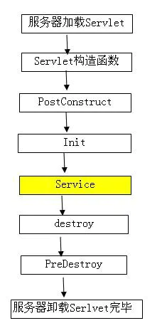

&ensp;&ensp;&ensp;&ensp;&ensp;&ensp;&ensp;&ensp;&ensp;&ensp;&ensp;&ensp;&ensp;&ensp;&ensp;&ensp;&ensp;&ensp;&ensp;&ensp;&ensp;&ensp;&ensp;&ensp;- 参考

&ensp;&ensp;&ensp;&ensp;&ensp;&ensp;&ensp;&ensp;&ensp;&ensp;&ensp;&ensp;&ensp;&ensp;&ensp;&ensp;&ensp;&ensp;&ensp;&ensp;&ensp;&ensp;&ensp;&ensp;&ensp;&ensp;&ensp;&ensp;[@PostConstruct - 简书](https://www.jianshu.com/p/98cf7d8b9ec3)

&ensp;&ensp;&ensp;&ensp;&ensp;&ensp;&ensp;&ensp;&ensp;&ensp;&ensp;&ensp;&ensp;&ensp;&ensp;&ensp;&ensp;&ensp;&ensp;&ensp;&ensp;&ensp;&ensp;&ensp;&ensp;&ensp;&ensp;&ensp;实际场景：[@PostConstruct注解](https://zhuanlan.zhihu.com/p/126749381)

&ensp;&ensp;&ensp;&ensp;&ensp;&ensp;&ensp;&ensp;&ensp;&ensp;&ensp;&ensp;&ensp;&ensp;&ensp;&ensp;- 作用域范围（@Scope）

&ensp;&ensp;&ensp;&ensp;&ensp;&ensp;&ensp;&ensp;&ensp;&ensp;&ensp;&ensp;&ensp;&ensp;&ensp;&ensp;&ensp;&ensp;&ensp;&ensp;- 设置Spring容器如何新建Bean实例（方法上，得有@Bean），参数值有6种不同的作用域。

&ensp;&ensp;&ensp;&ensp;&ensp;&ensp;&ensp;&ensp;&ensp;&ensp;&ensp;&ensp;&ensp;&ensp;&ensp;&ensp;&ensp;&ensp;&ensp;&ensp;- Singleton （单例,一个Spring容器中只有一个bean实例，默认模式）,
&ensp;&ensp;&ensp;&ensp;&ensp;&ensp;&ensp;&ensp;&ensp;&ensp;&ensp;&ensp;&ensp;&ensp;&ensp;&ensp;&ensp;&ensp;&ensp;&ensp;

&ensp;&ensp;&ensp;&ensp;&ensp;&ensp;&ensp;&ensp;&ensp;&ensp;&ensp;&ensp;&ensp;&ensp;&ensp;&ensp;&ensp;&ensp;&ensp;&ensp;- Protetype （每次调用新建一个bean）,
&ensp;&ensp;&ensp;&ensp;&ensp;&ensp;&ensp;&ensp;&ensp;&ensp;&ensp;&ensp;&ensp;&ensp;&ensp;&ensp;&ensp;&ensp;&ensp;&ensp;

&ensp;&ensp;&ensp;&ensp;&ensp;&ensp;&ensp;&ensp;&ensp;&ensp;&ensp;&ensp;&ensp;&ensp;&ensp;&ensp;&ensp;&ensp;&ensp;&ensp;- Request （web项目中，给每个http request新建一个bean）,
&ensp;&ensp;&ensp;&ensp;&ensp;&ensp;&ensp;&ensp;&ensp;&ensp;&ensp;&ensp;&ensp;&ensp;&ensp;&ensp;&ensp;&ensp;&ensp;&ensp;

&ensp;&ensp;&ensp;&ensp;&ensp;&ensp;&ensp;&ensp;&ensp;&ensp;&ensp;&ensp;&ensp;&ensp;&ensp;&ensp;&ensp;&ensp;&ensp;&ensp;- Session （web项目中，给每个http session新建一个bean）,

&ensp;&ensp;&ensp;&ensp;&ensp;&ensp;&ensp;&ensp;&ensp;&ensp;&ensp;&ensp;&ensp;&ensp;&ensp;&ensp;&ensp;&ensp;&ensp;&ensp;- GlobalSession（给每一个 global http session新建一个Bean实例）

&ensp;&ensp;&ensp;&ensp;&ensp;&ensp;&ensp;&ensp;&ensp;&ensp;&ensp;&ensp;- Bean注入

&ensp;&ensp;&ensp;&ensp;&ensp;&ensp;&ensp;&ensp;&ensp;&ensp;&ensp;&ensp;&ensp;&ensp;&ensp;&ensp;- @Autowired（自动装配）

&ensp;&ensp;&ensp;&ensp;&ensp;&ensp;&ensp;&ensp;&ensp;&ensp;&ensp;&ensp;&ensp;&ensp;&ensp;&ensp;&ensp;&ensp;&ensp;&ensp;由Spring提供。用于自动将所需的bean对象装配到声明的变量中，默认是byType进行注入相关bean。可以与[@Qualifier（限定）](https://www.wolai.com/PhVACoNzfZtndPLztMxSz)搭配使用。

&ensp;&ensp;&ensp;&ensp;&ensp;&ensp;&ensp;&ensp;&ensp;&ensp;&ensp;&ensp;&ensp;&ensp;&ensp;&ensp;- @Qualifier（限定）

&ensp;&ensp;&ensp;&ensp;&ensp;&ensp;&ensp;&ensp;&ensp;&ensp;&ensp;&ensp;&ensp;&ensp;&ensp;&ensp;&ensp;&ensp;&ensp;&ensp;可以用于bean的歧义性问题。

&ensp;&ensp;&ensp;&ensp;&ensp;&ensp;&ensp;&ensp;&ensp;&ensp;&ensp;&ensp;&ensp;&ensp;&ensp;&ensp;&ensp;&ensp;&ensp;&ensp;例如：使用@Autowired注解时，默认时按照类型（byType）进行注入bean对象的，此时就可以使用该注解，指定的bean名称，将特定bean名称的对象注入。

&ensp;&ensp;&ensp;&ensp;&ensp;&ensp;&ensp;&ensp;&ensp;&ensp;&ensp;&ensp;&ensp;&ensp;&ensp;&ensp;- @Resource（资源）

&ensp;&ensp;&ensp;&ensp;&ensp;&ensp;&ensp;&ensp;&ensp;&ensp;&ensp;&ensp;&ensp;&ensp;&ensp;&ensp;&ensp;&ensp;&ensp;&ensp;由JSR-250（Java Specification Requests）提供。作用和@Autowired类似不一样的是，该注解默认是使用byName进行注入相关bean。

&ensp;&ensp;&ensp;&ensp;&ensp;&ensp;&ensp;&ensp;&ensp;&ensp;&ensp;&ensp;&ensp;&ensp;&ensp;&ensp;&ensp;&ensp;&ensp;&ensp;该注解可以指定名字。而@Autowired不行，只能搭配@Qualifier使用。

&ensp;&ensp;&ensp;&ensp;&ensp;&ensp;&ensp;&ensp;&ensp;&ensp;&ensp;&ensp;&ensp;&ensp;&ensp;&ensp;&ensp;&ensp;&ensp;&ensp;- 举例代码

```Java
// 指定名称对象
@Resource(name = "testObj")
private String testObj;
// 指定名称对象
@Autowired
@Qualifier(value = "testObj")
private String testObj;


```


&ensp;&ensp;&ensp;&ensp;&ensp;&ensp;&ensp;&ensp;&ensp;&ensp;&ensp;&ensp;&ensp;&ensp;&ensp;&ensp;- @Inject（注入，很少用）

&ensp;&ensp;&ensp;&ensp;&ensp;&ensp;&ensp;&ensp;&ensp;&ensp;&ensp;&ensp;&ensp;&ensp;&ensp;&ensp;&ensp;&ensp;&ensp;&ensp;由JSR-330提供。

&ensp;&ensp;&ensp;&ensp;&ensp;&ensp;&ensp;&ensp;&ensp;&ensp;&ensp;&ensp;&ensp;&ensp;&ensp;&ensp;&ensp;&ensp;&ensp;&ensp;可以使用这个注解代替[@Autowired（自动装配）](https://www.wolai.com/cecJQLqTf4FqefhtAzJfNr)，作用一样。不过需要引入javax.inject依赖。

&ensp;&ensp;&ensp;&ensp;&ensp;&ensp;&ensp;&ensp;&ensp;&ensp;&ensp;&ensp;&ensp;&ensp;&ensp;&ensp;&ensp;&ensp;&ensp;&ensp;可以搭配@Named("xxx")指定名称使用，达到同样效果。

&ensp;&ensp;&ensp;&ensp;&ensp;&ensp;&ensp;&ensp;&ensp;&ensp;&ensp;&ensp;- 配置文件读取

&ensp;&ensp;&ensp;&ensp;&ensp;&ensp;&ensp;&ensp;&ensp;&ensp;&ensp;&ensp;&ensp;&ensp;&ensp;&ensp;- @Value（Spring表达式语言SpEL）

&ensp;&ensp;&ensp;&ensp;&ensp;&ensp;&ensp;&ensp;&ensp;&ensp;&ensp;&ensp;&ensp;&ensp;&ensp;&ensp;&ensp;&ensp;&ensp;&ensp;- 用于读取配置文件信息，可能是xml、yaml、properties

&ensp;&ensp;&ensp;&ensp;&ensp;&ensp;&ensp;&ensp;&ensp;&ensp;&ensp;&ensp;&ensp;&ensp;&ensp;&ensp;&ensp;&ensp;&ensp;&ensp;- 基本语法：@Value("${配置文件变量值}")

&ensp;&ensp;&ensp;&ensp;&ensp;&ensp;&ensp;&ensp;&ensp;&ensp;&ensp;&ensp;&ensp;&ensp;&ensp;&ensp;&ensp;&ensp;&ensp;&ensp;- 参考

&ensp;&ensp;&ensp;&ensp;&ensp;&ensp;&ensp;&ensp;&ensp;&ensp;&ensp;&ensp;&ensp;&ensp;&ensp;&ensp;&ensp;&ensp;&ensp;&ensp;&ensp;&ensp;&ensp;&ensp;[Spring 表达式语言(SpEL)](https://www.docs4dev.com/docs/zh/spring-framework/5.1.3.RELEASE/reference/core.html#:~:text=4.%20Spring%20%E8%A1%A8%E8%BE%BE%E5%BC%8F%E8%AF%AD%E8%A8%80(SpEL))

&ensp;&ensp;&ensp;&ensp;&ensp;&ensp;&ensp;&ensp;&ensp;&ensp;&ensp;&ensp;&ensp;&ensp;&ensp;&ensp;- @PropertySource

&ensp;&ensp;&ensp;&ensp;&ensp;&ensp;&ensp;&ensp;&ensp;&ensp;&ensp;&ensp;&ensp;&ensp;&ensp;&ensp;&ensp;&ensp;&ensp;&ensp;- @PropertySource 和 @ConfigurationProperties 组合使用，可以将属性文件与一个Java类绑定，将属性文件中的变量值注入到该Java 类的成员变量中。

&ensp;&ensp;&ensp;&ensp;&ensp;&ensp;&ensp;&ensp;&ensp;&ensp;&ensp;&ensp;&ensp;&ensp;&ensp;&ensp;&ensp;&ensp;&ensp;&ensp;- 用于读取文件源，将文件中的变量值读取到配置对象中

&ensp;&ensp;&ensp;&ensp;&ensp;&ensp;&ensp;&ensp;&ensp;&ensp;&ensp;&ensp;&ensp;&ensp;&ensp;&ensp;&ensp;&ensp;&ensp;&ensp;- 举例代码

```Java
@Component
@ConfigurationProperties(prefix = "gen")
@PropertySource(value = { "classpath:generator.yml" })
public class GenConfig
{
    /** 作者 */
    public static String author;

    /** 生成包路径 */
    public static String packageName;

    /** 自动去除表前缀，默认是false */
    public static boolean autoRemovePre;

    /** 表前缀(类名不会包含表前缀) */
    public static String tablePrefix;

    public static String getAuthor()
    {
        return author;
    }

    @Value("${author}")
    public void setAuthor(String author)
    {
        GenConfig.author = author;
    }

    public static String getPackageName()
    {
        return packageName;
    }

    @Value("${packageName}")
    public void setPackageName(String packageName)
    {
        GenConfig.packageName = packageName;
    }

    public static boolean getAutoRemovePre()
    {
        return autoRemovePre;
    }

    @Value("${autoRemovePre}")
    public void setAutoRemovePre(boolean autoRemovePre)
    {
        GenConfig.autoRemovePre = autoRemovePre;
    }

    public static String getTablePrefix()
    {
        return tablePrefix;
    }

    @Value("${tablePrefix}")
    public void setTablePrefix(String tablePrefix)
    {
        GenConfig.tablePrefix = tablePrefix;
    }
}

```


&ensp;&ensp;&ensp;&ensp;&ensp;&ensp;&ensp;&ensp;&ensp;&ensp;&ensp;&ensp;&ensp;&ensp;&ensp;&ensp;- @ConfigurationProperties（SpringBoot[读取前缀](https://www.wolai.com/u8v2iUqgkUki3twEaeNbky)）

&ensp;&ensp;&ensp;&ensp;&ensp;&ensp;&ensp;&ensp;&ensp;&ensp;&ensp;&ensp;&ensp;&ensp;&ensp;&ensp;&ensp;&ensp;&ensp;&ensp;- 用于读取配置文件信息，可能是yaml、properties配置文件

&ensp;&ensp;&ensp;&ensp;&ensp;&ensp;&ensp;&ensp;&ensp;&ensp;&ensp;&ensp;&ensp;&ensp;&ensp;&ensp;&ensp;&ensp;&ensp;&ensp;- 一般在配置类上读取配置文件信息

&ensp;&ensp;&ensp;&ensp;&ensp;&ensp;&ensp;&ensp;&ensp;&ensp;&ensp;&ensp;&ensp;&ensp;&ensp;&ensp;&ensp;&ensp;&ensp;&ensp;- 举例代码

```Java
@Component
@ConfigurationProperties(prefix = "ruoyi")
public class RuoYiConfig
{
    /** 项目名称 */
    private static String name;

    /** 版本 */
    private static String version;

    /** 版权年份 */
    private static String copyrightYear;

    /** 实例演示开关 */
    private static boolean demoEnabled;

    /** 上传路径 */
    private static String profile;

    /** 获取地址开关 */
    private static boolean addressEnabled;

    public static String getName()
    {
        return name;
    }

    public void setName(String name)
    {
        RuoYiConfig.name = name;
    }

    public static String getVersion()
    {
        return version;
    }

    public void setVersion(String version)
    {
        RuoYiConfig.version = version;
    }

    public static String getCopyrightYear()
    {
        return copyrightYear;
    }

    public void setCopyrightYear(String copyrightYear)
    {
        RuoYiConfig.copyrightYear = copyrightYear;
    }

    public static boolean isDemoEnabled()
    {
        return demoEnabled;
    }

    public void setDemoEnabled(boolean demoEnabled)
    {
        RuoYiConfig.demoEnabled = demoEnabled;
    }

    public static String getProfile()
    {
        return profile;
    }

    public void setProfile(String profile)
    {
        RuoYiConfig.profile = profile;
    }

    public static boolean isAddressEnabled()
    {
        return addressEnabled;
    }

    public void setAddressEnabled(boolean addressEnabled)
    {
        RuoYiConfig.addressEnabled = addressEnabled;
    }

    /**
     * 获取头像上传路径
     */
    public static String getAvatarPath()
    {
        return getProfile() + "/avatar";
    }

    /**
     * 获取下载路径
     */
    public static String getDownloadPath()
    {
        return getProfile() + "/download/";
    }

    /**
     * 获取上传路径
     */
    public static String getUploadPath()
    {
        return getProfile() + "/upload";
    }
}
```


&ensp;&ensp;&ensp;&ensp;&ensp;&ensp;&ensp;&ensp;&ensp;&ensp;&ensp;&ensp;&ensp;&ensp;&ensp;&ensp;- @Profile（不常用）

&ensp;&ensp;&ensp;&ensp;&ensp;&ensp;&ensp;&ensp;&ensp;&ensp;&ensp;&ensp;&ensp;&ensp;&ensp;&ensp;&ensp;&ensp;&ensp;&ensp;- 可以指定一个或多个配置文件，搭配[@Value（Spring表达式语言SpEL）](https://www.wolai.com/gjpYN7Aiiw5fT9Yv67AkjA)读取配置文件中的数据。

&ensp;&ensp;&ensp;&ensp;&ensp;&ensp;&ensp;&ensp;&ensp;&ensp;&ensp;&ensp;&ensp;&ensp;&ensp;&ensp;&ensp;&ensp;&ensp;&ensp;- 用于标注生产环境、开发环境、测试环境。很少使用

&ensp;&ensp;&ensp;&ensp;&ensp;&ensp;&ensp;&ensp;&ensp;&ensp;&ensp;&ensp;- 参考

&ensp;&ensp;&ensp;&ensp;&ensp;&ensp;&ensp;&ensp;&ensp;&ensp;&ensp;&ensp;&ensp;&ensp;&ensp;&ensp;[Spring Framework 中文文档 - 基于注解的容器配置](https://www.docs4dev.com/docs/zh/spring-framework/5.1.3.RELEASE/reference/core.html#:~:text=1.9. 基于注解的容器配置)

&ensp;&ensp;&ensp;&ensp;&ensp;&ensp;&ensp;&ensp;&ensp;&ensp;&ensp;&ensp;&ensp;&ensp;&ensp;&ensp;[Spring注解大全](https://blog.csdn.net/IT_faquir/article/details/78025203)

&ensp;&ensp;&ensp;&ensp;&ensp;&ensp;&ensp;&ensp;- 参考

&ensp;&ensp;&ensp;&ensp;&ensp;&ensp;&ensp;&ensp;&ensp;&ensp;&ensp;&ensp; [Spring的IOC原理](https://www.cnblogs.com/superjt/p/4311577.html)

&ensp;&ensp;&ensp;&ensp;- AOP（面向切面编程Aspect Oriented Programming）

&ensp;&ensp;&ensp;&ensp;&ensp;&ensp;&ensp;&ensp;- 概念

&ensp;&ensp;&ensp;&ensp;&ensp;&ensp;&ensp;&ensp;&ensp;&ensp;&ensp;&ensp;- 面向切面编程，通过预编译方式和运行期间动态代理实现程序功能的统一维护的一种技术。

&ensp;&ensp;&ensp;&ensp;&ensp;&ensp;&ensp;&ensp;&ensp;&ensp;&ensp;&ensp;- 目的：AOP能够将那些与业务无关，却为业务模块所共同调用的逻辑或责任（例如事务处理、日志管理、权限控制等）封装起来，便于减少系统的重复代码，降低模块间的耦合度，并有利于未来的可拓展性和可维护性。

&ensp;&ensp;&ensp;&ensp;&ensp;&ensp;&ensp;&ensp;&ensp;&ensp;&ensp;&ensp;- 示例图

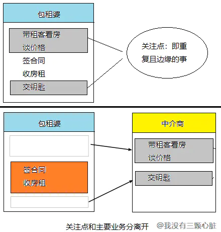

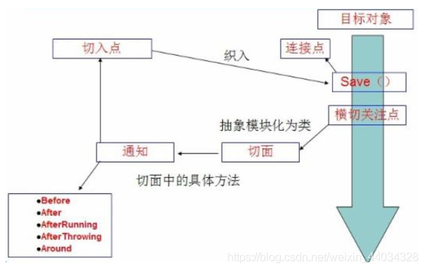

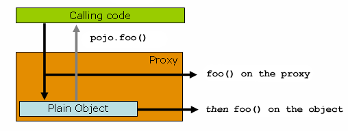

&ensp;&ensp;&ensp;&ensp;&ensp;&ensp;&ensp;&ensp;- Spring AOP作用

&ensp;&ensp;&ensp;&ensp;&ensp;&ensp;&ensp;&ensp;&ensp;&ensp;&ensp;&ensp;- 提供声明式事务

&ensp;&ensp;&ensp;&ensp;&ensp;&ensp;&ensp;&ensp;&ensp;&ensp;&ensp;&ensp;- 允许用户自定义切面

&ensp;&ensp;&ensp;&ensp;&ensp;&ensp;&ensp;&ensp;- AOP术语概念

&ensp;&ensp;&ensp;&ensp;&ensp;&ensp;&ensp;&ensp;&ensp;&ensp;&ensp;&ensp;- Aspect（切面 ）

&ensp;&ensp;&ensp;&ensp;&ensp;&ensp;&ensp;&ensp;&ensp;&ensp;&ensp;&ensp;&ensp;&ensp;&ensp;&ensp;> 涉及多个类别的关注点的模块化。**事务管理** （事务 Management) 是企业 Java 应用程序中横切关注的一个很好的例子。在 Spring AOP 中，切面是通过使用常规类([schema-based approach](https://www.docs4dev.com/docs/zh/spring-framework/5.1.3.RELEASE/reference/core.html#aop-schema))或使用`@Aspect`注解([@AspectJ style](https://www.docs4dev.com/docs/zh/spring-framework/5.1.3.RELEASE/reference/core.html#aop-ataspectj))注解 的常规类来实现的。


&ensp;&ensp;&ensp;&ensp;&ensp;&ensp;&ensp;&ensp;&ensp;&ensp;&ensp;&ensp;&ensp;&ensp;&ensp;&ensp;- 切面 = 切入点 + 通知，通俗点就是：**在什么时机，什么地方，做什么增强！** 

&ensp;&ensp;&ensp;&ensp;&ensp;&ensp;&ensp;&ensp;&ensp;&ensp;&ensp;&ensp;- Join point（连接点）

&ensp;&ensp;&ensp;&ensp;&ensp;&ensp;&ensp;&ensp;&ensp;&ensp;&ensp;&ensp;&ensp;&ensp;&ensp;&ensp;> 在程序执行过程中的一点，例如方法的执行或异常的处理。在 Spring AOP 中，连接点始终代表方法的执行。


&ensp;&ensp;&ensp;&ensp;&ensp;&ensp;&ensp;&ensp;&ensp;&ensp;&ensp;&ensp;&ensp;&ensp;&ensp;&ensp;- 与切入点匹配的执行点，也就是方法在什么地方执行

&ensp;&ensp;&ensp;&ensp;&ensp;&ensp;&ensp;&ensp;&ensp;&ensp;&ensp;&ensp;- Advice（通知 | 建议|增强）

&ensp;&ensp;&ensp;&ensp;&ensp;&ensp;&ensp;&ensp;&ensp;&ensp;&ensp;&ensp;&ensp;&ensp;&ensp;&ensp;> 切面在特定的连接点处采取的操作。


&ensp;&ensp;&ensp;&ensp;&ensp;&ensp;&ensp;&ensp;&ensp;&ensp;&ensp;&ensp;&ensp;&ensp;&ensp;&ensp;> 不同类型的通知包括“around环绕”，“before之前”和“after之后”建议(通知)。包括 Spring 在内的许多 AOP 框架都将建议建模为拦截器，并在连接点周围维护一系列拦截器。


&ensp;&ensp;&ensp;&ensp;&ensp;&ensp;&ensp;&ensp;&ensp;&ensp;&ensp;&ensp;&ensp;&ensp;&ensp;&ensp;- 在方法执行的什么实际（when:方法前/方法后/方法前后）做什么（what:增强的功能）

&ensp;&ensp;&ensp;&ensp;&ensp;&ensp;&ensp;&ensp;&ensp;&ensp;&ensp;&ensp;- Pointcut（切入点）

&ensp;&ensp;&ensp;&ensp;&ensp;&ensp;&ensp;&ensp;&ensp;&ensp;&ensp;&ensp;&ensp;&ensp;&ensp;&ensp;> 与连接点匹配的谓词。建议与切入点表达式关联，并在与该切入点匹配的任何连接点处运行(例如，执行具有特定名称的方法)。切入点表达式匹配的连接点的概念是 AOP 的核心，并且 Spring 默认使用 AspectJ 切入点表达语言。


&ensp;&ensp;&ensp;&ensp;&ensp;&ensp;&ensp;&ensp;&ensp;&ensp;&ensp;&ensp;&ensp;&ensp;&ensp;&ensp;- 在哪些类，哪些方法上切入（**where** ）。即一组连接点的集合；

&ensp;&ensp;&ensp;&ensp;&ensp;&ensp;&ensp;&ensp;&ensp;&ensp;&ensp;&ensp;- Target object（目标对象）

&ensp;&ensp;&ensp;&ensp;&ensp;&ensp;&ensp;&ensp;&ensp;&ensp;&ensp;&ensp;&ensp;&ensp;&ensp;&ensp;> 一个或多个方面建议的对象。也称为“建议对象”。由于 Spring AOP 是使用运行时代理实现的，因此该对象始终是代理对象。


&ensp;&ensp;&ensp;&ensp;&ensp;&ensp;&ensp;&ensp;&ensp;&ensp;&ensp;&ensp;&ensp;&ensp;&ensp;&ensp;- 目标对象，即真正执行业务的核心逻辑对象；

&ensp;&ensp;&ensp;&ensp;&ensp;&ensp;&ensp;&ensp;&ensp;&ensp;&ensp;&ensp;- AOP proxy（代理）

&ensp;&ensp;&ensp;&ensp;&ensp;&ensp;&ensp;&ensp;&ensp;&ensp;&ensp;&ensp;&ensp;&ensp;&ensp;&ensp;- 由 AOP 框架创建的一个对象，用于实现方面协定(建议方法执行等)。在 Spring Framework 中，AOP 代理是 JDK 动态代理或 CGLIB 代理。

&ensp;&ensp;&ensp;&ensp;&ensp;&ensp;&ensp;&ensp;&ensp;&ensp;&ensp;&ensp;&ensp;&ensp;&ensp;&ensp;- AOP代理，是客户端持有的增强后的对象引用。向目标对象应用通知之后创建的对象

&ensp;&ensp;&ensp;&ensp;&ensp;&ensp;&ensp;&ensp;&ensp;&ensp;&ensp;&ensp;- Weaving（织入）

&ensp;&ensp;&ensp;&ensp;&ensp;&ensp;&ensp;&ensp;&ensp;&ensp;&ensp;&ensp;&ensp;&ensp;&ensp;&ensp;> 将方面与其他应用程序类型或对象链接以创建建议的对象。这可以在编译时(例如，使用 AspectJ 编译器)，加载时或在运行时完成。像其他纯 Java AOP 框架一样，Spring AOP 在运行时执行编织。


&ensp;&ensp;&ensp;&ensp;&ensp;&ensp;&ensp;&ensp;&ensp;&ensp;&ensp;&ensp;&ensp;&ensp;&ensp;&ensp;- 把切面加入到对象，并创建出代理对象的过程。（由 Spring 来完成）

&ensp;&ensp;&ensp;&ensp;&ensp;&ensp;&ensp;&ensp;- AOP代理方式（两种）

&ensp;&ensp;&ensp;&ensp;&ensp;&ensp;&ensp;&ensp;&ensp;&ensp;&ensp;&ensp;> Spring AOP 默认将标准 JDK 动态代理用于 AOP 代理。这使得可以代理任何接口(或一组接口)。


&ensp;&ensp;&ensp;&ensp;&ensp;&ensp;&ensp;&ensp;&ensp;&ensp;&ensp;&ensp;> Spring AOP 也可以使用 CGLIB 代理。这对于代理类而不是接口是必需的。默认情况下，如果业务对象未实现接口，则使用 CGLIB。由于对接口而不是对类进行编程是一种好习惯，因此业务类通常实现一个或多个业务接口。在某些情况下(可能极少发生)，您需要建议未在接口上声明的方法，或者需要将代理对象作为具体类型传递给方法，则可以使用[强制使用 CGLIB](https://www.docs4dev.com/docs/zh/spring-framework/5.1.3.RELEASE/reference/core.html#aop-proxying)。


&ensp;&ensp;&ensp;&ensp;&ensp;&ensp;&ensp;&ensp;&ensp;&ensp;&ensp;&ensp;- 两种代理方式：JDK动态代理、CGLI代理

&ensp;&ensp;&ensp;&ensp;&ensp;&ensp;&ensp;&ensp;&ensp;&ensp;&ensp;&ensp;- 1、如果目标对象实现了接口，默认情况下会采用JDK的动态代理实现AOP
&ensp;&ensp;&ensp;&ensp;&ensp;&ensp;&ensp;&ensp;&ensp;&ensp;&ensp;&ensp;2、如果目标对象实现了接口，可以强制使用CGLIB实现AOP
&ensp;&ensp;&ensp;&ensp;&ensp;&ensp;&ensp;&ensp;&ensp;&ensp;&ensp;&ensp;3、如果目标对象没有实现了接口，必须采用CGLIB库，spring会自动在JDK动态代理和CGLIB之间转换
&ensp;&ensp;&ensp;&ensp;&ensp;&ensp;&ensp;&ensp;&ensp;&ensp;&ensp;&ensp;注：JDK动态代理要比cglib代理执行速度快，但性能不如cglib好。所以在选择用哪种代理还是要看具体情况，一般单例模式用cglib比较好，具体原因请自行百度。

&ensp;&ensp;&ensp;&ensp;&ensp;&ensp;&ensp;&ensp;- 常用注解

&ensp;&ensp;&ensp;&ensp;&ensp;&ensp;&ensp;&ensp;&ensp;&ensp;&ensp;&ensp;- AOP启用

&ensp;&ensp;&ensp;&ensp;&ensp;&ensp;&ensp;&ensp;&ensp;&ensp;&ensp;&ensp;&ensp;&ensp;&ensp;&ensp;- Spring支持AspectJ的注解式切面编程。只需要在java配置类中使用@EnableAspectJAutoProxy注解开启Spring对AspectJ代理的支持（类上）（下面这些注解都可以使用xml配置实现）

&ensp;&ensp;&ensp;&ensp;&ensp;&ensp;&ensp;&ensp;&ensp;&ensp;&ensp;&ensp;&ensp;&ensp;&ensp;&ensp;- 举例代码

```Java
@Configuration
@EnableAspectJAutoProxy
public class AppConfig {

}
```


&ensp;&ensp;&ensp;&ensp;&ensp;&ensp;&ensp;&ensp;&ensp;&ensp;&ensp;&ensp;- @Aspect

&ensp;&ensp;&ensp;&ensp;&ensp;&ensp;&ensp;&ensp;&ensp;&ensp;&ensp;&ensp;&ensp;&ensp;&ensp;&ensp;声明一个切面（类上）

&ensp;&ensp;&ensp;&ensp;&ensp;&ensp;&ensp;&ensp;&ensp;&ensp;&ensp;&ensp;- @PointCut

&ensp;&ensp;&ensp;&ensp;&ensp;&ensp;&ensp;&ensp;&ensp;&ensp;&ensp;&ensp;&ensp;&ensp;&ensp;&ensp;声明切入点（方法上）

&ensp;&ensp;&ensp;&ensp;&ensp;&ensp;&ensp;&ensp;&ensp;&ensp;&ensp;&ensp;- 五种通知注解

&ensp;&ensp;&ensp;&ensp;&ensp;&ensp;&ensp;&ensp;&ensp;&ensp;&ensp;&ensp;&ensp;&ensp;&ensp;&ensp;- @Before前置通知(Before advice)

&ensp;&ensp;&ensp;&ensp;&ensp;&ensp;&ensp;&ensp;&ensp;&ensp;&ensp;&ensp;&ensp;&ensp;&ensp;&ensp;&ensp;&ensp;&ensp;&ensp;- 前置通知，在连接点方法前调用

&ensp;&ensp;&ensp;&ensp;&ensp;&ensp;&ensp;&ensp;&ensp;&ensp;&ensp;&ensp;&ensp;&ensp;&ensp;&ensp;- @AfterReturning返回通知(After (finally) advice)

&ensp;&ensp;&ensp;&ensp;&ensp;&ensp;&ensp;&ensp;&ensp;&ensp;&ensp;&ensp;&ensp;&ensp;&ensp;&ensp;&ensp;&ensp;&ensp;&ensp;- 返回通知，在连接点方法执行并正常返回后调用，要求连接点方法在执行过程中没有发生异常。

&ensp;&ensp;&ensp;&ensp;&ensp;&ensp;&ensp;&ensp;&ensp;&ensp;&ensp;&ensp;&ensp;&ensp;&ensp;&ensp;- @AfterThrowing异常抛出通知(After throwing advice)

&ensp;&ensp;&ensp;&ensp;&ensp;&ensp;&ensp;&ensp;&ensp;&ensp;&ensp;&ensp;&ensp;&ensp;&ensp;&ensp;&ensp;&ensp;&ensp;&ensp;- 异常通知，当连接点方法异常时调用

&ensp;&ensp;&ensp;&ensp;&ensp;&ensp;&ensp;&ensp;&ensp;&ensp;&ensp;&ensp;&ensp;&ensp;&ensp;&ensp;- @After后置通知(After returning advice)

&ensp;&ensp;&ensp;&ensp;&ensp;&ensp;&ensp;&ensp;&ensp;&ensp;&ensp;&ensp;&ensp;&ensp;&ensp;&ensp;&ensp;&ensp;&ensp;&ensp;- 后置通知，在连接点方法后调用。不管是抛出异常或者正常退出都会执行。

&ensp;&ensp;&ensp;&ensp;&ensp;&ensp;&ensp;&ensp;&ensp;&ensp;&ensp;&ensp;&ensp;&ensp;&ensp;&ensp;- @Around环绕通知(Around advice)

&ensp;&ensp;&ensp;&ensp;&ensp;&ensp;&ensp;&ensp;&ensp;&ensp;&ensp;&ensp;&ensp;&ensp;&ensp;&ensp;&ensp;&ensp;&ensp;&ensp;- 环绕通知，它将覆盖原有方法，但是允许你通过反射调用原有方法

&ensp;&ensp;&ensp;&ensp;&ensp;&ensp;&ensp;&ensp;- 参考

&ensp;&ensp;&ensp;&ensp;&ensp;&ensp;&ensp;&ensp;&ensp;&ensp;&ensp;&ensp;[Spring Framework 中文文档 - AOP（面向切面编程）](https://www.docs4dev.com/docs/zh/spring-framework/5.1.3.RELEASE/reference/core.html#:~:text=5.使用 Spring 进行面向方面的编程)

&ensp;&ensp;&ensp;&ensp;&ensp;&ensp;&ensp;&ensp;&ensp;&ensp;&ensp;&ensp;[Spring(4)——面向切面编程（AOP模块）](https://www.jianshu.com/p/994027425b44)

&ensp;&ensp;&ensp;&ensp;- Spring校验（Validation ）

&ensp;&ensp;&ensp;&ensp;&ensp;&ensp;&ensp;&ensp;- 概念

&ensp;&ensp;&ensp;&ensp;&ensp;&ensp;&ensp;&ensp;&ensp;&ensp;&ensp;&ensp;> JSR-303 标准化了 Java 平台的验证约束声明和元数据。通过使用此 API，您可以使用声明性验证约束来注解域模型属性，并且运行时会强制执行它们。您可以使用许多内置约束。您还可以定义自己的自定义约束。


&ensp;&ensp;&ensp;&ensp;&ensp;&ensp;&ensp;&ensp;&ensp;&ensp;&ensp;&ensp;- 可以使用注解来进行数据校验

&ensp;&ensp;&ensp;&ensp;&ensp;&ensp;&ensp;&ensp;- Jakarta  Bean Validation 注解

&ensp;&ensp;&ensp;&ensp;&ensp;&ensp;&ensp;&ensp;&ensp;&ensp;&ensp;&ensp;- Jakarta Bean Validation constraints（Jakarta对象校验约束）

&ensp;&ensp;&ensp;&ensp;&ensp;&ensp;&ensp;&ensp;&ensp;&ensp;&ensp;&ensp;- 空校验

&ensp;&ensp;&ensp;&ensp;&ensp;&ensp;&ensp;&ensp;&ensp;&ensp;&ensp;&ensp;&ensp;&ensp;&ensp;&ensp;- @Null

&ensp;&ensp;&ensp;&ensp;&ensp;&ensp;&ensp;&ensp;&ensp;&ensp;&ensp;&ensp;&ensp;&ensp;&ensp;&ensp;&ensp;&ensp;&ensp;&ensp;被注释的元素必须为 null

&ensp;&ensp;&ensp;&ensp;&ensp;&ensp;&ensp;&ensp;&ensp;&ensp;&ensp;&ensp;&ensp;&ensp;&ensp;&ensp;- @NotNull

&ensp;&ensp;&ensp;&ensp;&ensp;&ensp;&ensp;&ensp;&ensp;&ensp;&ensp;&ensp;&ensp;&ensp;&ensp;&ensp;&ensp;&ensp;&ensp;&ensp;被注释的元素必须不为 null

&ensp;&ensp;&ensp;&ensp;&ensp;&ensp;&ensp;&ensp;&ensp;&ensp;&ensp;&ensp;- 字符串校验

&ensp;&ensp;&ensp;&ensp;&ensp;&ensp;&ensp;&ensp;&ensp;&ensp;&ensp;&ensp;&ensp;&ensp;&ensp;&ensp;- @NotBlank

&ensp;&ensp;&ensp;&ensp;&ensp;&ensp;&ensp;&ensp;&ensp;&ensp;&ensp;&ensp;&ensp;&ensp;&ensp;&ensp;&ensp;&ensp;&ensp;&ensp;字符串内容非空且长度大于0

&ensp;&ensp;&ensp;&ensp;&ensp;&ensp;&ensp;&ensp;&ensp;&ensp;&ensp;&ensp;&ensp;&ensp;&ensp;&ensp;- @Length(min=下限, max=上限)

&ensp;&ensp;&ensp;&ensp;&ensp;&ensp;&ensp;&ensp;&ensp;&ensp;&ensp;&ensp;&ensp;&ensp;&ensp;&ensp;&ensp;&ensp;&ensp;&ensp;验证注解的元素值长度在min和max区间内

&ensp;&ensp;&ensp;&ensp;&ensp;&ensp;&ensp;&ensp;&ensp;&ensp;&ensp;&ensp;&ensp;&ensp;&ensp;&ensp;- @Email(regexp=正则表达式)

&ensp;&ensp;&ensp;&ensp;&ensp;&ensp;&ensp;&ensp;&ensp;&ensp;&ensp;&ensp;&ensp;&ensp;&ensp;&ensp;&ensp;&ensp;&ensp;&ensp;验证注解的元素值是Email，也可以通过regexp和flag指定自定义的email格式

&ensp;&ensp;&ensp;&ensp;&ensp;&ensp;&ensp;&ensp;&ensp;&ensp;&ensp;&ensp;- 布尔

&ensp;&ensp;&ensp;&ensp;&ensp;&ensp;&ensp;&ensp;&ensp;&ensp;&ensp;&ensp;&ensp;&ensp;&ensp;&ensp;- @AssertTrue

&ensp;&ensp;&ensp;&ensp;&ensp;&ensp;&ensp;&ensp;&ensp;&ensp;&ensp;&ensp;&ensp;&ensp;&ensp;&ensp;&ensp;&ensp;&ensp;&ensp;被注释的元素必须为 true

&ensp;&ensp;&ensp;&ensp;&ensp;&ensp;&ensp;&ensp;&ensp;&ensp;&ensp;&ensp;&ensp;&ensp;&ensp;&ensp;- @AssertFalse

&ensp;&ensp;&ensp;&ensp;&ensp;&ensp;&ensp;&ensp;&ensp;&ensp;&ensp;&ensp;&ensp;&ensp;&ensp;&ensp;&ensp;&ensp;&ensp;&ensp;被注释的元素必须为 false

&ensp;&ensp;&ensp;&ensp;&ensp;&ensp;&ensp;&ensp;&ensp;&ensp;&ensp;&ensp;- 数字

&ensp;&ensp;&ensp;&ensp;&ensp;&ensp;&ensp;&ensp;&ensp;&ensp;&ensp;&ensp;&ensp;&ensp;&ensp;&ensp;- @Min(value)

&ensp;&ensp;&ensp;&ensp;&ensp;&ensp;&ensp;&ensp;&ensp;&ensp;&ensp;&ensp;&ensp;&ensp;&ensp;&ensp;&ensp;&ensp;&ensp;&ensp;被注释的元素必须是一个数字，其值必须大于等于指定的最小值

&ensp;&ensp;&ensp;&ensp;&ensp;&ensp;&ensp;&ensp;&ensp;&ensp;&ensp;&ensp;&ensp;&ensp;&ensp;&ensp;- @Max(value)

&ensp;&ensp;&ensp;&ensp;&ensp;&ensp;&ensp;&ensp;&ensp;&ensp;&ensp;&ensp;&ensp;&ensp;&ensp;&ensp;&ensp;&ensp;&ensp;&ensp;被注释的元素必须是一个数字，其值必须小于等于指定的最大值

&ensp;&ensp;&ensp;&ensp;&ensp;&ensp;&ensp;&ensp;&ensp;&ensp;&ensp;&ensp;&ensp;&ensp;&ensp;&ensp;- @DecimalMin(value)

&ensp;&ensp;&ensp;&ensp;&ensp;&ensp;&ensp;&ensp;&ensp;&ensp;&ensp;&ensp;&ensp;&ensp;&ensp;&ensp;&ensp;&ensp;&ensp;&ensp;被注释的元素必须是一个数字，其值必须大于等于指定的最小值

&ensp;&ensp;&ensp;&ensp;&ensp;&ensp;&ensp;&ensp;&ensp;&ensp;&ensp;&ensp;&ensp;&ensp;&ensp;&ensp;- @DecimalMax(value)

&ensp;&ensp;&ensp;&ensp;&ensp;&ensp;&ensp;&ensp;&ensp;&ensp;&ensp;&ensp;&ensp;&ensp;&ensp;&ensp;&ensp;&ensp;&ensp;&ensp;被注释的元素必须是一个数字，其值必须小于等于指定的最大值

&ensp;&ensp;&ensp;&ensp;&ensp;&ensp;&ensp;&ensp;&ensp;&ensp;&ensp;&ensp;&ensp;&ensp;&ensp;&ensp;- @Negative

&ensp;&ensp;&ensp;&ensp;&ensp;&ensp;&ensp;&ensp;&ensp;&ensp;&ensp;&ensp;&ensp;&ensp;&ensp;&ensp;&ensp;&ensp;&ensp;&ensp;必须是负数

&ensp;&ensp;&ensp;&ensp;&ensp;&ensp;&ensp;&ensp;&ensp;&ensp;&ensp;&ensp;&ensp;&ensp;&ensp;&ensp;- @NegativeOrZero

&ensp;&ensp;&ensp;&ensp;&ensp;&ensp;&ensp;&ensp;&ensp;&ensp;&ensp;&ensp;&ensp;&ensp;&ensp;&ensp;&ensp;&ensp;&ensp;&ensp;必须是0或者负数

&ensp;&ensp;&ensp;&ensp;&ensp;&ensp;&ensp;&ensp;&ensp;&ensp;&ensp;&ensp;&ensp;&ensp;&ensp;&ensp;- @Positive

&ensp;&ensp;&ensp;&ensp;&ensp;&ensp;&ensp;&ensp;&ensp;&ensp;&ensp;&ensp;&ensp;&ensp;&ensp;&ensp;&ensp;&ensp;&ensp;&ensp;必须是正数，不包括0

&ensp;&ensp;&ensp;&ensp;&ensp;&ensp;&ensp;&ensp;&ensp;&ensp;&ensp;&ensp;&ensp;&ensp;&ensp;&ensp;- @PositiveOrZero

&ensp;&ensp;&ensp;&ensp;&ensp;&ensp;&ensp;&ensp;&ensp;&ensp;&ensp;&ensp;&ensp;&ensp;&ensp;&ensp;&ensp;&ensp;&ensp;&ensp;必须是正数或0。

&ensp;&ensp;&ensp;&ensp;&ensp;&ensp;&ensp;&ensp;&ensp;&ensp;&ensp;&ensp;&ensp;&ensp;&ensp;&ensp;- @Digits(integer=整数位数, fraction=小数位数)

&ensp;&ensp;&ensp;&ensp;&ensp;&ensp;&ensp;&ensp;&ensp;&ensp;&ensp;&ensp;&ensp;&ensp;&ensp;&ensp;&ensp;&ensp;&ensp;&ensp;被注释的元素必须是一个数字，其值必须在可接受的范围内。

&ensp;&ensp;&ensp;&ensp;&ensp;&ensp;&ensp;&ensp;&ensp;&ensp;&ensp;&ensp;&ensp;&ensp;&ensp;&ensp;&ensp;&ensp;&ensp;&ensp;验证注解的元素值的整数位数和小数位数上限

&ensp;&ensp;&ensp;&ensp;&ensp;&ensp;&ensp;&ensp;&ensp;&ensp;&ensp;&ensp;- 日期

&ensp;&ensp;&ensp;&ensp;&ensp;&ensp;&ensp;&ensp;&ensp;&ensp;&ensp;&ensp;&ensp;&ensp;&ensp;&ensp;- @Past

&ensp;&ensp;&ensp;&ensp;&ensp;&ensp;&ensp;&ensp;&ensp;&ensp;&ensp;&ensp;&ensp;&ensp;&ensp;&ensp;&ensp;&ensp;&ensp;&ensp;被注释的元素必须是一个过去的日期

&ensp;&ensp;&ensp;&ensp;&ensp;&ensp;&ensp;&ensp;&ensp;&ensp;&ensp;&ensp;&ensp;&ensp;&ensp;&ensp;- @PastOrPresent

&ensp;&ensp;&ensp;&ensp;&ensp;&ensp;&ensp;&ensp;&ensp;&ensp;&ensp;&ensp;&ensp;&ensp;&ensp;&ensp;&ensp;&ensp;&ensp;&ensp;必须是过去或者现在的时间

&ensp;&ensp;&ensp;&ensp;&ensp;&ensp;&ensp;&ensp;&ensp;&ensp;&ensp;&ensp;&ensp;&ensp;&ensp;&ensp;- @Futuret

&ensp;&ensp;&ensp;&ensp;&ensp;&ensp;&ensp;&ensp;&ensp;&ensp;&ensp;&ensp;&ensp;&ensp;&ensp;&ensp;&ensp;&ensp;&ensp;&ensp;被注释的元素必须是一个将来的日期

&ensp;&ensp;&ensp;&ensp;&ensp;&ensp;&ensp;&ensp;&ensp;&ensp;&ensp;&ensp;&ensp;&ensp;&ensp;&ensp;- @FutureOrPresent

&ensp;&ensp;&ensp;&ensp;&ensp;&ensp;&ensp;&ensp;&ensp;&ensp;&ensp;&ensp;&ensp;&ensp;&ensp;&ensp;&ensp;&ensp;&ensp;&ensp;必须是将来或者现在的时间

&ensp;&ensp;&ensp;&ensp;&ensp;&ensp;&ensp;&ensp;&ensp;&ensp;&ensp;&ensp;- 其他（字符串、数组、集合、map）

&ensp;&ensp;&ensp;&ensp;&ensp;&ensp;&ensp;&ensp;&ensp;&ensp;&ensp;&ensp;&ensp;&ensp;&ensp;&ensp;- @Size(min=下限, max=上限)

&ensp;&ensp;&ensp;&ensp;&ensp;&ensp;&ensp;&ensp;&ensp;&ensp;&ensp;&ensp;&ensp;&ensp;&ensp;&ensp;&ensp;&ensp;&ensp;&ensp;被注释的元素的大小必须在指定的范围内。字符串长度必须在指定范围。例如字符串、Collection、Map、数组等

&ensp;&ensp;&ensp;&ensp;&ensp;&ensp;&ensp;&ensp;&ensp;&ensp;&ensp;&ensp;&ensp;&ensp;&ensp;&ensp;- @NotEmpty

&ensp;&ensp;&ensp;&ensp;&ensp;&ensp;&ensp;&ensp;&ensp;&ensp;&ensp;&ensp;&ensp;&ensp;&ensp;&ensp;&ensp;&ensp;&ensp;&ensp;CharSequence子类型、Collection、Map、数组元素值非空。

&ensp;&ensp;&ensp;&ensp;&ensp;&ensp;&ensp;&ensp;&ensp;&ensp;&ensp;&ensp;&ensp;&ensp;&ensp;&ensp;- @Pattern(regexp=正则表达式)

&ensp;&ensp;&ensp;&ensp;&ensp;&ensp;&ensp;&ensp;&ensp;&ensp;&ensp;&ensp;&ensp;&ensp;&ensp;&ensp;&ensp;&ensp;&ensp;&ensp;被注释的元素必须符合指定的正则表达式

&ensp;&ensp;&ensp;&ensp;&ensp;&ensp;&ensp;&ensp;- Hibernate Validator 注解

&ensp;&ensp;&ensp;&ensp;&ensp;&ensp;&ensp;&ensp;&ensp;&ensp;&ensp;&ensp;> 除了Jakarta Bean Validation API定义的约束之外，Hibernate Validator还提供了几个有用的自定义约束，如下所示。除了一个例外，这些约束适用于字段/属性级别，只有@ScriptAssert是类级别的约束。


&ensp;&ensp;&ensp;&ensp;&ensp;&ensp;&ensp;&ensp;&ensp;&ensp;&ensp;&ensp;Hibernate 也提供了一些约束，请参考[Hibernate Validator 7.0.1.Final](https://www.wolai.com/qECXw9w1gohpF369zDaEWy)

&ensp;&ensp;&ensp;&ensp;&ensp;&ensp;&ensp;&ensp;- 参考

&ensp;&ensp;&ensp;&ensp;&ensp;&ensp;&ensp;&ensp;&ensp;&ensp;&ensp;&ensp;[Spring Framework 中文文档 - JSR-303 和 JSR-349 - bean校验](https://www.docs4dev.com/docs/zh/spring-framework/5.1.3.RELEASE/reference/core.html#:~:text=JSR-303 和 JSR-349)

&ensp;&ensp;&ensp;&ensp;&ensp;&ensp;&ensp;&ensp;&ensp;&ensp;&ensp;&ensp;[Jakarta Bean Validation specification - 官网](https://beanvalidation.org/2.0/spec/#builtinconstraints)

&ensp;&ensp;&ensp;&ensp;&ensp;&ensp;&ensp;&ensp;&ensp;&ensp;&ensp;&ensp;[Hibernate Validator 7.0.1.Final](https://docs.jboss.org/hibernate/stable/validator/reference/en-US/html_single/#validator-defineconstraints-hv-constraints)

&ensp;&ensp;&ensp;&ensp;- 其他

&ensp;&ensp;&ensp;&ensp;&ensp;&ensp;&ensp;&ensp;- Resources（资源）

&ensp;&ensp;&ensp;&ensp;&ensp;&ensp;&ensp;&ensp;&ensp;&ensp;&ensp;&ensp;- 获取资源

&ensp;&ensp;&ensp;&ensp;&ensp;&ensp;&ensp;&ensp;&ensp;&ensp;&ensp;&ensp;&ensp;&ensp;&ensp;&ensp;- 获取资源方式图

&ensp;&ensp;&ensp;&ensp;&ensp;&ensp;&ensp;&ensp;&ensp;&ensp;&ensp;&ensp;&ensp;&ensp;&ensp;&ensp;&ensp;&ensp;&ensp;&ensp;- 获取类路径下资源

&ensp;&ensp;&ensp;&ensp;&ensp;&ensp;&ensp;&ensp;&ensp;&ensp;&ensp;&ensp;&ensp;&ensp;&ensp;&ensp;&ensp;&ensp;&ensp;&ensp;- 获取文件资源

&ensp;&ensp;&ensp;&ensp;&ensp;&ensp;&ensp;&ensp;&ensp;&ensp;&ensp;&ensp;&ensp;&ensp;&ensp;&ensp;&ensp;&ensp;&ensp;&ensp;- 获取http资源

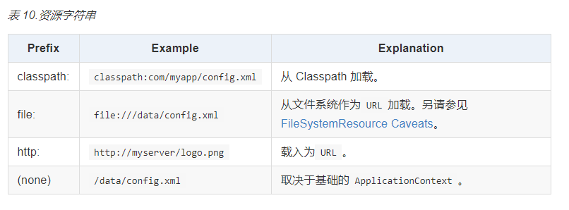

&ensp;&ensp;&ensp;&ensp;&ensp;&ensp;&ensp;&ensp;&ensp;&ensp;&ensp;&ensp;&ensp;&ensp;&ensp;&ensp;- 示例代码

&ensp;&ensp;&ensp;&ensp;&ensp;&ensp;&ensp;&ensp;&ensp;&ensp;&ensp;&ensp;&ensp;&ensp;&ensp;&ensp;&ensp;&ensp;&ensp;&ensp;- 所有应用程序上下文ApplicationContext （实现接口ResourcePatternResolver）都实现`ResourceLoader`接口。因此，所有应用程序上下文都可用于获取`Resource`个实例。

```Java
        // 获取上下文对象
        ApplicationContext ctx = new ClassPathXmlApplicationContext();
        // 获取classpath下的资源
        org.springframework.core.io.Resource resource = ctx.getResource("classpath:some/resource/path/myTemplate.txt");
```


&ensp;&ensp;&ensp;&ensp;&ensp;&ensp;&ensp;&ensp;&ensp;&ensp;&ensp;&ensp;&ensp;&ensp;&ensp;&ensp;- 参考

&ensp;&ensp;&ensp;&ensp;&ensp;&ensp;&ensp;&ensp;&ensp;&ensp;&ensp;&ensp;&ensp;&ensp;&ensp;&ensp;&ensp;&ensp;&ensp;&ensp;[Spring Framework 中文文档- 2.4. 资源加载器](https://www.docs4dev.com/docs/zh/spring-framework/5.1.3.RELEASE/reference/core.html#:~:text=2.4. 资源加载器)

&ensp;&ensp;&ensp;&ensp;&ensp;&ensp;&ensp;&ensp;- Spring表达式语言（SpEL）

&ensp;&ensp;&ensp;&ensp;&ensp;&ensp;&ensp;&ensp;&ensp;&ensp;&ensp;&ensp;> Spring 表达式语言(简称“ SpEL”)是一种功能强大的表达式语言，支持在运行时查询和操作对象图。语言语法类似于 Unified EL，但提供了其他功能，最著名的是方法调用和基本的字符串模板功能。


&ensp;&ensp;&ensp;&ensp;&ensp;&ensp;&ensp;&ensp;&ensp;&ensp;&ensp;&ensp;- 表达式语言给静态Java语言增加了动态功能。

&ensp;&ensp;&ensp;&ensp;&ensp;&ensp;&ensp;&ensp;&ensp;&ensp;&ensp;&ensp;- SpEL是单独模块，只依赖于core模块，不依赖于其他模块，可以单独使用。

&ensp;&ensp;&ensp;&ensp;&ensp;&ensp;&ensp;&ensp;&ensp;&ensp;&ensp;&ensp;- 参考

&ensp;&ensp;&ensp;&ensp;&ensp;&ensp;&ensp;&ensp;&ensp;&ensp;&ensp;&ensp;&ensp;&ensp;&ensp;&ensp;[Spring Framework 中文文档 - Spring 表达式语言(SpEL)](https://www.docs4dev.com/docs/zh/spring-framework/5.1.3.RELEASE/reference/core.html#:~:text=4. Spring 表达式语言(SpEL))

&ensp;&ensp;&ensp;&ensp;&ensp;&ensp;&ensp;&ensp;&ensp;&ensp;&ensp;&ensp;&ensp;&ensp;&ensp;&ensp;[玩转Spring中强大的spel表达式！](https://zhuanlan.zhihu.com/p/174786047)

&ensp;&ensp;&ensp;&ensp;&ensp;&ensp;&ensp;&ensp;- Null-safety（空安全）

&ensp;&ensp;&ensp;&ensp;&ensp;&ensp;&ensp;&ensp;&ensp;&ensp;&ensp;&ensp;- 概念

&ensp;&ensp;&ensp;&ensp;&ensp;&ensp;&ensp;&ensp;&ensp;&ensp;&ensp;&ensp;&ensp;&ensp;&ensp;&ensp;> 尽管 Java 不允许您使用其类型系统来表示空安全性，但 Spring Framework 现在在`org.springframework.lang`包中提供了以下 注解，以使您可以声明 API 和字段的空性：


&ensp;&ensp;&ensp;&ensp;&ensp;&ensp;&ensp;&ensp;&ensp;&ensp;&ensp;&ensp;&ensp;&ensp;&ensp;&ensp;> Spring Framework 自身利用了这些 注解，但是它们也可以在任何基于 Spring 的 Java 项目中使用，以声明 null 安全的 API 和可选的 null 安全的字段。


&ensp;&ensp;&ensp;&ensp;&ensp;&ensp;&ensp;&ensp;&ensp;&ensp;&ensp;&ensp;&ensp;&ensp;&ensp;&ensp;- 就是Spring提供的空判断注解

&ensp;&ensp;&ensp;&ensp;&ensp;&ensp;&ensp;&ensp;&ensp;&ensp;&ensp;&ensp;- 注解

&ensp;&ensp;&ensp;&ensp;&ensp;&ensp;&ensp;&ensp;&ensp;&ensp;&ensp;&ensp;&ensp;&ensp;&ensp;&ensp;- [@NonNull](https://docs.spring.io/spring-framework/docs/5.1.3.RELEASE/javadoc-api/org/springframework/lang/NonNull.html)：表示特定参数，返回值或字段不能为`null`的 注解(在使用`@NonNullApi`和`@NonNullFields`的参数和返回值上不需要)。
&ensp;&ensp;&ensp;&ensp;&ensp;&ensp;&ensp;&ensp;&ensp;&ensp;&ensp;&ensp;&ensp;&ensp;&ensp;&ensp;

&ensp;&ensp;&ensp;&ensp;&ensp;&ensp;&ensp;&ensp;&ensp;&ensp;&ensp;&ensp;&ensp;&ensp;&ensp;&ensp;- [@Nullable](https://docs.spring.io/spring-framework/docs/5.1.3.RELEASE/javadoc-api/org/springframework/lang/Nullable.html)：表示特定参数，返回值或字段可以是`null`的 注解。
&ensp;&ensp;&ensp;&ensp;&ensp;&ensp;&ensp;&ensp;&ensp;&ensp;&ensp;&ensp;&ensp;&ensp;&ensp;&ensp;

&ensp;&ensp;&ensp;&ensp;&ensp;&ensp;&ensp;&ensp;&ensp;&ensp;&ensp;&ensp;&ensp;&ensp;&ensp;&ensp;- [@NonNullApi](https://docs.spring.io/spring-framework/docs/5.1.3.RELEASE/javadoc-api/org/springframework/lang/NonNullApi.html)：程序包级别的 注解，它声明非 null 为参数和返回值的默认行为。
&ensp;&ensp;&ensp;&ensp;&ensp;&ensp;&ensp;&ensp;&ensp;&ensp;&ensp;&ensp;&ensp;&ensp;&ensp;&ensp;

&ensp;&ensp;&ensp;&ensp;&ensp;&ensp;&ensp;&ensp;&ensp;&ensp;&ensp;&ensp;&ensp;&ensp;&ensp;&ensp;- [@NonNullFields](https://docs.spring.io/spring-framework/docs/5.1.3.RELEASE/javadoc-api/org/springframework/lang/NonNullFields.html)：程序包级别的 注解，它声明非 null 为字段的默认行为。

&ensp;&ensp;&ensp;&ensp;&ensp;&ensp;&ensp;&ensp;&ensp;&ensp;&ensp;&ensp;- 参考

&ensp;&ensp;&ensp;&ensp;&ensp;&ensp;&ensp;&ensp;&ensp;&ensp;&ensp;&ensp;&ensp;&ensp;&ensp;&ensp;[Spring Framework 中文文档 - Null--safety（空安全）](https://www.docs4dev.com/docs/zh/spring-framework/5.1.3.RELEASE/reference/core.html#:~:text=7. Null-safety)

- 数据存储（Data Access）

&ensp;&ensp;&ensp;&ensp;- 事务（Spring支持的声明式事务）

&ensp;&ensp;&ensp;&ensp;- JDBC数据访问（Spring封装了JDBC，可以直接操作数据库，不需要引入其他框架也可以）

- 网站（Web Servlet）

&ensp;&ensp;&ensp;&ensp;- Spring Web MVC

&ensp;&ensp;&ensp;&ensp;&ensp;&ensp;&ensp;&ensp;- 概念

&ensp;&ensp;&ensp;&ensp;&ensp;&ensp;&ensp;&ensp;&ensp;&ensp;&ensp;&ensp;> Spring Web MVC 是基于 Servlet API 构建的原始 Web 框架，从一开始就已包含在 Spring Framework 中。正式名称“ Spring Web MVC”来自其源模块的名称([spring-webmvc](https://github.com/spring-projects/spring-framework/tree/master/spring-webmvc))，但更通常称为“ Spring MVC”。


&ensp;&ensp;&ensp;&ensp;&ensp;&ensp;&ensp;&ensp;&ensp;&ensp;&ensp;&ensp;> 与 Spring Web MVCParallel，Spring Framework 5.0 引入了一个反应式堆栈 Web 框架，其名称“ Spring WebFlux”也基于其源模块([spring-webflux](https://github.com/spring-projects/spring-framework/tree/master/spring-webflux))。本节介绍 Spring Web MVC。 [next section](https://www.docs4dev.com/docs/zh/spring-framework/5.1.3.RELEASE/reference/web-reactive.html#spring-web-reactive)涵盖了 Spring WebFlux。


&ensp;&ensp;&ensp;&ensp;&ensp;&ensp;&ensp;&ensp;&ensp;&ensp;&ensp;&ensp;- 基于Java实现的MVC轻量级web框架。

&ensp;&ensp;&ensp;&ensp;&ensp;&ensp;&ensp;&ensp;- DispatcherServlet（调度器）

&ensp;&ensp;&ensp;&ensp;&ensp;&ensp;&ensp;&ensp;&ensp;&ensp;&ensp;&ensp;- 执行流程

&ensp;&ensp;&ensp;&ensp;&ensp;&ensp;&ensp;&ensp;&ensp;&ensp;&ensp;&ensp;&ensp;&ensp;&ensp;&ensp;- 流程图


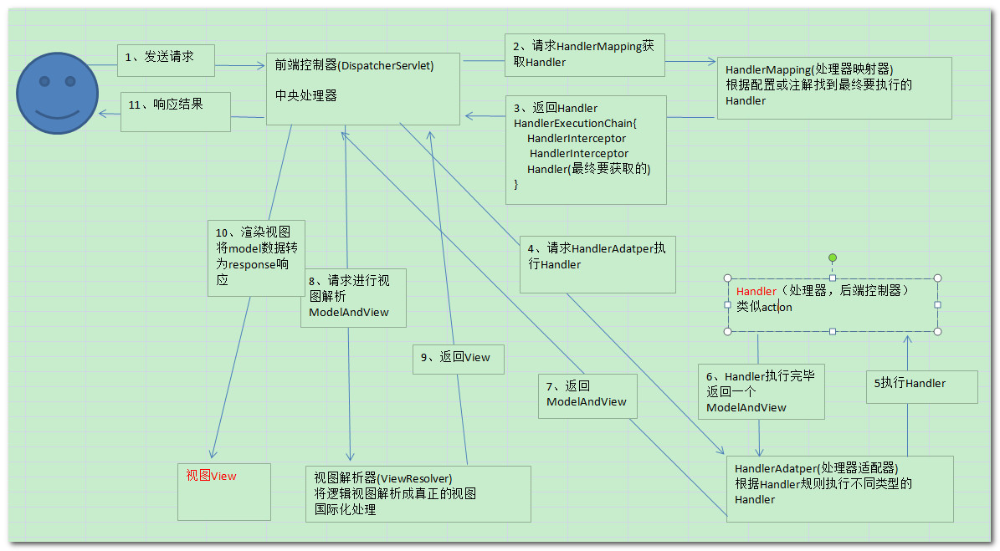


&ensp;&ensp;&ensp;&ensp;&ensp;&ensp;&ensp;&ensp;&ensp;&ensp;&ensp;&ensp;&ensp;&ensp;&ensp;&ensp;- 基础流程

&ensp;&ensp;&ensp;&ensp;&ensp;&ensp;&ensp;&ensp;&ensp;&ensp;&ensp;&ensp;&ensp;&ensp;&ensp;&ensp;&ensp;&ensp;&ensp;&ensp;- DispatcherServlet（调度器 | 中央处理器 | 前端控控制器）

&ensp;&ensp;&ensp;&ensp;&ensp;&ensp;&ensp;&ensp;&ensp;&ensp;&ensp;&ensp;&ensp;&ensp;&ensp;&ensp;&ensp;&ensp;&ensp;&ensp;&ensp;&ensp;&ensp;&ensp;> `DispatcherServlet`提供了用于请求处理的共享算法，而实际工作是由可配置的委托组件执行的。


&ensp;&ensp;&ensp;&ensp;&ensp;&ensp;&ensp;&ensp;&ensp;&ensp;&ensp;&ensp;&ensp;&ensp;&ensp;&ensp;&ensp;&ensp;&ensp;&ensp;&ensp;&ensp;&ensp;&ensp;- DispatcherServlet收到请求调用HandlerMapping（处理器映射器）。

&ensp;&ensp;&ensp;&ensp;&ensp;&ensp;&ensp;&ensp;&ensp;&ensp;&ensp;&ensp;&ensp;&ensp;&ensp;&ensp;&ensp;&ensp;&ensp;&ensp;- HandlerMapping（处理器映射器）

&ensp;&ensp;&ensp;&ensp;&ensp;&ensp;&ensp;&ensp;&ensp;&ensp;&ensp;&ensp;&ensp;&ensp;&ensp;&ensp;&ensp;&ensp;&ensp;&ensp;&ensp;&ensp;&ensp;&ensp;> 将请求与[interceptors](https://www.docs4dev.com/docs/zh/spring-framework/5.1.3.RELEASE/reference/web.html#mvc-handlermapping-interceptor)列表一起 Map 到处理程序，以进行预处理和后期处理。Map 基于某些条件，具体取决于`HandlerMapping`实现。


&ensp;&ensp;&ensp;&ensp;&ensp;&ensp;&ensp;&ensp;&ensp;&ensp;&ensp;&ensp;&ensp;&ensp;&ensp;&ensp;&ensp;&ensp;&ensp;&ensp;&ensp;&ensp;&ensp;&ensp;- HandlerMapping根据配置或注解（两种实现）找到最终要执行的Handler处理器，返回处理器执行链HandlerExecutionChain（执行链中可能包含拦截器HandlerInterceptor）。

&ensp;&ensp;&ensp;&ensp;&ensp;&ensp;&ensp;&ensp;&ensp;&ensp;&ensp;&ensp;&ensp;&ensp;&ensp;&ensp;&ensp;&ensp;&ensp;&ensp;&ensp;&ensp;&ensp;&ensp;- HandlerMapping的两个实现

&ensp;&ensp;&ensp;&ensp;&ensp;&ensp;&ensp;&ensp;&ensp;&ensp;&ensp;&ensp;&ensp;&ensp;&ensp;&ensp;&ensp;&ensp;&ensp;&ensp;&ensp;&ensp;&ensp;&ensp;&ensp;&ensp;&ensp;&ensp;> `HandlerMapping`的两个主要实现是`RequestMappingHandlerMapping`(支持`@RequestMapping`带注解的方法)和`SimpleUrlHandlerMapping`(将 URI 路径模式的显式注册维护到处理程序)。


&ensp;&ensp;&ensp;&ensp;&ensp;&ensp;&ensp;&ensp;&ensp;&ensp;&ensp;&ensp;&ensp;&ensp;&ensp;&ensp;&ensp;&ensp;&ensp;&ensp;&ensp;&ensp;&ensp;&ensp;&ensp;&ensp;&ensp;&ensp;- 注解：RequestMappingHandlerMapping：支持`@RequestMapping`带注解的方法

&ensp;&ensp;&ensp;&ensp;&ensp;&ensp;&ensp;&ensp;&ensp;&ensp;&ensp;&ensp;&ensp;&ensp;&ensp;&ensp;&ensp;&ensp;&ensp;&ensp;&ensp;&ensp;&ensp;&ensp;&ensp;&ensp;&ensp;&ensp;- xml配置：SimpleUrlHandlerMapping：将 URI 路径模式的显式注册维护到处理程序

&ensp;&ensp;&ensp;&ensp;&ensp;&ensp;&ensp;&ensp;&ensp;&ensp;&ensp;&ensp;&ensp;&ensp;&ensp;&ensp;&ensp;&ensp;&ensp;&ensp;- HandlerAdapter（处理器适配器）

&ensp;&ensp;&ensp;&ensp;&ensp;&ensp;&ensp;&ensp;&ensp;&ensp;&ensp;&ensp;&ensp;&ensp;&ensp;&ensp;&ensp;&ensp;&ensp;&ensp;&ensp;&ensp;&ensp;&ensp;> 帮助`DispatcherServlet`调用 Map 到请求的处理程序，无论实际如何调用该处理程序。例如，调用带注解的控制器需要解析注解。 


&ensp;&ensp;&ensp;&ensp;&ensp;&ensp;&ensp;&ensp;&ensp;&ensp;&ensp;&ensp;&ensp;&ensp;&ensp;&ensp;&ensp;&ensp;&ensp;&ensp;&ensp;&ensp;&ensp;&ensp;- 请求HandlerAdapter执行刚刚返回的Handler。HandlerAdapter根据（Handler）规则执行Handler处理器（就是controller）。

&ensp;&ensp;&ensp;&ensp;&ensp;&ensp;&ensp;&ensp;&ensp;&ensp;&ensp;&ensp;&ensp;&ensp;&ensp;&ensp;&ensp;&ensp;&ensp;&ensp;&ensp;&ensp;&ensp;&ensp;- 执行的Handler就是后端控制器（就是controller）Handler处理器执行完毕后，返回一个ModelAndView

&ensp;&ensp;&ensp;&ensp;&ensp;&ensp;&ensp;&ensp;&ensp;&ensp;&ensp;&ensp;&ensp;&ensp;&ensp;&ensp;&ensp;&ensp;&ensp;&ensp;- ViewResolver（视图解析器）

&ensp;&ensp;&ensp;&ensp;&ensp;&ensp;&ensp;&ensp;&ensp;&ensp;&ensp;&ensp;&ensp;&ensp;&ensp;&ensp;&ensp;&ensp;&ensp;&ensp;&ensp;&ensp;&ensp;&ensp;> 解析从处理程序返回到实际`View`的基于逻辑`String`的视图名称，使用该视图名称呈现给响应


&ensp;&ensp;&ensp;&ensp;&ensp;&ensp;&ensp;&ensp;&ensp;&ensp;&ensp;&ensp;&ensp;&ensp;&ensp;&ensp;&ensp;&ensp;&ensp;&ensp;&ensp;&ensp;&ensp;&ensp;- DispatcherServlet将返回的ModelAndView进行请求ViewResolver视图解析器，视图解析解析成真正的视图view并返回（拼接前缀后缀）。

&ensp;&ensp;&ensp;&ensp;&ensp;&ensp;&ensp;&ensp;&ensp;&ensp;&ensp;&ensp;&ensp;&ensp;&ensp;&ensp;&ensp;&ensp;&ensp;&ensp;&ensp;&ensp;&ensp;&ensp;- 最后数据填充到vie中，将渲染视图view，响应用户。

&ensp;&ensp;&ensp;&ensp;&ensp;&ensp;&ensp;&ensp;&ensp;&ensp;&ensp;&ensp;&ensp;&ensp;&ensp;&ensp;- 源码解析

&ensp;&ensp;&ensp;&ensp;&ensp;&ensp;&ensp;&ensp;&ensp;&ensp;&ensp;&ensp;&ensp;&ensp;&ensp;&ensp;&ensp;&ensp;&ensp;&ensp;- 1.用户请求到DispatcherServlet

&ensp;&ensp;&ensp;&ensp;&ensp;&ensp;&ensp;&ensp;&ensp;&ensp;&ensp;&ensp;&ensp;&ensp;&ensp;&ensp;&ensp;&ensp;&ensp;&ensp;&ensp;&ensp;&ensp;&ensp;"/"所有请求都会到调度器（调度器也是一个Servlet）。此时随便访问一个url会进入调度器。


&ensp;&ensp;&ensp;&ensp;&ensp;&ensp;&ensp;&ensp;&ensp;&ensp;&ensp;&ensp;&ensp;&ensp;&ensp;&ensp;&ensp;&ensp;&ensp;&ensp;&ensp;&ensp;&ensp;&ensp;访问调度器的时候，会进入doService()该方法，开始执行调度


&ensp;&ensp;&ensp;&ensp;&ensp;&ensp;&ensp;&ensp;&ensp;&ensp;&ensp;&ensp;&ensp;&ensp;&ensp;&ensp;&ensp;&ensp;&ensp;&ensp;- 2.执行HandlerMapping

&ensp;&ensp;&ensp;&ensp;&ensp;&ensp;&ensp;&ensp;&ensp;&ensp;&ensp;&ensp;&ensp;&ensp;&ensp;&ensp;&ensp;&ensp;&ensp;&ensp;&ensp;&ensp;&ensp;&ensp;进入doDispatch()该方法会发现在getHandler()方法中获取了HandlerMapping并返回了处理器执行链HandlerExecutionChain。


&ensp;&ensp;&ensp;&ensp;&ensp;&ensp;&ensp;&ensp;&ensp;&ensp;&ensp;&ensp;&ensp;&ensp;&ensp;&ensp;&ensp;&ensp;&ensp;&ensp;&ensp;&ensp;&ensp;&ensp;- getHandler()方法

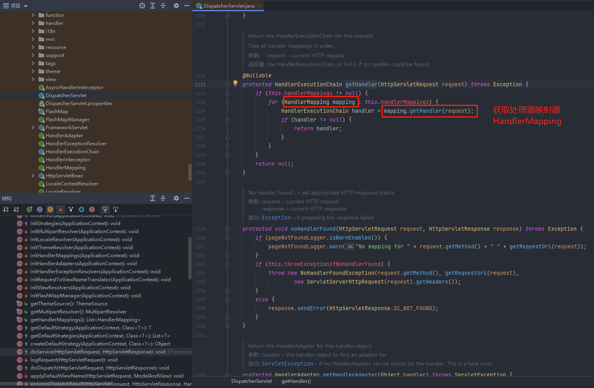

&ensp;&ensp;&ensp;&ensp;&ensp;&ensp;&ensp;&ensp;&ensp;&ensp;&ensp;&ensp;&ensp;&ensp;&ensp;&ensp;&ensp;&ensp;&ensp;&ensp;&ensp;&ensp;&ensp;&ensp;- 扩展HandlerExecutionChain

&ensp;&ensp;&ensp;&ensp;&ensp;&ensp;&ensp;&ensp;&ensp;&ensp;&ensp;&ensp;&ensp;&ensp;&ensp;&ensp;&ensp;&ensp;&ensp;&ensp;&ensp;&ensp;&ensp;&ensp;&ensp;&ensp;&ensp;&ensp;在HandlerExecutionChain处理执行链中，不仅仅只是handler处理器，可能还会有处理器拦截器HandlerInterceptor。


&ensp;&ensp;&ensp;&ensp;&ensp;&ensp;&ensp;&ensp;&ensp;&ensp;&ensp;&ensp;&ensp;&ensp;&ensp;&ensp;&ensp;&ensp;&ensp;&ensp;- 3.执行HandlerAdapter

&ensp;&ensp;&ensp;&ensp;&ensp;&ensp;&ensp;&ensp;&ensp;&ensp;&ensp;&ensp;&ensp;&ensp;&ensp;&ensp;&ensp;&ensp;&ensp;&ensp;&ensp;&ensp;&ensp;&ensp;- 用getHandlerAdapter()方法获取HandlerAdapter处理器适配器


&ensp;&ensp;&ensp;&ensp;&ensp;&ensp;&ensp;&ensp;&ensp;&ensp;&ensp;&ensp;&ensp;&ensp;&ensp;&ensp;&ensp;&ensp;&ensp;&ensp;&ensp;&ensp;&ensp;&ensp;- getHandlerAdapter()方法


&ensp;&ensp;&ensp;&ensp;&ensp;&ensp;&ensp;&ensp;&ensp;&ensp;&ensp;&ensp;&ensp;&ensp;&ensp;&ensp;&ensp;&ensp;&ensp;&ensp;&ensp;&ensp;&ensp;&ensp;- 执行Handler处理（调用后端控制器Contrller）

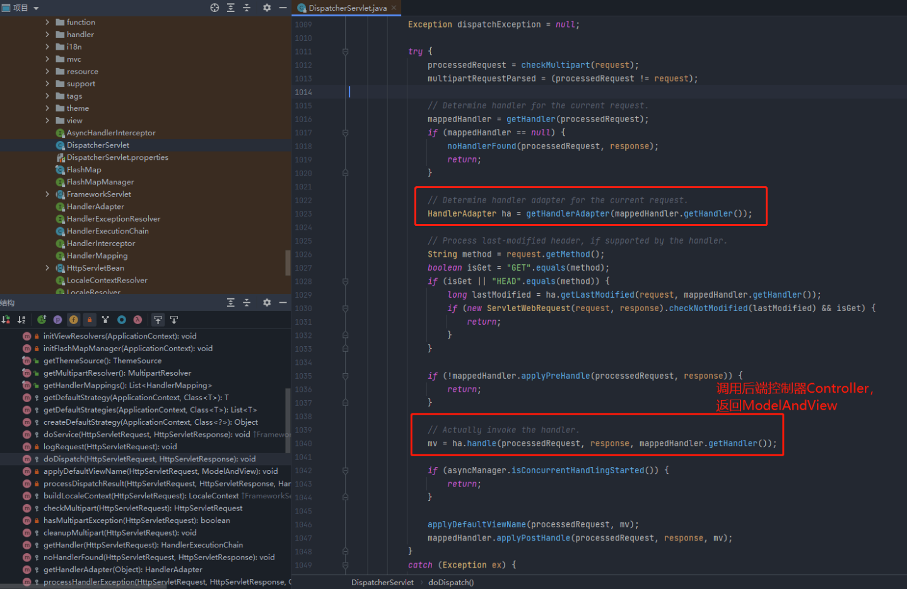

&ensp;&ensp;&ensp;&ensp;&ensp;&ensp;&ensp;&ensp;&ensp;&ensp;&ensp;&ensp;&ensp;&ensp;&ensp;&ensp;&ensp;&ensp;&ensp;&ensp;&ensp;&ensp;&ensp;&ensp;&ensp;&ensp;&ensp;&ensp;- handle()方法

&ensp;&ensp;&ensp;&ensp;&ensp;&ensp;&ensp;&ensp;&ensp;&ensp;&ensp;&ensp;&ensp;&ensp;&ensp;&ensp;&ensp;&ensp;&ensp;&ensp;&ensp;&ensp;&ensp;&ensp;&ensp;&ensp;&ensp;&ensp;&ensp;&ensp;&ensp;&ensp;进入handle()方法，会发现是一个接口，此时需要找到它对应是实现类。

&ensp;&ensp;&ensp;&ensp;&ensp;&ensp;&ensp;&ensp;&ensp;&ensp;&ensp;&ensp;&ensp;&ensp;&ensp;&ensp;&ensp;&ensp;&ensp;&ensp;&ensp;&ensp;&ensp;&ensp;&ensp;&ensp;&ensp;&ensp;&ensp;&ensp;&ensp;&ensp;- 为什么是SimpleControllerHandlerAdapter？

&ensp;&ensp;&ensp;&ensp;&ensp;&ensp;&ensp;&ensp;&ensp;&ensp;&ensp;&ensp;&ensp;&ensp;&ensp;&ensp;&ensp;&ensp;&ensp;&ensp;&ensp;&ensp;&ensp;&ensp;&ensp;&ensp;&ensp;&ensp;&ensp;&ensp;&ensp;&ensp;&ensp;&ensp;&ensp;&ensp;因为我们使用的xxxContrller不是实现Controller接口，就是使用了@Controller注解。

&ensp;&ensp;&ensp;&ensp;&ensp;&ensp;&ensp;&ensp;&ensp;&ensp;&ensp;&ensp;&ensp;&ensp;&ensp;&ensp;&ensp;&ensp;&ensp;&ensp;&ensp;&ensp;&ensp;&ensp;&ensp;&ensp;&ensp;&ensp;&ensp;&ensp;&ensp;&ensp;&ensp;&ensp;&ensp;&ensp;所以这里点进去方法后会发现它强制转换成了Controller类型。

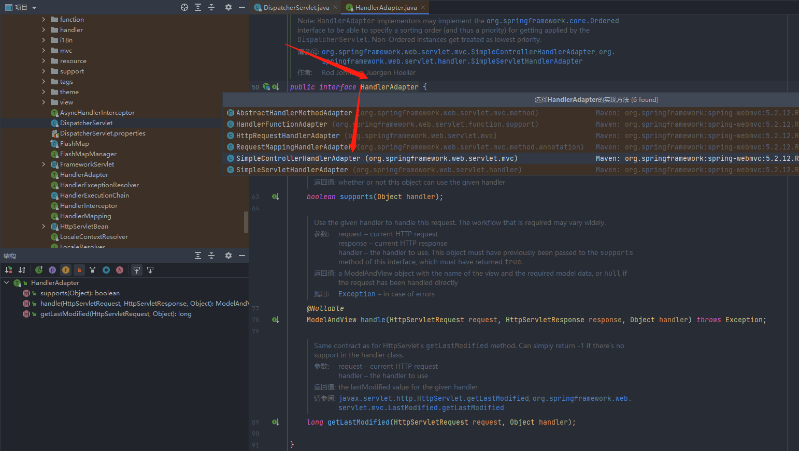

&ensp;&ensp;&ensp;&ensp;&ensp;&ensp;&ensp;&ensp;&ensp;&ensp;&ensp;&ensp;&ensp;&ensp;&ensp;&ensp;&ensp;&ensp;&ensp;&ensp;&ensp;&ensp;&ensp;&ensp;&ensp;&ensp;&ensp;&ensp;&ensp;&ensp;&ensp;&ensp;此时handleRequest()执行方法，将会执行到我们自己写的xxxController控制器（这个控制器实现了Controller接口）。

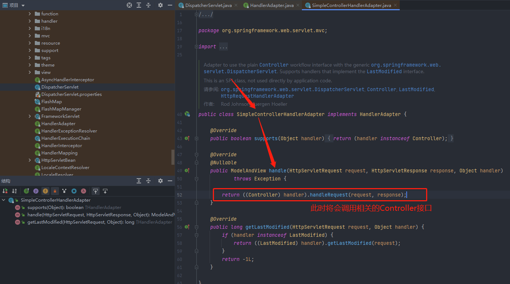

&ensp;&ensp;&ensp;&ensp;&ensp;&ensp;&ensp;&ensp;&ensp;&ensp;&ensp;&ensp;&ensp;&ensp;&ensp;&ensp;&ensp;&ensp;&ensp;&ensp;&ensp;&ensp;&ensp;&ensp;&ensp;&ensp;&ensp;&ensp;- 扩展拦截器


&ensp;&ensp;&ensp;&ensp;&ensp;&ensp;&ensp;&ensp;&ensp;&ensp;&ensp;&ensp;&ensp;&ensp;&ensp;&ensp;&ensp;&ensp;&ensp;&ensp;- 4.执行ViewResolver

&ensp;&ensp;&ensp;&ensp;&ensp;&ensp;&ensp;&ensp;&ensp;&ensp;&ensp;&ensp;&ensp;&ensp;&ensp;&ensp;&ensp;&ensp;&ensp;&ensp;&ensp;&ensp;&ensp;&ensp;进入processDispatchResult()方法，mv（ModelAndView）作为参数传入了方法


&ensp;&ensp;&ensp;&ensp;&ensp;&ensp;&ensp;&ensp;&ensp;&ensp;&ensp;&ensp;&ensp;&ensp;&ensp;&ensp;&ensp;&ensp;&ensp;&ensp;&ensp;&ensp;&ensp;&ensp;- 进入processDispatchResult()方法

&ensp;&ensp;&ensp;&ensp;&ensp;&ensp;&ensp;&ensp;&ensp;&ensp;&ensp;&ensp;&ensp;&ensp;&ensp;&ensp;&ensp;&ensp;&ensp;&ensp;&ensp;&ensp;&ensp;&ensp;&ensp;&ensp;&ensp;&ensp;可以看到mv当作参数传入了render()方法


&ensp;&ensp;&ensp;&ensp;&ensp;&ensp;&ensp;&ensp;&ensp;&ensp;&ensp;&ensp;&ensp;&ensp;&ensp;&ensp;&ensp;&ensp;&ensp;&ensp;&ensp;&ensp;&ensp;&ensp;&ensp;&ensp;&ensp;&ensp;- 进入render()方法

&ensp;&ensp;&ensp;&ensp;&ensp;&ensp;&ensp;&ensp;&ensp;&ensp;&ensp;&ensp;&ensp;&ensp;&ensp;&ensp;&ensp;&ensp;&ensp;&ensp;&ensp;&ensp;&ensp;&ensp;&ensp;&ensp;&ensp;&ensp;&ensp;&ensp;&ensp;&ensp;解析视图名称，并且返回view对象

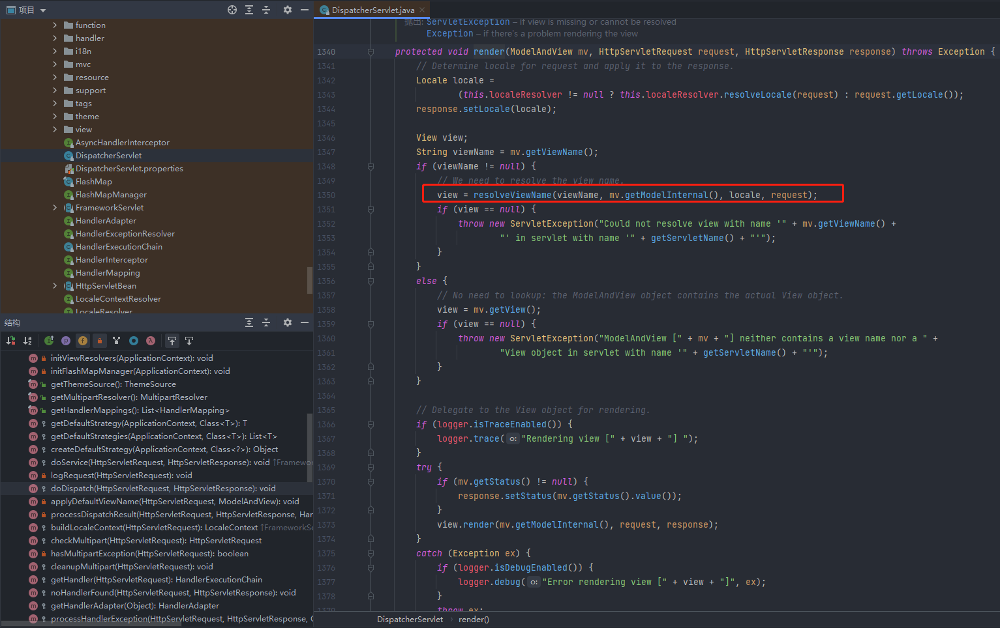

&ensp;&ensp;&ensp;&ensp;&ensp;&ensp;&ensp;&ensp;&ensp;&ensp;&ensp;&ensp;&ensp;&ensp;&ensp;&ensp;&ensp;&ensp;&ensp;&ensp;&ensp;&ensp;&ensp;&ensp;&ensp;&ensp;&ensp;&ensp;&ensp;&ensp;&ensp;&ensp;- 填充数据渲染视图

&ensp;&ensp;&ensp;&ensp;&ensp;&ensp;&ensp;&ensp;&ensp;&ensp;&ensp;&ensp;&ensp;&ensp;&ensp;&ensp;&ensp;&ensp;&ensp;&ensp;&ensp;&ensp;&ensp;&ensp;&ensp;&ensp;&ensp;&ensp;&ensp;&ensp;&ensp;&ensp;&ensp;&ensp;&ensp;&ensp;通过render()方法，填充数据，渲染视图


&ensp;&ensp;&ensp;&ensp;&ensp;&ensp;&ensp;&ensp;&ensp;&ensp;&ensp;&ensp;&ensp;&ensp;&ensp;&ensp;&ensp;&ensp;&ensp;&ensp;&ensp;&ensp;&ensp;&ensp;&ensp;&ensp;&ensp;&ensp;&ensp;&ensp;&ensp;&ensp;&ensp;&ensp;&ensp;&ensp;- 进入reader()方法

&ensp;&ensp;&ensp;&ensp;&ensp;&ensp;&ensp;&ensp;&ensp;&ensp;&ensp;&ensp;&ensp;&ensp;&ensp;&ensp;&ensp;&ensp;&ensp;&ensp;&ensp;&ensp;&ensp;&ensp;&ensp;&ensp;&ensp;&ensp;&ensp;&ensp;&ensp;&ensp;&ensp;&ensp;&ensp;&ensp;&ensp;&ensp;&ensp;&ensp;进去会发现是一个接口，需要找打它的实现类AbstractView


&ensp;&ensp;&ensp;&ensp;&ensp;&ensp;&ensp;&ensp;&ensp;&ensp;&ensp;&ensp;&ensp;&ensp;&ensp;&ensp;&ensp;&ensp;&ensp;&ensp;&ensp;&ensp;&ensp;&ensp;&ensp;&ensp;&ensp;&ensp;&ensp;&ensp;&ensp;&ensp;&ensp;&ensp;&ensp;&ensp;&ensp;&ensp;&ensp;&ensp;渲染输出模型renderMergedOutputModel()方法


&ensp;&ensp;&ensp;&ensp;&ensp;&ensp;&ensp;&ensp;&ensp;&ensp;&ensp;&ensp;&ensp;&ensp;&ensp;&ensp;&ensp;&ensp;&ensp;&ensp;&ensp;&ensp;&ensp;&ensp;&ensp;&ensp;&ensp;&ensp;&ensp;&ensp;&ensp;&ensp;&ensp;&ensp;&ensp;&ensp;&ensp;&ensp;&ensp;&ensp;- 进入renderMergedOutputModel()方法方法

&ensp;&ensp;&ensp;&ensp;&ensp;&ensp;&ensp;&ensp;&ensp;&ensp;&ensp;&ensp;&ensp;&ensp;&ensp;&ensp;&ensp;&ensp;&ensp;&ensp;&ensp;&ensp;&ensp;&ensp;&ensp;&ensp;&ensp;&ensp;&ensp;&ensp;&ensp;&ensp;&ensp;&ensp;&ensp;&ensp;&ensp;&ensp;&ensp;&ensp;&ensp;&ensp;&ensp;&ensp;这是一个抽象方法，再找他的实现子类的方法

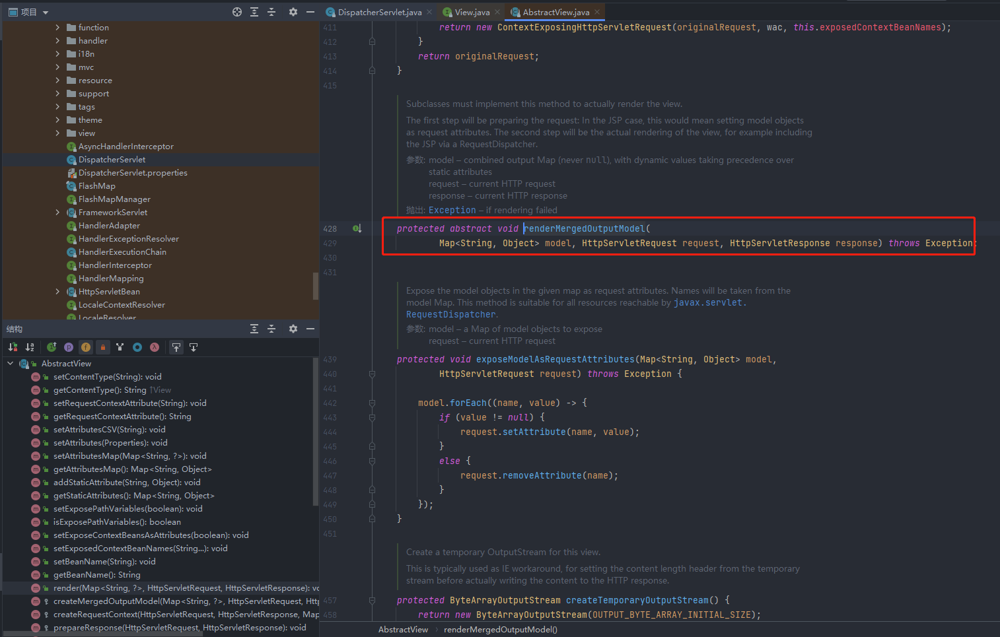

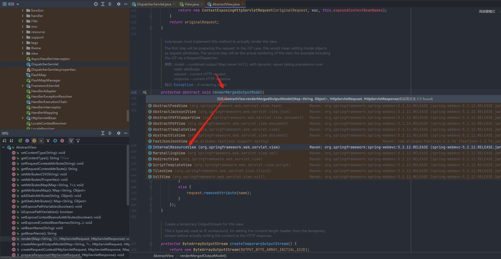

&ensp;&ensp;&ensp;&ensp;&ensp;&ensp;&ensp;&ensp;&ensp;&ensp;&ensp;&ensp;&ensp;&ensp;&ensp;&ensp;&ensp;&ensp;&ensp;&ensp;&ensp;&ensp;&ensp;&ensp;&ensp;&ensp;&ensp;&ensp;&ensp;&ensp;&ensp;&ensp;&ensp;&ensp;&ensp;&ensp;&ensp;&ensp;&ensp;&ensp;&ensp;&ensp;&ensp;&ensp;最终获取到RequestDispatcher请求调度接口，然后选择forward()请求转发或include()方法，进行响应给用户

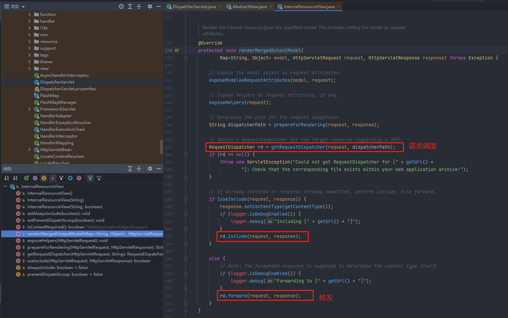

&ensp;&ensp;&ensp;&ensp;&ensp;&ensp;&ensp;&ensp;&ensp;&ensp;&ensp;&ensp;&ensp;&ensp;&ensp;&ensp;&ensp;&ensp;&ensp;&ensp;&ensp;&ensp;&ensp;&ensp;&ensp;&ensp;&ensp;&ensp;&ensp;&ensp;&ensp;&ensp;&ensp;&ensp;&ensp;&ensp;&ensp;&ensp;&ensp;&ensp;&ensp;&ensp;&ensp;&ensp;- forward()和include()区别

&ensp;&ensp;&ensp;&ensp;&ensp;&ensp;&ensp;&ensp;&ensp;&ensp;&ensp;&ensp;&ensp;&ensp;&ensp;&ensp;&ensp;&ensp;&ensp;&ensp;&ensp;&ensp;&ensp;&ensp;&ensp;&ensp;&ensp;&ensp;&ensp;&ensp;&ensp;&ensp;&ensp;&ensp;&ensp;&ensp;&ensp;&ensp;&ensp;&ensp;&ensp;&ensp;&ensp;&ensp;&ensp;&ensp;&ensp;&ensp;用于在响应中包含其他资源(Servlet，JSP页面或HTML文件)的内容。      

&ensp;&ensp;&ensp;&ensp;&ensp;&ensp;&ensp;&ensp;&ensp;&ensp;&ensp;&ensp;&ensp;&ensp;&ensp;&ensp;&ensp;&ensp;&ensp;&ensp;&ensp;&ensp;&ensp;&ensp;&ensp;&ensp;&ensp;&ensp;&ensp;&ensp;&ensp;&ensp;&ensp;&ensp;&ensp;&ensp;&ensp;&ensp;&ensp;&ensp;&ensp;&ensp;&ensp;&ensp;&ensp;&ensp;&ensp;&ensp;即请求转发后，原先的Servlet还可以继续输出响应信息，转发到的Servlet对请求做出的响应将并入原先Servlet的响应对象中。

&ensp;&ensp;&ensp;&ensp;&ensp;&ensp;&ensp;&ensp;&ensp;&ensp;&ensp;&ensp;&ensp;&ensp;&ensp;&ensp;&ensp;&ensp;&ensp;&ensp;- 参考

&ensp;&ensp;&ensp;&ensp;&ensp;&ensp;&ensp;&ensp;&ensp;&ensp;&ensp;&ensp;&ensp;&ensp;&ensp;&ensp;&ensp;&ensp;&ensp;&ensp;&ensp;&ensp;&ensp;&ensp;[springMVC执行流程详解_哔哩哔哩](https://www.bilibili.com/video/BV1Kz4y1D7yb?p=1)

&ensp;&ensp;&ensp;&ensp;&ensp;&ensp;&ensp;&ensp;&ensp;&ensp;&ensp;&ensp;- 拦截器

&ensp;&ensp;&ensp;&ensp;&ensp;&ensp;&ensp;&ensp;&ensp;&ensp;&ensp;&ensp;&ensp;&ensp;&ensp;&ensp;- 自定义拦截器（实现HandlerInterceptor）

&ensp;&ensp;&ensp;&ensp;&ensp;&ensp;&ensp;&ensp;&ensp;&ensp;&ensp;&ensp;&ensp;&ensp;&ensp;&ensp;&ensp;&ensp;&ensp;&ensp;> 所有`HandlerMapping`实现都支持处理程序拦截器，这些拦截器在您要将特定功能应用于某些请求时非常有用-例如检查主体。拦截器必须使用三种方法从`org.springframework.web.servlet`包中实现`HandlerInterceptor`，这三种方法应提供足够的灵 Active 以执行所有类型的预处理和后处理：
&ensp;&ensp;&ensp;&ensp;&ensp;&ensp;&ensp;&ensp;&ensp;&ensp;&ensp;&ensp;&ensp;&ensp;&ensp;&ensp;&ensp;&ensp;&ensp;&ensp;
&ensp;&ensp;&ensp;&ensp;&ensp;&ensp;&ensp;&ensp;&ensp;&ensp;&ensp;&ensp;&ensp;&ensp;&ensp;&ensp;&ensp;&ensp;&ensp;&ensp;    `preHandle(..)`：在执行实际处理程序之前
&ensp;&ensp;&ensp;&ensp;&ensp;&ensp;&ensp;&ensp;&ensp;&ensp;&ensp;&ensp;&ensp;&ensp;&ensp;&ensp;&ensp;&ensp;&ensp;&ensp;    `postHandle(..)`：执行处理程序后
&ensp;&ensp;&ensp;&ensp;&ensp;&ensp;&ensp;&ensp;&ensp;&ensp;&ensp;&ensp;&ensp;&ensp;&ensp;&ensp;&ensp;&ensp;&ensp;&ensp;    `afterCompletion(..)`：完成完整的请求后
&ensp;&ensp;&ensp;&ensp;&ensp;&ensp;&ensp;&ensp;&ensp;&ensp;&ensp;&ensp;&ensp;&ensp;&ensp;&ensp;&ensp;&ensp;&ensp;&ensp;
&ensp;&ensp;&ensp;&ensp;&ensp;&ensp;&ensp;&ensp;&ensp;&ensp;&ensp;&ensp;&ensp;&ensp;&ensp;&ensp;&ensp;&ensp;&ensp;&ensp;`preHandle(..)`方法返回布尔值。您可以使用此方法来中断或 continue 执行链的处理。当此方法返回`true`时，处理程序执行链 continue。当它返回 false 时，`DispatcherServlet`假定拦截器本身已经处理了请求(例如，提供了适当的视图)，并且不会 continue 执行执行链中的其他拦截器和实际处理程序。


&ensp;&ensp;&ensp;&ensp;&ensp;&ensp;&ensp;&ensp;&ensp;&ensp;&ensp;&ensp;&ensp;&ensp;&ensp;&ensp;&ensp;&ensp;&ensp;&ensp;> 请注意，`postHandle`在`@ResponseBody`和`ResponseEntity`方法中用处不大，因为在`HandlerAdapter`内和`postHandle`之前将响应写入和提交。这意味着对响应进行任何更改为时已晚，例如添加额外的 Headers。对于此类情况，您可以实现`ResponseBodyAdvice`并将其声明为[Controller Advice](https://www.docs4dev.com/docs/zh/spring-framework/5.1.3.RELEASE/reference/web.html#mvc-ann-controller-advice) bean 或直接在`RequestMappingHandlerAdapter`上对其进行配置。


&ensp;&ensp;&ensp;&ensp;&ensp;&ensp;&ensp;&ensp;&ensp;&ensp;&ensp;&ensp;&ensp;&ensp;&ensp;&ensp;&ensp;&ensp;&ensp;&ensp;可以通过实现`HandlerInterceptor`创建拦截器

&ensp;&ensp;&ensp;&ensp;&ensp;&ensp;&ensp;&ensp;&ensp;&ensp;&ensp;&ensp;&ensp;&ensp;&ensp;&ensp;- 拦截器配置注册类（实现WebMvcConfigurer ）

&ensp;&ensp;&ensp;&ensp;&ensp;&ensp;&ensp;&ensp;&ensp;&ensp;&ensp;&ensp;&ensp;&ensp;&ensp;&ensp;&ensp;&ensp;&ensp;&ensp;- 您可以注册拦截器以应用于传入的请求

&ensp;&ensp;&ensp;&ensp;&ensp;&ensp;&ensp;&ensp;&ensp;&ensp;&ensp;&ensp;&ensp;&ensp;&ensp;&ensp;&ensp;&ensp;&ensp;&ensp;- 官方代码

```Java
@Configuration
@EnableWebMvc
public class WebConfig implements WebMvcConfigurer {

    @Override
    public void addInterceptors(InterceptorRegistry registry) {
        registry.addInterceptor(new LocaleChangeInterceptor());
        registry.addInterceptor(new ThemeChangeInterceptor()).addPathPatterns("/**").excludePathPatterns("/admin/**");
        registry.addInterceptor(new SecurityInterceptor()).addPathPatterns("/secure/*");
    }
}
```


&ensp;&ensp;&ensp;&ensp;&ensp;&ensp;&ensp;&ensp;&ensp;&ensp;&ensp;&ensp;&ensp;&ensp;&ensp;&ensp;&ensp;&ensp;&ensp;&ensp;- 示例代码

```Java
@Configuration
public class ResourcesConfig implements WebMvcConfigurer
{
    /**
     * 首页地址
     */
    @Value("${shiro.user.indexUrl}")
    private String indexUrl;

    @Autowired
    private RepeatSubmitInterceptor repeatSubmitInterceptor;

    /**
     * 默认首页的设置，当输入域名是可以自动跳转到默认指定的网页
     */
    @Override
    public void addViewControllers(ViewControllerRegistry registry)
    {
        registry.addViewController("/").setViewName("forward:" + indexUrl);
    }

    @Override
    public void addResourceHandlers(ResourceHandlerRegistry registry)
    {
        /** 本地文件上传路径 */
        registry.addResourceHandler(Constants.RESOURCE_PREFIX + "/**").addResourceLocations("file:" + RuoYiConfig.getProfile() + "/");

        /** swagger配置 */
        registry.addResourceHandler("/swagger-ui/**").addResourceLocations("classpath:/META-INF/resources/webjars/springfox-swagger-ui/");
    }

    /**
     * 自定义拦截规则
     */
    @Override
    public void addInterceptors(InterceptorRegistry registry)
    {
        registry.addInterceptor(repeatSubmitInterceptor).addPathPatterns("/**");
    }
}
```


&ensp;&ensp;&ensp;&ensp;&ensp;&ensp;&ensp;&ensp;&ensp;&ensp;&ensp;&ensp;&ensp;&ensp;&ensp;&ensp;- 参考

&ensp;&ensp;&ensp;&ensp;&ensp;&ensp;&ensp;&ensp;&ensp;&ensp;&ensp;&ensp;&ensp;&ensp;&ensp;&ensp;&ensp;&ensp;&ensp;&ensp;[Spring Framework 中文文档 - 1.1.6. Interception](https://www.docs4dev.com/docs/zh/spring-framework/5.1.3.RELEASE/reference/web.html#:~:text=1.1.6. Interception)

&ensp;&ensp;&ensp;&ensp;&ensp;&ensp;&ensp;&ensp;- 常用注解

&ensp;&ensp;&ensp;&ensp;&ensp;&ensp;&ensp;&ensp;&ensp;&ensp;&ensp;&ensp;- @Controller

&ensp;&ensp;&ensp;&ensp;&ensp;&ensp;&ensp;&ensp;&ensp;&ensp;&ensp;&ensp;&ensp;&ensp;&ensp;&ensp;表明该类是控制器

&ensp;&ensp;&ensp;&ensp;&ensp;&ensp;&ensp;&ensp;&ensp;&ensp;&ensp;&ensp;- @RestController

&ensp;&ensp;&ensp;&ensp;&ensp;&ensp;&ensp;&ensp;&ensp;&ensp;&ensp;&ensp;&ensp;&ensp;&ensp;&ensp;这是一个组合注解，底层源码使用了@Controller+@ResponseBody。

&ensp;&ensp;&ensp;&ensp;&ensp;&ensp;&ensp;&ensp;&ensp;&ensp;&ensp;&ensp;&ensp;&ensp;&ensp;&ensp;表明该类是控制器,，并且所有方法以json格式响应数据

&ensp;&ensp;&ensp;&ensp;&ensp;&ensp;&ensp;&ensp;&ensp;&ensp;&ensp;&ensp;- @ResponseBody 

&ensp;&ensp;&ensp;&ensp;&ensp;&ensp;&ensp;&ensp;&ensp;&ensp;&ensp;&ensp;&ensp;&ensp;&ensp;&ensp;json格式响应数据

&ensp;&ensp;&ensp;&ensp;&ensp;&ensp;&ensp;&ensp;&ensp;&ensp;&ensp;&ensp;- 请求映射（路径映射）

&ensp;&ensp;&ensp;&ensp;&ensp;&ensp;&ensp;&ensp;&ensp;&ensp;&ensp;&ensp;&ensp;&ensp;&ensp;&ensp;- @RequestMapping

&ensp;&ensp;&ensp;&ensp;&ensp;&ensp;&ensp;&ensp;&ensp;&ensp;&ensp;&ensp;&ensp;&ensp;&ensp;&ensp;&ensp;&ensp;&ensp;&ensp;- 下面几个都可以用这个注解进行请求路径映射。因为下面几个注解底层源码都使用了该注解。备注：URI 变量将自动转换为适当的类型

&ensp;&ensp;&ensp;&ensp;&ensp;&ensp;&ensp;&ensp;&ensp;&ensp;&ensp;&ensp;&ensp;&ensp;&ensp;&ensp;&ensp;&ensp;&ensp;&ensp;- 正则示例代码

&ensp;&ensp;&ensp;&ensp;&ensp;&ensp;&ensp;&ensp;&ensp;&ensp;&ensp;&ensp;&ensp;&ensp;&ensp;&ensp;&ensp;&ensp;&ensp;&ensp;&ensp;&ensp;&ensp;&ensp;语法`{varName:regex}`声明带有正则表达式的 URI 变量，语法为`{varName:regex}`。例如，给定 URL `"/spring-web-3.0.5 .jar"`，以下方法将提取名称，版本和文件 extensions：

```Java
// 正则示例
@GetMapping("/{name:[a-z-]+}-{version:\\d\\.\\d\\.\\d}{ext:\\.[a-z]+}")
public void handle(@PathVariable String version, @PathVariable String ext) {
    // ...
}
// id只能是数字
@RequestMapping("/test9/{id:\d+}")
// id只能是5个数字，1个2个的都不行
@RequestMapping("/test9/{id:\d{5}}")
// 如：123-ab
@RequestMapping("/test10/{msg:^\\d{3}-[a-z]{2}$}") 

```


&ensp;&ensp;&ensp;&ensp;&ensp;&ensp;&ensp;&ensp;&ensp;&ensp;&ensp;&ensp;&ensp;&ensp;&ensp;&ensp;&ensp;&ensp;&ensp;&ensp;- 通配符使用

&ensp;&ensp;&ensp;&ensp;&ensp;&ensp;&ensp;&ensp;&ensp;&ensp;&ensp;&ensp;&ensp;&ensp;&ensp;&ensp;&ensp;&ensp;&ensp;&ensp;&ensp;&ensp;&ensp;&ensp;- `?`匹配一个字符

&ensp;&ensp;&ensp;&ensp;&ensp;&ensp;&ensp;&ensp;&ensp;&ensp;&ensp;&ensp;&ensp;&ensp;&ensp;&ensp;&ensp;&ensp;&ensp;&ensp;&ensp;&ensp;&ensp;&ensp;- `*`匹配路径段中的零个或多个字符

&ensp;&ensp;&ensp;&ensp;&ensp;&ensp;&ensp;&ensp;&ensp;&ensp;&ensp;&ensp;&ensp;&ensp;&ensp;&ensp;&ensp;&ensp;&ensp;&ensp;&ensp;&ensp;&ensp;&ensp;- `**`匹配零个或多个路径段

```Java
@RequestMapping("/group/?")
@RequestMapping("/group/?/id")
@RequestMapping("/test/*")
@RequestMapping("/test/*/name")
@RequestMapping("/test/person.*")
// 只要是/test/开头的都能匹配到
@RequestMapping("/test/**") 
```


&ensp;&ensp;&ensp;&ensp;&ensp;&ensp;&ensp;&ensp;&ensp;&ensp;&ensp;&ensp;&ensp;&ensp;&ensp;&ensp;- @GetMapping

&ensp;&ensp;&ensp;&ensp;&ensp;&ensp;&ensp;&ensp;&ensp;&ensp;&ensp;&ensp;&ensp;&ensp;&ensp;&ensp;&ensp;&ensp;&ensp;&ensp;Get请求

&ensp;&ensp;&ensp;&ensp;&ensp;&ensp;&ensp;&ensp;&ensp;&ensp;&ensp;&ensp;&ensp;&ensp;&ensp;&ensp;- @PostMapping

&ensp;&ensp;&ensp;&ensp;&ensp;&ensp;&ensp;&ensp;&ensp;&ensp;&ensp;&ensp;&ensp;&ensp;&ensp;&ensp;&ensp;&ensp;&ensp;&ensp;Post请求

&ensp;&ensp;&ensp;&ensp;&ensp;&ensp;&ensp;&ensp;&ensp;&ensp;&ensp;&ensp;&ensp;&ensp;&ensp;&ensp;- @PutMapping

&ensp;&ensp;&ensp;&ensp;&ensp;&ensp;&ensp;&ensp;&ensp;&ensp;&ensp;&ensp;&ensp;&ensp;&ensp;&ensp;&ensp;&ensp;&ensp;&ensp;Put请求

&ensp;&ensp;&ensp;&ensp;&ensp;&ensp;&ensp;&ensp;&ensp;&ensp;&ensp;&ensp;&ensp;&ensp;&ensp;&ensp;- @DeleteMapping

&ensp;&ensp;&ensp;&ensp;&ensp;&ensp;&ensp;&ensp;&ensp;&ensp;&ensp;&ensp;&ensp;&ensp;&ensp;&ensp;&ensp;&ensp;&ensp;&ensp;Delete请求

&ensp;&ensp;&ensp;&ensp;&ensp;&ensp;&ensp;&ensp;&ensp;&ensp;&ensp;&ensp;&ensp;&ensp;&ensp;&ensp;- @PatchMapping

&ensp;&ensp;&ensp;&ensp;&ensp;&ensp;&ensp;&ensp;&ensp;&ensp;&ensp;&ensp;&ensp;&ensp;&ensp;&ensp;&ensp;&ensp;&ensp;&ensp;Patch请求

&ensp;&ensp;&ensp;&ensp;&ensp;&ensp;&ensp;&ensp;&ensp;&ensp;&ensp;&ensp;- 请求参数绑定

&ensp;&ensp;&ensp;&ensp;&ensp;&ensp;&ensp;&ensp;&ensp;&ensp;&ensp;&ensp;&ensp;&ensp;&ensp;&ensp;- @PathVariable

&ensp;&ensp;&ensp;&ensp;&ensp;&ensp;&ensp;&ensp;&ensp;&ensp;&ensp;&ensp;&ensp;&ensp;&ensp;&ensp;&ensp;&ensp;&ensp;&ensp;路径变量，参数匹配占位符，用于动态参数，RestFul接口

&ensp;&ensp;&ensp;&ensp;&ensp;&ensp;&ensp;&ensp;&ensp;&ensp;&ensp;&ensp;&ensp;&ensp;&ensp;&ensp;&ensp;&ensp;&ensp;&ensp;- 实例代码

```Java
@GetMapping("/owners/{ownerId}/pets/{petId}")
public Pet findPet(@PathVariable Long ownerId, @PathVariable Long petId) {
    // ...
}
@GetMapping("/{id}")
public Person getPerson(@PathVariable Long id) {
    // ...
}

```


&ensp;&ensp;&ensp;&ensp;&ensp;&ensp;&ensp;&ensp;&ensp;&ensp;&ensp;&ensp;&ensp;&ensp;&ensp;&ensp;- @RequestParam

&ensp;&ensp;&ensp;&ensp;&ensp;&ensp;&ensp;&ensp;&ensp;&ensp;&ensp;&ensp;&ensp;&ensp;&ensp;&ensp;&ensp;&ensp;&ensp;&ensp;请求参数，用于设置参数值的name别名、required参数是否必须、defalutValue默认值。

&ensp;&ensp;&ensp;&ensp;&ensp;&ensp;&ensp;&ensp;&ensp;&ensp;&ensp;&ensp;&ensp;&ensp;&ensp;&ensp;- @RequestBody

&ensp;&ensp;&ensp;&ensp;&ensp;&ensp;&ensp;&ensp;&ensp;&ensp;&ensp;&ensp;&ensp;&ensp;&ensp;&ensp;&ensp;&ensp;&ensp;&ensp;请求体，用于访问 HTTP 请求正文。如果前端传值对象到后端，则可使用该注解。

```Java
@RequestMapping("/login")
public void login(@requestBody User u){
}
@PostMapping("/accounts")
public void handle(@RequestBody Account account) {
    // ...
}

```


&ensp;&ensp;&ensp;&ensp;&ensp;&ensp;&ensp;&ensp;&ensp;&ensp;&ensp;&ensp;&ensp;&ensp;&ensp;&ensp;- @RequestPart

&ensp;&ensp;&ensp;&ensp;&ensp;&ensp;&ensp;&ensp;&ensp;&ensp;&ensp;&ensp;&ensp;&ensp;&ensp;&ensp;&ensp;&ensp;&ensp;&ensp;该注解用在multipart/form-data表单提交请求的方法上。@RequestParam适用于name-value String类型的请求域，@RequestPart适用于复杂的请求域（像JSON，XML）。

&ensp;&ensp;&ensp;&ensp;&ensp;&ensp;&ensp;&ensp;&ensp;&ensp;&ensp;&ensp;&ensp;&ensp;&ensp;&ensp;&ensp;&ensp;&ensp;&ensp;上传文件的时候会用到。

```Java
// 官方案例
@PostMapping("/")
public String handle(@RequestPart("meta-data") MetaData metadata,
        @RequestPart("file-data") MultipartFile file) {
    // ...
}
@PostMapping("upload")
public ImageInfo upload(@RequestPart("file") MultipartFile file,@RequestPart("imageInfo") ImageInfo imageInfo) {
    System.out.println(imageInfo);
    return imageInfo;
}
```


&ensp;&ensp;&ensp;&ensp;&ensp;&ensp;&ensp;&ensp;&ensp;&ensp;&ensp;&ensp;&ensp;&ensp;&ensp;&ensp;- @MatrixVariable

&ensp;&ensp;&ensp;&ensp;&ensp;&ensp;&ensp;&ensp;&ensp;&ensp;&ensp;&ensp;&ensp;&ensp;&ensp;&ensp;&ensp;&ensp;&ensp;&ensp;矩阵变量，使用之前需要先配置开启，因为默认是没有打开的

```Java
@Configuration
public class WebConfig extends WebMvcConfigurerAdapter {
 
    @Override
    public void configurePathMatch(PathMatchConfigurer configurer) {
        UrlPathHelper urlPathHelper=new UrlPathHelper();
        urlPathHelper.setRemoveSemicolonContent(false);
        configurer.setUrlPathHelper(urlPathHelper);
    }
}
```


&ensp;&ensp;&ensp;&ensp;&ensp;&ensp;&ensp;&ensp;&ensp;&ensp;&ensp;&ensp;&ensp;&ensp;&ensp;&ensp;&ensp;&ensp;&ensp;&ensp;- 举例代码

```Java
// GET /pets/42;q=11;r=22
@GetMapping("/pets/{petId}")
public void findPet(@PathVariable String petId, @MatrixVariable int q) {
    // petId == 42
    // q == 11
}
```


```Java
// GET /owners/42;q=11/pets/21;q=22
@GetMapping("/owners/{ownerId}/pets/{petId}")
public void findPet(
        @MatrixVariable(name="q", pathVar="ownerId") int q1,
        @MatrixVariable(name="q", pathVar="petId") int q2) {
    // q1 == 11
    // q2 == 22
}
```


&ensp;&ensp;&ensp;&ensp;&ensp;&ensp;&ensp;&ensp;&ensp;&ensp;&ensp;&ensp;&ensp;&ensp;&ensp;&ensp;- @ModelAttribute

&ensp;&ensp;&ensp;&ensp;&ensp;&ensp;&ensp;&ensp;&ensp;&ensp;&ensp;&ensp;&ensp;&ensp;&ensp;&ensp;&ensp;&ensp;&ensp;&ensp;绑定请求参数到实体对象。该注解类型将请求参数绑定到Model对象。

&ensp;&ensp;&ensp;&ensp;&ensp;&ensp;&ensp;&ensp;&ensp;&ensp;&ensp;&ensp;&ensp;&ensp;&ensp;&ensp;&ensp;&ensp;&ensp;&ensp;和@RequestBody类似。区别在于：@ModelAttribute注解的实体类接收前端发来的数据格式需要为"x-www-form-urlencoded"，@RequestBody注解的实体类接收前端的数据格式为JSON(application/json)格式。（若是使用@ModelAttribute接收application/json格式，虽然不会报错，但是值并不会自动填入）

```Java
@PutMapping("/accounts/{account}")
public String save(@ModelAttribute("account") Account account) {
    // ...
}
```


&ensp;&ensp;&ensp;&ensp;&ensp;&ensp;&ensp;&ensp;&ensp;&ensp;&ensp;&ensp;- 请求头绑定

&ensp;&ensp;&ensp;&ensp;&ensp;&ensp;&ensp;&ensp;&ensp;&ensp;&ensp;&ensp;&ensp;&ensp;&ensp;&ensp;- @RequestHeader

&ensp;&ensp;&ensp;&ensp;&ensp;&ensp;&ensp;&ensp;&ensp;&ensp;&ensp;&ensp;&ensp;&ensp;&ensp;&ensp;&ensp;&ensp;&ensp;&ensp;请求头，用于将请求的头的信息区域数据映射到功能处理方法的参数上。和@RequestParam类似，可以设置name别名、required参数是否必须、defalutValue默认值。

```Java
@GetMapping("/demo")
public void handle(
    @RequestHeader("Accept-Encoding") String encoding, (1)
    @RequestHeader("Keep-Alive") long keepAlive) { (2)
}
```


&ensp;&ensp;&ensp;&ensp;&ensp;&ensp;&ensp;&ensp;&ensp;&ensp;&ensp;&ensp;&ensp;&ensp;&ensp;&ensp;- @CookieValue

&ensp;&ensp;&ensp;&ensp;&ensp;&ensp;&ensp;&ensp;&ensp;&ensp;&ensp;&ensp;&ensp;&ensp;&ensp;&ensp;&ensp;&ensp;&ensp;&ensp;用于访问 cookie。 Cookies 值将转换为声明的方法参数类型。

```Java
@GetMapping("/demo")
public void handle(@CookieValue("JSESSIONID") String cookie) { (1)
}
```


&ensp;&ensp;&ensp;&ensp;&ensp;&ensp;&ensp;&ensp;&ensp;&ensp;&ensp;&ensp;- 其他不常用

&ensp;&ensp;&ensp;&ensp;&ensp;&ensp;&ensp;&ensp;&ensp;&ensp;&ensp;&ensp;&ensp;&ensp;&ensp;&ensp;- @SessionAttribute

&ensp;&ensp;&ensp;&ensp;&ensp;&ensp;&ensp;&ensp;&ensp;&ensp;&ensp;&ensp;&ensp;&ensp;&ensp;&ensp;&ensp;&ensp;&ensp;&ensp;如果您需要访问全局存在(例如，在控制器外部(例如，通过过滤器)Management)并且可能存在或可能不存在的预先存在的会话属性，则可以在方法参数上使用`@SessionAttribute`Comments，作为以下示例显示：

```Java
@RequestMapping("/")
public String handle(@SessionAttribute User user) { (1)
    // ...
}
```


&ensp;&ensp;&ensp;&ensp;&ensp;&ensp;&ensp;&ensp;&ensp;&ensp;&ensp;&ensp;&ensp;&ensp;&ensp;&ensp;- @SessionAttributes

&ensp;&ensp;&ensp;&ensp;&ensp;&ensp;&ensp;&ensp;&ensp;&ensp;&ensp;&ensp;&ensp;&ensp;&ensp;&ensp;&ensp;&ensp;&ensp;&ensp;用于在请求之间的 HTTP Servlet 会话中存储模型属性。它是类型级别的注解，用于声明特定控制器使用的会话属性。

```Java
@Controller
@SessionAttributes("pet") (1)
public class EditPetForm {
    // ...
}
```


&ensp;&ensp;&ensp;&ensp;&ensp;&ensp;&ensp;&ensp;&ensp;&ensp;&ensp;&ensp;&ensp;&ensp;&ensp;&ensp;&ensp;&ensp;&ensp;&ensp;- 使用存储的值

&ensp;&ensp;&ensp;&ensp;&ensp;&ensp;&ensp;&ensp;&ensp;&ensp;&ensp;&ensp;&ensp;&ensp;&ensp;&ensp;&ensp;&ensp;&ensp;&ensp;&ensp;&ensp;&ensp;&ensp;在第一个请求上，将名称为`pet`的模型属性添加到模型时，该属性会自动提升为 HTTP Servlet 会话并保存在该会话中。它会一直保留在那里，直到另一个控制器方法使用`SessionStatus`方法参数来清除存储，如以下示例所示：

&ensp;&ensp;&ensp;&ensp;&ensp;&ensp;&ensp;&ensp;&ensp;&ensp;&ensp;&ensp;&ensp;&ensp;&ensp;&ensp;&ensp;&ensp;&ensp;&ensp;&ensp;&ensp;&ensp;&ensp;- **(1)**  将`Pet`值存储在 Servlet 会话中。
&ensp;&ensp;&ensp;&ensp;&ensp;&ensp;&ensp;&ensp;&ensp;&ensp;&ensp;&ensp;&ensp;&ensp;&ensp;&ensp;&ensp;&ensp;&ensp;&ensp;&ensp;&ensp;&ensp;&ensp;

&ensp;&ensp;&ensp;&ensp;&ensp;&ensp;&ensp;&ensp;&ensp;&ensp;&ensp;&ensp;&ensp;&ensp;&ensp;&ensp;&ensp;&ensp;&ensp;&ensp;&ensp;&ensp;&ensp;&ensp;- **(2)**  从 Servlet 会话中清除`Pet`值。

```Java
@Controller
@SessionAttributes("pet") (1)
public class EditPetForm {
    // ...
    @PostMapping("/pets/{id}")
    public String handle(Pet pet, BindingResult errors, SessionStatus status) {
        if (errors.hasErrors) {
            // ...
        }
            status.setComplete(); (2)
            // ...
        }
    }
}
```


&ensp;&ensp;&ensp;&ensp;&ensp;&ensp;&ensp;&ensp;&ensp;&ensp;&ensp;&ensp;&ensp;&ensp;&ensp;&ensp;- @RequestAttribute

&ensp;&ensp;&ensp;&ensp;&ensp;&ensp;&ensp;&ensp;&ensp;&ensp;&ensp;&ensp;&ensp;&ensp;&ensp;&ensp;&ensp;&ensp;&ensp;&ensp;与`@SessionAttribute`相似，您可以使用`@RequestAttribute`注解来访问先前创建的预先存在的请求属性

```Java
@GetMapping("/")
public String handle(@RequestAttribute Client client) { (1)
    // ...
}
```


&ensp;&ensp;&ensp;&ensp;&ensp;&ensp;&ensp;&ensp;&ensp;&ensp;&ensp;&ensp;- 异常处理注解

&ensp;&ensp;&ensp;&ensp;&ensp;&ensp;&ensp;&ensp;&ensp;&ensp;&ensp;&ensp;&ensp;&ensp;&ensp;&ensp;- 全局异常/数据绑定

&ensp;&ensp;&ensp;&ensp;&ensp;&ensp;&ensp;&ensp;&ensp;&ensp;&ensp;&ensp;&ensp;&ensp;&ensp;&ensp;&ensp;&ensp;&ensp;&ensp;- @ControllerAdvice 

&ensp;&ensp;&ensp;&ensp;&ensp;&ensp;&ensp;&ensp;&ensp;&ensp;&ensp;&ensp;&ensp;&ensp;&ensp;&ensp;&ensp;&ensp;&ensp;&ensp;&ensp;&ensp;&ensp;&ensp;这是一个增强的 Controller。可以实现三个方面的功能：

&ensp;&ensp;&ensp;&ensp;&ensp;&ensp;&ensp;&ensp;&ensp;&ensp;&ensp;&ensp;&ensp;&ensp;&ensp;&ensp;&ensp;&ensp;&ensp;&ensp;&ensp;&ensp;&ensp;&ensp;- 1.全局异常处理

```Java
@Controller
public class SimpleController {
    // ...
    @ExceptionHandler
    public ResponseEntity<String> handle(IOException ex) {
        // ...
    }
}
@ControllerAdvice
public class MyGlobalExceptionHandler {
    @ExceptionHandler(Exception.class)
    public ModelAndView customException(Exception e) {
        ModelAndView mv = new ModelAndView();
        mv.addObject("message", e.getMessage());
        mv.setViewName("myerror");
        return mv;
    }
}

```


&ensp;&ensp;&ensp;&ensp;&ensp;&ensp;&ensp;&ensp;&ensp;&ensp;&ensp;&ensp;&ensp;&ensp;&ensp;&ensp;&ensp;&ensp;&ensp;&ensp;&ensp;&ensp;&ensp;&ensp;- 2.全局数据绑定

```Java
@ControllerAdvice
public class MyGlobalExceptionHandler {
    @ModelAttribute(name = "md")
    public Map<String,Object> mydata() {
        HashMap<String, Object> map = new HashMap<>();
        map.put("age", 99);
        map.put("gender", "男");
        return map;
    }
}
```


&ensp;&ensp;&ensp;&ensp;&ensp;&ensp;&ensp;&ensp;&ensp;&ensp;&ensp;&ensp;&ensp;&ensp;&ensp;&ensp;&ensp;&ensp;&ensp;&ensp;&ensp;&ensp;&ensp;&ensp;- 3.全局数据预处理

&ensp;&ensp;&ensp;&ensp;&ensp;&ensp;&ensp;&ensp;&ensp;&ensp;&ensp;&ensp;&ensp;&ensp;&ensp;&ensp;&ensp;&ensp;&ensp;&ensp;&ensp;&ensp;&ensp;&ensp;- 参考

&ensp;&ensp;&ensp;&ensp;&ensp;&ensp;&ensp;&ensp;&ensp;&ensp;&ensp;&ensp;&ensp;&ensp;&ensp;&ensp;&ensp;&ensp;&ensp;&ensp;&ensp;&ensp;&ensp;&ensp;&ensp;&ensp;&ensp;&ensp;[SpringMVC 中 @ControllerAdvice 注解的三种使用场景！](https://www.cnblogs.com/lenve/p/10748453.html)

&ensp;&ensp;&ensp;&ensp;&ensp;&ensp;&ensp;&ensp;&ensp;&ensp;&ensp;&ensp;&ensp;&ensp;&ensp;&ensp;&ensp;&ensp;&ensp;&ensp;- @InitBinder

&ensp;&ensp;&ensp;&ensp;&ensp;&ensp;&ensp;&ensp;&ensp;&ensp;&ensp;&ensp;&ensp;&ensp;&ensp;&ensp;&ensp;&ensp;&ensp;&ensp;&ensp;&ensp;&ensp;&ensp;> `@InitBinder`个方法可以注册特定于控制器的`java.bean.PropertyEditor`或 Spring `Converter`和`Formatter`组件。


&ensp;&ensp;&ensp;&ensp;&ensp;&ensp;&ensp;&ensp;&ensp;&ensp;&ensp;&ensp;&ensp;&ensp;&ensp;&ensp;- @ExceptionHandler

&ensp;&ensp;&ensp;&ensp;&ensp;&ensp;&ensp;&ensp;&ensp;&ensp;&ensp;&ensp;&ensp;&ensp;&ensp;&ensp;&ensp;&ensp;&ensp;&ensp;用于处理控制器方法中的异常

```Java
@Controller
public class SimpleController {
    @ExceptionHandler
    public ResponseEntity<String> handle(IOException ex) {
        // ...
    }
    @ExceptionHandler({FileSystemException.class, RemoteException.class})
    public ResponseEntity<String> handle(IOException ex) {
        // ...
    }
}
```


&ensp;&ensp;&ensp;&ensp;&ensp;&ensp;&ensp;&ensp;- 跨域（三种方式）

&ensp;&ensp;&ensp;&ensp;&ensp;&ensp;&ensp;&ensp;&ensp;&ensp;&ensp;&ensp;- @CrossOrigin（单个方法）

```Java
@RestController
@RequestMapping("/account")
public class AccountController {
    @CrossOrigin
    @GetMapping("/{id}")
    public Account retrieve(@PathVariable Long id) {
        // ...
    }
}
```


&ensp;&ensp;&ensp;&ensp;&ensp;&ensp;&ensp;&ensp;&ensp;&ensp;&ensp;&ensp;- @CrossOrigin（整个控制器）

```Java
@CrossOrigin(origins = "http://domain2.com", maxAge = 3600)
@RestController
@RequestMapping("/account")
public class AccountController {
    @GetMapping("/{id}")
    public Account retrieve(@PathVariable Long id) {
        // ...
    }
}
```


&ensp;&ensp;&ensp;&ensp;&ensp;&ensp;&ensp;&ensp;&ensp;&ensp;&ensp;&ensp;- 全局跨域

```Java
@Configuration
@EnableWebMvc
public class WebConfig implements WebMvcConfigurer {

    @Override
    public void addCorsMappings(CorsRegistry registry) {

        registry.addMapping("/api/**")
            .allowedOrigins("http://domain2.com")
            .allowedMethods("PUT", "DELETE")
            .allowedHeaders("header1", "header2", "header3")
            .exposedHeaders("header1", "header2")
            .allowCredentials(true).maxAge(3600);

        // Add more mappings...
    }
}
```


```Java
/**
 * web跨域访问配置
 */
@Override
public void addCorsMappings(CorsRegistry registry)
{
  // 设置允许跨域的路径
  registry.addMapping("/**")
      // 设置允许跨域请求的域名
      .allowedOrigins("*")
      // 是否允许证书
      .allowCredentials(true)
      // 设置允许的方法
      .allowedMethods("GET", "POST", "DELETE", "PUT")
      // 设置允许的header属性
      .allowedHeaders("*")
      // 跨域允许时间
      .maxAge(3600);
}
```


&ensp;&ensp;&ensp;&ensp;&ensp;&ensp;&ensp;&ensp;- 视图层技术

&ensp;&ensp;&ensp;&ensp;&ensp;&ensp;&ensp;&ensp;&ensp;&ensp;&ensp;&ensp;- Thymeleaf

&ensp;&ensp;&ensp;&ensp;&ensp;&ensp;&ensp;&ensp;&ensp;&ensp;&ensp;&ensp;&ensp;&ensp;&ensp;&ensp;SpringBoot默认支持的模板引擎Thymeleaf

&ensp;&ensp;&ensp;&ensp;&ensp;&ensp;&ensp;&ensp;&ensp;&ensp;&ensp;&ensp;- FreeMarker

&ensp;&ensp;&ensp;&ensp;&ensp;&ensp;&ensp;&ensp;&ensp;&ensp;&ensp;&ensp;&ensp;&ensp;&ensp;&ensp;[Apache FreeMarker](http://www.freemarker.org/)是一个模板引擎，用于生成从 HTML 到电子邮件等的任何类型的文本输出。

&ensp;&ensp;&ensp;&ensp;&ensp;&ensp;&ensp;&ensp;&ensp;&ensp;&ensp;&ensp;- Groovy Markup

&ensp;&ensp;&ensp;&ensp;&ensp;&ensp;&ensp;&ensp;&ensp;&ensp;&ensp;&ensp;&ensp;&ensp;&ensp;&ensp;[Groovy 标记模板引擎](http://groovy-lang.org/templating.html#_the_markuptemplateengine)主要用于生成类似 XML 的标记(XML，XHTML，HTML5 等)，但是您可以使用它来生成任何基于文本的内容。 Spring 框架具有内置的集成，可以将 Spring MVC 与 Groovy 标记一起使用。

&ensp;&ensp;&ensp;&ensp;&ensp;&ensp;&ensp;&ensp;&ensp;&ensp;&ensp;&ensp;- JSP 和 JSTL

&ensp;&ensp;&ensp;&ensp;&ensp;&ensp;&ensp;&ensp;&ensp;&ensp;&ensp;&ensp;&ensp;&ensp;&ensp;&ensp;Spring 框架具有内置的集成，可以将 Spring MVC 与 JSP 和 JSTL 一起使用。

&ensp;&ensp;&ensp;&ensp;&ensp;&ensp;&ensp;&ensp;- MVC配置类

&ensp;&ensp;&ensp;&ensp;&ensp;&ensp;&ensp;&ensp;&ensp;&ensp;&ensp;&ensp;- 启用 MVC 配置

&ensp;&ensp;&ensp;&ensp;&ensp;&ensp;&ensp;&ensp;&ensp;&ensp;&ensp;&ensp;&ensp;&ensp;&ensp;&ensp;在 Java 配置中，可以使用`@EnableWebMvc`注解来启用 MVC 配置

```Java
@Configuration
@EnableWebMvc
public class WebConfig {
}EnableWebMvc
```


&ensp;&ensp;&ensp;&ensp;&ensp;&ensp;&ensp;&ensp;&ensp;&ensp;&ensp;&ensp;- MVC配置接口（MVC Config API）

&ensp;&ensp;&ensp;&ensp;&ensp;&ensp;&ensp;&ensp;&ensp;&ensp;&ensp;&ensp;&ensp;&ensp;&ensp;&ensp;在 Java 配置中，您可以实现`WebMvcConfigurer`接口。跨域实现接口里面有相关的配置信息。

```Java
@Configuration
@EnableWebMvc
public class WebConfig implements WebMvcConfigurer {

    // Implement configuration methods...
}
```


&ensp;&ensp;&ensp;&ensp;&ensp;&ensp;&ensp;&ensp;&ensp;&ensp;&ensp;&ensp;- 类型转换（Type Conversion）

&ensp;&ensp;&ensp;&ensp;&ensp;&ensp;&ensp;&ensp;&ensp;&ensp;&ensp;&ensp;&ensp;&ensp;&ensp;&ensp;默认情况下，安装了`Number`和`Date`类型的格式化程序，包括对`@NumberFormat`和`@DateTimeFormat`注解的支持。

```Java
@Configuration
@EnableWebMvc
public class WebConfig implements WebMvcConfigurer {
    // 在 Java 配置中，您可以注册自定义格式器和转换器
    @Override
    public void addFormatters(FormatterRegistry registry) {
        // ...
    }
}
```


&ensp;&ensp;&ensp;&ensp;&ensp;&ensp;&ensp;&ensp;&ensp;&ensp;&ensp;&ensp;- 校验（Validation）

```Java
@Configuration
@EnableWebMvc
public class WebConfig implements WebMvcConfigurer {
    // 在 Java 配置中，您可以自定义全局Validator实例
    @Override
    public Validator getValidator(); {
        // ...
    }
}
```


&ensp;&ensp;&ensp;&ensp;&ensp;&ensp;&ensp;&ensp;&ensp;&ensp;&ensp;&ensp;- 拦截器（Interceptors）

&ensp;&ensp;&ensp;&ensp;&ensp;&ensp;&ensp;&ensp;&ensp;&ensp;&ensp;&ensp;&ensp;&ensp;&ensp;&ensp;可以参考[拦截器](https://www.wolai.com/pw6pNzWDkrTwN5km28rjtV)

```Java
@Configuration
@EnableWebMvc
public class WebConfig implements WebMvcConfigurer {

    @Override
    public void addInterceptors(InterceptorRegistry registry) {
        registry.addInterceptor(new LocaleChangeInterceptor());
        registry.addInterceptor(new ThemeChangeInterceptor()).addPathPatterns("/**").excludePathPatterns("/admin/**");
        registry.addInterceptor(new SecurityInterceptor()).addPathPatterns("/secure/*");
    }
}
```


&ensp;&ensp;&ensp;&ensp;&ensp;&ensp;&ensp;&ensp;&ensp;&ensp;&ensp;&ensp;- 内容类型（Content Type）

&ensp;&ensp;&ensp;&ensp;&ensp;&ensp;&ensp;&ensp;&ensp;&ensp;&ensp;&ensp;&ensp;&ensp;&ensp;&ensp;您可以配置 Spring MVC 如何根据请求确定请求的媒体类型(例如`Accept`Headers，URL 路径扩展，查询参数等)。

```Java
@Configuration
@EnableWebMvc
public class WebConfig implements WebMvcConfigurer {

    @Override
    public void configureContentNegotiation(ContentNegotiationConfigurer configurer) {
        configurer.mediaType("json", MediaType.APPLICATION_JSON);
        configurer.mediaType("xml", MediaType.APPLICATION_XML);
    }
}
```


&ensp;&ensp;&ensp;&ensp;&ensp;&ensp;&ensp;&ensp;&ensp;&ensp;&ensp;&ensp;- 视图控制器（View ControllersconfigureViewResolvers）

&ensp;&ensp;&ensp;&ensp;&ensp;&ensp;&ensp;&ensp;&ensp;&ensp;&ensp;&ensp;&ensp;&ensp;&ensp;&ensp;这是定义被调用时立即转发到视图的`ParameterizableViewController`的快捷方式。在视图生成响应之前没有 Java 控制器逻辑要执行的静态情况下，可以使用它。

```Java

@Configuration
@EnableWebMvc
public class WebConfig implements WebMvcConfigurer {
    // 以下 Java 配置示例将对/的请求转发到名为home的视图：
    @Override
    public void addViewControllers(ViewControllerRegistry registry) {
        registry.addViewController("/").setViewName("home");
    }
}

```


```Java
    /**
     * 默认首页的设置，当输入域名是可以自动跳转到默认指定的网页
     */
    @Override
    public void addViewControllers(ViewControllerRegistry registry)
    {
        registry.addViewController("/").setViewName("forward:" + indexUrl);
    }
```


&ensp;&ensp;&ensp;&ensp;&ensp;&ensp;&ensp;&ensp;&ensp;&ensp;&ensp;&ensp;- 静态资源（Static Resources）

```Java
@Configuration
@EnableWebMvc
public class WebConfig implements WebMvcConfigurer {

    @Override
    public void addResourceHandlers(ResourceHandlerRegistry registry) {
        registry.addResourceHandler("/resources/**")
            .addResourceLocations("/public", "classpath:/static/")
            .setCachePeriod(31556926);
    }
}
```


```Java
    @Override
    public void addResourceHandlers(ResourceHandlerRegistry registry)
    {
        /** 本地文件上传路径 */
        registry.addResourceHandler(Constants.RESOURCE_PREFIX + "/**").addResourceLocations("file:" + RuoYiConfig.getProfile() + "/");

        /** swagger配置 */
        registry.addResourceHandler("/swagger-ui/**").addResourceLocations("classpath:/META-INF/resources/webjars/springfox-swagger-ui/");
    }
```


&ensp;&ensp;&ensp;&ensp;&ensp;&ensp;&ensp;&ensp;- RESTFul

&ensp;&ensp;&ensp;&ensp;&ensp;&ensp;&ensp;&ensp;&ensp;&ensp;&ensp;&ensp;RESTFUL是一种网络应用程序的设计风格和开发方式，经常使用注解的参考：[@PathVariable](https://www.wolai.com/7xtLkudS51dRwZ3wWufakQ)

&ensp;&ensp;&ensp;&ensp;&ensp;&ensp;&ensp;&ensp;&ensp;&ensp;&ensp;&ensp;- 返回对象

&ensp;&ensp;&ensp;&ensp;&ensp;&ensp;&ensp;&ensp;&ensp;&ensp;&ensp;&ensp;&ensp;&ensp;&ensp;&ensp;封装了一个返回结果对象，数据统一放到data中，同时还有一个工具类

```Java
/**
 * API操作结果返回类
 *
 * @author changsheng
 */
@ApiModel("API结果返回类")
@Data
public class ApiResult<T> {

    @ApiModelProperty("code")
    private Integer code;

    @ApiModelProperty("描述信息")
    private String msg;

    @ApiModelProperty("数据")
    private T data;

    public ApiResult() {
    }

    public ApiResult(Integer code, String msg) {
        this.code = code;
        this.msg = msg;
    }

    public ApiResult(Integer code, String msg, T data) {
        this.code = code;
        this.msg = msg;
        this.data = data;
    }

    /**
     * 操作成功，返回成功信息
     *
     * @return 结果
     */
    public ApiResult<T> success() {
        return new ApiResult<>(200, "成功");
    }

    /**
     * 操作警告，返回警告信息
     *
     * @param msg 警告信息
     * @return 结果
     */
    public ApiResult<T> warn(String msg) {
        return new ApiResult<>(300, msg);
    }

    /**
     * 操作失败，返回失败信息
     *
     * @param msg 失败信息
     * @return 结果
     */
    public ApiResult<T> error(String msg) {
        return new ApiResult<>(500, msg);
    }

    /**
     * 操作成功，返回数据
     *
     * @param data 数据
     * @return 结果
     */
    public ApiResult<T> success(T data) {
        return new ApiResult<>(200, "成功", data);
    }

}
```


&ensp;&ensp;&ensp;&ensp;&ensp;&ensp;&ensp;&ensp;&ensp;&ensp;&ensp;&ensp;- 返回工具类

&ensp;&ensp;&ensp;&ensp;&ensp;&ensp;&ensp;&ensp;&ensp;&ensp;&ensp;&ensp;&ensp;&ensp;&ensp;&ensp;通过该工具类，可以很方便的返回对象

```Java
/**
 * API结果返回类 的工具类
 *
 * @author changsheng
 */
public class ApiUtil {

    /**
     * 操作成功，返回成功信息
     *
     * @return 结果
     */
    public static <T> ApiResult<T> success() {
        return new ApiResult<T>().success();
    }

    /**
     * 操作警告，返回警告信息
     *
     * @param msg 警告信息
     * @return 结果
     */
    public static <T> ApiResult<T> warn(String msg) {
        return new ApiResult<T>().warn(msg);
    }

    /**
     * 操作失败，返回失败信息
     *
     * @param msg 失败信息
     * @return 结果
     */
    public static <T> ApiResult<T> error(String msg) {
        return new ApiResult<T>().error(msg);
    }

    /**
     * 操作成功，返回数据
     *
     * @param data 数据
     * @return 结果
     */
    public static <T> ApiResult<T> success(T data) {
        return new ApiResult<T>().success(data);
    }
}
```


&ensp;&ensp;&ensp;&ensp;&ensp;&ensp;&ensp;&ensp;- 参考

&ensp;&ensp;&ensp;&ensp;&ensp;&ensp;&ensp;&ensp;&ensp;&ensp;&ensp;&ensp;[Spring Framework 中文文档 - Web Servlet ](https://www.docs4dev.com/docs/zh/spring-framework/5.1.3.RELEASE/reference/web.html)

- 网站响应式（Web Reactive）

&ensp;&ensp;&ensp;&ensp;- [ ] TODO 有时间了解一下该技术

&ensp;&ensp;&ensp;&ensp;- Spring WebFlux

&ensp;&ensp;&ensp;&ensp;&ensp;&ensp;&ensp;&ensp;- 概念

&ensp;&ensp;&ensp;&ensp;&ensp;&ensp;&ensp;&ensp;&ensp;&ensp;&ensp;&ensp;Spring WebFlux 是 Spring Framework 5.0中引入的新的响应式web框架。与Spring MVC不同，它不需要Servlet API，是完全异步且非阻塞的，并且通过Reactor项目实现了Reactive Streams规范。

&ensp;&ensp;&ensp;&ensp;&ensp;&ensp;&ensp;&ensp;&ensp;&ensp;&ensp;&ensp;【spring-webmvc + Servlet + Tomcat】命令式的、同步阻塞的

&ensp;&ensp;&ensp;&ensp;&ensp;&ensp;&ensp;&ensp;&ensp;&ensp;&ensp;&ensp;【spring-webflux + Reactor + Netty】响应式的、异步非阻塞的

&ensp;&ensp;&ensp;&ensp;&ensp;&ensp;&ensp;&ensp;&ensp;&ensp;&ensp;&ensp;- 官网图

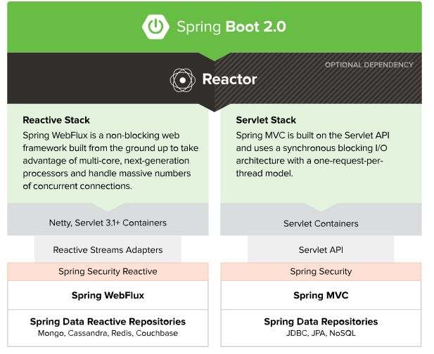

&ensp;&ensp;&ensp;&ensp;&ensp;&ensp;&ensp;&ensp;- 参考

&ensp;&ensp;&ensp;&ensp;&ensp;&ensp;&ensp;&ensp;&ensp;&ensp;&ensp;&ensp;[外行人都能看得懂的WebFlux](https://zhuanlan.zhihu.com/p/92460075)

- 参考

&ensp;&ensp;&ensp;&ensp;[Spring Framework官网](https://spring.io/projects/spring-framework)

&ensp;&ensp;&ensp;&ensp;[Spring Framework 中文文档 - 5.1.3.RELEASE](https://www.docs4dev.com/docs/zh/spring-framework/5.1.3.RELEASE/reference)

---

- 面试题


