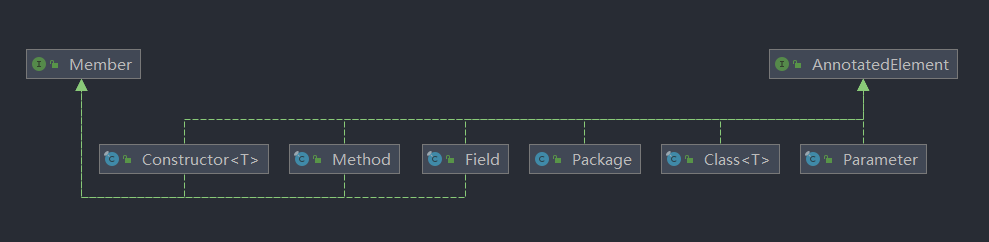

# 反射（java.lang.reflect反射包）

- 概念

&ensp;&ensp;&ensp;&ensp;- 什么是反射

&ensp;&ensp;&ensp;&ensp;&ensp;&ensp;&ensp;&ensp;> 反射（Reflection） 是 Java 程序开发语言的特征之一，它允许运行中的 Java 程序对自身进行检查，或者说“自审”，并能直接操作程序的内部属性和方法。


&ensp;&ensp;&ensp;&ensp;&ensp;&ensp;&ensp;&ensp;- 是一种语言特性、特征

&ensp;&ensp;&ensp;&ensp;&ensp;&ensp;&ensp;&ensp;- 简单来说就是运行的时候获得相关的类、方法、属性、构造器信息。

&ensp;&ensp;&ensp;&ensp;&ensp;&ensp;&ensp;&ensp;- 反射常用类在java.lang.reflect包下

&ensp;&ensp;&ensp;&ensp;- 结构图



- 基础使用

&ensp;&ensp;&ensp;&ensp;获取class类的四种方式

```Java
public class Test {
    public static void main(String[] args) throws ClassNotFoundException {
        User user = new User();
        // 1.通过对象获得
        Class userClass01 = user.getClass();
        System.out.println(userClass01);
        // 2.通过Class类的
        Class userClass02 = Class.forName("com.shengjava.reflect.User");
        System.out.println(userClass02);
        // 3.通过类名.class获得
        Class userClass03 = User.class;
        System.out.println(userClass03);
        // 4.可以通过子类，获取父类（获取user类的父类Object类）
        Class superclass = userClass01.getSuperclass();
        System.out.println(superclass);
    }
}
class User{}
```


&ensp;&ensp;&ensp;&ensp;获取类的相关信息，例如：字段、构造器、方法等等其他常用方法

```Java
public class 获取类的运行时结构 {
    public static void main(String[] args) {
        // 1.获取类
        Class<Person> personClass = Person.class;
        System.out.println("===== 1.获取类 =====");
        System.out.println(personClass.getName()); // 获取类名
        System.out.println(personClass.getPackage()); // 获取类的包名
        // 2.获取类的属性
        Field[] fields = personClass.getFields();
        System.out.println("===== 2.获取类public的属性(getFields()仅能获取public公开的属性) =====");
        for (Field field : fields) {
            System.out.println(field);
        }
        Field[] fields2 = personClass.getDeclaredFields();
        System.out.println("===== 2.获取类全部的属性 =====");
        for (Field field : fields2) {
            System.out.println(field);
        }
        // 3.获取类的构造器
        Constructor<?>[] constructors = personClass.getDeclaredConstructors();
        System.out.println("===== 3.获取类的全部构造器 =====");
        for (Constructor<?> constructor : constructors) {
            System.out.println(constructor);
        }
        // 4.获取类的方法
        Method[] methods = personClass.getDeclaredMethods();
        System.out.println("===== 4.获取类的全部方法 =====");
        for (Method method : methods) {
            System.out.println(method);
        }
    }
}

class Person{
    private String name;
    public Person() {}
    public Person(String name) {this.name = name;}
    @Override
    public String toString() {return "Person{ name='" + name + '\'' + '}';}
    public String getName() {return name;}
    public void setName(String name) {this.name = name;}
}
```


- 常用接口

&ensp;&ensp;&ensp;&ensp;- 还是按照先看接口，从接口开始看起。

&ensp;&ensp;&ensp;&ensp;- Member接口

&ensp;&ensp;&ensp;&ensp;&ensp;&ensp;&ensp;&ensp;> Member是一个反映关于单个成员（字段或方法）或构造函数的标识信息的接口。


&ensp;&ensp;&ensp;&ensp;&ensp;&ensp;&ensp;&ensp;- 获得一些成员信息的接口（只有方法、字段属性、构造器实现了它）

&ensp;&ensp;&ensp;&ensp;&ensp;&ensp;&ensp;&ensp;- 请参考[AnnotatedElement接口](https://www.wolai.com/7b4bnFe9wzGibKjLt6Lx1s)下的[常见子类（Class、Method...）](https://www.wolai.com/d4nMKRhHfNrEJGV9LikTV1)

&ensp;&ensp;&ensp;&ensp;&ensp;&ensp;&ensp;&ensp;- 常用方法

```Java
public class Demo {
    public static void main(String[] args) throws NoSuchMethodException {
        Member m = Demo.class.getMethod("test");
        // 查询
        int declared = m.DECLARED;
        int aPublic = m.PUBLIC;
        // 查询类
        Class<?> declaringClass = m.getDeclaringClass();
        // 查询类名
        String name = m.getName();
        // 查询修饰符（PUBLIC值为1）
        int modifiers = m.getModifiers();
    }

    public void test() {
    }
}
```


&ensp;&ensp;&ensp;&ensp;- AnnotatedElement接口

&ensp;&ensp;&ensp;&ensp;&ensp;&ensp;&ensp;&ensp;- 常用方法

```Java
public class Demo {
    public static void main(String[] args) throws NoSuchMethodException {
        AnnotatedElement c = Demo.class.getMethod("test");
        // 查询此元素上存在的注解
        Annotation[] annotations = c.getAnnotations();
        // 查询此元素上存申明的注解
        Annotation[] declaredAnnotations = c.getDeclaredAnnotations();
        // 查询此元素上是否存在指定注解
        boolean annotationPresent = c.isAnnotationPresent(Deprecated.class);
    }

    @Deprecated
    public void test() {
    }
}
```


&ensp;&ensp;&ensp;&ensp;&ensp;&ensp;&ensp;&ensp;- 常见子类（Class、Method...）

&ensp;&ensp;&ensp;&ensp;&ensp;&ensp;&ensp;&ensp;&ensp;&ensp;&ensp;&ensp;- Class

&ensp;&ensp;&ensp;&ensp;&ensp;&ensp;&ensp;&ensp;&ensp;&ensp;&ensp;&ensp;&ensp;&ensp;&ensp;&ensp;- 这个类比较特殊，在java.lang包下面

&ensp;&ensp;&ensp;&ensp;&ensp;&ensp;&ensp;&ensp;&ensp;&ensp;&ensp;&ensp;&ensp;&ensp;&ensp;&ensp;- 获取对象的几种方式

&ensp;&ensp;&ensp;&ensp;&ensp;&ensp;&ensp;&ensp;&ensp;&ensp;&ensp;&ensp;&ensp;&ensp;&ensp;&ensp;&ensp;&ensp;&ensp;&ensp;还有一种是从子类获取父类对象（[获取class类的四种方式](https://www.wolai.com/cK3oufNj27YTEJ5FKFRnyU)）

```Java
        // 1.通过Class类的静态方法获取（需要完整路径名，例如com.test.Demo）
        Class d1 = Class.forName("com.test.Demo");
        // 2.通过类的class属性
        Class d2 = Demo.class;
        // 3.通过对象的getClass()
        Demo demo = new Demo();
        Class d3 = demo.getClass();
```


&ensp;&ensp;&ensp;&ensp;&ensp;&ensp;&ensp;&ensp;&ensp;&ensp;&ensp;&ensp;&ensp;&ensp;&ensp;&ensp;- 常用方法

```Java
public class Demo {
    public Integer n = 1;

    public static void main(String[] args) throws NoSuchMethodException, NoSuchFieldException {
        Class c = Demo.class;
        // 获取类加载器
        ClassLoader classLoader = c.getClassLoader();
        // 获取构造器
        Constructor constructor = c.getConstructor();
        Constructor[] constructors = c.getConstructors();
        // 获取方法
        Method test = c.getMethod("test");
        Method test1 = c.getDeclaredMethod("test");
        Method[] methods = c.getMethods();
        Method[] declaredMethods = c.getDeclaredMethods();
        // 获取字段属性
        Field n = c.getField("n");
        Field n1 = c.getDeclaredField("n");
        Field[] fields = c.getFields();
        Field[] declaredFields = c.getDeclaredFields();
        // 获取包
        Package aPackage = c.getPackage();
        // 获取父类
        Class superclass = c.getSuperclass();
        // 获取接口
        Class[] interfaces = c.getInterfaces();
    }

    @Deprecated
    public void test() {
    }
}
```


&ensp;&ensp;&ensp;&ensp;&ensp;&ensp;&ensp;&ensp;&ensp;&ensp;&ensp;&ensp;- Method、Parameter、Filed、Constructor、Package、Parameter

&ensp;&ensp;&ensp;&ensp;&ensp;&ensp;&ensp;&ensp;&ensp;&ensp;&ensp;&ensp;&ensp;&ensp;&ensp;&ensp;- 这几个类都类似，都是获取一些相关参数的方法

- 参考

&ensp;&ensp;&ensp;&ensp;[详解面试中常考的 Java 反射机制 - 知乎 (zhihu.com)](https://zhuanlan.zhihu.com/p/86293659)

