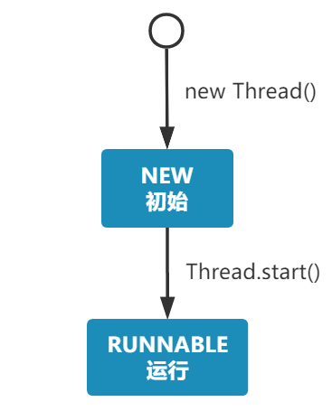
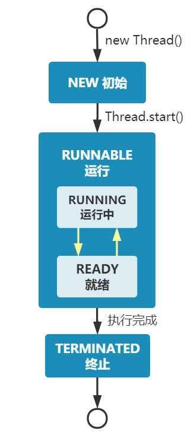
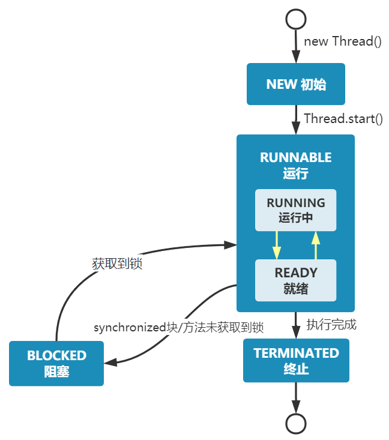
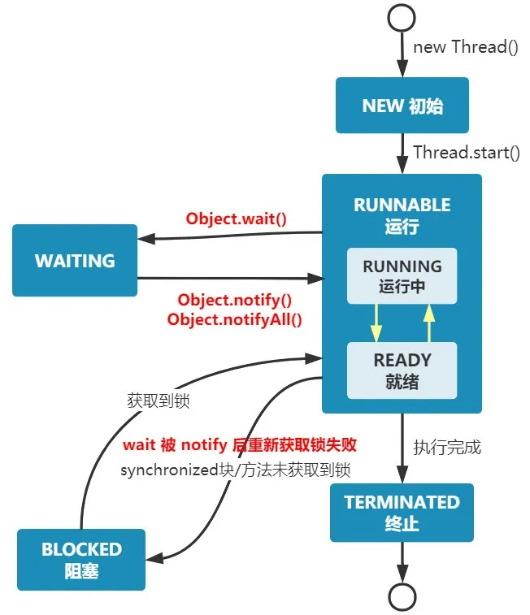
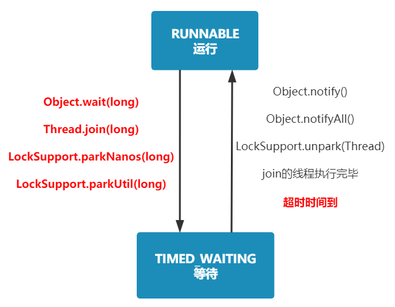
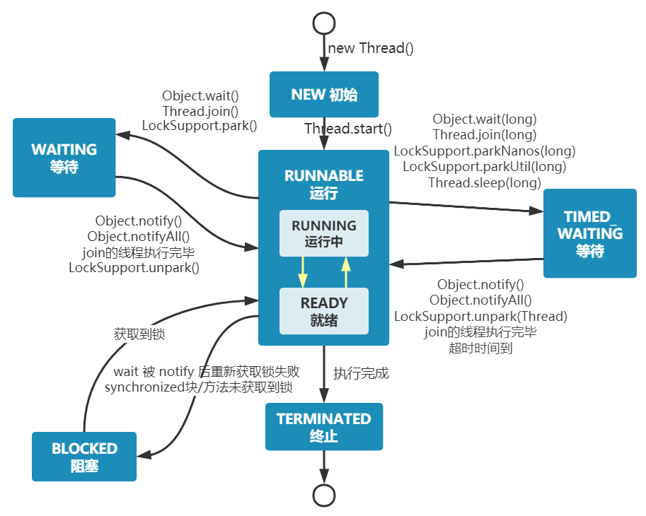

# 多线程

- 多线程基础

&ensp;&ensp;&ensp;&ensp;- 思路

&ensp;&ensp;&ensp;&ensp;&ensp;&ensp;&ensp;&ensp;1. 先了解基本的一些概念，例如进程、线程。

&ensp;&ensp;&ensp;&ensp;&ensp;&ensp;&ensp;&ensp;2. 然后了解线程创建的三种方式和三种方式的优缺点

&ensp;&ensp;&ensp;&ensp;&ensp;&ensp;&ensp;&ensp;3. 再去详细了解线程的六种状态，与此同时学习Thread类中的常用方法，在学线程的等待机制时，顺便把线程通知中的等待/通知机制学习一下。

&ensp;&ensp;&ensp;&ensp;&ensp;&ensp;&ensp;&ensp;4. 线程的同步，synchronized和volatile关键字。

&ensp;&ensp;&ensp;&ensp;&ensp;&ensp;&ensp;&ensp;5. 线程通讯机制

&ensp;&ensp;&ensp;&ensp;&ensp;&ensp;&ensp;&ensp;6. 线程池学习

&ensp;&ensp;&ensp;&ensp;- 1.进程、线程概念

&ensp;&ensp;&ensp;&ensp;&ensp;&ensp;&ensp;&ensp;- 概念

&ensp;&ensp;&ensp;&ensp;&ensp;&ensp;&ensp;&ensp;&ensp;&ensp;&ensp;&ensp;> 进程是对运行时程序的封装，是**系统进行资源调度和分配的的基本单位，实现了操作系统的并发** ；


&ensp;&ensp;&ensp;&ensp;&ensp;&ensp;&ensp;&ensp;&ensp;&ensp;&ensp;&ensp;> 线程是进程的子任务，**是CPU调度和分派的基本单位** ，**用于保证程序的实时性，实现进程内部的并发；** 


&ensp;&ensp;&ensp;&ensp;&ensp;&ensp;&ensp;&ensp;&ensp;&ensp;&ensp;&ensp;- 进程：是操作系统进行资源调度与分配的基本单位。

&ensp;&ensp;&ensp;&ensp;&ensp;&ensp;&ensp;&ensp;&ensp;&ensp;&ensp;&ensp;- 线程：一个进程里面有多个线程，是CPU调度与分配的基本单位。

&ensp;&ensp;&ensp;&ensp;&ensp;&ensp;&ensp;&ensp;&ensp;&ensp;&ensp;&ensp;- （打个比方：进程类似工厂，线程就是工厂里面的小车间。打比方：qq、微信、浏览器就是进程，可以在操作系统的任务管理器中看到，进程中有1个或以上的线程。）

&ensp;&ensp;&ensp;&ensp;&ensp;&ensp;&ensp;&ensp;- 参考

&ensp;&ensp;&ensp;&ensp;&ensp;&ensp;&ensp;&ensp;&ensp;&ensp;&ensp;&ensp;[一个故事讲完进程、线程和协程 (qq.com)](https://mp.weixin.qq.com/s/zuWRx1FGuBC-_HwuA7jK3w)

&ensp;&ensp;&ensp;&ensp;&ensp;&ensp;&ensp;&ensp;&ensp;&ensp;&ensp;&ensp;[进程和线程基础知识全家桶，30 张图一套带走 (qq.com)](https://mp.weixin.qq.com/s/FaHKGRI69TqDj0AJtNiVoA)

&ensp;&ensp;&ensp;&ensp;- 2.线程创建（三种方式）

&ensp;&ensp;&ensp;&ensp;&ensp;&ensp;&ensp;&ensp;- 继承Thread

&ensp;&ensp;&ensp;&ensp;&ensp;&ensp;&ensp;&ensp;&ensp;&ensp;&ensp;&ensp;- Thread类概念

&ensp;&ensp;&ensp;&ensp;&ensp;&ensp;&ensp;&ensp;&ensp;&ensp;&ensp;&ensp;&ensp;&ensp;&ensp;&ensp;> 线程是程序中执行的线程。 Java虚拟机允许应用程序同时执行多个执行线程。


&ensp;&ensp;&ensp;&ensp;&ensp;&ensp;&ensp;&ensp;&ensp;&ensp;&ensp;&ensp;&ensp;&ensp;&ensp;&ensp;- [Thread](https://www.mklab.cn/onlineapi/jdk_8_cn/java/lang/Thread.html)类在java.lang包下。（在文档中有创建线程并启动的方法）

&ensp;&ensp;&ensp;&ensp;&ensp;&ensp;&ensp;&ensp;&ensp;&ensp;&ensp;&ensp;- 思路

&ensp;&ensp;&ensp;&ensp;&ensp;&ensp;&ensp;&ensp;&ensp;&ensp;&ensp;&ensp;&ensp;&ensp;&ensp;&ensp;- 这里先了解基本的线程创建，至于常用方法、字段属性之类的后面会接触到

&ensp;&ensp;&ensp;&ensp;&ensp;&ensp;&ensp;&ensp;&ensp;&ensp;&ensp;&ensp;- 实现

&ensp;&ensp;&ensp;&ensp;&ensp;&ensp;&ensp;&ensp;&ensp;&ensp;&ensp;&ensp;&ensp;&ensp;&ensp;&ensp;- 实现步骤

&ensp;&ensp;&ensp;&ensp;&ensp;&ensp;&ensp;&ensp;&ensp;&ensp;&ensp;&ensp;&ensp;&ensp;&ensp;&ensp;&ensp;&ensp;&ensp;&ensp;1. 创建一个类，继承Thread 类，并实重写run()方法。

&ensp;&ensp;&ensp;&ensp;&ensp;&ensp;&ensp;&ensp;&ensp;&ensp;&ensp;&ensp;&ensp;&ensp;&ensp;&ensp;&ensp;&ensp;&ensp;&ensp;2. 创建线程类，并调用start()方法运行

&ensp;&ensp;&ensp;&ensp;&ensp;&ensp;&ensp;&ensp;&ensp;&ensp;&ensp;&ensp;&ensp;&ensp;&ensp;&ensp;- 实现代码

```Java
public class MyThread extends Thread {
    public static void main(String[] args) {
        // 第一种方式，继承Tread类，重新run()方法，调用start()方法启动线程
        new MyThread().start();
    }
    @Override
    public void run() {
        System.out.println("使用继承Thread类的方法创建线程。");
    }
}
```


&ensp;&ensp;&ensp;&ensp;&ensp;&ensp;&ensp;&ensp;&ensp;&ensp;&ensp;&ensp;- 优缺点

&ensp;&ensp;&ensp;&ensp;&ensp;&ensp;&ensp;&ensp;&ensp;&ensp;&ensp;&ensp;&ensp;&ensp;&ensp;&ensp;- 优点：可以直接获取到当前线程this对象，而不需要使用Thread.currentThread()获取当前线程。

&ensp;&ensp;&ensp;&ensp;&ensp;&ensp;&ensp;&ensp;&ensp;&ensp;&ensp;&ensp;&ensp;&ensp;&ensp;&ensp;- 缺点：继承了Thead类就不能继承其他类了（Java只能单继承）

&ensp;&ensp;&ensp;&ensp;&ensp;&ensp;&ensp;&ensp;&ensp;&ensp;&ensp;&ensp;&ensp;&ensp;&ensp;&ensp;- 注意：不建议使用继承Tread类的方法，避免OOP单继承的局限性。

&ensp;&ensp;&ensp;&ensp;&ensp;&ensp;&ensp;&ensp;&ensp;&ensp;&ensp;&ensp;- 扩展（线程Thread常用方法）

&ensp;&ensp;&ensp;&ensp;&ensp;&ensp;&ensp;&ensp;&ensp;&ensp;&ensp;&ensp;&ensp;&ensp;&ensp;&ensp;常用方法如下，相关使用可以查看API文档

```Java
        Thread t = new Thread();
        // 查询线程信息
        long id = t.getId();
        String name = t.getName();
        int priority = t.getPriority();
        StackTraceElement[] stackTrace = t.getStackTrace();
        State state = t.getState();
        ThreadGroup threadGroup = t.getThreadGroup();
        boolean alive = t.isAlive();
        boolean daemon = t.isDaemon();
        boolean interrupted = t.isInterrupted();
        // 修改线程
        t.setDaemon(false);
        t.setName("thread-name");
        t.setContextClassLoader(null);
        t.setPriority(10);

        // 线程状态改变
        t.start();
        t.wait();
        t.wait(1000);
        t.wait(1000,100);
        t.notify();
        t.notifyAll();
        t.join();
        t.join(1000);
        t.join(1000, 100);
        t.interrupt();
        // 线程的静态方法（还有一些静态字段、静态内部类，这里不过多罗列）
        Thread.sleep(1000);
        int i1 = Thread.activeCount();
        Thread thread1 = Thread.currentThread();
        boolean interrupted1 = Thread.interrupted();
        Thread.yield();
```


&ensp;&ensp;&ensp;&ensp;&ensp;&ensp;&ensp;&ensp;- 实现Runable接口

&ensp;&ensp;&ensp;&ensp;&ensp;&ensp;&ensp;&ensp;&ensp;&ensp;&ensp;&ensp;- Runable接口概念

&ensp;&ensp;&ensp;&ensp;&ensp;&ensp;&ensp;&ensp;&ensp;&ensp;&ensp;&ensp;&ensp;&ensp;&ensp;&ensp;> `Runnable`接口应由任何类实现，其实例将由线程执行。 该类必须定义一个无参数的方法，称为`run` 。


&ensp;&ensp;&ensp;&ensp;&ensp;&ensp;&ensp;&ensp;&ensp;&ensp;&ensp;&ensp;&ensp;&ensp;&ensp;&ensp;- 可以通过实现[Runnable](https://www.mklab.cn/onlineapi/jdk_8_cn/java/lang/Runnable.html) 接口创建一个线程，不过这个线程必须实现run()方法

&ensp;&ensp;&ensp;&ensp;&ensp;&ensp;&ensp;&ensp;&ensp;&ensp;&ensp;&ensp;- 实现代码

&ensp;&ensp;&ensp;&ensp;&ensp;&ensp;&ensp;&ensp;&ensp;&ensp;&ensp;&ensp;&ensp;&ensp;&ensp;&ensp;- 实现步骤

&ensp;&ensp;&ensp;&ensp;&ensp;&ensp;&ensp;&ensp;&ensp;&ensp;&ensp;&ensp;&ensp;&ensp;&ensp;&ensp;&ensp;&ensp;&ensp;&ensp;1. 创建一个匿名类，这个匿名类（Lambda表达式）实现了Runnable接口

&ensp;&ensp;&ensp;&ensp;&ensp;&ensp;&ensp;&ensp;&ensp;&ensp;&ensp;&ensp;&ensp;&ensp;&ensp;&ensp;&ensp;&ensp;&ensp;&ensp;2. 将匿名类当作传入Thread类，调用start()方法运行。

&ensp;&ensp;&ensp;&ensp;&ensp;&ensp;&ensp;&ensp;&ensp;&ensp;&ensp;&ensp;&ensp;&ensp;&ensp;&ensp;&ensp;&ensp;&ensp;&ensp;- 备注

&ensp;&ensp;&ensp;&ensp;&ensp;&ensp;&ensp;&ensp;&ensp;&ensp;&ensp;&ensp;&ensp;&ensp;&ensp;&ensp;&ensp;&ensp;&ensp;&ensp;&ensp;&ensp;&ensp;&ensp;备注：这里的传入的参数是Lambda表达式（传入的参数是一个实现了Runnable接口的匿名类），如果看不懂Lambda表达式建议查看我这边博客：[【Java 进阶】JDK 8 推导Lambda简化过程_长生的梦呓-CSDN博客](https://www.wolai.com/a9F14SvTX73gTZobeHUvcL)

&ensp;&ensp;&ensp;&ensp;&ensp;&ensp;&ensp;&ensp;&ensp;&ensp;&ensp;&ensp;&ensp;&ensp;&ensp;&ensp;- 代码

```Java
        // 将实现Runnable接口的匿名类（也就是lambda表达式）当作参数传入创建的Thread对象中，然后调用start方法启动。
        new Thread(()->{
            System.out.println("使用实现Runnable接口创建线程。（这里使用了Lambda表达式创建了匿名类）");
        }).start();
```


&ensp;&ensp;&ensp;&ensp;&ensp;&ensp;&ensp;&ensp;&ensp;&ensp;&ensp;&ensp;- 优缺点

&ensp;&ensp;&ensp;&ensp;&ensp;&ensp;&ensp;&ensp;&ensp;&ensp;&ensp;&ensp;&ensp;&ensp;&ensp;&ensp;- 优点：采用的是实现Runable接口，解决了继承Thread类出现的问题。并且可以使用Lambda表达式，让代码看起来更加简洁。

&ensp;&ensp;&ensp;&ensp;&ensp;&ensp;&ensp;&ensp;&ensp;&ensp;&ensp;&ensp;&ensp;&ensp;&ensp;&ensp;- 缺点：如果需要访问当前线程需要使用Thread.currentThread()方法。

&ensp;&ensp;&ensp;&ensp;&ensp;&ensp;&ensp;&ensp;- 实现Callable接口

&ensp;&ensp;&ensp;&ensp;&ensp;&ensp;&ensp;&ensp;&ensp;&ensp;&ensp;&ensp;- 概念

&ensp;&ensp;&ensp;&ensp;&ensp;&ensp;&ensp;&ensp;&ensp;&ensp;&ensp;&ensp;&ensp;&ensp;&ensp;&ensp;- 可以说这个创建线程的方式是：通过FutureTask类，然后实现RunnableFuture接口创建线程，因为这个接口他继承了Callable和Future接口。

&ensp;&ensp;&ensp;&ensp;&ensp;&ensp;&ensp;&ensp;&ensp;&ensp;&ensp;&ensp;&ensp;&ensp;&ensp;&ensp;- Callable接口

&ensp;&ensp;&ensp;&ensp;&ensp;&ensp;&ensp;&ensp;&ensp;&ensp;&ensp;&ensp;&ensp;&ensp;&ensp;&ensp;&ensp;&ensp;&ensp;&ensp;> 返回结果并可能引发异常的任务。 实现者定义一个没有参数的单一方法，称为`call` 。`Callable`接口类似于`Runnable` ，因为它们都是为其实例可能由另一个线程执行的类设计的。 然而，`Runnable`不返回结果，也不能抛出被检查的异常。


&ensp;&ensp;&ensp;&ensp;&ensp;&ensp;&ensp;&ensp;&ensp;&ensp;&ensp;&ensp;&ensp;&ensp;&ensp;&ensp;&ensp;&ensp;&ensp;&ensp;- [Callable](https://www.mklab.cn/onlineapi/jdk_8_cn/java/util/concurrent/Callable.html)是JUC并发包（java.util.[concurrent](https://www.mklab.cn/onlineapi/jdk_8_cn/java/util/concurrent/package-frame.html)包）下的一个接口，可以通过实现[Callable](https://www.mklab.cn/onlineapi/jdk_8_cn/java/util/concurrent/Callable.html)接口的call()方法创建一个线程。

&ensp;&ensp;&ensp;&ensp;&ensp;&ensp;&ensp;&ensp;&ensp;&ensp;&ensp;&ensp;&ensp;&ensp;&ensp;&ensp;&ensp;&ensp;&ensp;&ensp;- 关键是实现`Runnable`接口的线程不返回结果，但是实现`Callable`接口的线程是会返回结果的。

&ensp;&ensp;&ensp;&ensp;&ensp;&ensp;&ensp;&ensp;&ensp;&ensp;&ensp;&ensp;- 思路

&ensp;&ensp;&ensp;&ensp;&ensp;&ensp;&ensp;&ensp;&ensp;&ensp;&ensp;&ensp;&ensp;&ensp;&ensp;&ensp;- 一点点的了解这种线程创建的方法，建议点进去源码从接口开始了解。

&ensp;&ensp;&ensp;&ensp;&ensp;&ensp;&ensp;&ensp;&ensp;&ensp;&ensp;&ensp;- 实现

&ensp;&ensp;&ensp;&ensp;&ensp;&ensp;&ensp;&ensp;&ensp;&ensp;&ensp;&ensp;&ensp;&ensp;&ensp;&ensp;- 实现步骤

&ensp;&ensp;&ensp;&ensp;&ensp;&ensp;&ensp;&ensp;&ensp;&ensp;&ensp;&ensp;&ensp;&ensp;&ensp;&ensp;&ensp;&ensp;&ensp;&ensp;1. 创建一个实现了Callable<V>接口的匿名类（Lambda表达式）。

&ensp;&ensp;&ensp;&ensp;&ensp;&ensp;&ensp;&ensp;&ensp;&ensp;&ensp;&ensp;&ensp;&ensp;&ensp;&ensp;&ensp;&ensp;&ensp;&ensp;2. 将匿名类当作参数传入创建的FutureTask<V>对象中。

&ensp;&ensp;&ensp;&ensp;&ensp;&ensp;&ensp;&ensp;&ensp;&ensp;&ensp;&ensp;&ensp;&ensp;&ensp;&ensp;&ensp;&ensp;&ensp;&ensp;3. 将创建的FutureTask<V>对象当作参数传入Thread对象中，然后调用start()方法运行。

&ensp;&ensp;&ensp;&ensp;&ensp;&ensp;&ensp;&ensp;&ensp;&ensp;&ensp;&ensp;&ensp;&ensp;&ensp;&ensp;&ensp;&ensp;&ensp;&ensp;- 备注

&ensp;&ensp;&ensp;&ensp;&ensp;&ensp;&ensp;&ensp;&ensp;&ensp;&ensp;&ensp;&ensp;&ensp;&ensp;&ensp;&ensp;&ensp;&ensp;&ensp;&ensp;&ensp;&ensp;&ensp;- 为什么FutureTask<V>类中可以传入匿名类（就是Lambda表达式）？

&ensp;&ensp;&ensp;&ensp;&ensp;&ensp;&ensp;&ensp;&ensp;&ensp;&ensp;&ensp;&ensp;&ensp;&ensp;&ensp;&ensp;&ensp;&ensp;&ensp;&ensp;&ensp;&ensp;&ensp;&ensp;&ensp;&ensp;&ensp;- 因为FutureTask<V>有一个构造器，里面需要传入的参数就是Callable<V>接口。并且Callable<V>接口只有一个方法，他拥有@FunctionalInterface注解，所以可以传入lambda表达式。

&ensp;&ensp;&ensp;&ensp;&ensp;&ensp;&ensp;&ensp;&ensp;&ensp;&ensp;&ensp;&ensp;&ensp;&ensp;&ensp;&ensp;&ensp;&ensp;&ensp;&ensp;&ensp;&ensp;&ensp;&ensp;&ensp;&ensp;&ensp;- 源码如下

&ensp;&ensp;&ensp;&ensp;&ensp;&ensp;&ensp;&ensp;&ensp;&ensp;&ensp;&ensp;&ensp;&ensp;&ensp;&ensp;&ensp;&ensp;&ensp;&ensp;&ensp;&ensp;&ensp;&ensp;&ensp;&ensp;&ensp;&ensp;&ensp;&ensp;&ensp;&ensp;- utureTask<V>拥有一个单个参数的构造器，这个参数就是Callable<V>

```Java
    public FutureTask(Callable<V> callable) {
        if (callable == null)
            throw new NullPointerException();
        this.callable = callable;
        this.state = NEW;       // ensure visibility of callable
    }
```


&ensp;&ensp;&ensp;&ensp;&ensp;&ensp;&ensp;&ensp;&ensp;&ensp;&ensp;&ensp;&ensp;&ensp;&ensp;&ensp;&ensp;&ensp;&ensp;&ensp;&ensp;&ensp;&ensp;&ensp;&ensp;&ensp;&ensp;&ensp;&ensp;&ensp;&ensp;&ensp;- Callable<V>有@FunctionalInterface注解

```Java
@FunctionalInterface
public interface Callable<V> {
    V call() throws Exception;
}
```


&ensp;&ensp;&ensp;&ensp;&ensp;&ensp;&ensp;&ensp;&ensp;&ensp;&ensp;&ensp;&ensp;&ensp;&ensp;&ensp;&ensp;&ensp;&ensp;&ensp;&ensp;&ensp;&ensp;&ensp;- 为什么FutureTask<V>对象可以当作参数传入Thread中？

&ensp;&ensp;&ensp;&ensp;&ensp;&ensp;&ensp;&ensp;&ensp;&ensp;&ensp;&ensp;&ensp;&ensp;&ensp;&ensp;&ensp;&ensp;&ensp;&ensp;&ensp;&ensp;&ensp;&ensp;&ensp;&ensp;&ensp;&ensp;- 因为FutureTask<V>实现了RunnableFuture<V>接口，而这个RunnableFuture<V>接口是继承自Runnable接口。

&ensp;&ensp;&ensp;&ensp;&ensp;&ensp;&ensp;&ensp;&ensp;&ensp;&ensp;&ensp;&ensp;&ensp;&ensp;&ensp;&ensp;&ensp;&ensp;&ensp;&ensp;&ensp;&ensp;&ensp;&ensp;&ensp;&ensp;&ensp;- 源码如下

```Java
public class FutureTask<V> implements RunnableFuture<V> {
}
```


```Java
public interface RunnableFuture<V> extends Runnable, Future<V> {
    void run();
}

```


&ensp;&ensp;&ensp;&ensp;&ensp;&ensp;&ensp;&ensp;&ensp;&ensp;&ensp;&ensp;&ensp;&ensp;&ensp;&ensp;- 代码

```Java
        // 将实现Callable<V>接口的匿名类（也就是lambda表达式）当作参数传入创建的FutureTask<V>对象中
        // 再将新建的FutureTask<V>对象，传入Thread类中，运行start方法启动
        new Thread(
                new FutureTask<Boolean>(() -> {
                    System.out.println("使用实现Callable<V>接口创建线程。（这里使用了Lambda表达式创建了匿名类）");
                    return true;
                })
        ).start();
```


&ensp;&ensp;&ensp;&ensp;&ensp;&ensp;&ensp;&ensp;&ensp;&ensp;&ensp;&ensp;&ensp;&ensp;&ensp;&ensp;- 优缺点

&ensp;&ensp;&ensp;&ensp;&ensp;&ensp;&ensp;&ensp;&ensp;&ensp;&ensp;&ensp;&ensp;&ensp;&ensp;&ensp;&ensp;&ensp;&ensp;&ensp;- 优点：

&ensp;&ensp;&ensp;&ensp;&ensp;&ensp;&ensp;&ensp;&ensp;&ensp;&ensp;&ensp;&ensp;&ensp;&ensp;&ensp;&ensp;&ensp;&ensp;&ensp;&ensp;&ensp;&ensp;&ensp;- Callable的任务执行后可返回值，而Runnable的任务是不能返回值的。

&ensp;&ensp;&ensp;&ensp;&ensp;&ensp;&ensp;&ensp;&ensp;&ensp;&ensp;&ensp;&ensp;&ensp;&ensp;&ensp;&ensp;&ensp;&ensp;&ensp;&ensp;&ensp;&ensp;&ensp;- call方法可以抛出异常，run方法不可以。

&ensp;&ensp;&ensp;&ensp;&ensp;&ensp;&ensp;&ensp;&ensp;&ensp;&ensp;&ensp;&ensp;&ensp;&ensp;&ensp;&ensp;&ensp;&ensp;&ensp;&ensp;&ensp;&ensp;&ensp;- 运行Callable任务可以拿到一个Future对象，表示异步计算的结果。

&ensp;&ensp;&ensp;&ensp;&ensp;&ensp;&ensp;&ensp;&ensp;&ensp;&ensp;&ensp;&ensp;&ensp;&ensp;&ensp;&ensp;&ensp;&ensp;&ensp;- 所以通过这个方法，最主要的就是线程执行完后获得返回值。

&ensp;&ensp;&ensp;&ensp;&ensp;&ensp;&ensp;&ensp;- 参考

&ensp;&ensp;&ensp;&ensp;&ensp;&ensp;&ensp;&ensp;&ensp;&ensp;&ensp;&ensp;[【Java 进阶】JDK 8 推导Lambda简化过程_长生的梦呓-CSDN博客](https://blog.csdn.net/weixin_44034328/article/details/104366290)

&ensp;&ensp;&ensp;&ensp;&ensp;&ensp;&ensp;&ensp;&ensp;&ensp;&ensp;&ensp;[java 创建线程的三种方式、创建线程池的四种方式](https://blog.csdn.net/qq_35275233/article/details/87893337)

&ensp;&ensp;&ensp;&ensp;- 3.线程状态

&ensp;&ensp;&ensp;&ensp;&ensp;&ensp;&ensp;&ensp;- 概念

&ensp;&ensp;&ensp;&ensp;&ensp;&ensp;&ensp;&ensp;&ensp;&ensp;&ensp;&ensp;- 线程状态可以理解为线程的生命周期。

&ensp;&ensp;&ensp;&ensp;&ensp;&ensp;&ensp;&ensp;&ensp;&ensp;&ensp;&ensp;- 点开Thread类中的内部枚举类[Thread.State](https://www.mklab.cn/onlineapi/jdk_8_cn/java/lang/Thread.State.html)就可以看到所有的状态了。

&ensp;&ensp;&ensp;&ensp;&ensp;&ensp;&ensp;&ensp;&ensp;&ensp;&ensp;&ensp;- Java线程状态有：新建、运行、无限等待、限期等待、阻塞、结束

&ensp;&ensp;&ensp;&ensp;&ensp;&ensp;&ensp;&ensp;- Java线程六种状态

&ensp;&ensp;&ensp;&ensp;&ensp;&ensp;&ensp;&ensp;&ensp;&ensp;&ensp;&ensp;- NEW初始

&ensp;&ensp;&ensp;&ensp;&ensp;&ensp;&ensp;&ensp;&ensp;&ensp;&ensp;&ensp;&ensp;&ensp;&ensp;&ensp;- 新创建线程时候，init初始化的时候就是初始状态，对应代码如下：

```Java
Thread t = new Thread();
```


&ensp;&ensp;&ensp;&ensp;&ensp;&ensp;&ensp;&ensp;&ensp;&ensp;&ensp;&ensp;&ensp;&ensp;&ensp;&ensp;- 流程图


&ensp;&ensp;&ensp;&ensp;&ensp;&ensp;&ensp;&ensp;&ensp;&ensp;&ensp;&ensp;- RUNNABLE运行

&ensp;&ensp;&ensp;&ensp;&ensp;&ensp;&ensp;&ensp;&ensp;&ensp;&ensp;&ensp;&ensp;&ensp;&ensp;&ensp;- 调用start方法时候运行，则是运行状态了。在调用了这个方法之后才真正出现了一个线程，并且执行，状态也改变成了RUNNABLE

```Java
t.start();
```


&ensp;&ensp;&ensp;&ensp;&ensp;&ensp;&ensp;&ensp;&ensp;&ensp;&ensp;&ensp;&ensp;&ensp;&ensp;&ensp;- 流程图



&ensp;&ensp;&ensp;&ensp;&ensp;&ensp;&ensp;&ensp;&ensp;&ensp;&ensp;&ensp;- TERMINATED终止

&ensp;&ensp;&ensp;&ensp;&ensp;&ensp;&ensp;&ensp;&ensp;&ensp;&ensp;&ensp;&ensp;&ensp;&ensp;&ensp;- 线程执行完毕后就变成了终止状态

&ensp;&ensp;&ensp;&ensp;&ensp;&ensp;&ensp;&ensp;&ensp;&ensp;&ensp;&ensp;&ensp;&ensp;&ensp;&ensp;- 流程图



&ensp;&ensp;&ensp;&ensp;&ensp;&ensp;&ensp;&ensp;&ensp;&ensp;&ensp;&ensp;- BLOCKED阻塞

&ensp;&ensp;&ensp;&ensp;&ensp;&ensp;&ensp;&ensp;&ensp;&ensp;&ensp;&ensp;&ensp;&ensp;&ensp;&ensp;- 执行同步代码块sychronized进入阻塞状态BLOCKED，需要拿到锁才能运行（状态为RUNNABLE）

&ensp;&ensp;&ensp;&ensp;&ensp;&ensp;&ensp;&ensp;&ensp;&ensp;&ensp;&ensp;&ensp;&ensp;&ensp;&ensp;- 流程图



&ensp;&ensp;&ensp;&ensp;&ensp;&ensp;&ensp;&ensp;&ensp;&ensp;&ensp;&ensp;&ensp;&ensp;&ensp;&ensp;&ensp;&ensp;&ensp;&ensp;- 比如，有一个锁对象 A，线程 1 此时持有这把锁。线程 2、3、4 分别尝试抢这把锁失败。那么他们都会进入同步队列中，变成阻塞状态，如此往复。


&ensp;&ensp;&ensp;&ensp;&ensp;&ensp;&ensp;&ensp;&ensp;&ensp;&ensp;&ensp;- WAITING等待

&ensp;&ensp;&ensp;&ensp;&ensp;&ensp;&ensp;&ensp;&ensp;&ensp;&ensp;&ensp;&ensp;&ensp;&ensp;&ensp;- 进入该状态的线程需要等待其他线程做出一些特定动作（通知或中断）。

&ensp;&ensp;&ensp;&ensp;&ensp;&ensp;&ensp;&ensp;&ensp;&ensp;&ensp;&ensp;&ensp;&ensp;&ensp;&ensp;- 概念图

&ensp;&ensp;&ensp;&ensp;&ensp;&ensp;&ensp;&ensp;&ensp;&ensp;&ensp;&ensp;&ensp;&ensp;&ensp;&ensp;&ensp;&ensp;&ensp;&ensp; 进入等待状态：调用lock.wait() 方法


&ensp;&ensp;&ensp;&ensp;&ensp;&ensp;&ensp;&ensp;&ensp;&ensp;&ensp;&ensp;&ensp;&ensp;&ensp;&ensp;&ensp;&ensp;&ensp;&ensp;唤醒：必须由另一个线程，调用同一个对象的 notify()/notifyAll() 方法。


&ensp;&ensp;&ensp;&ensp;&ensp;&ensp;&ensp;&ensp;&ensp;&ensp;&ensp;&ensp;&ensp;&ensp;&ensp;&ensp;- 流程图

&ensp;&ensp;&ensp;&ensp;&ensp;&ensp;&ensp;&ensp;&ensp;&ensp;&ensp;&ensp;&ensp;&ensp;&ensp;&ensp;&ensp;&ensp;&ensp;&ensp;- 进入等待状态wait()后唤醒notify()



&ensp;&ensp;&ensp;&ensp;&ensp;&ensp;&ensp;&ensp;&ensp;&ensp;&ensp;&ensp;&ensp;&ensp;&ensp;&ensp;&ensp;&ensp;&ensp;&ensp;扩展join方法：看join()方法源码，他的本质仍然是执行了 wait() 方法。


&ensp;&ensp;&ensp;&ensp;&ensp;&ensp;&ensp;&ensp;&ensp;&ensp;&ensp;&ensp;&ensp;&ensp;&ensp;&ensp;&ensp;&ensp;&ensp;&ensp;扩展LockSupport.park()、LockSupport.unpark()方法


&ensp;&ensp;&ensp;&ensp;&ensp;&ensp;&ensp;&ensp;&ensp;&ensp;&ensp;&ensp;&ensp;&ensp;&ensp;&ensp;- 等待/通知机制

&ensp;&ensp;&ensp;&ensp;&ensp;&ensp;&ensp;&ensp;&ensp;&ensp;&ensp;&ensp;&ensp;&ensp;&ensp;&ensp;&ensp;&ensp;&ensp;&ensp;- A线程调用对象O的wait()会进入等待状态，只有别的线程例如B线程调用O的notify()/notifyAll()方法才会被唤醒，进入RUNNABLE状态，继续运行。

&ensp;&ensp;&ensp;&ensp;&ensp;&ensp;&ensp;&ensp;&ensp;&ensp;&ensp;&ensp;&ensp;&ensp;&ensp;&ensp;&ensp;&ensp;&ensp;&ensp;- 一个形象的例子就是厨师和服务员之间就存在等待/通知机制，服务员通知做菜后等待厨师做完然后上菜。

&ensp;&ensp;&ensp;&ensp;&ensp;&ensp;&ensp;&ensp;&ensp;&ensp;&ensp;&ensp;&ensp;&ensp;&ensp;&ensp;&ensp;&ensp;&ensp;&ensp;- 常用方法

&ensp;&ensp;&ensp;&ensp;&ensp;&ensp;&ensp;&ensp;&ensp;&ensp;&ensp;&ensp;&ensp;&ensp;&ensp;&ensp;&ensp;&ensp;&ensp;&ensp;&ensp;&ensp;&ensp;&ensp;- wait()：进入等待状态

&ensp;&ensp;&ensp;&ensp;&ensp;&ensp;&ensp;&ensp;&ensp;&ensp;&ensp;&ensp;&ensp;&ensp;&ensp;&ensp;&ensp;&ensp;&ensp;&ensp;&ensp;&ensp;&ensp;&ensp;- notify()：通知唤醒

&ensp;&ensp;&ensp;&ensp;&ensp;&ensp;&ensp;&ensp;&ensp;&ensp;&ensp;&ensp;&ensp;&ensp;&ensp;&ensp;&ensp;&ensp;&ensp;&ensp;&ensp;&ensp;&ensp;&ensp;- notifyAll()：唤醒所有

&ensp;&ensp;&ensp;&ensp;&ensp;&ensp;&ensp;&ensp;&ensp;&ensp;&ensp;&ensp;&ensp;&ensp;&ensp;&ensp;- 线程的Waiting状态扩展

&ensp;&ensp;&ensp;&ensp;&ensp;&ensp;&ensp;&ensp;&ensp;&ensp;&ensp;&ensp;&ensp;&ensp;&ensp;&ensp;&ensp;&ensp;&ensp;&ensp;- 合并线程join

&ensp;&ensp;&ensp;&ensp;&ensp;&ensp;&ensp;&ensp;&ensp;&ensp;&ensp;&ensp;&ensp;&ensp;&ensp;&ensp;&ensp;&ensp;&ensp;&ensp;&ensp;&ensp;&ensp;&ensp;- t.join()：等待线程死亡（等待t线程执行完后再执行其他线程，类似排队时候的vip插队（优先执行t线程，直到t线程执行完了才执行主线程。执行t线程时候，此时的主线程为WAITING状态，直到t线程执行完了，主线程才会变成RUNNABLE 状态）

&ensp;&ensp;&ensp;&ensp;&ensp;&ensp;&ensp;&ensp;&ensp;&ensp;&ensp;&ensp;&ensp;&ensp;&ensp;&ensp;&ensp;&ensp;&ensp;&ensp;&ensp;&ensp;&ensp;&ensp;- 看join()方法源码，他的本质仍然是执行了 wait() 方法。

&ensp;&ensp;&ensp;&ensp;&ensp;&ensp;&ensp;&ensp;&ensp;&ensp;&ensp;&ensp;&ensp;&ensp;&ensp;&ensp;&ensp;&ensp;&ensp;&ensp;- LockSupport类

&ensp;&ensp;&ensp;&ensp;&ensp;&ensp;&ensp;&ensp;&ensp;&ensp;&ensp;&ensp;&ensp;&ensp;&ensp;&ensp;&ensp;&ensp;&ensp;&ensp;&ensp;&ensp;&ensp;&ensp;> 用于创建锁和其他同步类的基本线程阻塞原语。


&ensp;&ensp;&ensp;&ensp;&ensp;&ensp;&ensp;&ensp;&ensp;&ensp;&ensp;&ensp;&ensp;&ensp;&ensp;&ensp;&ensp;&ensp;&ensp;&ensp;&ensp;&ensp;&ensp;&ensp;- 从线程状态流转来看，[LockSupport](https://www.mklab.cn/onlineapi/jdk_8_cn/java/util/concurrent/locks/LockSupport.html)中两个方法park()/unpark()与 wait()/notify()相同。

&ensp;&ensp;&ensp;&ensp;&ensp;&ensp;&ensp;&ensp;&ensp;&ensp;&ensp;&ensp;&ensp;&ensp;&ensp;&ensp;&ensp;&ensp;&ensp;&ensp;&ensp;&ensp;&ensp;&ensp;- LockSupport.park()：该线程状态会从 RUNNABLE 变成 WAITING

&ensp;&ensp;&ensp;&ensp;&ensp;&ensp;&ensp;&ensp;&ensp;&ensp;&ensp;&ensp;&ensp;&ensp;&ensp;&ensp;&ensp;&ensp;&ensp;&ensp;&ensp;&ensp;&ensp;&ensp;- LockSupport.unpark(Thread 刚刚的线程)：调用这个，刚刚的线程会从 WAITING 回到 RUNNABLE

&ensp;&ensp;&ensp;&ensp;&ensp;&ensp;&ensp;&ensp;&ensp;&ensp;&ensp;&ensp;- TIMED_WAITING定时等待

&ensp;&ensp;&ensp;&ensp;&ensp;&ensp;&ensp;&ensp;&ensp;&ensp;&ensp;&ensp;&ensp;&ensp;&ensp;&ensp;- 这个非常简单，就是上面的等待状态WAITING增加一个定时参数就是该状态了。

&ensp;&ensp;&ensp;&ensp;&ensp;&ensp;&ensp;&ensp;&ensp;&ensp;&ensp;&ensp;&ensp;&ensp;&ensp;&ensp;- 流程图

&ensp;&ensp;&ensp;&ensp;&ensp;&ensp;&ensp;&ensp;&ensp;&ensp;&ensp;&ensp;&ensp;&ensp;&ensp;&ensp;&ensp;&ensp;&ensp;&ensp;- 这些方法的唯一区别就是，从 TIMED_WAITING 返回 RUNNABLE，不但可以通过之前的方式，还可以通过到了超时时间，返回 RUNNABLE 状态。



&ensp;&ensp;&ensp;&ensp;&ensp;&ensp;&ensp;&ensp;&ensp;&ensp;&ensp;&ensp;&ensp;&ensp;&ensp;&ensp;&ensp;&ensp;&ensp;&ensp;Thread.sleep(long)：仅仅让线程挂起，只能通过等待超时时间到了再被唤醒


&ensp;&ensp;&ensp;&ensp;&ensp;&ensp;&ensp;&ensp;&ensp;&ensp;&ensp;&ensp;&ensp;&ensp;&ensp;&ensp;&ensp;&ensp;&ensp;&ensp;最终的全局流程图：



&ensp;&ensp;&ensp;&ensp;&ensp;&ensp;&ensp;&ensp;- 问题

&ensp;&ensp;&ensp;&ensp;&ensp;&ensp;&ensp;&ensp;&ensp;&ensp;&ensp;&ensp;- Java线程六种状态、经典的线程五种状态区别？

&ensp;&ensp;&ensp;&ensp;&ensp;&ensp;&ensp;&ensp;&ensp;&ensp;&ensp;&ensp;&ensp;&ensp;&ensp;&ensp;- java中的六种状态就是上面的六种。

&ensp;&ensp;&ensp;&ensp;&ensp;&ensp;&ensp;&ensp;&ensp;&ensp;&ensp;&ensp;&ensp;&ensp;&ensp;&ensp;- 但是经典的线程五种状态：创建、就绪、执行、阻塞、终止。

&ensp;&ensp;&ensp;&ensp;&ensp;&ensp;&ensp;&ensp;&ensp;&ensp;&ensp;&ensp;&ensp;&ensp;&ensp;&ensp;- 不同实现者，可能有合并和拆分。注意不要混淆二者！详情查看[图解线程状态，看完浑身通透](https://www.wolai.com/8xXYECNWjW6TPMmeTcxMxh)

&ensp;&ensp;&ensp;&ensp;&ensp;&ensp;&ensp;&ensp;- 参考

&ensp;&ensp;&ensp;&ensp;&ensp;&ensp;&ensp;&ensp;&ensp;&ensp;&ensp;&ensp;[图解线程状态，看完浑身通透](https://mp.weixin.qq.com/s/aG_uBLQevyZEFTOLK-kH9g)

&ensp;&ensp;&ensp;&ensp;&ensp;&ensp;&ensp;&ensp;&ensp;&ensp;&ensp;&ensp;[Java线程的6种状态及切换(透彻讲解)_潘建南的博客](https://blog.csdn.net/pange1991/article/details/53860651)

&ensp;&ensp;&ensp;&ensp;&ensp;&ensp;&ensp;&ensp;&ensp;&ensp;&ensp;&ensp;[【面试】如果把线程当作一个人来对待，所有问题都瞬间明白了 (qq.com)](https://mp.weixin.qq.com/s/PrUa0tFyu3UZllP2FRDyVA)

&ensp;&ensp;&ensp;&ensp;- 4.线程通讯

&ensp;&ensp;&ensp;&ensp;&ensp;&ensp;&ensp;&ensp;- 线程通信主要可以分为三种方式，分别为**共享内存** 、**消息传递** 和**管道流** 。

&ensp;&ensp;&ensp;&ensp;&ensp;&ensp;&ensp;&ensp;- 共享内存

&ensp;&ensp;&ensp;&ensp;&ensp;&ensp;&ensp;&ensp;&ensp;&ensp;&ensp;&ensp;- 主要实现是通过volatile关键字来实现的。

&ensp;&ensp;&ensp;&ensp;&ensp;&ensp;&ensp;&ensp;&ensp;&ensp;&ensp;&ensp;- [volatile关键字](https://www.wolai.com/oSTQPrniZ1ZjBuXvynhtwi)

&ensp;&ensp;&ensp;&ensp;&ensp;&ensp;&ensp;&ensp;- 消息传递

&ensp;&ensp;&ensp;&ensp;&ensp;&ensp;&ensp;&ensp;&ensp;&ensp;&ensp;&ensp;- wait/notify等待通知方式

&ensp;&ensp;&ensp;&ensp;&ensp;&ensp;&ensp;&ensp;&ensp;&ensp;&ensp;&ensp;&ensp;&ensp;&ensp;&ensp;- Java中最常见的实现方式是synchronized + wait() + notify() / notifyAll()[等待/通知机制](https://www.wolai.com/bYNcyyK83wRLXbe577RatJ)

&ensp;&ensp;&ensp;&ensp;&ensp;&ensp;&ensp;&ensp;&ensp;&ensp;&ensp;&ensp;&ensp;&ensp;&ensp;&ensp;- 生产者消费者模式（经典范式）

&ensp;&ensp;&ensp;&ensp;&ensp;&ensp;&ensp;&ensp;&ensp;&ensp;&ensp;&ensp;&ensp;&ensp;&ensp;&ensp;&ensp;&ensp;&ensp;&ensp;- 概念

&ensp;&ensp;&ensp;&ensp;&ensp;&ensp;&ensp;&ensp;&ensp;&ensp;&ensp;&ensp;&ensp;&ensp;&ensp;&ensp;&ensp;&ensp;&ensp;&ensp;&ensp;&ensp;&ensp;&ensp;- 解决同一个资源在多线程并发访问时的完整性。

&ensp;&ensp;&ensp;&ensp;&ensp;&ensp;&ensp;&ensp;&ensp;&ensp;&ensp;&ensp;&ensp;&ensp;&ensp;&ensp;&ensp;&ensp;&ensp;&ensp;&ensp;&ensp;&ensp;&ensp;- 核心思路：在生产者消费者中间添加一个“内存缓冲区”（用于存储数据），然后生产者产生数据放入缓冲区，消费者从缓冲区获取数据。

&ensp;&ensp;&ensp;&ensp;&ensp;&ensp;&ensp;&ensp;&ensp;&ensp;&ensp;&ensp;&ensp;&ensp;&ensp;&ensp;&ensp;&ensp;&ensp;&ensp;&ensp;&ensp;&ensp;&ensp;- 概念图


&ensp;&ensp;&ensp;&ensp;&ensp;&ensp;&ensp;&ensp;&ensp;&ensp;&ensp;&ensp;&ensp;&ensp;&ensp;&ensp;&ensp;&ensp;&ensp;&ensp;- 代码示例

&ensp;&ensp;&ensp;&ensp;&ensp;&ensp;&ensp;&ensp;&ensp;&ensp;&ensp;&ensp;&ensp;&ensp;&ensp;&ensp;&ensp;&ensp;&ensp;&ensp;&ensp;&ensp;&ensp;&ensp;- 有好几种实现方式，我这里只写了最简单的实现方式。详情看[参考](https://www.wolai.com/piz2ttLfMY7s8FY7ZMczEs)

```Java
public class Demo {
    public static void main(String[] args){
        Storage storage = new Storage();
        // 3个生产者为仓库产生产品
        new Thread(new Producer(storage), "p1").start();
        new Thread(new Producer(storage), "p2").start();
        new Thread(new Producer(storage), "p3").start();
        // 5个消费者消费仓库产生的产品
        new Thread(new Consumer(storage), "m1").start();
        new Thread(new Consumer(storage), "m2").start();
        new Thread(new Consumer(storage), "m3").start();
        new Thread(new Consumer(storage), "m4").start();
        new Thread(new Consumer(storage), "m5").start();
    }
}
// 仓库（缓冲区）
class Storage{
    // 产品列表
    private LinkedList<String> products = new LinkedList<>();
    // 产品列表最大容量
    private static final int MAX_SIZE = 10;
    // 生产操作
    public void produce() throws InterruptedException {
        synchronized (products) {
            if (products.size() <= MAX_SIZE) {
                System.out.println(Thread.currentThread().getName() + "生产者：生产了一个产品。");
                products.add("产品");
            } else {
                System.out.println(Thread.currentThread().getName() + "生产者：仓库满了暂时不生产了！生产者进入等待状态，并通知所有消费者（所有等待中的线程）。");
                products.wait();
            }
            // 唤醒所有等待中的线程
            products.notifyAll();
        }
    }
    // 消费操作
    public void consume() throws InterruptedException {
        synchronized (products) {
            if (products.size() > 0) {
                System.out.println("\t" + Thread.currentThread().getName() + "消费者：消费了一个产品。");
                products.remove("产品");
            } else {
                System.out.println("\t" + Thread.currentThread().getName() + "消费者：仓库中没有产品了！消费者进入等待状态，并通知所有生产者（所有等待中的线程）。");
                products.wait();
            }
            // 唤醒所有等待中的线程
            products.notifyAll();
        }
    }
}
// 生产者
class Producer implements Runnable{
    // 仓库
    private Storage storage;
    public Producer(Storage storage){
        this.storage = storage;
    }
    @Override
    public void run(){
        for(;;){
            try{
                // 1秒生产一个
                storage.produce();
                Thread.sleep(1000);
            }catch (InterruptedException e){
                e.printStackTrace();
            }
        }
    }
}
// 消费者
class Consumer implements Runnable{
    // 仓库
    private Storage storage;
    public Consumer(Storage storage){
        this.storage = storage;
    }
    @Override
    public void run(){
        for(;;){
            try{
                // 3秒消费一个
                Thread.sleep(5000);
                storage.consume();
            }catch (InterruptedException e){
                e.printStackTrace();
            }
        }
    }
}
```


&ensp;&ensp;&ensp;&ensp;&ensp;&ensp;&ensp;&ensp;&ensp;&ensp;&ensp;&ensp;&ensp;&ensp;&ensp;&ensp;&ensp;&ensp;&ensp;&ensp;- 参考

&ensp;&ensp;&ensp;&ensp;&ensp;&ensp;&ensp;&ensp;&ensp;&ensp;&ensp;&ensp;&ensp;&ensp;&ensp;&ensp;&ensp;&ensp;&ensp;&ensp;&ensp;&ensp;&ensp;&ensp;[Java多种方式解决生产者消费者问题（十分详细）](https://blog.csdn.net/ldx19980108/article/details/81707751)

&ensp;&ensp;&ensp;&ensp;&ensp;&ensp;&ensp;&ensp;&ensp;&ensp;&ensp;&ensp;&ensp;&ensp;&ensp;&ensp;- 信号灯法

&ensp;&ensp;&ensp;&ensp;&ensp;&ensp;&ensp;&ensp;&ensp;&ensp;&ensp;&ensp;&ensp;&ensp;&ensp;&ensp;&ensp;&ensp;&ensp;&ensp;- 信号灯法一般是线程的交替执行。（思路类似生产者消费者法，但是没有缓冲区）

```Java

// 信号灯（实现两个线程：行人、司机交替进行操作，红灯时）
class TrafficLight{
    // 信号灯是否红灯（true代表红灯，不允许开车，但是允许行人通过）
    private boolean isRedLight = true;
    // 信号灯刷新时间
    private final int REFRESH_TIME = 1000;
    // 小车司机开车通过（synchronized锁当前的信号灯对象）
    public synchronized void drive(){
        if (!isRedLight) {
            System.out.println("小车司机开车通过信号灯。");
            try {
                Thread.sleep(REFRESH_TIME);
            } catch (InterruptedException e) {
                e.printStackTrace();
            }
            isRedLight = true;
        }
    }
    // 行人走路步行通过（synchronized锁当前的信号灯对象）
    public synchronized void walk(){
        if (isRedLight) {
            System.out.println("行人走路步行通过信号灯。");
            try {
                Thread.sleep(REFRESH_TIME);
            } catch (InterruptedException e) {
                e.printStackTrace();
            }
            isRedLight = false;
        }
    }
}
// 行人
class Pedestrian implements Runnable {
    private TrafficLight trafficLight;
    public Pedestrian(TrafficLight trafficLight) {
        this.trafficLight = trafficLight;
    }
    @Override
    public void run() {
        for (;;) {
            trafficLight.walk();
        }
    }
}
// 司机
class Driver implements Runnable {
    private TrafficLight trafficLight;
    public Driver(TrafficLight trafficLight) {
        this.trafficLight = trafficLight;
    }
    @Override
    public void run() {
        for (;;) {
            trafficLight.drive();
        }
    }
}

```


&ensp;&ensp;&ensp;&ensp;&ensp;&ensp;&ensp;&ensp;&ensp;&ensp;&ensp;&ensp;- join方式

&ensp;&ensp;&ensp;&ensp;&ensp;&ensp;&ensp;&ensp;&ensp;&ensp;&ensp;&ensp;&ensp;&ensp;&ensp;&ensp;[合并线程join](https://www.wolai.com/fAcxAy4ypBy3BqTqvGKWKt)（强制先执行调用join()方法的线程）

&ensp;&ensp;&ensp;&ensp;&ensp;&ensp;&ensp;&ensp;- 管道流

&ensp;&ensp;&ensp;&ensp;&ensp;&ensp;&ensp;&ensp;&ensp;&ensp;&ensp;&ensp;- 概念

&ensp;&ensp;&ensp;&ensp;&ensp;&ensp;&ensp;&ensp;&ensp;&ensp;&ensp;&ensp;&ensp;&ensp;&ensp;&ensp;[管道流使用场景：主要用于线程之间的数据传输，传输媒介是内存。](https://www.wolai.com/wZWq35QGsmAX95moBZNsjc)

&ensp;&ensp;&ensp;&ensp;&ensp;&ensp;&ensp;&ensp;&ensp;&ensp;&ensp;&ensp;&ensp;&ensp;&ensp;&ensp;- 管道流（管道输入/输出流）是IO流下的相关类。

&ensp;&ensp;&ensp;&ensp;&ensp;&ensp;&ensp;&ensp;&ensp;&ensp;&ensp;&ensp;&ensp;&ensp;&ensp;&ensp;- 管道字节流：PipedOutputStream、 PipedInputStream。

&ensp;&ensp;&ensp;&ensp;&ensp;&ensp;&ensp;&ensp;&ensp;&ensp;&ensp;&ensp;&ensp;&ensp;&ensp;&ensp;- 管道字符流：PipedWriter、 PipedReader

&ensp;&ensp;&ensp;&ensp;&ensp;&ensp;&ensp;&ensp;&ensp;&ensp;&ensp;&ensp;&ensp;&ensp;&ensp;&ensp;- 管道输入/输出流思想就是生产者消费者模式的实现，详情可以看源码。

&ensp;&ensp;&ensp;&ensp;&ensp;&ensp;&ensp;&ensp;&ensp;&ensp;&ensp;&ensp;&ensp;&ensp;&ensp;&ensp;- 思路图


&ensp;&ensp;&ensp;&ensp;&ensp;&ensp;&ensp;&ensp;&ensp;&ensp;&ensp;&ensp;- 代码

&ensp;&ensp;&ensp;&ensp;&ensp;&ensp;&ensp;&ensp;&ensp;&ensp;&ensp;&ensp;&ensp;&ensp;&ensp;&ensp;通过管道流中的[connect](https://www.mklab.cn/onlineapi/jdk_8_cn/java/io/PipedInputStream.html#connect-java.io.PipedOutputStream-)([PipedOutputStream](https://www.mklab.cn/onlineapi/jdk_8_cn/java/io/PipedOutputStream.html) src)方法，使得两个管道流产生连接。

```Java

public class Demo {
    public static void main(String[] args) throws IOException {
        PipedReader in = new PipedReader();
        PipedWriter out = new PipedWriter();
        in.connect(out);
        new Thread(new Reader(in)).start();
        new Thread(new Writer(out)).start();
    }
}

class Reader implements Runnable {
    PipedReader pr;
    public Reader(PipedReader pr) {
        this.pr = pr;
    }
    @Override
    public void run() {
        try {
            int rs = 0;
            while ((rs = pr.read()) != -1) {
                System.out.print((char) rs);
            }
        } catch (IOException e) {
            e.printStackTrace();
        }
    }
}

class Writer implements Runnable {
    PipedWriter pw;
    public Writer(PipedWriter pw) {
        this.pw = pw;
    }
    @Override
    public void run() {
        try {
            int rs = 0;
            while ((rs = System.in.read()) != -1) {
                pw.write(rs);
            }
        } catch (IOException e) {
            e.printStackTrace();
        }
    }
}
```


&ensp;&ensp;&ensp;&ensp;&ensp;&ensp;&ensp;&ensp;&ensp;&ensp;&ensp;&ensp;- 参考

&ensp;&ensp;&ensp;&ensp;&ensp;&ensp;&ensp;&ensp;&ensp;&ensp;&ensp;&ensp;&ensp;&ensp;&ensp;&ensp;[【Java并发编程】管道输入输出流PipedReader/PipedWriter](https://blog.csdn.net/fxkcsdn/article/details/86562043)

&ensp;&ensp;&ensp;&ensp;&ensp;&ensp;&ensp;&ensp;- 参考

&ensp;&ensp;&ensp;&ensp;&ensp;&ensp;&ensp;&ensp;&ensp;&ensp;&ensp;&ensp;[Java多线程（十）线程间通信](https://zhuanlan.zhihu.com/p/359027560)

&ensp;&ensp;&ensp;&ensp;- 5.并发编程（同步）

&ensp;&ensp;&ensp;&ensp;&ensp;&ensp;&ensp;&ensp;- 3大特征

&ensp;&ensp;&ensp;&ensp;&ensp;&ensp;&ensp;&ensp;&ensp;&ensp;&ensp;&ensp;- 原子性

&ensp;&ensp;&ensp;&ensp;&ensp;&ensp;&ensp;&ensp;&ensp;&ensp;&ensp;&ensp;&ensp;&ensp;&ensp;&ensp;> 定义：即一个或者多个操作作为一个整体，要么全部执行，要么都不执行，并且操作在执行过程中不会被线程调度机制打断；而且这种操作一旦开始，就一直运行到结束，中间不会有任何上下文切换。


&ensp;&ensp;&ensp;&ensp;&ensp;&ensp;&ensp;&ensp;&ensp;&ensp;&ensp;&ensp;&ensp;&ensp;&ensp;&ensp;- 所谓原子性就是指一个操作或者多个操作，要么全部执行并且执行的过程不会被任何因素打断，要么就都不执行。（言而言之，原子性就是不可再分割的操作，要么全部执行，要么都不执行）

&ensp;&ensp;&ensp;&ensp;&ensp;&ensp;&ensp;&ensp;&ensp;&ensp;&ensp;&ensp;&ensp;&ensp;&ensp;&ensp;- 简而言之，原子同步！

&ensp;&ensp;&ensp;&ensp;&ensp;&ensp;&ensp;&ensp;&ensp;&ensp;&ensp;&ensp;&ensp;&ensp;&ensp;&ensp;- 备注

&ensp;&ensp;&ensp;&ensp;&ensp;&ensp;&ensp;&ensp;&ensp;&ensp;&ensp;&ensp;&ensp;&ensp;&ensp;&ensp;&ensp;&ensp;&ensp;&ensp;注意！面试时经常会问比较synchronized和volatile，它们俩特性上最大的区别就在于原子性，volatile不具备原子性（只具备[可见性](https://www.wolai.com/x9Md3y27BBikQHZh8yDsRs)）。

&ensp;&ensp;&ensp;&ensp;&ensp;&ensp;&ensp;&ensp;&ensp;&ensp;&ensp;&ensp;- 可见性

&ensp;&ensp;&ensp;&ensp;&ensp;&ensp;&ensp;&ensp;&ensp;&ensp;&ensp;&ensp;&ensp;&ensp;&ensp;&ensp;- 可见性是指多个线程访问一个资源时，该资源的状态、值信息等对于其他线程都是可见的。简单来说：A线程改了变量v的值，B线程可以知道这个值该修改了，这就是可见性。

&ensp;&ensp;&ensp;&ensp;&ensp;&ensp;&ensp;&ensp;&ensp;&ensp;&ensp;&ensp;&ensp;&ensp;&ensp;&ensp;- 可见性解决：[volatile关键字](https://www.wolai.com/oSTQPrniZ1ZjBuXvynhtwi)

&ensp;&ensp;&ensp;&ensp;&ensp;&ensp;&ensp;&ensp;&ensp;&ensp;&ensp;&ensp;- 有序性

&ensp;&ensp;&ensp;&ensp;&ensp;&ensp;&ensp;&ensp;&ensp;&ensp;&ensp;&ensp;&ensp;&ensp;&ensp;&ensp;- 即程序执行的顺序按照代码的先后顺序执行。

&ensp;&ensp;&ensp;&ensp;&ensp;&ensp;&ensp;&ensp;&ensp;&ensp;&ensp;&ensp;&ensp;&ensp;&ensp;&ensp;- 就是代码是一行一行执行下来的

&ensp;&ensp;&ensp;&ensp;&ensp;&ensp;&ensp;&ensp;&ensp;&ensp;&ensp;&ensp;- 参考

&ensp;&ensp;&ensp;&ensp;&ensp;&ensp;&ensp;&ensp;&ensp;&ensp;&ensp;&ensp;&ensp;&ensp;&ensp;&ensp;[并发编程的3大特征，这些你都彻底明白了吗？](https://zhuanlan.zhihu.com/p/158611376)

&ensp;&ensp;&ensp;&ensp;&ensp;&ensp;&ensp;&ensp;- 原子性（同步）

&ensp;&ensp;&ensp;&ensp;&ensp;&ensp;&ensp;&ensp;&ensp;&ensp;&ensp;&ensp;- synchronized关键字

&ensp;&ensp;&ensp;&ensp;&ensp;&ensp;&ensp;&ensp;&ensp;&ensp;&ensp;&ensp;&ensp;&ensp;&ensp;&ensp;- 概念

&ensp;&ensp;&ensp;&ensp;&ensp;&ensp;&ensp;&ensp;&ensp;&ensp;&ensp;&ensp;&ensp;&ensp;&ensp;&ensp;&ensp;&ensp;&ensp;&ensp;- synchronized控制对对象的访问，每一个对象都一个锁，只有拿到锁才能进行相关操作，否则会阻塞。

&ensp;&ensp;&ensp;&ensp;&ensp;&ensp;&ensp;&ensp;&ensp;&ensp;&ensp;&ensp;&ensp;&ensp;&ensp;&ensp;&ensp;&ensp;&ensp;&ensp;- 方法一旦执行，就占有了锁，直到方法执行完毕才会释放锁，后面阻塞的线程才可以获取到锁。

&ensp;&ensp;&ensp;&ensp;&ensp;&ensp;&ensp;&ensp;&ensp;&ensp;&ensp;&ensp;&ensp;&ensp;&ensp;&ensp;&ensp;&ensp;&ensp;&ensp;- 修改（增加删除）的时候才需要同步，查询不需要

&ensp;&ensp;&ensp;&ensp;&ensp;&ensp;&ensp;&ensp;&ensp;&ensp;&ensp;&ensp;&ensp;&ensp;&ensp;&ensp;&ensp;&ensp;&ensp;&ensp;- synchronized可以修饰静态方法、成员函数，同时还可以直接定义代码块，但是归根结底它上锁的资源只有两类：**一个是对象，一个是类** 。

&ensp;&ensp;&ensp;&ensp;&ensp;&ensp;&ensp;&ensp;&ensp;&ensp;&ensp;&ensp;&ensp;&ensp;&ensp;&ensp;&ensp;&ensp;&ensp;&ensp;&ensp;&ensp;&ensp;&ensp;- 举例

&ensp;&ensp;&ensp;&ensp;&ensp;&ensp;&ensp;&ensp;&ensp;&ensp;&ensp;&ensp;&ensp;&ensp;&ensp;&ensp;&ensp;&ensp;&ensp;&ensp;&ensp;&ensp;&ensp;&ensp;&ensp;&ensp;&ensp;&ensp;- 举例：修饰实例方法就是锁**对象** ，因为他是实例化对象之后才调用的方法。

&ensp;&ensp;&ensp;&ensp;&ensp;&ensp;&ensp;&ensp;&ensp;&ensp;&ensp;&ensp;&ensp;&ensp;&ensp;&ensp;&ensp;&ensp;&ensp;&ensp;&ensp;&ensp;&ensp;&ensp;&ensp;&ensp;&ensp;&ensp;- 举例：修饰静态方法则是锁**类** 的，这个静态方法归类所有（通过类名调用静态方法）。

&ensp;&ensp;&ensp;&ensp;&ensp;&ensp;&ensp;&ensp;&ensp;&ensp;&ensp;&ensp;&ensp;&ensp;&ensp;&ensp;&ensp;&ensp;&ensp;&ensp;&ensp;&ensp;&ensp;&ensp;&ensp;&ensp;&ensp;&ensp;- 备注

&ensp;&ensp;&ensp;&ensp;&ensp;&ensp;&ensp;&ensp;&ensp;&ensp;&ensp;&ensp;&ensp;&ensp;&ensp;&ensp;&ensp;&ensp;&ensp;&ensp;&ensp;&ensp;&ensp;&ensp;&ensp;&ensp;&ensp;&ensp;&ensp;&ensp;&ensp;&ensp;重点弄清楚这些锁是上给谁（类、对象），就应该很容易懂synchronized的使用啦，其他的只要记住：要进入同步方法/同步块时执行方法，就必须先获得相应的锁才行。

&ensp;&ensp;&ensp;&ensp;&ensp;&ensp;&ensp;&ensp;&ensp;&ensp;&ensp;&ensp;&ensp;&ensp;&ensp;&ensp;&ensp;&ensp;&ensp;&ensp;&ensp;&ensp;&ensp;&ensp;&ensp;&ensp;&ensp;&ensp;&ensp;&ensp;&ensp;&ensp;注意：只有锁类的时候，只有直接通过类名调用静态方法才是锁类。如果是new一个对象，那么他锁的还是一个对象具体可以看[深入理解synchronized底层原理，一篇文章就够了！](https://www.wolai.com/4KfqzGqE7PDugk6SVoXqUx)中是示例。

&ensp;&ensp;&ensp;&ensp;&ensp;&ensp;&ensp;&ensp;&ensp;&ensp;&ensp;&ensp;&ensp;&ensp;&ensp;&ensp;- 三种用法

&ensp;&ensp;&ensp;&ensp;&ensp;&ensp;&ensp;&ensp;&ensp;&ensp;&ensp;&ensp;&ensp;&ensp;&ensp;&ensp;&ensp;&ensp;&ensp;&ensp;- 修饰实例方法（同步方法）

```Java
synchronized void method() {
  //业务代码
}
```


&ensp;&ensp;&ensp;&ensp;&ensp;&ensp;&ensp;&ensp;&ensp;&ensp;&ensp;&ensp;&ensp;&ensp;&ensp;&ensp;&ensp;&ensp;&ensp;&ensp;- 修饰静态方法（同步方法）

```Java
synchronized void staic method() {
  //业务代码
}
```


&ensp;&ensp;&ensp;&ensp;&ensp;&ensp;&ensp;&ensp;&ensp;&ensp;&ensp;&ensp;&ensp;&ensp;&ensp;&ensp;&ensp;&ensp;&ensp;&ensp;- 修饰代码块（同步块）

```Java
synchronized(this) {
  //业务代码
}
```


&ensp;&ensp;&ensp;&ensp;&ensp;&ensp;&ensp;&ensp;&ensp;&ensp;&ensp;&ensp;&ensp;&ensp;&ensp;&ensp;- 参考

&ensp;&ensp;&ensp;&ensp;&ensp;&ensp;&ensp;&ensp;&ensp;&ensp;&ensp;&ensp;&ensp;&ensp;&ensp;&ensp;&ensp;&ensp;&ensp;&ensp;[synchronized详解 - 三分恶](https://www.cnblogs.com/three-fighter/p/14396208.html)

&ensp;&ensp;&ensp;&ensp;&ensp;&ensp;&ensp;&ensp;&ensp;&ensp;&ensp;&ensp;&ensp;&ensp;&ensp;&ensp;&ensp;&ensp;&ensp;&ensp;[深入理解synchronized底层原理，一篇文章就够了！](https://cloud.tencent.com/developer/article/1465413)

&ensp;&ensp;&ensp;&ensp;&ensp;&ensp;&ensp;&ensp;&ensp;&ensp;&ensp;&ensp;- Lock接口锁

&ensp;&ensp;&ensp;&ensp;&ensp;&ensp;&ensp;&ensp;&ensp;&ensp;&ensp;&ensp;&ensp;&ensp;&ensp;&ensp;- 概念

&ensp;&ensp;&ensp;&ensp;&ensp;&ensp;&ensp;&ensp;&ensp;&ensp;&ensp;&ensp;&ensp;&ensp;&ensp;&ensp;&ensp;&ensp;&ensp;&ensp;> `Lock`实现提供比使用`synchronized`方法和语句可以获得的更广泛的锁定操作。


&ensp;&ensp;&ensp;&ensp;&ensp;&ensp;&ensp;&ensp;&ensp;&ensp;&ensp;&ensp;&ensp;&ensp;&ensp;&ensp;&ensp;&ensp;&ensp;&ensp;> 在Lock接口出现之前，Java程序是靠synchronized关键字实现锁功能的。JDK1.5之后并发包中新增了Lock接口以及相关实现类来实现锁功能。


&ensp;&ensp;&ensp;&ensp;&ensp;&ensp;&ensp;&ensp;&ensp;&ensp;&ensp;&ensp;&ensp;&ensp;&ensp;&ensp;&ensp;&ensp;&ensp;&ensp;-  [Lock](https://www.mklab.cn/onlineapi/jdk_8_cn/java/util/concurrent/locks/Lock.html)接口下的相关实现类，例如ReentrantLock可以实现和synchronized关键字一样的功能。需要注意的是，使用Lock接口的实现类实现同步操作时，需要显式写出相关的上锁和锁释放代码。

&ensp;&ensp;&ensp;&ensp;&ensp;&ensp;&ensp;&ensp;&ensp;&ensp;&ensp;&ensp;&ensp;&ensp;&ensp;&ensp;&ensp;&ensp;&ensp;&ensp;- 不过使用Lock的实现类只能锁代码块。

&ensp;&ensp;&ensp;&ensp;&ensp;&ensp;&ensp;&ensp;&ensp;&ensp;&ensp;&ensp;&ensp;&ensp;&ensp;&ensp;&ensp;&ensp;&ensp;&ensp;- 使用示例

&ensp;&ensp;&ensp;&ensp;&ensp;&ensp;&ensp;&ensp;&ensp;&ensp;&ensp;&ensp;&ensp;&ensp;&ensp;&ensp;&ensp;&ensp;&ensp;&ensp;&ensp;&ensp;&ensp;&ensp;- 官方建议的是使用try语句将他包裹，具体查看[ReentrantLock](https://www.mklab.cn/onlineapi/jdk_8_cn/java/util/concurrent/locks/ReentrantLock.html)中示例

```Java
  Lock lock=new ReentrantLock()；
  lock.lock();
  // do...
  lock.unlock();

```


&ensp;&ensp;&ensp;&ensp;&ensp;&ensp;&ensp;&ensp;&ensp;&ensp;&ensp;&ensp;&ensp;&ensp;&ensp;&ensp;- [Lock](https://www.mklab.cn/onlineapi/jdk_8_cn/java/util/concurrent/locks/Lock.html)接口

&ensp;&ensp;&ensp;&ensp;&ensp;&ensp;&ensp;&ensp;&ensp;&ensp;&ensp;&ensp;&ensp;&ensp;&ensp;&ensp;&ensp;&ensp;&ensp;&ensp;- 概念

&ensp;&ensp;&ensp;&ensp;&ensp;&ensp;&ensp;&ensp;&ensp;&ensp;&ensp;&ensp;&ensp;&ensp;&ensp;&ensp;&ensp;&ensp;&ensp;&ensp;&ensp;&ensp;&ensp;&ensp;> 一个可重入互斥`Lock`具有与使用`synchronized`方法和语句访问的隐式监视锁相同的基本行为和语义，但具有扩展功能。


&ensp;&ensp;&ensp;&ensp;&ensp;&ensp;&ensp;&ensp;&ensp;&ensp;&ensp;&ensp;&ensp;&ensp;&ensp;&ensp;&ensp;&ensp;&ensp;&ensp;&ensp;&ensp;&ensp;&ensp;- 通过Lock接口下的[ReentrantLock](https://www.mklab.cn/onlineapi/jdk_8_cn/java/util/concurrent/locks/ReentrantLock.html)实现类可以实现和synchronized关键字一样的功能。不过只能锁同步代码块，而不能锁同步方法。

&ensp;&ensp;&ensp;&ensp;&ensp;&ensp;&ensp;&ensp;&ensp;&ensp;&ensp;&ensp;&ensp;&ensp;&ensp;&ensp;&ensp;&ensp;&ensp;&ensp;- Lock接口常用方法

&ensp;&ensp;&ensp;&ensp;&ensp;&ensp;&ensp;&ensp;&ensp;&ensp;&ensp;&ensp;&ensp;&ensp;&ensp;&ensp;&ensp;&ensp;&ensp;&ensp;&ensp;&ensp;&ensp;&ensp;- 接口方法

```Java
        Lock lock = new ReentrantLock();
        // 上锁
        lock.lock();
        // 释放锁
        lock.unlock();
        // 获取Condition
        Condition condition = lock.newCondition();
```


&ensp;&ensp;&ensp;&ensp;&ensp;&ensp;&ensp;&ensp;&ensp;&ensp;&ensp;&ensp;&ensp;&ensp;&ensp;&ensp;&ensp;&ensp;&ensp;&ensp;&ensp;&ensp;&ensp;&ensp;- ReentrantLock常用方法

&ensp;&ensp;&ensp;&ensp;&ensp;&ensp;&ensp;&ensp;&ensp;&ensp;&ensp;&ensp;&ensp;&ensp;&ensp;&ensp;&ensp;&ensp;&ensp;&ensp;&ensp;&ensp;&ensp;&ensp;&ensp;&ensp;&ensp;&ensp;- 仅仅是一小部分方法，更多的请查看api

```Java
        ReentrantLock lock = new ReentrantLock();
        // 查询当前线程对此锁的暂停数量
        int holdCount = lock.getHoldCount();
        // 查询等待获取此锁的线程数量（预估数）
        int queueLength = lock.getQueueLength();
        // 查询是否有线程等待获取此锁
        boolean b = lock.hasQueuedThreads();
        // 查询此锁是否由任何线程持有
        boolean locked = lock.isLocked();
        // 设置为此锁的公平设置为true
        boolean fair = lock.isFair();
```


&ensp;&ensp;&ensp;&ensp;&ensp;&ensp;&ensp;&ensp;&ensp;&ensp;&ensp;&ensp;&ensp;&ensp;&ensp;&ensp;&ensp;&ensp;&ensp;&ensp;- 代码

&ensp;&ensp;&ensp;&ensp;&ensp;&ensp;&ensp;&ensp;&ensp;&ensp;&ensp;&ensp;&ensp;&ensp;&ensp;&ensp;&ensp;&ensp;&ensp;&ensp;&ensp;&ensp;&ensp;&ensp;使用Lock实现同步代码块，让数字n能同步减到10。

```Java
public class MyThread extends Thread {
    public static void main(String[] args) {
        MyThread t = new MyThread();
        new Thread(t).start();
        new Thread(t).start();
        new Thread(t).start();
    }

    Lock lock = new ReentrantLock();
    int n = 10;

    @Override
    public void run() {
        for (;;) {
            // 上锁
            lock.lock();
            try {
                // do...
                if (n > 0) {
                    System.out.println(n--);
                    Thread.sleep(1000);
                } else {
                    break;
                }
            } catch (InterruptedException e) {
                e.printStackTrace();
            } finally {
                // 释放锁
                lock.unlock();
            }
        }
    }
}
```


&ensp;&ensp;&ensp;&ensp;&ensp;&ensp;&ensp;&ensp;&ensp;&ensp;&ensp;&ensp;&ensp;&ensp;&ensp;&ensp;- [Condition](https://www.mklab.cn/onlineapi/jdk_8_cn/java/util/concurrent/locks/Condition.html)接口

&ensp;&ensp;&ensp;&ensp;&ensp;&ensp;&ensp;&ensp;&ensp;&ensp;&ensp;&ensp;&ensp;&ensp;&ensp;&ensp;&ensp;&ensp;&ensp;&ensp;- 概念

&ensp;&ensp;&ensp;&ensp;&ensp;&ensp;&ensp;&ensp;&ensp;&ensp;&ensp;&ensp;&ensp;&ensp;&ensp;&ensp;&ensp;&ensp;&ensp;&ensp;&ensp;&ensp;&ensp;&ensp;- 借助锁中的lock.newCondition()方法，获取Condition。

&ensp;&ensp;&ensp;&ensp;&ensp;&ensp;&ensp;&ensp;&ensp;&ensp;&ensp;&ensp;&ensp;&ensp;&ensp;&ensp;&ensp;&ensp;&ensp;&ensp;&ensp;&ensp;&ensp;&ensp;- 可以实现线程等待/通知机制（Object类中的wait()和notify/notifyAll()方法）

&ensp;&ensp;&ensp;&ensp;&ensp;&ensp;&ensp;&ensp;&ensp;&ensp;&ensp;&ensp;&ensp;&ensp;&ensp;&ensp;&ensp;&ensp;&ensp;&ensp;&ensp;&ensp;&ensp;&ensp;- 方法的类比

&ensp;&ensp;&ensp;&ensp;&ensp;&ensp;&ensp;&ensp;&ensp;&ensp;&ensp;&ensp;&ensp;&ensp;&ensp;&ensp;&ensp;&ensp;&ensp;&ensp;&ensp;&ensp;&ensp;&ensp;&ensp;&ensp;&ensp;&ensp;对接口中相关的方法理解类比如下：

&ensp;&ensp;&ensp;&ensp;&ensp;&ensp;&ensp;&ensp;&ensp;&ensp;&ensp;&ensp;&ensp;&ensp;&ensp;&ensp;&ensp;&ensp;&ensp;&ensp;&ensp;&ensp;&ensp;&ensp;&ensp;&ensp;&ensp;&ensp;- wait() ==  相当于Object类的wait方法

&ensp;&ensp;&ensp;&ensp;&ensp;&ensp;&ensp;&ensp;&ensp;&ensp;&ensp;&ensp;&ensp;&ensp;&ensp;&ensp;&ensp;&ensp;&ensp;&ensp;&ensp;&ensp;&ensp;&ensp;&ensp;&ensp;&ensp;&ensp;- await(long time, TimeUnit unit)   == 相当于Object类的wait(long timeout)方法

&ensp;&ensp;&ensp;&ensp;&ensp;&ensp;&ensp;&ensp;&ensp;&ensp;&ensp;&ensp;&ensp;&ensp;&ensp;&ensp;&ensp;&ensp;&ensp;&ensp;&ensp;&ensp;&ensp;&ensp;&ensp;&ensp;&ensp;&ensp;- signal() == 相当于Object类的notify方法

&ensp;&ensp;&ensp;&ensp;&ensp;&ensp;&ensp;&ensp;&ensp;&ensp;&ensp;&ensp;&ensp;&ensp;&ensp;&ensp;&ensp;&ensp;&ensp;&ensp;&ensp;&ensp;&ensp;&ensp;&ensp;&ensp;&ensp;&ensp;- signalAll() ==相当于Object类的notifyAll方法

&ensp;&ensp;&ensp;&ensp;&ensp;&ensp;&ensp;&ensp;&ensp;&ensp;&ensp;&ensp;&ensp;&ensp;&ensp;&ensp;&ensp;&ensp;&ensp;&ensp;- 使用单个Condition实现等待/通知机制

```Java
public class MyThread extends Thread {
    public static void main(String[] args) throws InterruptedException {
        MyService service = new MyService();
        // 开启新线程
        new ThreadA(service).start();
        // 主线程睡眠3秒再调用业务通知（service.signal()）
        Thread.sleep(3000);
        service.signal();
    }

    static public class MyService {
        private Lock lock = new ReentrantLock();
        public Condition condition = lock.newCondition();

        public void await() {
            lock.lock();
            try {
                System.out.println(" await时间为" + System.currentTimeMillis());
                condition.await();
                System.out.println("这是condition.await()方法之后的语句，condition.signal()方法之后我才被执行");
            } catch (InterruptedException e) {
                e.printStackTrace();
            } finally {
                lock.unlock();
            }
        }

        public void signal() throws InterruptedException {
            lock.lock();
            try {
                System.out.println("signal时间为" + System.currentTimeMillis());
                condition.signal();
                Thread.sleep(3000);
                System.out.println("这是condition.signal()方法之后的语句");
            } finally {
                lock.unlock();
            }
        }
    }

    static public class ThreadA extends Thread {
        private MyService service;

        public ThreadA(MyService service) {
            this.service = service;
        }

        @Override
        public void run() {
            service.await();
        }
    }
}
```


&ensp;&ensp;&ensp;&ensp;&ensp;&ensp;&ensp;&ensp;&ensp;&ensp;&ensp;&ensp;&ensp;&ensp;&ensp;&ensp;- 参考

&ensp;&ensp;&ensp;&ensp;&ensp;&ensp;&ensp;&ensp;&ensp;&ensp;&ensp;&ensp;&ensp;&ensp;&ensp;&ensp;&ensp;&ensp;&ensp;&ensp;[Java多线程学习（六）Lock锁的使用](https://cloud.tencent.com/developer/article/1151531)

&ensp;&ensp;&ensp;&ensp;&ensp;&ensp;&ensp;&ensp;- 可见性

&ensp;&ensp;&ensp;&ensp;&ensp;&ensp;&ensp;&ensp;&ensp;&ensp;&ensp;&ensp;- volatile关键字

&ensp;&ensp;&ensp;&ensp;&ensp;&ensp;&ensp;&ensp;&ensp;&ensp;&ensp;&ensp;&ensp;&ensp;&ensp;&ensp;- 概念

&ensp;&ensp;&ensp;&ensp;&ensp;&ensp;&ensp;&ensp;&ensp;&ensp;&ensp;&ensp;&ensp;&ensp;&ensp;&ensp;&ensp;&ensp;&ensp;&ensp;- volatile解决了线程间的（可以是变量、对象）“[可见性](https://www.wolai.com/x9Md3y27BBikQHZh8yDsRs)”

&ensp;&ensp;&ensp;&ensp;&ensp;&ensp;&ensp;&ensp;&ensp;&ensp;&ensp;&ensp;&ensp;&ensp;&ensp;&ensp;&ensp;&ensp;&ensp;&ensp;- 简单来说线程A中改变了变量v值，线程B中可以清楚的知道。

&ensp;&ensp;&ensp;&ensp;&ensp;&ensp;&ensp;&ensp;&ensp;&ensp;&ensp;&ensp;&ensp;&ensp;&ensp;&ensp;- 简单示例

&ensp;&ensp;&ensp;&ensp;&ensp;&ensp;&ensp;&ensp;&ensp;&ensp;&ensp;&ensp;&ensp;&ensp;&ensp;&ensp;&ensp;&ensp;&ensp;&ensp;使用volatile关键字，解决程序中变量的可见性。

&ensp;&ensp;&ensp;&ensp;&ensp;&ensp;&ensp;&ensp;&ensp;&ensp;&ensp;&ensp;&ensp;&ensp;&ensp;&ensp;&ensp;&ensp;&ensp;&ensp;代码解释：当在主线程中，修改了对象t的变量值isRunning ，那么在子线程中可以立马可见感知到变量的修改。

```Java
public class Demo {
    public static void main(String[] args) throws InterruptedException {
        MyThread t = new MyThread();
        new Thread(t).start();
        // 一秒后设置为false
        Thread.sleep(1000);
        t.setRunning(false);
        System.out.println("已经赋值为false");
    }
}
class MyThread implements Runnable{
    // 如果不加上volatile则会出现死循环
    private volatile boolean isRunning = true;
    int m;
    public boolean isRunning() {
        return isRunning;
    }
    public void setRunning(boolean isRunning) {
        this.isRunning = isRunning;
    }
    @Override
    public void run() {
        System.out.println("进入run了");
        while (isRunning) {
            // do...
            m = 1;
        }
        System.out.println(m);
        System.out.println("线程被停止了！");
    }
}
```


&ensp;&ensp;&ensp;&ensp;&ensp;&ensp;&ensp;&ensp;&ensp;&ensp;&ensp;&ensp;&ensp;&ensp;&ensp;&ensp;&ensp;&ensp;&ensp;&ensp;注意：volatile只是解决了线程间的变量可见性，并没有解决同步问题，所以如果需要同步，那么还需要使用例如synchronized关键字

&ensp;&ensp;&ensp;&ensp;&ensp;&ensp;&ensp;&ensp;&ensp;&ensp;&ensp;&ensp;&ensp;&ensp;&ensp;&ensp;&ensp;&ensp;&ensp;&ensp;

&ensp;&ensp;&ensp;&ensp;&ensp;&ensp;&ensp;&ensp;&ensp;&ensp;&ensp;&ensp;&ensp;&ensp;&ensp;&ensp;- 参考

&ensp;&ensp;&ensp;&ensp;&ensp;&ensp;&ensp;&ensp;&ensp;&ensp;&ensp;&ensp;&ensp;&ensp;&ensp;&ensp;&ensp;&ensp;&ensp;&ensp;[Java多线程学习（三）volatile关键字](https://cloud.tencent.com/developer/inventory/6073/article/1148462)

&ensp;&ensp;&ensp;&ensp;&ensp;&ensp;&ensp;&ensp;&ensp;&ensp;&ensp;&ensp;&ensp;&ensp;&ensp;&ensp;&ensp;&ensp;&ensp;&ensp;[Java中Volatile关键字详解 - 郑斌blog - 博客园 (cnblogs.com)](https://www.cnblogs.com/zhengbin/p/5654805.html)

&ensp;&ensp;&ensp;&ensp;&ensp;&ensp;&ensp;&ensp;&ensp;&ensp;&ensp;&ensp;&ensp;&ensp;&ensp;&ensp;&ensp;&ensp;&ensp;&ensp;[volatile 三部曲之可见性 (qq.com)](https://mp.weixin.qq.com/s/2tuUq1QOtfhARfXh5VQx8A)

&ensp;&ensp;&ensp;&ensp;&ensp;&ensp;&ensp;&ensp;&ensp;&ensp;&ensp;&ensp;&ensp;&ensp;&ensp;&ensp;&ensp;&ensp;&ensp;&ensp;[面试被问傻了,Java中Volatile关键字详解，别再说不懂volatile关键字！](https://www.bilibili.com/video/BV1d64y1X7gG)

&ensp;&ensp;&ensp;&ensp;- 问题与扩展

&ensp;&ensp;&ensp;&ensp;&ensp;&ensp;&ensp;&ensp;- 死锁

&ensp;&ensp;&ensp;&ensp;&ensp;&ensp;&ensp;&ensp;&ensp;&ensp;&ensp;&ensp;- 并发编程时，可能会出现资源争夺的情况，从而产生死锁

&ensp;&ensp;&ensp;&ensp;&ensp;&ensp;&ensp;&ensp;&ensp;&ensp;&ensp;&ensp;- 参考博客：[Java多线程：死锁](https://www.cnblogs.com/xiaoxi/p/8311034.html)

&ensp;&ensp;&ensp;&ensp;&ensp;&ensp;&ensp;&ensp;- ThreadLocal

&ensp;&ensp;&ensp;&ensp;&ensp;&ensp;&ensp;&ensp;&ensp;&ensp;&ensp;&ensp;- 概念

&ensp;&ensp;&ensp;&ensp;&ensp;&ensp;&ensp;&ensp;&ensp;&ensp;&ensp;&ensp;&ensp;&ensp;&ensp;&ensp;- ThreadLocal并不是一个Thread，而是Thread的局部变量（LocalVariable），也许把它命名为ThreadLocalVariable更容易让人理解一些。

&ensp;&ensp;&ensp;&ensp;&ensp;&ensp;&ensp;&ensp;&ensp;&ensp;&ensp;&ensp;&ensp;&ensp;&ensp;&ensp;- ThreadLocal是解决线程安全问题一个很好的思路，它通过为每个线程提供一个独立的变量副本解决了变量并发访问的冲突问题。

&ensp;&ensp;&ensp;&ensp;&ensp;&ensp;&ensp;&ensp;&ensp;&ensp;&ensp;&ensp;&ensp;&ensp;&ensp;&ensp;- 简单来说，就是将在每一个线程中，都一个一个局部变量的副本，修改这个副本对其他线程没有影响

&ensp;&ensp;&ensp;&ensp;&ensp;&ensp;&ensp;&ensp;&ensp;&ensp;&ensp;&ensp;&ensp;&ensp;&ensp;&ensp;- 解释


&ensp;&ensp;&ensp;&ensp;&ensp;&ensp;&ensp;&ensp;&ensp;&ensp;&ensp;&ensp;- 代码

```Java
        ThreadLocal<String> tl = ThreadLocal.withInitial(() -> "A");
        // 下面两个线程进行测试
        new Thread(() -> {
            //每个线程调度get函数获取本线程的副本。
            System.out.println(Thread.currentThread() + "：" + tl.get());
            // set函数set的值，只会设置本线程的值，不会对其他线程有任何影响。
            tl.set("1");
            System.out.println(Thread.currentThread() + "：" + tl.get());
        }).start();
        new Thread(() -> {
            System.out.println(Thread.currentThread() + "：" + tl.get());
            tl.set("a");
            System.out.println(Thread.currentThread() + "：" + tl.get());
        }).start();
```


&ensp;&ensp;&ensp;&ensp;&ensp;&ensp;&ensp;&ensp;&ensp;&ensp;&ensp;&ensp;- 参考

&ensp;&ensp;&ensp;&ensp;&ensp;&ensp;&ensp;&ensp;&ensp;&ensp;&ensp;&ensp;&ensp;&ensp;&ensp;&ensp;[ThreadLocal作用、场景、原理](https://www.jianshu.com/p/6fc3bba12f38)

&ensp;&ensp;&ensp;&ensp;&ensp;&ensp;&ensp;&ensp;&ensp;&ensp;&ensp;&ensp;&ensp;&ensp;&ensp;&ensp;[ThreadLocal的使用方法、作用、使用场景和原理](https://www.jianshu.com/p/1ff73d2d7520)

&ensp;&ensp;&ensp;&ensp;&ensp;&ensp;&ensp;&ensp;&ensp;&ensp;&ensp;&ensp;&ensp;&ensp;&ensp;&ensp;[这才是 Thread Local 的正确原理与适用场景](http://www.jasongj.com/java/threadlocal/)

&ensp;&ensp;&ensp;&ensp;&ensp;&ensp;&ensp;&ensp;&ensp;&ensp;&ensp;&ensp;&ensp;&ensp;&ensp;&ensp;[ThreadLocal使用与原理](https://blog.csdn.net/qq_35190492/article/details/116431270)

&ensp;&ensp;&ensp;&ensp;&ensp;&ensp;&ensp;&ensp;- [线程的Waiting状态扩展](https://www.wolai.com/6uSBqGL3qYWLiDfKMaQBfz)

&ensp;&ensp;&ensp;&ensp;&ensp;&ensp;&ensp;&ensp;&ensp;&ensp;&ensp;&ensp;- [合并线程join](https://www.wolai.com/fAcxAy4ypBy3BqTqvGKWKt)

&ensp;&ensp;&ensp;&ensp;&ensp;&ensp;&ensp;&ensp;&ensp;&ensp;&ensp;&ensp;- [LockSupport类](https://www.wolai.com/hnZgPfDuvmzDa1Dtd3Lg5E)

&ensp;&ensp;&ensp;&ensp;&ensp;&ensp;&ensp;&ensp;- 上下文切换

&ensp;&ensp;&ensp;&ensp;&ensp;&ensp;&ensp;&ensp;&ensp;&ensp;&ensp;&ensp;> 当前任务在执行完CPU时间片切换到另一个任务之前会先保存自己的状态，以便下次再切换会这个任务时，可以再加载这个任务的状态。**任务从保存到再加载的过程就是一次上下文切换** 。


&ensp;&ensp;&ensp;&ensp;&ensp;&ensp;&ensp;&ensp;&ensp;&ensp;&ensp;&ensp;简单来说就是线程切换

&ensp;&ensp;&ensp;&ensp;&ensp;&ensp;&ensp;&ensp;- 参考

&ensp;&ensp;&ensp;&ensp;&ensp;&ensp;&ensp;&ensp;&ensp;&ensp;&ensp;&ensp;[Java多线程学习（七）并发编程中一些问题 - 阅读清单 - 云+社区 - 腾讯云 (tencent.com)](https://cloud.tencent.com/developer/inventory/6073/article/1151533)

&ensp;&ensp;&ensp;&ensp;- 线程池

&ensp;&ensp;&ensp;&ensp;&ensp;&ensp;&ensp;&ensp;- 思路

&ensp;&ensp;&ensp;&ensp;&ensp;&ensp;&ensp;&ensp;&ensp;&ensp;&ensp;&ensp;1. 先学会基础的线程池创建语使用

&ensp;&ensp;&ensp;&ensp;&ensp;&ensp;&ensp;&ensp;&ensp;&ensp;&ensp;&ensp;2. 深入工具类细节

&ensp;&ensp;&ensp;&ensp;&ensp;&ensp;&ensp;&ensp;- 概念

&ensp;&ensp;&ensp;&ensp;&ensp;&ensp;&ensp;&ensp;&ensp;&ensp;&ensp;&ensp;相较于我们上面的三种创建线程的方式，JDK 5开始提供了Executor线程池框架，可以通过它进行线程的创建，统一管理。

&ensp;&ensp;&ensp;&ensp;&ensp;&ensp;&ensp;&ensp;&ensp;&ensp;&ensp;&ensp;优点：提升了系统的性能以及使用率（通过线程池重复利用已创建的线程，避免了频繁创建/销毁线程对象。通过线程池统一管理线程）

&ensp;&ensp;&ensp;&ensp;&ensp;&ensp;&ensp;&ensp;- 简单使用

&ensp;&ensp;&ensp;&ensp;&ensp;&ensp;&ensp;&ensp;&ensp;&ensp;&ensp;&ensp;- 工具类Executors

&ensp;&ensp;&ensp;&ensp;&ensp;&ensp;&ensp;&ensp;&ensp;&ensp;&ensp;&ensp;&ensp;&ensp;&ensp;&ensp;> 工厂和工具方法[Executor](https://www.mklab.cn/onlineapi/jdk_8_cn/java/util/concurrent/Executor.html) ， [ExecutorService](https://www.mklab.cn/onlineapi/jdk_8_cn/java/util/concurrent/ExecutorService.html) ， [ScheduledExecutorService](https://www.mklab.cn/onlineapi/jdk_8_cn/java/util/concurrent/ScheduledExecutorService.html) ， [ThreadFactory](https://www.mklab.cn/onlineapi/jdk_8_cn/java/util/concurrent/ThreadFactory.html)和[Callable](https://www.mklab.cn/onlineapi/jdk_8_cn/java/util/concurrent/Callable.html)在此包中定义的类。


&ensp;&ensp;&ensp;&ensp;&ensp;&ensp;&ensp;&ensp;&ensp;&ensp;&ensp;&ensp;&ensp;&ensp;&ensp;&ensp;直接可以使用这个工具类线程池Executors创建线程，里面全是静态方法直接调用。

&ensp;&ensp;&ensp;&ensp;&ensp;&ensp;&ensp;&ensp;&ensp;&ensp;&ensp;&ensp;&ensp;&ensp;&ensp;&ensp;- 简单使用代码

```Java
        // 1.创建
        ExecutorService executor = Executors.newFixedThreadPool(5);
        // 2.执行
        for (int i = 0; i < 10; i++) {
            executor.submit(() -> {
                System.out.println(Thread.currentThread().getName());
            });
        }
        // 3.关闭
        executor.shutdown();
```


&ensp;&ensp;&ensp;&ensp;&ensp;&ensp;&ensp;&ensp;&ensp;&ensp;&ensp;&ensp;&ensp;&ensp;&ensp;&ensp;- 常用方法

&ensp;&ensp;&ensp;&ensp;&ensp;&ensp;&ensp;&ensp;- 参考

&ensp;&ensp;&ensp;&ensp;&ensp;&ensp;&ensp;&ensp;&ensp;&ensp;&ensp;&ensp;[Java线程池的使用 - 简书 (jianshu.com)](https://www.jianshu.com/p/7ab4ae9443b9)

&ensp;&ensp;&ensp;&ensp;&ensp;&ensp;&ensp;&ensp;&ensp;&ensp;&ensp;&ensp;[Java多线程学习（八）线程池与Executor 框架](https://cloud.tencent.com/developer/inventory/6073/article/1157685)

&ensp;&ensp;&ensp;&ensp;&ensp;&ensp;&ensp;&ensp;&ensp;&ensp;&ensp;&ensp;[图解 | 你管这破玩意叫线程池？ (qq.com)](https://mp.weixin.qq.com/s/70u3d3c6VavgteGttIBoWA)

&ensp;&ensp;&ensp;&ensp;&ensp;&ensp;&ensp;&ensp;&ensp;&ensp;&ensp;&ensp;[叮咚 | 线程池为什么设计成这样？ (qq.com)](https://mp.weixin.qq.com/s/G2cAMBpkpt6WtxPkc9kBQQ)

&ensp;&ensp;&ensp;&ensp;- 原子类

&ensp;&ensp;&ensp;&ensp;- JUC并发工具类

- 参考

&ensp;&ensp;&ensp;&ensp;[Java多线程学习的全部内容 - 阅读清单](https://cloud.tencent.com/developer/inventory/6073)

&ensp;&ensp;&ensp;&ensp;[【狂神说Java】JUC并发编程最新版通俗易懂_哔哩哔哩_bilibili](https://www.bilibili.com/video/BV1B7411L7tE)


