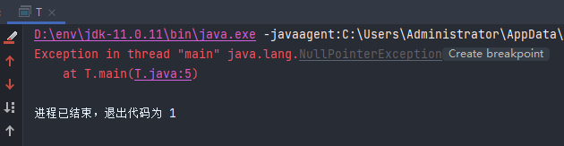
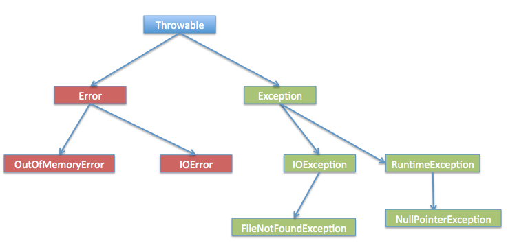
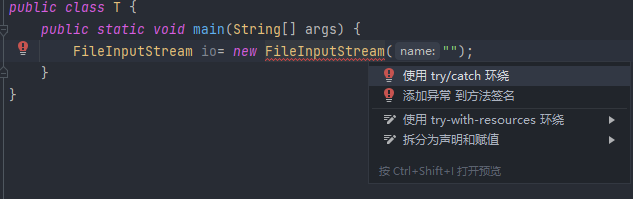

# 异常处理（java.lang基础包中）

- 概念作用

&ensp;&ensp;&ensp;&ensp;- 异常就是可预测但是又没办法消除的一种错误。

&ensp;&ensp;&ensp;&ensp;- 异常分为两类，一种是不可以处理的错误Error，另一种是可以处理的异常Exception

&ensp;&ensp;&ensp;&ensp;- 主要是为了程序的健壮性

&ensp;&ensp;&ensp;&ensp;- 异常分为两种

&ensp;&ensp;&ensp;&ensp;&ensp;&ensp;&ensp;&ensp;- 编译期

&ensp;&ensp;&ensp;&ensp;&ensp;&ensp;&ensp;&ensp;&ensp;&ensp;&ensp;&ensp;- 编译期出现的异常（写代码的时候就会出现，会提醒你，例如IDE爆红就是）

&ensp;&ensp;&ensp;&ensp;&ensp;&ensp;&ensp;&ensp;&ensp;&ensp;&ensp;&ensp;如下就是编译器异常


&ensp;&ensp;&ensp;&ensp;&ensp;&ensp;&ensp;&ensp;- 运行期

&ensp;&ensp;&ensp;&ensp;&ensp;&ensp;&ensp;&ensp;&ensp;&ensp;&ensp;&ensp;- 运行期出现的异常（程序运行的时候才会出现的异常）



- Throwable（异常超类 - 运行期异常）

&ensp;&ensp;&ensp;&ensp;- 概念

&ensp;&ensp;&ensp;&ensp;&ensp;&ensp;&ensp;&ensp;- 行时会抛出的异常分为两种：异常Exception、错误Error

&ensp;&ensp;&ensp;&ensp;&ensp;&ensp;&ensp;&ensp;- 图解

&ensp;&ensp;&ensp;&ensp;&ensp;&ensp;&ensp;&ensp;&ensp;&ensp;&ensp;&ensp;- 异常、错误都继承Throwable类，Throwable是超类



&ensp;&ensp;&ensp;&ensp;- 异常（Exception）

&ensp;&ensp;&ensp;&ensp;&ensp;&ensp;&ensp;&ensp;- 所有Exception类下，不属于`RuntimeException`子类的都是已检查异常（需要捕获或者抛出）。

&ensp;&ensp;&ensp;&ensp;&ensp;&ensp;&ensp;&ensp;- `RuntimeException`子类下的都是未检查异常，只有在程序运行时才会出现

&ensp;&ensp;&ensp;&ensp;&ensp;&ensp;&ensp;&ensp;- 已检查异常

&ensp;&ensp;&ensp;&ensp;&ensp;&ensp;&ensp;&ensp;&ensp;&ensp;&ensp;&ensp;- 已检查异常概念解释

&ensp;&ensp;&ensp;&ensp;&ensp;&ensp;&ensp;&ensp;&ensp;&ensp;&ensp;&ensp;&ensp;&ensp;&ensp;&ensp;> 就是编译器要求你必须处置的异常。不知道你编程的时候有没有遇到过，你写的某段代码，编译器要求你必须要对这段代码 try...catch，或者 throws exception，如果你遇见过，没错，这就是检查异常，也就是说，你代码还没运行呢，编译器就会检查你的代码，会不会出现异常，要求你对可能出现的异常必须做出相应的处理。[原文链接](https://blog.csdn.net/weixin_39613540/article/details/114258248)


&ensp;&ensp;&ensp;&ensp;&ensp;&ensp;&ensp;&ensp;&ensp;&ensp;&ensp;&ensp;&ensp;&ensp;&ensp;&ensp;就是IDE会提示捕获或者抛出的异常。



&ensp;&ensp;&ensp;&ensp;&ensp;&ensp;&ensp;&ensp;&ensp;&ensp;&ensp;&ensp;- 常见的已检查异常

&ensp;&ensp;&ensp;&ensp;&ensp;&ensp;&ensp;&ensp;&ensp;&ensp;&ensp;&ensp;&ensp;&ensp;&ensp;&ensp;- 解析异常：ParseException

```java
    public static void main(String[] args) throws ParseException {
        Date parse = new SimpleDateFormat("yyyy-MM-dd").parse("2021-a-a");
    }
```


&ensp;&ensp;&ensp;&ensp;&ensp;&ensp;&ensp;&ensp;&ensp;&ensp;&ensp;&ensp;&ensp;&ensp;&ensp;&ensp;- IO操作时：IOExcetipon

&ensp;&ensp;&ensp;&ensp;&ensp;&ensp;&ensp;&ensp;&ensp;&ensp;&ensp;&ensp;&ensp;&ensp;&ensp;&ensp;&ensp;&ensp;&ensp;&ensp;- IO异常IOExcetipon

```java
    public static void main(String[] args) throws IOException {
        new InputStreamReader(System.in).close();
    }
```


&ensp;&ensp;&ensp;&ensp;&ensp;&ensp;&ensp;&ensp;&ensp;&ensp;&ensp;&ensp;&ensp;&ensp;&ensp;&ensp;&ensp;&ensp;&ensp;&ensp;- 文件找不到异常FileNotFoundException

```java
    public static void main(String[] args) throws FileNotFoundException {
        new FileInputStream("");
    }
```


&ensp;&ensp;&ensp;&ensp;&ensp;&ensp;&ensp;&ensp;&ensp;&ensp;&ensp;&ensp;&ensp;&ensp;&ensp;&ensp;- 反射异常：ReflectiveOperationException

&ensp;&ensp;&ensp;&ensp;&ensp;&ensp;&ensp;&ensp;&ensp;&ensp;&ensp;&ensp;&ensp;&ensp;&ensp;&ensp;&ensp;&ensp;&ensp;&ensp;- 核心反射中反射操作抛出的常见超类异常。

&ensp;&ensp;&ensp;&ensp;&ensp;&ensp;&ensp;&ensp;&ensp;&ensp;&ensp;&ensp;&ensp;&ensp;&ensp;&ensp;&ensp;&ensp;&ensp;&ensp;- 类没找到：ClassNotFoundException

```Java
    public static void main(String[] args) throws ClassNotFoundException {
        Class<?> aClass = Class.forName("TestClass");
    }
```


&ensp;&ensp;&ensp;&ensp;&ensp;&ensp;&ensp;&ensp;&ensp;&ensp;&ensp;&ensp;&ensp;&ensp;&ensp;&ensp;&ensp;&ensp;&ensp;&ensp;- 方法没找到：NoSuchMethodException

```Java
    public static void main(String[] args) throws ClassNotFoundException, NoSuchMethodException {
        Class<?> aClass = Class.forName("TestClass");
        Method method = aClass.getMethod("test");
    }
```


&ensp;&ensp;&ensp;&ensp;&ensp;&ensp;&ensp;&ensp;&ensp;&ensp;&ensp;&ensp;&ensp;&ensp;&ensp;&ensp;&ensp;&ensp;&ensp;&ensp;- 字段没找到：NoSuchFieldException

```Java
    public static void main(String[] args) throws ClassNotFoundException, NoSuchMethodException, NoSuchFieldException {
        Class<?> aClass = Class.forName("TestClass");
        Method method = aClass.getMethod("test");
        Field test = aClass.getField("test");
    }
```


&ensp;&ensp;&ensp;&ensp;&ensp;&ensp;&ensp;&ensp;&ensp;&ensp;&ensp;&ensp;&ensp;&ensp;&ensp;&ensp;- JDBC中SQL语句异常：SQLException

&ensp;&ensp;&ensp;&ensp;&ensp;&ensp;&ensp;&ensp;&ensp;&ensp;&ensp;&ensp;&ensp;&ensp;&ensp;&ensp;&ensp;&ensp;&ensp;&ensp;JDBC操作会看到这个异常

```Java
    public static void main(String[] args) throws ClassNotFoundException, SQLException {
        String DRIVER = "", URL = "", USERNAME = "", PASSWORD = "";
        Class.forName(DRIVER);
        Connection c = DriverManager.getConnection(URL, USERNAME, PASSWORD);
    }
```


&ensp;&ensp;&ensp;&ensp;&ensp;&ensp;&ensp;&ensp;&ensp;&ensp;&ensp;&ensp;&ensp;&ensp;&ensp;&ensp;- 网络编程中网络超时异常：TimeoutException

&ensp;&ensp;&ensp;&ensp;&ensp;&ensp;&ensp;&ensp;&ensp;&ensp;&ensp;&ensp;&ensp;&ensp;&ensp;&ensp;&ensp;&ensp;&ensp;&ensp;tomcat启动失败的时候可能会遇到这个异常

&ensp;&ensp;&ensp;&ensp;&ensp;&ensp;&ensp;&ensp;- 未检查异常（就是运行时异常RuntimeException）

&ensp;&ensp;&ensp;&ensp;&ensp;&ensp;&ensp;&ensp;&ensp;&ensp;&ensp;&ensp;- 基本数据类型

&ensp;&ensp;&ensp;&ensp;&ensp;&ensp;&ensp;&ensp;&ensp;&ensp;&ensp;&ensp;&ensp;&ensp;&ensp;&ensp;- 算术异常：ArithmeticException

```Java
int i = 1 / 0;
```


&ensp;&ensp;&ensp;&ensp;&ensp;&ensp;&ensp;&ensp;&ensp;&ensp;&ensp;&ensp;- 数组

&ensp;&ensp;&ensp;&ensp;&ensp;&ensp;&ensp;&ensp;&ensp;&ensp;&ensp;&ensp;&ensp;&ensp;&ensp;&ensp;- 下标越界：IndexOutOfBoundsException

```Java
        int[] arr = new int[2];
        arr[-1] = 0;
```


&ensp;&ensp;&ensp;&ensp;&ensp;&ensp;&ensp;&ensp;&ensp;&ensp;&ensp;&ensp;&ensp;&ensp;&ensp;&ensp;&ensp;&ensp;&ensp;&ensp;- 存在子类，字符串下表越界：StringIndexOutOfBoundsException

```C#
        String s = "abc";
        s.substring(-1);
```


&ensp;&ensp;&ensp;&ensp;&ensp;&ensp;&ensp;&ensp;&ensp;&ensp;&ensp;&ensp;&ensp;&ensp;&ensp;&ensp;- 负数数组大小异常：NegativeArraySizeException

```Java
int[] arr = new int[-1];
```


&ensp;&ensp;&ensp;&ensp;&ensp;&ensp;&ensp;&ensp;&ensp;&ensp;&ensp;&ensp;&ensp;&ensp;&ensp;&ensp;- 数组存储类型不匹配：ArrayStoreException

```Java
        Object[] arr = new Integer[2];
        arr[0] = "str";
```


&ensp;&ensp;&ensp;&ensp;&ensp;&ensp;&ensp;&ensp;&ensp;&ensp;&ensp;&ensp;- 对象

&ensp;&ensp;&ensp;&ensp;&ensp;&ensp;&ensp;&ensp;&ensp;&ensp;&ensp;&ensp;&ensp;&ensp;&ensp;&ensp;- 方法

&ensp;&ensp;&ensp;&ensp;&ensp;&ensp;&ensp;&ensp;&ensp;&ensp;&ensp;&ensp;&ensp;&ensp;&ensp;&ensp;&ensp;&ensp;&ensp;&ensp;- 空指针：NullPointerException

```java
        String s = null;
        s.toString();
```


&ensp;&ensp;&ensp;&ensp;&ensp;&ensp;&ensp;&ensp;&ensp;&ensp;&ensp;&ensp;&ensp;&ensp;&ensp;&ensp;&ensp;&ensp;&ensp;&ensp;- 非法参数：IllegalArgumentException

```Java
new SimpleDateFormat("abc");

```


&ensp;&ensp;&ensp;&ensp;&ensp;&ensp;&ensp;&ensp;&ensp;&ensp;&ensp;&ensp;&ensp;&ensp;&ensp;&ensp;&ensp;&ensp;&ensp;&ensp;&ensp;&ensp;&ensp;&ensp;- 子类数字格式化异常：NumberFormatException

```Java
Integer num = new Integer("abc");
```


&ensp;&ensp;&ensp;&ensp;&ensp;&ensp;&ensp;&ensp;&ensp;&ensp;&ensp;&ensp;&ensp;&ensp;&ensp;&ensp;- 对象类型转换

&ensp;&ensp;&ensp;&ensp;&ensp;&ensp;&ensp;&ensp;&ensp;&ensp;&ensp;&ensp;&ensp;&ensp;&ensp;&ensp;&ensp;&ensp;&ensp;&ensp;- 类转换异常：ClassCastException

```java
        Object x = 1;
        String x1 = (String) x;
```


&ensp;&ensp;&ensp;&ensp;- 错误（Error）

&ensp;&ensp;&ensp;&ensp;&ensp;&ensp;&ensp;&ensp;- 一个`Error`是的子类`Throwable` ，表示严重的问题，合理的应用程序不应该试图捕获。

&ensp;&ensp;&ensp;&ensp;&ensp;&ensp;&ensp;&ensp;- 虚拟机错误：VirtualMachineError

&ensp;&ensp;&ensp;&ensp;&ensp;&ensp;&ensp;&ensp;&ensp;&ensp;&ensp;&ensp;- 抛出此异常表示Java虚拟机已损坏或已耗尽其继续运行所需的资源

&ensp;&ensp;&ensp;&ensp;&ensp;&ensp;&ensp;&ensp;&ensp;&ensp;&ensp;&ensp;- 栈溢出：StackOverflowError

&ensp;&ensp;&ensp;&ensp;&ensp;&ensp;&ensp;&ensp;&ensp;&ensp;&ensp;&ensp;&ensp;&ensp;&ensp;&ensp;- 在发生堆栈溢出时抛出，因为应用程序过于严重。

```Java
 public static void main(String[] args) {
        f();
    }

    static void f() {
        f();
    }
```


&ensp;&ensp;&ensp;&ensp;&ensp;&ensp;&ensp;&ensp;&ensp;&ensp;&ensp;&ensp;- 内存超出：OutOfMemoryError

&ensp;&ensp;&ensp;&ensp;&ensp;&ensp;&ensp;&ensp;&ensp;&ensp;&ensp;&ensp;&ensp;&ensp;&ensp;&ensp;- 当Java虚拟机由于内存不足而无法分配对象时抛出，垃圾收集器不再提供更多内存。

&ensp;&ensp;&ensp;&ensp;&ensp;&ensp;&ensp;&ensp;&ensp;&ensp;&ensp;&ensp;- 未知错误：UnknownError

&ensp;&ensp;&ensp;&ensp;&ensp;&ensp;&ensp;&ensp;&ensp;&ensp;&ensp;&ensp;&ensp;&ensp;&ensp;&ensp;- 在Java虚拟机中发生未知但严重的异常时抛出。

&ensp;&ensp;&ensp;&ensp;&ensp;&ensp;&ensp;&ensp;- IO错误：IOError（发生严重I / O错误时抛出。）

- 两种处理方式

&ensp;&ensp;&ensp;&ensp;- 捕获 try...catch...finally

&ensp;&ensp;&ensp;&ensp;- 抛出 throws 、throw

- 扩展：自定义异常

&ensp;&ensp;&ensp;&ensp;- 异常类也是类，集成Exception即可

- 参考

&ensp;&ensp;&ensp;&ensp;[Throwable](https://www.mklab.cn/api/jdk/8/cn)类

