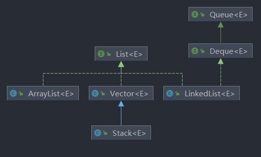
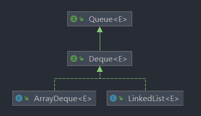
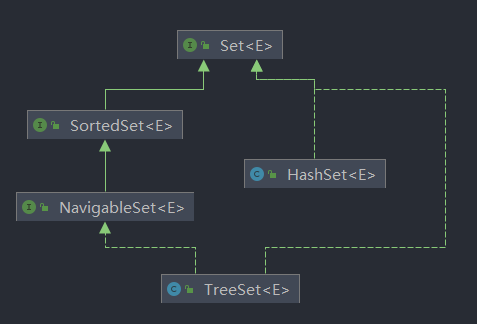
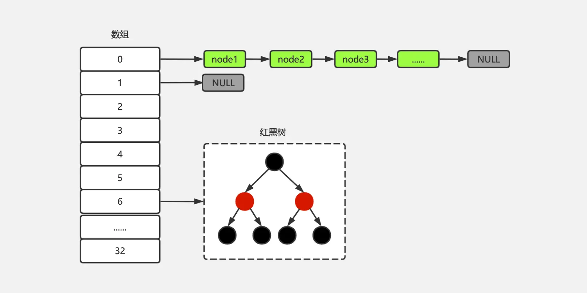
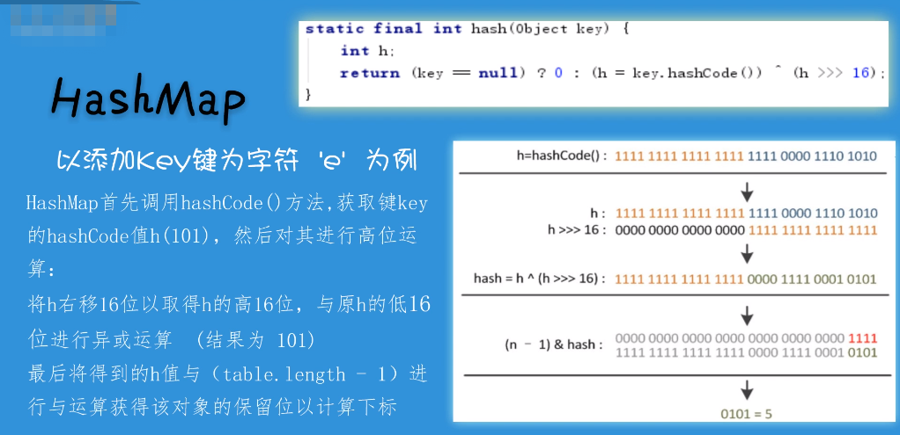
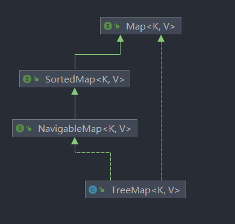

# 集合（java.util工具包）

- 数据结构

&ensp;&ensp;&ensp;&ensp;- 逻辑结构

&ensp;&ensp;&ensp;&ensp;&ensp;&ensp;&ensp;&ensp;- 集合

&ensp;&ensp;&ensp;&ensp;&ensp;&ensp;&ensp;&ensp;&ensp;&ensp;&ensp;&ensp;数据结构中的元素之间除了“同属一个集合” 的相互关系外，别无其他关系；

&ensp;&ensp;&ensp;&ensp;&ensp;&ensp;&ensp;&ensp;&ensp;&ensp;&ensp;&ensp;可能是同一个类型的

&ensp;&ensp;&ensp;&ensp;&ensp;&ensp;&ensp;&ensp;- 线性结构

&ensp;&ensp;&ensp;&ensp;&ensp;&ensp;&ensp;&ensp;&ensp;&ensp;&ensp;&ensp;数据结构中的元素存在一对一的相互关系；

&ensp;&ensp;&ensp;&ensp;&ensp;&ensp;&ensp;&ensp;- 树形结构

&ensp;&ensp;&ensp;&ensp;&ensp;&ensp;&ensp;&ensp;&ensp;&ensp;&ensp;&ensp;数据结构中的元素存在一对多的相互关系；

&ensp;&ensp;&ensp;&ensp;&ensp;&ensp;&ensp;&ensp;- 图形结构

&ensp;&ensp;&ensp;&ensp;&ensp;&ensp;&ensp;&ensp;&ensp;&ensp;&ensp;&ensp;数据结构中的元素存在多对多的相互关系。

&ensp;&ensp;&ensp;&ensp;- 常见的数据结构

&ensp;&ensp;&ensp;&ensp;&ensp;&ensp;&ensp;&ensp;- 数组（ArrayList）

&ensp;&ensp;&ensp;&ensp;&ensp;&ensp;&ensp;&ensp;- 链表（LinkedList）

&ensp;&ensp;&ensp;&ensp;&ensp;&ensp;&ensp;&ensp;- 栈(Stack)

&ensp;&ensp;&ensp;&ensp;&ensp;&ensp;&ensp;&ensp;- 队列(Queue)

&ensp;&ensp;&ensp;&ensp;&ensp;&ensp;&ensp;&ensp;- 树(Tree)

&ensp;&ensp;&ensp;&ensp;&ensp;&ensp;&ensp;&ensp;- 图(Graph)

&ensp;&ensp;&ensp;&ensp;&ensp;&ensp;&ensp;&ensp;- 堆(Heap)

&ensp;&ensp;&ensp;&ensp;&ensp;&ensp;&ensp;&ensp;- 散列表(Hash)

&ensp;&ensp;&ensp;&ensp;- 常用算法

&ensp;&ensp;&ensp;&ensp;&ensp;&ensp;&ensp;&ensp;- 插入

&ensp;&ensp;&ensp;&ensp;&ensp;&ensp;&ensp;&ensp;- 删除

&ensp;&ensp;&ensp;&ensp;&ensp;&ensp;&ensp;&ensp;- 更新

&ensp;&ensp;&ensp;&ensp;&ensp;&ensp;&ensp;&ensp;- 检索

&ensp;&ensp;&ensp;&ensp;&ensp;&ensp;&ensp;&ensp;&ensp;&ensp;&ensp;&ensp;- 顺序查找（遍历）

&ensp;&ensp;&ensp;&ensp;&ensp;&ensp;&ensp;&ensp;&ensp;&ensp;&ensp;&ensp;- 二分查找

&ensp;&ensp;&ensp;&ensp;&ensp;&ensp;&ensp;&ensp;&ensp;&ensp;&ensp;&ensp;- 哈希查找

&ensp;&ensp;&ensp;&ensp;&ensp;&ensp;&ensp;&ensp;- 排序

&ensp;&ensp;&ensp;&ensp;&ensp;&ensp;&ensp;&ensp;&ensp;&ensp;&ensp;&ensp;- 插入排序

&ensp;&ensp;&ensp;&ensp;&ensp;&ensp;&ensp;&ensp;&ensp;&ensp;&ensp;&ensp;- 冒泡排序

&ensp;&ensp;&ensp;&ensp;&ensp;&ensp;&ensp;&ensp;&ensp;&ensp;&ensp;&ensp;- 选择排序

&ensp;&ensp;&ensp;&ensp;&ensp;&ensp;&ensp;&ensp;&ensp;&ensp;&ensp;&ensp;- 希尔排序

&ensp;&ensp;&ensp;&ensp;&ensp;&ensp;&ensp;&ensp;&ensp;&ensp;&ensp;&ensp;- 快速排序

&ensp;&ensp;&ensp;&ensp;&ensp;&ensp;&ensp;&ensp;&ensp;&ensp;&ensp;&ensp;- 堆排序

&ensp;&ensp;&ensp;&ensp;&ensp;&ensp;&ensp;&ensp;&ensp;&ensp;&ensp;&ensp;- 归并排序

- 算法

&ensp;&ensp;&ensp;&ensp;- 算法判定标准

&ensp;&ensp;&ensp;&ensp;&ensp;&ensp;&ensp;&ensp;- 时间复杂度

&ensp;&ensp;&ensp;&ensp;&ensp;&ensp;&ensp;&ensp;- 空间复杂度

&ensp;&ensp;&ensp;&ensp;- 常见算法

&ensp;&ensp;&ensp;&ensp;&ensp;&ensp;&ensp;&ensp;- 递推法

&ensp;&ensp;&ensp;&ensp;&ensp;&ensp;&ensp;&ensp;- 递归法

&ensp;&ensp;&ensp;&ensp;&ensp;&ensp;&ensp;&ensp;- 穷举法（暴力破解）

&ensp;&ensp;&ensp;&ensp;&ensp;&ensp;&ensp;&ensp;- 贪心算法

&ensp;&ensp;&ensp;&ensp;&ensp;&ensp;&ensp;&ensp;- 分治算法

&ensp;&ensp;&ensp;&ensp;&ensp;&ensp;&ensp;&ensp;- 动态规划

&ensp;&ensp;&ensp;&ensp;&ensp;&ensp;&ensp;&ensp;&ensp;&ensp;&ensp;&ensp;[图解 | 你管这破玩意叫动态规划 (qq.com)](https://mp.weixin.qq.com/s/MgNGAWfKp9O0j4lwsx4qLA)

&ensp;&ensp;&ensp;&ensp;&ensp;&ensp;&ensp;&ensp;- 回溯法

- Java内置数据结构

&ensp;&ensp;&ensp;&ensp;- 什么是Java集合

&ensp;&ensp;&ensp;&ensp;&ensp;&ensp;&ensp;&ensp;- 就是一些Java内置实现的一些数据结构，可以直接使用

&ensp;&ensp;&ensp;&ensp;&ensp;&ensp;&ensp;&ensp;- 大部分的集合都实现了Collection接口

&ensp;&ensp;&ensp;&ensp;&ensp;&ensp;&ensp;&ensp;- 例如：ArrayList、LinkedList、HashSet都实现了Collection

&ensp;&ensp;&ensp;&ensp;&ensp;&ensp;&ensp;&ensp;- 思路

&ensp;&ensp;&ensp;&ensp;&ensp;&ensp;&ensp;&ensp;&ensp;&ensp;&ensp;&ensp;以接口为切入点，进行学习整理

&ensp;&ensp;&ensp;&ensp;&ensp;&ensp;&ensp;&ensp;&ensp;&ensp;&ensp;&ensp;以下内容按照接口的层级进行书写，搞定了接口，后面子类基本大同小异。

&ensp;&ensp;&ensp;&ensp;&ensp;&ensp;&ensp;&ensp;&ensp;&ensp;&ensp;&ensp;从接口开始看起，方便理清思路

&ensp;&ensp;&ensp;&ensp;- Collection<E>接口（集合）

&ensp;&ensp;&ensp;&ensp;&ensp;&ensp;&ensp;&ensp;-  解释

&ensp;&ensp;&ensp;&ensp;&ensp;&ensp;&ensp;&ensp;&ensp;&ensp;&ensp;&ensp;- 它是常见Java内置常见**集合类型** 数据结构的父接口（集合父接口）

&ensp;&ensp;&ensp;&ensp;&ensp;&ensp;&ensp;&ensp;&ensp;&ensp;&ensp;&ensp;- 对于Collection接口，它实现了Iterable迭代器接口，所以拥有了例如：foreach()、iterator()等迭代方法，拥有了foreach循环的能力。不过在这里仅仅只查看Collection接口下的数据结构，不查看迭代器相关的东西。

&ensp;&ensp;&ensp;&ensp;&ensp;&ensp;&ensp;&ensp;&ensp;&ensp;&ensp;&ensp;- 结构图


&ensp;&ensp;&ensp;&ensp;&ensp;&ensp;&ensp;&ensp;- Collection接口方法使用

&ensp;&ensp;&ensp;&ensp;&ensp;&ensp;&ensp;&ensp;&ensp;&ensp;&ensp;&ensp;- 思路

&ensp;&ensp;&ensp;&ensp;&ensp;&ensp;&ensp;&ensp;&ensp;&ensp;&ensp;&ensp;&ensp;&ensp;&ensp;&ensp;下面是ArrayList实现的Collection接口方法示例（主要展示Collection接口中的方法），其他方法暂时不展示，待后面按照接口层级看到子类时，基本上就已经把子类的方法全部学习完了。

&ensp;&ensp;&ensp;&ensp;&ensp;&ensp;&ensp;&ensp;&ensp;&ensp;&ensp;&ensp;&ensp;&ensp;&ensp;&ensp;这里使用ArrayList是因为这是最常见，也是最常用的一个List，建议看一下相关的源码，了解基本设计思路。

&ensp;&ensp;&ensp;&ensp;&ensp;&ensp;&ensp;&ensp;&ensp;&ensp;&ensp;&ensp;- 增加

&ensp;&ensp;&ensp;&ensp;&ensp;&ensp;&ensp;&ensp;&ensp;&ensp;&ensp;&ensp;&ensp;&ensp;&ensp;&ensp;- 都是add开头的方法

```java
        ArrayList<Integer> list = new ArrayList<>(8);
        // 添加元素1到末尾
        list.add(1);
        // 添加指定的集合（3，4）到末尾
        list.addAll(Arrays.asList(3, 4));
```


&ensp;&ensp;&ensp;&ensp;&ensp;&ensp;&ensp;&ensp;&ensp;&ensp;&ensp;&ensp;- 修改

&ensp;&ensp;&ensp;&ensp;&ensp;&ensp;&ensp;&ensp;&ensp;&ensp;&ensp;&ensp;&ensp;&ensp;&ensp;&ensp;- 该接口中修改方法没有，主要看子类的实现

&ensp;&ensp;&ensp;&ensp;&ensp;&ensp;&ensp;&ensp;&ensp;&ensp;&ensp;&ensp;- 删除

&ensp;&ensp;&ensp;&ensp;&ensp;&ensp;&ensp;&ensp;&ensp;&ensp;&ensp;&ensp;&ensp;&ensp;&ensp;&ensp;- remove开头的方法，clear清空

```java
        ArrayList<String> list = new ArrayList<>(8);
        list.addAll(Arrays.asList("a", "b", "c", "d", "e", "f"));
        // 删除指定下标位置的元素，并返回值元素值
        String remove = list.remove(5);
        // 删除第一个出现的指定元素
        list.remove("a");
        // 删除所有包含指定元素的值
        list.removeAll(Arrays.asList("a", "b"));
        // 删除指定元素，如果元素为"c"则删除
        list.removeIf(x -> x.equals("c"));
        // 删除列表中不包含的集合元素
        list.retainAll(Arrays.asList("d", "e"));
        // 删指所有
        list.clear();
        // 输出：[]
```


&ensp;&ensp;&ensp;&ensp;&ensp;&ensp;&ensp;&ensp;&ensp;&ensp;&ensp;&ensp;- 查询

&ensp;&ensp;&ensp;&ensp;&ensp;&ensp;&ensp;&ensp;&ensp;&ensp;&ensp;&ensp;&ensp;&ensp;&ensp;&ensp;- 主要是对列表的属性查询、元素查询、循环遍历

```java
        ArrayList<String> list = new ArrayList<>(8);
        list.addAll(Arrays.asList("a", "b", "c", "d", "e", "f"));
        // 查询列表是否为空
        boolean empty = list.isEmpty(); 
        // 查询列表大小（就是元素个数）
        int size = list.size();
        // 查询列表中是否存在某元素
        boolean a = list.contains("b");
        // 查询列表中是否存在指定集合中的所有元素
        boolean b = list.containsAll(Arrays.asList("a", "b"));
```


&ensp;&ensp;&ensp;&ensp;&ensp;&ensp;&ensp;&ensp;&ensp;&ensp;&ensp;&ensp;&ensp;&ensp;&ensp;&ensp;- 还有两个迭代器方法[iterator](https://www.mklab.cn/onlineapi/jdk_8_cn/java/util/Collection.html#iterator--)()（顺序遍历迭代器用于顺序遍历）和[spliterator](https://www.mklab.cn/onlineapi/jdk_8_cn/java/util/Collection.html#spliterator--)()（可分割迭代器用于并行拆分迭代），参考：[了解Java Spliterator 这篇文章就够了 (baidu.com)](https://baijiahao.baidu.com/s?id=1649268592254063537&wfr=spider&for=pc)

&ensp;&ensp;&ensp;&ensp;&ensp;&ensp;&ensp;&ensp;&ensp;&ensp;&ensp;&ensp;- 排序

&ensp;&ensp;&ensp;&ensp;&ensp;&ensp;&ensp;&ensp;&ensp;&ensp;&ensp;&ensp;&ensp;&ensp;&ensp;&ensp;- 需要注意的是Comparator这个接口，里面有一些默认实现的方法

```java
        ArrayList<String> list = new ArrayList<>(8);
        list.addAll(Arrays.asList("a", "b", "c", "d", "f", "e"));
        // 排序升序
        list.sort(Comparator.naturalOrder());
        // 排序降序
        list.sort(Comparator.reverseOrder());
```


&ensp;&ensp;&ensp;&ensp;&ensp;&ensp;&ensp;&ensp;- 常见子接口（List 、Queue、Set接口）

&ensp;&ensp;&ensp;&ensp;&ensp;&ensp;&ensp;&ensp;&ensp;&ensp;&ensp;&ensp;- List 接口（列表）

&ensp;&ensp;&ensp;&ensp;&ensp;&ensp;&ensp;&ensp;&ensp;&ensp;&ensp;&ensp;&ensp;&ensp;&ensp;&ensp;- 解释

&ensp;&ensp;&ensp;&ensp;&ensp;&ensp;&ensp;&ensp;&ensp;&ensp;&ensp;&ensp;&ensp;&ensp;&ensp;&ensp;&ensp;&ensp;&ensp;&ensp;> 有序集合（也称为序列 ）。 该界面的用户可以精确控制列表中每个元素的插入位置。 用户可以通过整数索引（列表中的位置）访问元素，并搜索列表中的元素。


&ensp;&ensp;&ensp;&ensp;&ensp;&ensp;&ensp;&ensp;&ensp;&ensp;&ensp;&ensp;&ensp;&ensp;&ensp;&ensp;&ensp;&ensp;&ensp;&ensp;- 简单来说就是：有序集合（也称为序列 ）

&ensp;&ensp;&ensp;&ensp;&ensp;&ensp;&ensp;&ensp;&ensp;&ensp;&ensp;&ensp;&ensp;&ensp;&ensp;&ensp;&ensp;&ensp;&ensp;&ensp;- 常见的实现类有：[ArrayList](https://www.mklab.cn/onlineapi/jdk_8_cn/java/util/ArrayList.html) ， [LinkedList](https://www.mklab.cn/onlineapi/jdk_8_cn/java/util/LinkedList.html) ， [Stack](https://www.mklab.cn/onlineapi/jdk_8_cn/java/util/Stack.html) ， [Vector](https://www.mklab.cn/onlineapi/jdk_8_cn/java/util/Vector.html)

&ensp;&ensp;&ensp;&ensp;&ensp;&ensp;&ensp;&ensp;&ensp;&ensp;&ensp;&ensp;&ensp;&ensp;&ensp;&ensp;&ensp;&ensp;&ensp;&ensp;- 结构图



&ensp;&ensp;&ensp;&ensp;&ensp;&ensp;&ensp;&ensp;&ensp;&ensp;&ensp;&ensp;&ensp;&ensp;&ensp;&ensp;- List接口常用方法

&ensp;&ensp;&ensp;&ensp;&ensp;&ensp;&ensp;&ensp;&ensp;&ensp;&ensp;&ensp;&ensp;&ensp;&ensp;&ensp;&ensp;&ensp;&ensp;&ensp;- 增加

&ensp;&ensp;&ensp;&ensp;&ensp;&ensp;&ensp;&ensp;&ensp;&ensp;&ensp;&ensp;&ensp;&ensp;&ensp;&ensp;&ensp;&ensp;&ensp;&ensp;&ensp;&ensp;&ensp;&ensp;- 都是add开头的方法

```java
        ArrayList<Integer> list = new ArrayList<>(8);
        // 添加元素1到末尾
        list.add(1);
        // 添加元素2到指定位置（list中元素的下标是从0开始的，因为底层是数组）
        list.add(1, 2);
        // 添加指定的集合（3，4）到末尾
        list.addAll(Arrays.asList(3, 4));
        // 添加指定的集合（3，4）到末尾
        list.addAll(4, Arrays.asList(5, 6));
        // 最终输出：[1, 2, 3, 5, 6, 4]
```


&ensp;&ensp;&ensp;&ensp;&ensp;&ensp;&ensp;&ensp;&ensp;&ensp;&ensp;&ensp;&ensp;&ensp;&ensp;&ensp;&ensp;&ensp;&ensp;&ensp;- 修改

&ensp;&ensp;&ensp;&ensp;&ensp;&ensp;&ensp;&ensp;&ensp;&ensp;&ensp;&ensp;&ensp;&ensp;&ensp;&ensp;&ensp;&ensp;&ensp;&ensp;&ensp;&ensp;&ensp;&ensp;- 主要是set和replace开头的方法，注意replaceAll传入的参数是lambda表达式

```java
        ArrayList<Integer> list = new ArrayList<>(8);
        list.addAll(Arrays.asList(1, 2, 3, 4, 5, 6));
        // 替换下标为0的元素值为100
        Integer set = list.set(0, 100);
        // 替换指定元素的值（如果元素值为2则替换成200，否则不替换
        list.replaceAll(x -> x == 2 ? 200 : x);
```


&ensp;&ensp;&ensp;&ensp;&ensp;&ensp;&ensp;&ensp;&ensp;&ensp;&ensp;&ensp;&ensp;&ensp;&ensp;&ensp;&ensp;&ensp;&ensp;&ensp;- 删除

&ensp;&ensp;&ensp;&ensp;&ensp;&ensp;&ensp;&ensp;&ensp;&ensp;&ensp;&ensp;&ensp;&ensp;&ensp;&ensp;&ensp;&ensp;&ensp;&ensp;&ensp;&ensp;&ensp;&ensp;- remove开头的方法，clear清空

```java
        ArrayList<String> list = new ArrayList<>(8);
        list.addAll(Arrays.asList("a", "b", "c", "d", "e", "f"));
        // 删除指定下标位置的元素，并返回值元素值
        String remove = list.remove(5);
        // 删除第一个出现的指定元素
        list.remove("a");
        // 删除所有包含指定元素的值
        list.removeAll(Arrays.asList("a", "b"));
        // 删除列表中不包含的集合元素
        list.retainAll(Arrays.asList("d", "e"));
        // 删指所有
        list.clear();
        // 输出：[]
```


&ensp;&ensp;&ensp;&ensp;&ensp;&ensp;&ensp;&ensp;&ensp;&ensp;&ensp;&ensp;&ensp;&ensp;&ensp;&ensp;&ensp;&ensp;&ensp;&ensp;- 查询

&ensp;&ensp;&ensp;&ensp;&ensp;&ensp;&ensp;&ensp;&ensp;&ensp;&ensp;&ensp;&ensp;&ensp;&ensp;&ensp;&ensp;&ensp;&ensp;&ensp;&ensp;&ensp;&ensp;&ensp;- 主要是对列表的属性查询、元素查询、循环遍历

```java
        ArrayList<String> list = new ArrayList<>(8);
        list.addAll(Arrays.asList("a", "b", "c", "d", "e", "f"));
        // 查询列表是否为空
        boolean empty = list.isEmpty();
        // 查询列表大小（就是元素个数）
        int size = list.size();
        // 查询列表中是否存在某元素
        boolean a = list.contains("b");
        // 查询列表中是否存在指定集合中的所有元素
        boolean b = list.containsAll(Arrays.asList("a", "b"));
        // 查询指定元素第一次出现的下标（从头开始
        int i1 = list.indexOf("b");
        // 查询指定元素第一次出现的下标（从尾部开始）
        int i2 = list.lastIndexOf("b");
        // 查询指定下标的元素）
        String s = list.get(0);
        // 查询指定下标的列表（0包含, 2不包含）
        List<String> strings = list.subList(0, 2);
        // foreach循环查询（lambda和方法引用）
        list.forEach(x -> System.out.print(x));
        list.forEach(System.out::print);
```


&ensp;&ensp;&ensp;&ensp;&ensp;&ensp;&ensp;&ensp;&ensp;&ensp;&ensp;&ensp;&ensp;&ensp;&ensp;&ensp;&ensp;&ensp;&ensp;&ensp;&ensp;&ensp;&ensp;&ensp;- 查询并转换（数据结构转换）

&ensp;&ensp;&ensp;&ensp;&ensp;&ensp;&ensp;&ensp;&ensp;&ensp;&ensp;&ensp;&ensp;&ensp;&ensp;&ensp;&ensp;&ensp;&ensp;&ensp;&ensp;&ensp;&ensp;&ensp;&ensp;&ensp;&ensp;&ensp;- 将列表转换成数组

```java
        LinkedList<String> list = new LinkedList<>(Arrays.asList("a", "b", "c", "d", "e", "f"));
        // 转换成对象数组
        Object[] objects = list.toArray();
        // 转换成字符串数组
        String[] strings = list.toArray(new String[]);
```


&ensp;&ensp;&ensp;&ensp;&ensp;&ensp;&ensp;&ensp;&ensp;&ensp;&ensp;&ensp;&ensp;&ensp;&ensp;&ensp;&ensp;&ensp;&ensp;&ensp;- 排序

&ensp;&ensp;&ensp;&ensp;&ensp;&ensp;&ensp;&ensp;&ensp;&ensp;&ensp;&ensp;&ensp;&ensp;&ensp;&ensp;&ensp;&ensp;&ensp;&ensp;&ensp;&ensp;&ensp;&ensp;- 需要注意的是Comparator这个接口，里面有一些默认实现的方法

```java
        ArrayList<String> list = new ArrayList<>(8);
        list.addAll(Arrays.asList("a", "b", "c", "d", "f", "e"));
        // 排序升序
        list.sort(Comparator.naturalOrder());
        // 排序降序
        list.sort(Comparator.reverseOrder());
```


&ensp;&ensp;&ensp;&ensp;&ensp;&ensp;&ensp;&ensp;&ensp;&ensp;&ensp;&ensp;&ensp;&ensp;&ensp;&ensp;- 常见实现子类

&ensp;&ensp;&ensp;&ensp;&ensp;&ensp;&ensp;&ensp;&ensp;&ensp;&ensp;&ensp;&ensp;&ensp;&ensp;&ensp;&ensp;&ensp;&ensp;&ensp;- [ArrayList类](https://www.mklab.cn/onlineapi/jdk_8_cn/java/util/ArrayList.html)

&ensp;&ensp;&ensp;&ensp;&ensp;&ensp;&ensp;&ensp;&ensp;&ensp;&ensp;&ensp;&ensp;&ensp;&ensp;&ensp;&ensp;&ensp;&ensp;&ensp;&ensp;&ensp;&ensp;&ensp;- 解释

&ensp;&ensp;&ensp;&ensp;&ensp;&ensp;&ensp;&ensp;&ensp;&ensp;&ensp;&ensp;&ensp;&ensp;&ensp;&ensp;&ensp;&ensp;&ensp;&ensp;&ensp;&ensp;&ensp;&ensp;&ensp;&ensp;&ensp;&ensp;> 可调整大小的数组的实现List接口。 实现所有可选列表操作，并允许所有元素，包括null 。 除了实现List 接口之外，该类还提供了一些方法来操纵内部使用的存储列表的数组的大小。 （这个类是大致相当于Vector，不同之处在于它是不同步的）。


&ensp;&ensp;&ensp;&ensp;&ensp;&ensp;&ensp;&ensp;&ensp;&ensp;&ensp;&ensp;&ensp;&ensp;&ensp;&ensp;&ensp;&ensp;&ensp;&ensp;&ensp;&ensp;&ensp;&ensp;&ensp;&ensp;&ensp;&ensp;- 简单理解：就是可变长度数组

&ensp;&ensp;&ensp;&ensp;&ensp;&ensp;&ensp;&ensp;&ensp;&ensp;&ensp;&ensp;&ensp;&ensp;&ensp;&ensp;&ensp;&ensp;&ensp;&ensp;&ensp;&ensp;&ensp;&ensp;&ensp;&ensp;&ensp;&ensp;- 特点：查询快（因为是一段存储空间，具有索引），增加修改删除慢（因为涉及到扩容，数组拷贝相关）

&ensp;&ensp;&ensp;&ensp;&ensp;&ensp;&ensp;&ensp;&ensp;&ensp;&ensp;&ensp;&ensp;&ensp;&ensp;&ensp;&ensp;&ensp;&ensp;&ensp;&ensp;&ensp;&ensp;&ensp;- 常用方法

&ensp;&ensp;&ensp;&ensp;&ensp;&ensp;&ensp;&ensp;&ensp;&ensp;&ensp;&ensp;&ensp;&ensp;&ensp;&ensp;&ensp;&ensp;&ensp;&ensp;&ensp;&ensp;&ensp;&ensp;&ensp;&ensp;&ensp;&ensp;- 思路

&ensp;&ensp;&ensp;&ensp;&ensp;&ensp;&ensp;&ensp;&ensp;&ensp;&ensp;&ensp;&ensp;&ensp;&ensp;&ensp;&ensp;&ensp;&ensp;&ensp;&ensp;&ensp;&ensp;&ensp;&ensp;&ensp;&ensp;&ensp;&ensp;&ensp;&ensp;&ensp;仅仅只展示该类出特有的一些方法，因为其他方法都是实现字接口，在接口中已有示例，这里就不在过多赘述。

&ensp;&ensp;&ensp;&ensp;&ensp;&ensp;&ensp;&ensp;&ensp;&ensp;&ensp;&ensp;&ensp;&ensp;&ensp;&ensp;&ensp;&ensp;&ensp;&ensp;&ensp;&ensp;&ensp;&ensp;&ensp;&ensp;&ensp;&ensp;- 增加

&ensp;&ensp;&ensp;&ensp;&ensp;&ensp;&ensp;&ensp;&ensp;&ensp;&ensp;&ensp;&ensp;&ensp;&ensp;&ensp;&ensp;&ensp;&ensp;&ensp;&ensp;&ensp;&ensp;&ensp;&ensp;&ensp;&ensp;&ensp;&ensp;&ensp;&ensp;&ensp;- 用的都是实现了父接口的方法，参考上面接口中的方法使用。例如：Collection、List接口

&ensp;&ensp;&ensp;&ensp;&ensp;&ensp;&ensp;&ensp;&ensp;&ensp;&ensp;&ensp;&ensp;&ensp;&ensp;&ensp;&ensp;&ensp;&ensp;&ensp;&ensp;&ensp;&ensp;&ensp;&ensp;&ensp;&ensp;&ensp;- 修改

```java
        ArrayList<Integer> list = new ArrayList<>(8);
        list.addAll(Arrays.asList(1, 2, 3, 4, 5, 6));
        // 修改列表容量为列表当前的大小
        list.trimToSize();
        // 修改列表的容量
        list.ensureCapacity(16);
```


&ensp;&ensp;&ensp;&ensp;&ensp;&ensp;&ensp;&ensp;&ensp;&ensp;&ensp;&ensp;&ensp;&ensp;&ensp;&ensp;&ensp;&ensp;&ensp;&ensp;&ensp;&ensp;&ensp;&ensp;&ensp;&ensp;&ensp;&ensp;- 删除

&ensp;&ensp;&ensp;&ensp;&ensp;&ensp;&ensp;&ensp;&ensp;&ensp;&ensp;&ensp;&ensp;&ensp;&ensp;&ensp;&ensp;&ensp;&ensp;&ensp;&ensp;&ensp;&ensp;&ensp;&ensp;&ensp;&ensp;&ensp;&ensp;&ensp;&ensp;&ensp;- remove开头的方法，clear清空

```java
        ArrayList<String> list = new ArrayList<>(8);
        list.addAll(Arrays.asList("a", "b", "c", "d", "e", "f"));
        // 删除指定元素，如果元素为"c"则删除
        list.removeIf(x -> x.equals("c"));
```


&ensp;&ensp;&ensp;&ensp;&ensp;&ensp;&ensp;&ensp;&ensp;&ensp;&ensp;&ensp;&ensp;&ensp;&ensp;&ensp;&ensp;&ensp;&ensp;&ensp;&ensp;&ensp;&ensp;&ensp;&ensp;&ensp;&ensp;&ensp;- 查询

&ensp;&ensp;&ensp;&ensp;&ensp;&ensp;&ensp;&ensp;&ensp;&ensp;&ensp;&ensp;&ensp;&ensp;&ensp;&ensp;&ensp;&ensp;&ensp;&ensp;&ensp;&ensp;&ensp;&ensp;&ensp;&ensp;&ensp;&ensp;&ensp;&ensp;&ensp;&ensp;- 同上，主要都是来自接口的方法实现

&ensp;&ensp;&ensp;&ensp;&ensp;&ensp;&ensp;&ensp;&ensp;&ensp;&ensp;&ensp;&ensp;&ensp;&ensp;&ensp;&ensp;&ensp;&ensp;&ensp;&ensp;&ensp;&ensp;&ensp;&ensp;&ensp;&ensp;&ensp;- 排序

&ensp;&ensp;&ensp;&ensp;&ensp;&ensp;&ensp;&ensp;&ensp;&ensp;&ensp;&ensp;&ensp;&ensp;&ensp;&ensp;&ensp;&ensp;&ensp;&ensp;&ensp;&ensp;&ensp;&ensp;&ensp;&ensp;&ensp;&ensp;&ensp;&ensp;&ensp;&ensp;- 同上，主要都是来自接口的方法实现

&ensp;&ensp;&ensp;&ensp;&ensp;&ensp;&ensp;&ensp;&ensp;&ensp;&ensp;&ensp;&ensp;&ensp;&ensp;&ensp;&ensp;&ensp;&ensp;&ensp;&ensp;&ensp;&ensp;&ensp;- 底层原理

&ensp;&ensp;&ensp;&ensp;&ensp;&ensp;&ensp;&ensp;&ensp;&ensp;&ensp;&ensp;&ensp;&ensp;&ensp;&ensp;&ensp;&ensp;&ensp;&ensp;&ensp;&ensp;&ensp;&ensp;&ensp;&ensp;&ensp;&ensp;- ArrayList是基于数组实现的，是一个动态数组，其容量能自动增长

&ensp;&ensp;&ensp;&ensp;&ensp;&ensp;&ensp;&ensp;&ensp;&ensp;&ensp;&ensp;&ensp;&ensp;&ensp;&ensp;&ensp;&ensp;&ensp;&ensp;&ensp;&ensp;&ensp;&ensp;&ensp;&ensp;&ensp;&ensp;- 扩容细节

&ensp;&ensp;&ensp;&ensp;&ensp;&ensp;&ensp;&ensp;&ensp;&ensp;&ensp;&ensp;&ensp;&ensp;&ensp;&ensp;&ensp;&ensp;&ensp;&ensp;&ensp;&ensp;&ensp;&ensp;&ensp;&ensp;&ensp;&ensp;&ensp;&ensp;&ensp;&ensp;- 创建列表

&ensp;&ensp;&ensp;&ensp;&ensp;&ensp;&ensp;&ensp;&ensp;&ensp;&ensp;&ensp;&ensp;&ensp;&ensp;&ensp;&ensp;&ensp;&ensp;&ensp;&ensp;&ensp;&ensp;&ensp;&ensp;&ensp;&ensp;&ensp;&ensp;&ensp;&ensp;&ensp;&ensp;&ensp;&ensp;&ensp;创建ArratList的时候如果不传入容量initialCapacity值，则会使用默认容量为10的DEFAULT_CAPACITY值，进行创建一个类型为Object的数组elementData。

```java
// 默认容量为10
private static final int DEFAULT_CAPACITY = 10;

```


&ensp;&ensp;&ensp;&ensp;&ensp;&ensp;&ensp;&ensp;&ensp;&ensp;&ensp;&ensp;&ensp;&ensp;&ensp;&ensp;&ensp;&ensp;&ensp;&ensp;&ensp;&ensp;&ensp;&ensp;&ensp;&ensp;&ensp;&ensp;&ensp;&ensp;&ensp;&ensp;- 增加元素与扩容机制

&ensp;&ensp;&ensp;&ensp;&ensp;&ensp;&ensp;&ensp;&ensp;&ensp;&ensp;&ensp;&ensp;&ensp;&ensp;&ensp;&ensp;&ensp;&ensp;&ensp;&ensp;&ensp;&ensp;&ensp;&ensp;&ensp;&ensp;&ensp;&ensp;&ensp;&ensp;&ensp;&ensp;&ensp;&ensp;&ensp;增加元素时会先判断容量是否足够，如果容量不够了，则会进行小于等于1.5倍的扩容（其实也不一定是1.5倍正好，因为是>>位移操作，所以有可能会有1的误差，例如：5>>2就等于2），然后再拷贝到扩容后的新数组中。

&ensp;&ensp;&ensp;&ensp;&ensp;&ensp;&ensp;&ensp;&ensp;&ensp;&ensp;&ensp;&ensp;&ensp;&ensp;&ensp;&ensp;&ensp;&ensp;&ensp;&ensp;&ensp;&ensp;&ensp;&ensp;&ensp;&ensp;&ensp;&ensp;&ensp;&ensp;&ensp;- 关键代码

&ensp;&ensp;&ensp;&ensp;&ensp;&ensp;&ensp;&ensp;&ensp;&ensp;&ensp;&ensp;&ensp;&ensp;&ensp;&ensp;&ensp;&ensp;&ensp;&ensp;&ensp;&ensp;&ensp;&ensp;&ensp;&ensp;&ensp;&ensp;&ensp;&ensp;&ensp;&ensp;&ensp;&ensp;&ensp;&ensp;- 创建元素

```java
    public ArrayList(Collection<? extends E> c) {
        elementData = c.toArray();
        if ((size = elementData.length) != 0) {
            // c.toArray might (incorrectly) not return Object[] (see 6260652)
            if (elementData.getClass() != Object[].class)
                elementData = Arrays.copyOf(elementData, size, Object[].class);
        } else {
            // replace with empty array.
            this.elementData = EMPTY_ELEMENTDATA;
        }
    }
```


&ensp;&ensp;&ensp;&ensp;&ensp;&ensp;&ensp;&ensp;&ensp;&ensp;&ensp;&ensp;&ensp;&ensp;&ensp;&ensp;&ensp;&ensp;&ensp;&ensp;&ensp;&ensp;&ensp;&ensp;&ensp;&ensp;&ensp;&ensp;&ensp;&ensp;&ensp;&ensp;&ensp;&ensp;&ensp;&ensp;- 添加元素与扩容机制

&ensp;&ensp;&ensp;&ensp;&ensp;&ensp;&ensp;&ensp;&ensp;&ensp;&ensp;&ensp;&ensp;&ensp;&ensp;&ensp;&ensp;&ensp;&ensp;&ensp;&ensp;&ensp;&ensp;&ensp;&ensp;&ensp;&ensp;&ensp;&ensp;&ensp;&ensp;&ensp;&ensp;&ensp;&ensp;&ensp;

```java
    public boolean add(E e) {
        ensureCapacityInternal(size + 1);  // Increments modCount!!
        elementData[size++] = e;
        return true;
    }
```


```java
    private void ensureCapacityInternal(int minCapacity) {
        ensureExplicitCapacity(calculateCapacity(elementData, minCapacity));
    }
```


```java
    private void ensureExplicitCapacity(int minCapacity) {
        modCount++;

        // overflow-conscious code
        if (minCapacity - elementData.length > 0)
            grow(minCapacity);
    }
```


&ensp;&ensp;&ensp;&ensp;&ensp;&ensp;&ensp;&ensp;&ensp;&ensp;&ensp;&ensp;&ensp;&ensp;&ensp;&ensp;&ensp;&ensp;&ensp;&ensp;&ensp;&ensp;&ensp;&ensp;&ensp;&ensp;&ensp;&ensp;&ensp;&ensp;&ensp;&ensp;&ensp;&ensp;&ensp;&ensp;- 容量：int newCapacity = oldCapacity + (oldCapacity >> 1);

```java
    private void grow(int minCapacity) {
        // overflow-conscious code
        int oldCapacity = elementData.length;
        int newCapacity = oldCapacity + (oldCapacity >> 1);
        if (newCapacity - minCapacity < 0)
            newCapacity = minCapacity;
        if (newCapacity - MAX_ARRAY_SIZE > 0)
            newCapacity = hugeCapacity(minCapacity);
        // minCapacity is usually close to size, so this is a win:
        elementData = Arrays.copyOf(elementData, newCapacity);
    }
```


&ensp;&ensp;&ensp;&ensp;&ensp;&ensp;&ensp;&ensp;&ensp;&ensp;&ensp;&ensp;&ensp;&ensp;&ensp;&ensp;&ensp;&ensp;&ensp;&ensp;&ensp;&ensp;&ensp;&ensp;&ensp;&ensp;&ensp;&ensp;- ArrayList不是线程安全的，只能用在单线程环境下。线程安全请使用JUC包下的CopyOnWriteArrayList类（并发的时候去了解一下）

&ensp;&ensp;&ensp;&ensp;&ensp;&ensp;&ensp;&ensp;&ensp;&ensp;&ensp;&ensp;&ensp;&ensp;&ensp;&ensp;&ensp;&ensp;&ensp;&ensp;- Vector类（遗留类）

&ensp;&ensp;&ensp;&ensp;&ensp;&ensp;&ensp;&ensp;&ensp;&ensp;&ensp;&ensp;&ensp;&ensp;&ensp;&ensp;&ensp;&ensp;&ensp;&ensp;&ensp;&ensp;&ensp;&ensp;- 废弃的原因

&ensp;&ensp;&ensp;&ensp;&ensp;&ensp;&ensp;&ensp;&ensp;&ensp;&ensp;&ensp;&ensp;&ensp;&ensp;&ensp;&ensp;&ensp;&ensp;&ensp;&ensp;&ensp;&ensp;&ensp;&ensp;&ensp;&ensp;&ensp;Vector是遗留类（和HashTable一样，不建议使用），这类集合库大量使用了 synchronized 来保证线程安全。但是在单线程环境下会有不必要的加锁操作，从而导致性能下降。然而“[偏向锁](https://zhuanlan.zhihu.com/p/365454004)”可以保证即便是使用了这些老的库，也不会产生很大的性能下降，因为 JVM 知道访问临界区的线程始终是同一个，也就避免了加锁操作。

&ensp;&ensp;&ensp;&ensp;&ensp;&ensp;&ensp;&ensp;&ensp;&ensp;&ensp;&ensp;&ensp;&ensp;&ensp;&ensp;&ensp;&ensp;&ensp;&ensp;&ensp;&ensp;&ensp;&ensp;&ensp;&ensp;&ensp;&ensp;但是，随着时代的发展，新的Java类（比如ArrayList、HashMap）都使用了无锁集合库，这些集合库比老的集合库性能要更好。

&ensp;&ensp;&ensp;&ensp;&ensp;&ensp;&ensp;&ensp;&ensp;&ensp;&ensp;&ensp;&ensp;&ensp;&ensp;&ensp;&ensp;&ensp;&ensp;&ensp;&ensp;&ensp;&ensp;&ensp;&ensp;&ensp;&ensp;&ensp;即便是多线程环境下，Java 也提供了 ConcurrentHashMap、CopyOnWriteArrayList 等性能更好的线程安全的集合库。

&ensp;&ensp;&ensp;&ensp;&ensp;&ensp;&ensp;&ensp;&ensp;&ensp;&ensp;&ensp;&ensp;&ensp;&ensp;&ensp;&ensp;&ensp;&ensp;&ensp;&ensp;&ensp;&ensp;&ensp;&ensp;&ensp;&ensp;&ensp;所以：

&ensp;&ensp;&ensp;&ensp;&ensp;&ensp;&ensp;&ensp;&ensp;&ensp;&ensp;&ensp;&ensp;&ensp;&ensp;&ensp;&ensp;&ensp;&ensp;&ensp;&ensp;&ensp;&ensp;&ensp;&ensp;&ensp;&ensp;&ensp;1. 对于使用了Java提供的新的JUC并发库来说，使用**偏向锁** 的收益不是那么明显了。

&ensp;&ensp;&ensp;&ensp;&ensp;&ensp;&ensp;&ensp;&ensp;&ensp;&ensp;&ensp;&ensp;&ensp;&ensp;&ensp;&ensp;&ensp;&ensp;&ensp;&ensp;&ensp;&ensp;&ensp;&ensp;&ensp;&ensp;&ensp;2. 当前多线程越来越普遍的情况下，偏向锁带来的锁升级操作反而会影响应用的性能

&ensp;&ensp;&ensp;&ensp;&ensp;&ensp;&ensp;&ensp;&ensp;&ensp;&ensp;&ensp;&ensp;&ensp;&ensp;&ensp;&ensp;&ensp;&ensp;&ensp;&ensp;&ensp;&ensp;&ensp;- 参考

&ensp;&ensp;&ensp;&ensp;&ensp;&ensp;&ensp;&ensp;&ensp;&ensp;&ensp;&ensp;&ensp;&ensp;&ensp;&ensp;&ensp;&ensp;&ensp;&ensp;&ensp;&ensp;&ensp;&ensp;&ensp;&ensp;&ensp;&ensp;- **偏向锁** 是从 JDK1.6 引入的一种针对 **synchronized**  的锁优化技术，然而从 JDK 15 开始，这一特性被官方标记为废弃状态。

&ensp;&ensp;&ensp;&ensp;&ensp;&ensp;&ensp;&ensp;&ensp;&ensp;&ensp;&ensp;&ensp;&ensp;&ensp;&ensp;&ensp;&ensp;&ensp;&ensp;&ensp;&ensp;&ensp;&ensp;&ensp;&ensp;&ensp;&ensp;[你知道 Java 的偏向锁要被废弃掉了吗？ - 知乎 (zhihu.com)](https://zhuanlan.zhihu.com/p/365454004)

&ensp;&ensp;&ensp;&ensp;&ensp;&ensp;&ensp;&ensp;&ensp;&ensp;&ensp;&ensp;&ensp;&ensp;&ensp;&ensp;&ensp;&ensp;&ensp;&ensp;&ensp;&ensp;&ensp;&ensp;- 子类

&ensp;&ensp;&ensp;&ensp;&ensp;&ensp;&ensp;&ensp;&ensp;&ensp;&ensp;&ensp;&ensp;&ensp;&ensp;&ensp;&ensp;&ensp;&ensp;&ensp;&ensp;&ensp;&ensp;&ensp;&ensp;&ensp;&ensp;&ensp;- Stack（栈）

&ensp;&ensp;&ensp;&ensp;&ensp;&ensp;&ensp;&ensp;&ensp;&ensp;&ensp;&ensp;&ensp;&ensp;&ensp;&ensp;&ensp;&ensp;&ensp;&ensp;&ensp;&ensp;&ensp;&ensp;&ensp;&ensp;&ensp;&ensp;&ensp;&ensp;&ensp;&ensp;对于Vector的子类，因为上述Vector的原因，所以Stack也废弃了，如果需要使用栈，可以尝试使用`Deque`接口下的`ArrayDeque`类

&ensp;&ensp;&ensp;&ensp;&ensp;&ensp;&ensp;&ensp;&ensp;&ensp;&ensp;&ensp;- Queue接口（队列）

&ensp;&ensp;&ensp;&ensp;&ensp;&ensp;&ensp;&ensp;&ensp;&ensp;&ensp;&ensp;&ensp;&ensp;&ensp;&ensp;- 解释

&ensp;&ensp;&ensp;&ensp;&ensp;&ensp;&ensp;&ensp;&ensp;&ensp;&ensp;&ensp;&ensp;&ensp;&ensp;&ensp;&ensp;&ensp;&ensp;&ensp;- 队列数据结构

&ensp;&ensp;&ensp;&ensp;&ensp;&ensp;&ensp;&ensp;&ensp;&ensp;&ensp;&ensp;&ensp;&ensp;&ensp;&ensp;&ensp;&ensp;&ensp;&ensp;- 继承Collection接口

&ensp;&ensp;&ensp;&ensp;&ensp;&ensp;&ensp;&ensp;&ensp;&ensp;&ensp;&ensp;&ensp;&ensp;&ensp;&ensp;&ensp;&ensp;&ensp;&ensp;- 结构图



&ensp;&ensp;&ensp;&ensp;&ensp;&ensp;&ensp;&ensp;&ensp;&ensp;&ensp;&ensp;&ensp;&ensp;&ensp;&ensp;- Queue接口常用方法

&ensp;&ensp;&ensp;&ensp;&ensp;&ensp;&ensp;&ensp;&ensp;&ensp;&ensp;&ensp;&ensp;&ensp;&ensp;&ensp;&ensp;&ensp;&ensp;&ensp;- 下面以LinkedList为例子，继承来的某些方法就不再过多展示。

&ensp;&ensp;&ensp;&ensp;&ensp;&ensp;&ensp;&ensp;&ensp;&ensp;&ensp;&ensp;&ensp;&ensp;&ensp;&ensp;&ensp;&ensp;&ensp;&ensp;- 增加

```java
        LinkedList<String> list = new LinkedList<>();
        // 添加一个元素到队列
        list.add("a");
        // 添加一个元素到队列（作用同上）
        list.offer("b");
```


&ensp;&ensp;&ensp;&ensp;&ensp;&ensp;&ensp;&ensp;&ensp;&ensp;&ensp;&ensp;&ensp;&ensp;&ensp;&ensp;&ensp;&ensp;&ensp;&ensp;- 修改

&ensp;&ensp;&ensp;&ensp;&ensp;&ensp;&ensp;&ensp;&ensp;&ensp;&ensp;&ensp;&ensp;&ensp;&ensp;&ensp;&ensp;&ensp;&ensp;&ensp;&ensp;&ensp;&ensp;&ensp;- 接口中没有提供修改方法，但是在[Collection](https://www.mklab.cn/onlineapi/jdk_8_cn/java/util/Collection.html)接口中有提供相关的修改方法。例如：retainAll()

&ensp;&ensp;&ensp;&ensp;&ensp;&ensp;&ensp;&ensp;&ensp;&ensp;&ensp;&ensp;&ensp;&ensp;&ensp;&ensp;&ensp;&ensp;&ensp;&ensp;- 删除

```java
        LinkedList<String> list = new LinkedList<>(Arrays.asList("a", "b", "c"));
        // 删除（投出）队列中第一个元素，并且返回当前元素
        String poll = list.poll();
        // 删除队列中第一个元素，并且返回当前元素（同上）
        String remove = list.remove();
```


&ensp;&ensp;&ensp;&ensp;&ensp;&ensp;&ensp;&ensp;&ensp;&ensp;&ensp;&ensp;&ensp;&ensp;&ensp;&ensp;&ensp;&ensp;&ensp;&ensp;- 查询

```Java
        LinkedList<String> list = new LinkedList<>(Arrays.asList("a", "b", "c"));
        // 查询队列中第一个元素
        String element = list.element();
        // 查询（瞅一眼）队列中第一个元素
        String peek = list.peek();
```


&ensp;&ensp;&ensp;&ensp;&ensp;&ensp;&ensp;&ensp;&ensp;&ensp;&ensp;&ensp;&ensp;&ensp;&ensp;&ensp;- 常见子接口（Deque接口）

&ensp;&ensp;&ensp;&ensp;&ensp;&ensp;&ensp;&ensp;&ensp;&ensp;&ensp;&ensp;&ensp;&ensp;&ensp;&ensp;&ensp;&ensp;&ensp;&ensp;- Deque接口（双端队列）

&ensp;&ensp;&ensp;&ensp;&ensp;&ensp;&ensp;&ensp;&ensp;&ensp;&ensp;&ensp;&ensp;&ensp;&ensp;&ensp;&ensp;&ensp;&ensp;&ensp;&ensp;&ensp;&ensp;&ensp;- 解释

&ensp;&ensp;&ensp;&ensp;&ensp;&ensp;&ensp;&ensp;&ensp;&ensp;&ensp;&ensp;&ensp;&ensp;&ensp;&ensp;&ensp;&ensp;&ensp;&ensp;&ensp;&ensp;&ensp;&ensp;&ensp;&ensp;&ensp;&ensp;> 支持两端元素插入和移除的线性集合。 名称deque是“双端队列”的缩写


&ensp;&ensp;&ensp;&ensp;&ensp;&ensp;&ensp;&ensp;&ensp;&ensp;&ensp;&ensp;&ensp;&ensp;&ensp;&ensp;&ensp;&ensp;&ensp;&ensp;&ensp;&ensp;&ensp;&ensp;&ensp;&ensp;&ensp;&ensp;- 双端队列数据结构，实现的常见子类有：[ArrayDeque](https://www.mklab.cn/onlineapi/jdk_8_cn/java/util/ArrayDeque.html)、 [LinkedList](https://www.mklab.cn/onlineapi/jdk_8_cn/java/util/LinkedList.html)、 [ConcurrentLinkedDeque](https://www.mklab.cn/onlineapi/jdk_8_cn/java/util/concurrent/ConcurrentLinkedDeque.html)

&ensp;&ensp;&ensp;&ensp;&ensp;&ensp;&ensp;&ensp;&ensp;&ensp;&ensp;&ensp;&ensp;&ensp;&ensp;&ensp;&ensp;&ensp;&ensp;&ensp;&ensp;&ensp;&ensp;&ensp;&ensp;&ensp;&ensp;&ensp;- 如果不想使用LinkedList，可以尝试使用ArrayDeque类

&ensp;&ensp;&ensp;&ensp;&ensp;&ensp;&ensp;&ensp;&ensp;&ensp;&ensp;&ensp;&ensp;&ensp;&ensp;&ensp;&ensp;&ensp;&ensp;&ensp;&ensp;&ensp;&ensp;&ensp;- Deque接口方法使用

&ensp;&ensp;&ensp;&ensp;&ensp;&ensp;&ensp;&ensp;&ensp;&ensp;&ensp;&ensp;&ensp;&ensp;&ensp;&ensp;&ensp;&ensp;&ensp;&ensp;&ensp;&ensp;&ensp;&ensp;&ensp;&ensp;&ensp;&ensp;- 下面以LinkedList为例子，继承来的某些方法就不再过多展示

&ensp;&ensp;&ensp;&ensp;&ensp;&ensp;&ensp;&ensp;&ensp;&ensp;&ensp;&ensp;&ensp;&ensp;&ensp;&ensp;&ensp;&ensp;&ensp;&ensp;&ensp;&ensp;&ensp;&ensp;&ensp;&ensp;&ensp;&ensp;- 增加

&ensp;&ensp;&ensp;&ensp;&ensp;&ensp;&ensp;&ensp;&ensp;&ensp;&ensp;&ensp;&ensp;&ensp;&ensp;&ensp;&ensp;&ensp;&ensp;&ensp;&ensp;&ensp;&ensp;&ensp;&ensp;&ensp;&ensp;&ensp;&ensp;&ensp;&ensp;&ensp;- 因为是双端队列，所以支持头部或者尾部进行插入，同时有好几个类似的方法，但是这几个方法在插入返回时有一些细微的差别

```java
        LinkedList<String> list = new LinkedList<>();
        // 头部插入
        list.addFirst("a");
        // 头部插入（头部推送进去）
        list.push("a1");
        // 头部插入（提供到头部）
        list.offerFirst("a2");
        // 尾部插入
        list.addLast("b");
        // 尾部插入（提供到尾部）
        list.offer("b1");
        // 尾部插入（提供到尾部，同上）
        list.offerLast("b3");
```


&ensp;&ensp;&ensp;&ensp;&ensp;&ensp;&ensp;&ensp;&ensp;&ensp;&ensp;&ensp;&ensp;&ensp;&ensp;&ensp;&ensp;&ensp;&ensp;&ensp;&ensp;&ensp;&ensp;&ensp;&ensp;&ensp;&ensp;&ensp;- 修改

&ensp;&ensp;&ensp;&ensp;&ensp;&ensp;&ensp;&ensp;&ensp;&ensp;&ensp;&ensp;&ensp;&ensp;&ensp;&ensp;&ensp;&ensp;&ensp;&ensp;&ensp;&ensp;&ensp;&ensp;&ensp;&ensp;&ensp;&ensp;&ensp;&ensp;&ensp;&ensp;- 接口中没有提供修改方法，但是在[Collection](https://www.mklab.cn/onlineapi/jdk_8_cn/java/util/Collection.html)接口中有提供相关的修改方法。例如：retainAll()

&ensp;&ensp;&ensp;&ensp;&ensp;&ensp;&ensp;&ensp;&ensp;&ensp;&ensp;&ensp;&ensp;&ensp;&ensp;&ensp;&ensp;&ensp;&ensp;&ensp;&ensp;&ensp;&ensp;&ensp;&ensp;&ensp;&ensp;&ensp;- 删除

```java
        LinkedList<String> list = new LinkedList<>(Arrays.asList("a", "b", "c", "d", "e", "f"));
        // 删除第一个元素并返回
        String remove = list.remove();
        String removeFirst = list.removeFirst();
        String poll = list.poll();
        String pollFirst = list.pollFirst();
        // 删除第一个元素（弹出顶部元素）
        String pop = list.pop();
        
        // 删除最后一个元素并返回
        String removeLast = list.removeLast();
        // 删除最后一个元素并返回（同上）
        String pollLast = list.pollLast();

        // 删除指定元素（第一个出现的指定元素）
        boolean a = list.remove("a");
        boolean b = list.removeFirstOccurrence("a");
        // 删除指定元素（最后一次出现的指定元素）
        boolean c = list.removeLastOccurrence("a");
```


&ensp;&ensp;&ensp;&ensp;&ensp;&ensp;&ensp;&ensp;&ensp;&ensp;&ensp;&ensp;&ensp;&ensp;&ensp;&ensp;&ensp;&ensp;&ensp;&ensp;&ensp;&ensp;&ensp;&ensp;&ensp;&ensp;&ensp;&ensp;- 查询

```Java
         LinkedList<String> list = new LinkedList<>(Arrays.asList("a", "b", "c", "d", "e", "f"));
        // 查询第一个元素
        String element = list.element();
        String getFirst = list.getFirst();
        String peek = list.peek();
        String peekFirst = list.peekFirst();

        // 查询最后一个元素
        String getLast = list.getLast();
        String peekLast = list.peekLast();
                
        // 查询是否包含指定元素
        boolean a = list.contains("a");

```


&ensp;&ensp;&ensp;&ensp;&ensp;&ensp;&ensp;&ensp;&ensp;&ensp;&ensp;&ensp;&ensp;&ensp;&ensp;&ensp;&ensp;&ensp;&ensp;&ensp;&ensp;&ensp;&ensp;&ensp;- 常见实现子类

&ensp;&ensp;&ensp;&ensp;&ensp;&ensp;&ensp;&ensp;&ensp;&ensp;&ensp;&ensp;&ensp;&ensp;&ensp;&ensp;&ensp;&ensp;&ensp;&ensp;&ensp;&ensp;&ensp;&ensp;&ensp;&ensp;&ensp;&ensp;- LinkedList

&ensp;&ensp;&ensp;&ensp;&ensp;&ensp;&ensp;&ensp;&ensp;&ensp;&ensp;&ensp;&ensp;&ensp;&ensp;&ensp;&ensp;&ensp;&ensp;&ensp;&ensp;&ensp;&ensp;&ensp;&ensp;&ensp;&ensp;&ensp;&ensp;&ensp;&ensp;&ensp;- 解释

&ensp;&ensp;&ensp;&ensp;&ensp;&ensp;&ensp;&ensp;&ensp;&ensp;&ensp;&ensp;&ensp;&ensp;&ensp;&ensp;&ensp;&ensp;&ensp;&ensp;&ensp;&ensp;&ensp;&ensp;&ensp;&ensp;&ensp;&ensp;&ensp;&ensp;&ensp;&ensp;&ensp;&ensp;&ensp;&ensp;> 双链表实现了`List`和`Deque`接口。所有的操作都能像双向列表一样预期。 索引到列表中的操作将从开始或结束遍历列表，以更接近指定的索引为准。


&ensp;&ensp;&ensp;&ensp;&ensp;&ensp;&ensp;&ensp;&ensp;&ensp;&ensp;&ensp;&ensp;&ensp;&ensp;&ensp;&ensp;&ensp;&ensp;&ensp;&ensp;&ensp;&ensp;&ensp;&ensp;&ensp;&ensp;&ensp;&ensp;&ensp;&ensp;&ensp;&ensp;&ensp;&ensp;&ensp;- 链表数据结构，不过由于实现了Queue、Deque接口，它也可以被当成队列、双端队列（也可以使用ArrayDeque）、栈来使用。

&ensp;&ensp;&ensp;&ensp;&ensp;&ensp;&ensp;&ensp;&ensp;&ensp;&ensp;&ensp;&ensp;&ensp;&ensp;&ensp;&ensp;&ensp;&ensp;&ensp;&ensp;&ensp;&ensp;&ensp;&ensp;&ensp;&ensp;&ensp;&ensp;&ensp;&ensp;&ensp;&ensp;&ensp;&ensp;&ensp;- 特点：增加修改删除快（只需要操作前、中、后三个节点即可），查询慢（因为没有索引，需要遍历一遍链表才能找到对应的数据）

&ensp;&ensp;&ensp;&ensp;&ensp;&ensp;&ensp;&ensp;&ensp;&ensp;&ensp;&ensp;&ensp;&ensp;&ensp;&ensp;&ensp;&ensp;&ensp;&ensp;&ensp;&ensp;&ensp;&ensp;&ensp;&ensp;&ensp;&ensp;&ensp;&ensp;&ensp;&ensp;&ensp;&ensp;&ensp;&ensp;- 图

&ensp;&ensp;&ensp;&ensp;&ensp;&ensp;&ensp;&ensp;&ensp;&ensp;&ensp;&ensp;&ensp;&ensp;&ensp;&ensp;&ensp;&ensp;&ensp;&ensp;&ensp;&ensp;&ensp;&ensp;&ensp;&ensp;&ensp;&ensp;&ensp;&ensp;&ensp;&ensp;&ensp;&ensp;&ensp;&ensp;&ensp;&ensp;&ensp;&ensp;- 链表长这样


&ensp;&ensp;&ensp;&ensp;&ensp;&ensp;&ensp;&ensp;&ensp;&ensp;&ensp;&ensp;&ensp;&ensp;&ensp;&ensp;&ensp;&ensp;&ensp;&ensp;&ensp;&ensp;&ensp;&ensp;&ensp;&ensp;&ensp;&ensp;&ensp;&ensp;&ensp;&ensp;- 使用

&ensp;&ensp;&ensp;&ensp;&ensp;&ensp;&ensp;&ensp;&ensp;&ensp;&ensp;&ensp;&ensp;&ensp;&ensp;&ensp;&ensp;&ensp;&ensp;&ensp;&ensp;&ensp;&ensp;&ensp;&ensp;&ensp;&ensp;&ensp;&ensp;&ensp;&ensp;&ensp;&ensp;&ensp;&ensp;&ensp;- 由于实现了Collection接口中的方法，并且在上面Collection、Queue、Deque接口已经有了示例，所以在这里就不再重复进行使用展示了

&ensp;&ensp;&ensp;&ensp;&ensp;&ensp;&ensp;&ensp;&ensp;&ensp;&ensp;&ensp;&ensp;&ensp;&ensp;&ensp;&ensp;&ensp;&ensp;&ensp;&ensp;&ensp;&ensp;&ensp;&ensp;&ensp;&ensp;&ensp;&ensp;&ensp;&ensp;&ensp;- 底层原理

&ensp;&ensp;&ensp;&ensp;&ensp;&ensp;&ensp;&ensp;&ensp;&ensp;&ensp;&ensp;&ensp;&ensp;&ensp;&ensp;&ensp;&ensp;&ensp;&ensp;&ensp;&ensp;&ensp;&ensp;&ensp;&ensp;&ensp;&ensp;&ensp;&ensp;&ensp;&ensp;&ensp;&ensp;&ensp;&ensp;- LinkedList类中有如下几个属性（用于标注第一个和最后一个元素）

```java
    // 元素个数
    transient int size = 0;
    // 第一个元素
    transient Node<E> first;
    // 最后一个元素
    transient Node<E> last;
```


&ensp;&ensp;&ensp;&ensp;&ensp;&ensp;&ensp;&ensp;&ensp;&ensp;&ensp;&ensp;&ensp;&ensp;&ensp;&ensp;&ensp;&ensp;&ensp;&ensp;&ensp;&ensp;&ensp;&ensp;&ensp;&ensp;&ensp;&ensp;&ensp;&ensp;&ensp;&ensp;&ensp;&ensp;&ensp;&ensp;- 内部类Node节点（每一个节点都是有前节点、后节点，说明这是一个双端链表，而不是一个单链表）

```java
    private static class Node<E> {
        // 当前节点
        E item;
        // 下一个节点
        Node<E> next;
        // 后节点
        Node<E> prev;

        Node(Node<E> prev, E element, Node<E> next) {
            this.item = element;
            this.next = next;
            this.prev = prev;
        }
    }
```


&ensp;&ensp;&ensp;&ensp;&ensp;&ensp;&ensp;&ensp;&ensp;&ensp;&ensp;&ensp;&ensp;&ensp;&ensp;&ensp;&ensp;&ensp;&ensp;&ensp;&ensp;&ensp;&ensp;&ensp;&ensp;&ensp;&ensp;&ensp;- ArrayDeque

&ensp;&ensp;&ensp;&ensp;&ensp;&ensp;&ensp;&ensp;&ensp;&ensp;&ensp;&ensp;&ensp;&ensp;&ensp;&ensp;&ensp;&ensp;&ensp;&ensp;&ensp;&ensp;&ensp;&ensp;&ensp;&ensp;&ensp;&ensp;&ensp;&ensp;&ensp;&ensp;- 解释

&ensp;&ensp;&ensp;&ensp;&ensp;&ensp;&ensp;&ensp;&ensp;&ensp;&ensp;&ensp;&ensp;&ensp;&ensp;&ensp;&ensp;&ensp;&ensp;&ensp;&ensp;&ensp;&ensp;&ensp;&ensp;&ensp;&ensp;&ensp;&ensp;&ensp;&ensp;&ensp;&ensp;&ensp;&ensp;&ensp;- 线程不安全

&ensp;&ensp;&ensp;&ensp;&ensp;&ensp;&ensp;&ensp;&ensp;&ensp;&ensp;&ensp;&ensp;&ensp;&ensp;&ensp;&ensp;&ensp;&ensp;&ensp;&ensp;&ensp;&ensp;&ensp;&ensp;&ensp;&ensp;&ensp;&ensp;&ensp;&ensp;&ensp;&ensp;&ensp;&ensp;&ensp;- 是Deque的实现类，可以当作双端队列，也可以当成栈来使用，效率比废弃的Stack要高。

&ensp;&ensp;&ensp;&ensp;&ensp;&ensp;&ensp;&ensp;&ensp;&ensp;&ensp;&ensp;&ensp;&ensp;&ensp;&ensp;&ensp;&ensp;&ensp;&ensp;&ensp;&ensp;&ensp;&ensp;&ensp;&ensp;&ensp;&ensp;&ensp;&ensp;&ensp;&ensp;&ensp;&ensp;&ensp;&ensp;- 需要注意ArrayDeque是不支持的null值的，如果为null则会抛出空指针异常NPE（源码中有nulll判断）。

&ensp;&ensp;&ensp;&ensp;&ensp;&ensp;&ensp;&ensp;&ensp;&ensp;&ensp;&ensp;&ensp;&ensp;&ensp;&ensp;&ensp;&ensp;&ensp;&ensp;&ensp;&ensp;&ensp;&ensp;&ensp;&ensp;&ensp;&ensp;&ensp;&ensp;&ensp;&ensp;- 使用

&ensp;&ensp;&ensp;&ensp;&ensp;&ensp;&ensp;&ensp;&ensp;&ensp;&ensp;&ensp;&ensp;&ensp;&ensp;&ensp;&ensp;&ensp;&ensp;&ensp;&ensp;&ensp;&ensp;&ensp;&ensp;&ensp;&ensp;&ensp;&ensp;&ensp;&ensp;&ensp;&ensp;&ensp;&ensp;&ensp;由于是实现了相关的接口，所以主要看上面接口的常用方法即可。

&ensp;&ensp;&ensp;&ensp;&ensp;&ensp;&ensp;&ensp;&ensp;&ensp;&ensp;&ensp;- Set 接口（集合）

&ensp;&ensp;&ensp;&ensp;&ensp;&ensp;&ensp;&ensp;&ensp;&ensp;&ensp;&ensp;&ensp;&ensp;&ensp;&ensp;- 解释

&ensp;&ensp;&ensp;&ensp;&ensp;&ensp;&ensp;&ensp;&ensp;&ensp;&ensp;&ensp;&ensp;&ensp;&ensp;&ensp;&ensp;&ensp;&ensp;&ensp;- 不包含重复元素的集合。

&ensp;&ensp;&ensp;&ensp;&ensp;&ensp;&ensp;&ensp;&ensp;&ensp;&ensp;&ensp;&ensp;&ensp;&ensp;&ensp;&ensp;&ensp;&ensp;&ensp;- 结构图



&ensp;&ensp;&ensp;&ensp;&ensp;&ensp;&ensp;&ensp;&ensp;&ensp;&ensp;&ensp;&ensp;&ensp;&ensp;&ensp;- Set 接口常用方法

&ensp;&ensp;&ensp;&ensp;&ensp;&ensp;&ensp;&ensp;&ensp;&ensp;&ensp;&ensp;&ensp;&ensp;&ensp;&ensp;&ensp;&ensp;&ensp;&ensp;- 大部分方法都是实现的Collection接口，主要还是看实现子类。

&ensp;&ensp;&ensp;&ensp;&ensp;&ensp;&ensp;&ensp;&ensp;&ensp;&ensp;&ensp;&ensp;&ensp;&ensp;&ensp;- 常见实现子类（HashSet）

&ensp;&ensp;&ensp;&ensp;&ensp;&ensp;&ensp;&ensp;&ensp;&ensp;&ensp;&ensp;&ensp;&ensp;&ensp;&ensp;&ensp;&ensp;&ensp;&ensp;- HashSet

&ensp;&ensp;&ensp;&ensp;&ensp;&ensp;&ensp;&ensp;&ensp;&ensp;&ensp;&ensp;&ensp;&ensp;&ensp;&ensp;&ensp;&ensp;&ensp;&ensp;&ensp;&ensp;&ensp;&ensp;- 解释

&ensp;&ensp;&ensp;&ensp;&ensp;&ensp;&ensp;&ensp;&ensp;&ensp;&ensp;&ensp;&ensp;&ensp;&ensp;&ensp;&ensp;&ensp;&ensp;&ensp;&ensp;&ensp;&ensp;&ensp;&ensp;&ensp;&ensp;&ensp;> 此类实现Set接口，由哈希表（实际为HashMap实例）支持。 


&ensp;&ensp;&ensp;&ensp;&ensp;&ensp;&ensp;&ensp;&ensp;&ensp;&ensp;&ensp;&ensp;&ensp;&ensp;&ensp;&ensp;&ensp;&ensp;&ensp;&ensp;&ensp;&ensp;&ensp;&ensp;&ensp;&ensp;&ensp;- 线程不安全、允许null元素

&ensp;&ensp;&ensp;&ensp;&ensp;&ensp;&ensp;&ensp;&ensp;&ensp;&ensp;&ensp;&ensp;&ensp;&ensp;&ensp;&ensp;&ensp;&ensp;&ensp;&ensp;&ensp;&ensp;&ensp;- 常用方法

&ensp;&ensp;&ensp;&ensp;&ensp;&ensp;&ensp;&ensp;&ensp;&ensp;&ensp;&ensp;&ensp;&ensp;&ensp;&ensp;&ensp;&ensp;&ensp;&ensp;&ensp;&ensp;&ensp;&ensp;&ensp;&ensp;&ensp;&ensp;- 常用方法都来源于接口实现

&ensp;&ensp;&ensp;&ensp;&ensp;&ensp;&ensp;&ensp;&ensp;&ensp;&ensp;&ensp;&ensp;&ensp;&ensp;&ensp;&ensp;&ensp;&ensp;&ensp;&ensp;&ensp;&ensp;&ensp;- 底层原理

&ensp;&ensp;&ensp;&ensp;&ensp;&ensp;&ensp;&ensp;&ensp;&ensp;&ensp;&ensp;&ensp;&ensp;&ensp;&ensp;&ensp;&ensp;&ensp;&ensp;&ensp;&ensp;&ensp;&ensp;&ensp;&ensp;&ensp;&ensp;- 在创建时底层实际上创建的还是HashMap

```java
    public HashSet() {
        map = new HashMap<>();
    }
```


&ensp;&ensp;&ensp;&ensp;&ensp;&ensp;&ensp;&ensp;&ensp;&ensp;&ensp;&ensp;&ensp;&ensp;&ensp;&ensp;&ensp;&ensp;&ensp;&ensp;&ensp;&ensp;&ensp;&ensp;&ensp;&ensp;&ensp;&ensp;- 调用的相关方法也还是HashMap的相关方法

```java
    public boolean add(E e) {
        return map.put(e, PRESENT)==null;
    }
```


&ensp;&ensp;&ensp;&ensp;&ensp;&ensp;&ensp;&ensp;&ensp;&ensp;&ensp;&ensp;&ensp;&ensp;&ensp;&ensp;- 常见子接口（SortedSet接口）

&ensp;&ensp;&ensp;&ensp;&ensp;&ensp;&ensp;&ensp;&ensp;&ensp;&ensp;&ensp;&ensp;&ensp;&ensp;&ensp;&ensp;&ensp;&ensp;&ensp;- SortedSet接口

&ensp;&ensp;&ensp;&ensp;&ensp;&ensp;&ensp;&ensp;&ensp;&ensp;&ensp;&ensp;&ensp;&ensp;&ensp;&ensp;&ensp;&ensp;&ensp;&ensp;&ensp;&ensp;&ensp;&ensp;- 解释

&ensp;&ensp;&ensp;&ensp;&ensp;&ensp;&ensp;&ensp;&ensp;&ensp;&ensp;&ensp;&ensp;&ensp;&ensp;&ensp;&ensp;&ensp;&ensp;&ensp;&ensp;&ensp;&ensp;&ensp;&ensp;&ensp;&ensp;&ensp;> [Set](https://www.mklab.cn/onlineapi/jdk_8_cn/java/util/Set.html)进一步提供其元素的*总排序* ，元素使用他们的[natural ordering](https://www.mklab.cn/onlineapi/jdk_8_cn/java/lang/Comparable.html)或通常在排序集创建时提供的[Comparator](https://www.mklab.cn/onlineapi/jdk_8_cn/java/util/Comparator.html)进行排序。 集合的迭代器将以递增的元素顺序遍历集合。


&ensp;&ensp;&ensp;&ensp;&ensp;&ensp;&ensp;&ensp;&ensp;&ensp;&ensp;&ensp;&ensp;&ensp;&ensp;&ensp;&ensp;&ensp;&ensp;&ensp;&ensp;&ensp;&ensp;&ensp;&ensp;&ensp;&ensp;&ensp;- 用于排序

&ensp;&ensp;&ensp;&ensp;&ensp;&ensp;&ensp;&ensp;&ensp;&ensp;&ensp;&ensp;&ensp;&ensp;&ensp;&ensp;&ensp;&ensp;&ensp;&ensp;&ensp;&ensp;&ensp;&ensp;- SortedSet子接口方法使用

&ensp;&ensp;&ensp;&ensp;&ensp;&ensp;&ensp;&ensp;&ensp;&ensp;&ensp;&ensp;&ensp;&ensp;&ensp;&ensp;&ensp;&ensp;&ensp;&ensp;&ensp;&ensp;&ensp;&ensp;&ensp;&ensp;&ensp;&ensp;- 思路

&ensp;&ensp;&ensp;&ensp;&ensp;&ensp;&ensp;&ensp;&ensp;&ensp;&ensp;&ensp;&ensp;&ensp;&ensp;&ensp;&ensp;&ensp;&ensp;&ensp;&ensp;&ensp;&ensp;&ensp;&ensp;&ensp;&ensp;&ensp;&ensp;&ensp;&ensp;&ensp;以下示例代码使用TreeSet类进行示例

&ensp;&ensp;&ensp;&ensp;&ensp;&ensp;&ensp;&ensp;&ensp;&ensp;&ensp;&ensp;&ensp;&ensp;&ensp;&ensp;&ensp;&ensp;&ensp;&ensp;&ensp;&ensp;&ensp;&ensp;&ensp;&ensp;&ensp;&ensp;&ensp;&ensp;&ensp;&ensp;

&ensp;&ensp;&ensp;&ensp;&ensp;&ensp;&ensp;&ensp;&ensp;&ensp;&ensp;&ensp;&ensp;&ensp;&ensp;&ensp;&ensp;&ensp;&ensp;&ensp;&ensp;&ensp;&ensp;&ensp;&ensp;&ensp;&ensp;&ensp;- 增删改

&ensp;&ensp;&ensp;&ensp;&ensp;&ensp;&ensp;&ensp;&ensp;&ensp;&ensp;&ensp;&ensp;&ensp;&ensp;&ensp;&ensp;&ensp;&ensp;&ensp;&ensp;&ensp;&ensp;&ensp;&ensp;&ensp;&ensp;&ensp;&ensp;&ensp;&ensp;&ensp;- 增删改参考父类接口方法

&ensp;&ensp;&ensp;&ensp;&ensp;&ensp;&ensp;&ensp;&ensp;&ensp;&ensp;&ensp;&ensp;&ensp;&ensp;&ensp;&ensp;&ensp;&ensp;&ensp;&ensp;&ensp;&ensp;&ensp;&ensp;&ensp;&ensp;&ensp;- 查询

```Java
        TreeSet<String> set = new TreeSet<>(Arrays.asList("b", "a", "d", "c", "f", "e"));
        // 查询第一个元素
        String first = set.first();
        // 查询最后一个元素
        String last = set.last();
        // 查询小于指定元素的集合（d不包含）
        SortedSet<String> set1 = set.headSet("d");
        // 查询指定元素区间的集合[b包含, d不包含）
        SortedSet<String> set2 = set.subSet("b", "d");
        // 查询大于指定元素的集合（d包含）
        SortedSet<String> set3 = set.tailSet("d");
```


&ensp;&ensp;&ensp;&ensp;&ensp;&ensp;&ensp;&ensp;&ensp;&ensp;&ensp;&ensp;&ensp;&ensp;&ensp;&ensp;&ensp;&ensp;&ensp;&ensp;&ensp;&ensp;&ensp;&ensp;- 常见子接口（NavigableSet）

&ensp;&ensp;&ensp;&ensp;&ensp;&ensp;&ensp;&ensp;&ensp;&ensp;&ensp;&ensp;&ensp;&ensp;&ensp;&ensp;&ensp;&ensp;&ensp;&ensp;&ensp;&ensp;&ensp;&ensp;&ensp;&ensp;&ensp;&ensp;- NavigableSet接口

&ensp;&ensp;&ensp;&ensp;&ensp;&ensp;&ensp;&ensp;&ensp;&ensp;&ensp;&ensp;&ensp;&ensp;&ensp;&ensp;&ensp;&ensp;&ensp;&ensp;&ensp;&ensp;&ensp;&ensp;&ensp;&ensp;&ensp;&ensp;&ensp;&ensp;&ensp;&ensp;- 解释

&ensp;&ensp;&ensp;&ensp;&ensp;&ensp;&ensp;&ensp;&ensp;&ensp;&ensp;&ensp;&ensp;&ensp;&ensp;&ensp;&ensp;&ensp;&ensp;&ensp;&ensp;&ensp;&ensp;&ensp;&ensp;&ensp;&ensp;&ensp;&ensp;&ensp;&ensp;&ensp;&ensp;&ensp;&ensp;&ensp;> [SortedSet](https://www.mklab.cn/onlineapi/jdk_8_cn/java/util/SortedSet.html)扩展了导航方法，报告给定搜索目标的最匹配的匹配。 方法`lower` ， `floor` ， `ceiling`和`higher`返回元件分别大于给定的元素小于，小于或等于，大于或等于，大于，如果不存在返回`null`。`NavigableSet`可以按升序或降序进行访问和遍历。


&ensp;&ensp;&ensp;&ensp;&ensp;&ensp;&ensp;&ensp;&ensp;&ensp;&ensp;&ensp;&ensp;&ensp;&ensp;&ensp;&ensp;&ensp;&ensp;&ensp;&ensp;&ensp;&ensp;&ensp;&ensp;&ensp;&ensp;&ensp;&ensp;&ensp;&ensp;&ensp;- SortedSet子接口方法使用

&ensp;&ensp;&ensp;&ensp;&ensp;&ensp;&ensp;&ensp;&ensp;&ensp;&ensp;&ensp;&ensp;&ensp;&ensp;&ensp;&ensp;&ensp;&ensp;&ensp;&ensp;&ensp;&ensp;&ensp;&ensp;&ensp;&ensp;&ensp;&ensp;&ensp;&ensp;&ensp;&ensp;&ensp;&ensp;&ensp;- 增加修改则是参考父类接口。

&ensp;&ensp;&ensp;&ensp;&ensp;&ensp;&ensp;&ensp;&ensp;&ensp;&ensp;&ensp;&ensp;&ensp;&ensp;&ensp;&ensp;&ensp;&ensp;&ensp;&ensp;&ensp;&ensp;&ensp;&ensp;&ensp;&ensp;&ensp;&ensp;&ensp;&ensp;&ensp;&ensp;&ensp;&ensp;&ensp;- 删除

```Java
TreeSet<String> set = new TreeSet<>(Arrays.asList("b", "a", "d", "c", "f", "e"));  
// 删除第一个元素  
String pollFirst = set.pollFirst();  
// 删除最后一个元素  
String pollLast = set.pollLast();
```


&ensp;&ensp;&ensp;&ensp;&ensp;&ensp;&ensp;&ensp;&ensp;&ensp;&ensp;&ensp;&ensp;&ensp;&ensp;&ensp;&ensp;&ensp;&ensp;&ensp;&ensp;&ensp;&ensp;&ensp;&ensp;&ensp;&ensp;&ensp;&ensp;&ensp;&ensp;&ensp;&ensp;&ensp;&ensp;&ensp;- 查询

```Java
TreeSet<String> set = new TreeSet<>(Arrays.asList("b", "a", "d", "c", "f", "e"));  
// 查询元素条件是指定元素：小于lower，小于或等于floor，大于或等于ceiling，大于higher  
String a = set.lower("a");  
String a1 = set.floor("a");  
String a2 = set.ceiling("a");  
String a3 = set.higher("a");  
// 查询小于或等于的集合（inclusive为true时包含等于，false时不包含）  
NavigableSet<String> set1 = set.headSet("d", true);  
// 查询指定元素区间的集合[b包含, d不包含）（inclusive为true时包含等于，false时不包含）  
NavigableSet<String> set2 = set.subSet("b", true, "d", true);  
// 查询大于指定元素的集合（inclusive为true时包含等于，false时不包含）  
NavigableSet<String> set3 = set.tailSet("d", true);
```


&ensp;&ensp;&ensp;&ensp;&ensp;&ensp;&ensp;&ensp;&ensp;&ensp;&ensp;&ensp;&ensp;&ensp;&ensp;&ensp;&ensp;&ensp;&ensp;&ensp;&ensp;&ensp;&ensp;&ensp;&ensp;&ensp;&ensp;&ensp;&ensp;&ensp;&ensp;&ensp;- 常见实现子类（TreeSet）

&ensp;&ensp;&ensp;&ensp;&ensp;&ensp;&ensp;&ensp;&ensp;&ensp;&ensp;&ensp;&ensp;&ensp;&ensp;&ensp;&ensp;&ensp;&ensp;&ensp;&ensp;&ensp;&ensp;&ensp;&ensp;&ensp;&ensp;&ensp;&ensp;&ensp;&ensp;&ensp;&ensp;&ensp;&ensp;&ensp;- TreeSet

&ensp;&ensp;&ensp;&ensp;&ensp;&ensp;&ensp;&ensp;&ensp;&ensp;&ensp;&ensp;&ensp;&ensp;&ensp;&ensp;&ensp;&ensp;&ensp;&ensp;&ensp;&ensp;&ensp;&ensp;&ensp;&ensp;&ensp;&ensp;&ensp;&ensp;&ensp;&ensp;&ensp;&ensp;&ensp;&ensp;&ensp;&ensp;&ensp;&ensp;- 解释

&ensp;&ensp;&ensp;&ensp;&ensp;&ensp;&ensp;&ensp;&ensp;&ensp;&ensp;&ensp;&ensp;&ensp;&ensp;&ensp;&ensp;&ensp;&ensp;&ensp;&ensp;&ensp;&ensp;&ensp;&ensp;&ensp;&ensp;&ensp;&ensp;&ensp;&ensp;&ensp;&ensp;&ensp;&ensp;&ensp;&ensp;&ensp;&ensp;&ensp;&ensp;&ensp;&ensp;&ensp;> 实现基于[TreeMap](https://www.mklab.cn/onlineapi/jdk_8_cn/java/util/TreeMap.html) 。


&ensp;&ensp;&ensp;&ensp;&ensp;&ensp;&ensp;&ensp;&ensp;&ensp;&ensp;&ensp;&ensp;&ensp;&ensp;&ensp;&ensp;&ensp;&ensp;&ensp;&ensp;&ensp;&ensp;&ensp;&ensp;&ensp;&ensp;&ensp;&ensp;&ensp;&ensp;&ensp;&ensp;&ensp;&ensp;&ensp;&ensp;&ensp;&ensp;&ensp;&ensp;&ensp;&ensp;&ensp;- 线程不安全

&ensp;&ensp;&ensp;&ensp;&ensp;&ensp;&ensp;&ensp;&ensp;&ensp;&ensp;&ensp;&ensp;&ensp;&ensp;&ensp;&ensp;&ensp;&ensp;&ensp;&ensp;&ensp;&ensp;&ensp;&ensp;&ensp;&ensp;&ensp;&ensp;&ensp;&ensp;&ensp;&ensp;&ensp;&ensp;&ensp;&ensp;&ensp;&ensp;&ensp;- 常用方法

&ensp;&ensp;&ensp;&ensp;&ensp;&ensp;&ensp;&ensp;&ensp;&ensp;&ensp;&ensp;&ensp;&ensp;&ensp;&ensp;&ensp;&ensp;&ensp;&ensp;&ensp;&ensp;&ensp;&ensp;&ensp;&ensp;&ensp;&ensp;&ensp;&ensp;&ensp;&ensp;&ensp;&ensp;&ensp;&ensp;&ensp;&ensp;&ensp;&ensp;&ensp;&ensp;&ensp;&ensp;- 都是实现自父类的方法

&ensp;&ensp;&ensp;&ensp;&ensp;&ensp;&ensp;&ensp;&ensp;&ensp;&ensp;&ensp;&ensp;&ensp;&ensp;&ensp;&ensp;&ensp;&ensp;&ensp;&ensp;&ensp;&ensp;&ensp;&ensp;&ensp;&ensp;&ensp;&ensp;&ensp;&ensp;&ensp;&ensp;&ensp;&ensp;&ensp;&ensp;&ensp;&ensp;&ensp;- 底层原理

&ensp;&ensp;&ensp;&ensp;&ensp;&ensp;&ensp;&ensp;&ensp;&ensp;&ensp;&ensp;&ensp;&ensp;&ensp;&ensp;&ensp;&ensp;&ensp;&ensp;&ensp;&ensp;&ensp;&ensp;&ensp;&ensp;&ensp;&ensp;&ensp;&ensp;&ensp;&ensp;&ensp;&ensp;&ensp;&ensp;&ensp;&ensp;&ensp;&ensp;&ensp;&ensp;&ensp;&ensp;- 底层创建时是一个TreeMap，详情看TreeMap

```Java
    public TreeSet() {
        this(new TreeMap<E,Object>());
    }
```


&ensp;&ensp;&ensp;&ensp;&ensp;&ensp;&ensp;&ensp;&ensp;&ensp;&ensp;&ensp;&ensp;&ensp;&ensp;&ensp;&ensp;&ensp;&ensp;&ensp;&ensp;&ensp;&ensp;&ensp;&ensp;&ensp;&ensp;&ensp;&ensp;&ensp;&ensp;&ensp;&ensp;&ensp;&ensp;&ensp;&ensp;&ensp;&ensp;&ensp;&ensp;&ensp;&ensp;&ensp;

&ensp;&ensp;&ensp;&ensp;- Map<K，V>接口（映射）

&ensp;&ensp;&ensp;&ensp;&ensp;&ensp;&ensp;&ensp;- 解释

&ensp;&ensp;&ensp;&ensp;&ensp;&ensp;&ensp;&ensp;&ensp;&ensp;&ensp;&ensp;> 将键映射到值的对象。 地图不能包含重复的键; 每个键可以映射到最多一个值。


&ensp;&ensp;&ensp;&ensp;&ensp;&ensp;&ensp;&ensp;&ensp;&ensp;&ensp;&ensp;- 映射数据结构，也可以叫做“散列表”

&ensp;&ensp;&ensp;&ensp;&ensp;&ensp;&ensp;&ensp;&ensp;&ensp;&ensp;&ensp;- 问题

&ensp;&ensp;&ensp;&ensp;&ensp;&ensp;&ensp;&ensp;&ensp;&ensp;&ensp;&ensp;&ensp;&ensp;&ensp;&ensp;[为什么map不继承collection接口](https://blog.csdn.net/codeHaoHao/article/details/85395920)？

&ensp;&ensp;&ensp;&ensp;&ensp;&ensp;&ensp;&ensp;&ensp;&ensp;&ensp;&ensp;&ensp;&ensp;&ensp;&ensp;因为：collection提供的是一组数据集合，然而map是映射关系

&ensp;&ensp;&ensp;&ensp;&ensp;&ensp;&ensp;&ensp;&ensp;&ensp;&ensp;&ensp;- 概念图


&ensp;&ensp;&ensp;&ensp;&ensp;&ensp;&ensp;&ensp;- 常用方法

&ensp;&ensp;&ensp;&ensp;&ensp;&ensp;&ensp;&ensp;&ensp;&ensp;&ensp;&ensp;- 思路

&ensp;&ensp;&ensp;&ensp;&ensp;&ensp;&ensp;&ensp;&ensp;&ensp;&ensp;&ensp;&ensp;&ensp;&ensp;&ensp;这里使用HashMap子类实现，

&ensp;&ensp;&ensp;&ensp;&ensp;&ensp;&ensp;&ensp;&ensp;&ensp;&ensp;&ensp;- 增加

```Java
Map<String, Integer> map = new HashMap<>(8);  
// 插入数据  
map.put("a", 1);  
map.put("b", 2);  
map.put("c", 3);  
// 插入映射数据  
map.putAll(new HashMap<String, Integer>(1));  
// 如果键不存在则插入，存在则返回给定值  
Integer a = map.putIfAbsent("a", 100);  
// 合并键值（如果给定的键k不存在则插入值v，如果存在则根据后面的lambda表达式判断是否替换该值（如果老值oldValue为1则替换成新值））  
map.merge("a", 1000, (oldValue, newValue) -> oldValue == 1 ? newValue: oldValue);
// 查询插入,如果不存在k，则根据lambda插入  
Integer a = map.compute("a", (k, v) -> Objects.requireNonNull(v) == 1 ? 100 : 200);  
// 查询插入,如果不存在k，则根据lambda插入  
Integer integer = map.computeIfAbsent("d", v -> 4);  

```


&ensp;&ensp;&ensp;&ensp;&ensp;&ensp;&ensp;&ensp;&ensp;&ensp;&ensp;&ensp;- 修改

```Java
Map<String, Integer> map = new HashMap<>(8);  
// 插入数据  
map.put("a", 1);  
map.put("b", 2);  
map.put("c", 3);  
// 替换指定的k  
map.replace("a", 100);  
// 替换指定的k（按照条件替换）  
map.replace("b", 2, 200);  
// 替换所有值v  
map.replaceAll((k, v) -> v + 1);
// 查询替换，如果存在k则根据lambda进行替换  
Integer d = map.computeIfPresent("d", (k, v) -> v + 400);  
```


&ensp;&ensp;&ensp;&ensp;&ensp;&ensp;&ensp;&ensp;&ensp;&ensp;&ensp;&ensp;- 删除

```Java
Map<String, Integer> map = new HashMap<>(8);  
// 插入数据  
map.put("a", 1);  
map.put("b", 2);  
map.put("c", 3);  
// 删除  
map.remove("a");  
map.remove("b", 2);  
// 删除清空  
map.clear();
```


&ensp;&ensp;&ensp;&ensp;&ensp;&ensp;&ensp;&ensp;&ensp;&ensp;&ensp;&ensp;- 查询

```Java
Map<String, Integer> map = new HashMap<>(8);  
map.put("a", 1);  
map.put("b", 2);  
map.put("c", 3);  
// 查询基本信息  
boolean empty = map.isEmpty();  
int size = map.size();  
// 查询是否包含键或值  
boolean b = map.containsKey("a");  
boolean b1 = map.containsValue(1);  
// 查询键集合  
Set<String> strings = map.keySet();  
// 查询值集合  
Collection<Integer> values = map.values();  
// 查询映射实体集合  
Set<Map.Entry<String, Integer>> entries = map.entrySet();  
// 查询指定键k的值  
Integer a1 = map.get("a");  
// 查询指定键的值，如果不存在的返回默认hi  
Integer a2 = map.getOrDefault("a", 10000);
```


&ensp;&ensp;&ensp;&ensp;&ensp;&ensp;&ensp;&ensp;- 常见子类

&ensp;&ensp;&ensp;&ensp;&ensp;&ensp;&ensp;&ensp;&ensp;&ensp;&ensp;&ensp;- HashMap

&ensp;&ensp;&ensp;&ensp;&ensp;&ensp;&ensp;&ensp;&ensp;&ensp;&ensp;&ensp;&ensp;&ensp;&ensp;&ensp;- 资料

&ensp;&ensp;&ensp;&ensp;&ensp;&ensp;&ensp;&ensp;&ensp;&ensp;&ensp;&ensp;&ensp;&ensp;&ensp;&ensp;&ensp;&ensp;&ensp;&ensp;HashMap：[[转]为什么Java中的HashMap默认加载因子是0.75 - DarrenChan陈驰 - 博客园 (cnblogs.com)](https://www.cnblogs.com/DarrenChan/p/8854859.html)

&ensp;&ensp;&ensp;&ensp;&ensp;&ensp;&ensp;&ensp;&ensp;&ensp;&ensp;&ensp;&ensp;&ensp;&ensp;&ensp;- 解释

&ensp;&ensp;&ensp;&ensp;&ensp;&ensp;&ensp;&ensp;&ensp;&ensp;&ensp;&ensp;&ensp;&ensp;&ensp;&ensp;&ensp;&ensp;&ensp;&ensp;> 基于哈希表的实现的Map接口。 此实现提供了所有可选的地图（映射）操作，并允许null的值和null键。


&ensp;&ensp;&ensp;&ensp;&ensp;&ensp;&ensp;&ensp;&ensp;&ensp;&ensp;&ensp;&ensp;&ensp;&ensp;&ensp;&ensp;&ensp;&ensp;&ensp;- 就是映射、散列表

&ensp;&ensp;&ensp;&ensp;&ensp;&ensp;&ensp;&ensp;&ensp;&ensp;&ensp;&ensp;&ensp;&ensp;&ensp;&ensp;- 常用方法

&ensp;&ensp;&ensp;&ensp;&ensp;&ensp;&ensp;&ensp;&ensp;&ensp;&ensp;&ensp;&ensp;&ensp;&ensp;&ensp;&ensp;&ensp;&ensp;&ensp;面向接口编程，该类实现了大部分的接口方法

&ensp;&ensp;&ensp;&ensp;&ensp;&ensp;&ensp;&ensp;&ensp;&ensp;&ensp;&ensp;&ensp;&ensp;&ensp;&ensp;- 底层原理

&ensp;&ensp;&ensp;&ensp;&ensp;&ensp;&ensp;&ensp;&ensp;&ensp;&ensp;&ensp;&ensp;&ensp;&ensp;&ensp;&ensp;&ensp;&ensp;&ensp;- 实现原理概念图



&ensp;&ensp;&ensp;&ensp;&ensp;&ensp;&ensp;&ensp;&ensp;&ensp;&ensp;&ensp;&ensp;&ensp;&ensp;&ensp;&ensp;&ensp;&ensp;&ensp;- 核心代码

```Java
    // 默认负载因子
    static final float DEFAULT_LOAD_FACTOR = 0.75f;
    // 容纳键值对的临界值（计算公式：数组长度*负载因子）
    int threshold;
    // 记录内部结构发生改变次数
    transient int modCount;
    // 创建时默认容量是16（就是数组的长度）
    static final int DEFAULT_INITIAL_CAPACITY = 1 << 4; // aka 16
    // 创建
    public HashMap(int initialCapacity) {
        this(initialCapacity, DEFAULT_LOAD_FACTOR);
    }
    // 内部类Node节点
    //（每个node节点用于存放hash值、key键值、v下一个元素的值、next下一个节点）
    static class Node<K,V> implements Map.Entry<K,V> {
        final int hash;
        final K key;
        V value;
        Node<K,V> next; 
    }
    // 树节点
    static final class TreeNode<K,V> extends LinkedHashMap.Entry<K,V> {
        TreeNode<K,V> parent;  // red-black tree links
        TreeNode<K,V> left;
        TreeNode<K,V> right;
        TreeNode<K,V> prev;    // needed to unlink next upon deletion
        boolean red; 
    } 
```


&ensp;&ensp;&ensp;&ensp;&ensp;&ensp;&ensp;&ensp;&ensp;&ensp;&ensp;&ensp;&ensp;&ensp;&ensp;&ensp;&ensp;&ensp;&ensp;&ensp;- ❓问题

&ensp;&ensp;&ensp;&ensp;&ensp;&ensp;&ensp;&ensp;&ensp;&ensp;&ensp;&ensp;&ensp;&ensp;&ensp;&ensp;&ensp;&ensp;&ensp;&ensp;&ensp;&ensp;&ensp;&ensp;- JDK 1.7和1.8区别？

&ensp;&ensp;&ensp;&ensp;&ensp;&ensp;&ensp;&ensp;&ensp;&ensp;&ensp;&ensp;&ensp;&ensp;&ensp;&ensp;&ensp;&ensp;&ensp;&ensp;&ensp;&ensp;&ensp;&ensp;&ensp;&ensp;&ensp;&ensp;- JDK1.7的时候，是以数组+链表的方式解决Hash碰撞问题

&ensp;&ensp;&ensp;&ensp;&ensp;&ensp;&ensp;&ensp;&ensp;&ensp;&ensp;&ensp;&ensp;&ensp;&ensp;&ensp;&ensp;&ensp;&ensp;&ensp;&ensp;&ensp;&ensp;&ensp;&ensp;&ensp;&ensp;&ensp;- JDK1.8的时候则是在这个基础上增加了红黑树结构，以数组+链表+红黑树的方式。当链表长度大于8且容量大于64时，链表会转换成红黑树。当红黑树长度小于等于6时又会转换成链表幸是

&ensp;&ensp;&ensp;&ensp;&ensp;&ensp;&ensp;&ensp;&ensp;&ensp;&ensp;&ensp;&ensp;&ensp;&ensp;&ensp;&ensp;&ensp;&ensp;&ensp;&ensp;&ensp;&ensp;&ensp;- HashMap默认数组长度是多少？

&ensp;&ensp;&ensp;&ensp;&ensp;&ensp;&ensp;&ensp;&ensp;&ensp;&ensp;&ensp;&ensp;&ensp;&ensp;&ensp;&ensp;&ensp;&ensp;&ensp;&ensp;&ensp;&ensp;&ensp;&ensp;&ensp;&ensp;&ensp;- 从源码中可以看到默认的数组长度是16，当达到了负载因子的0.75时候，则会发生数组扩容。

&ensp;&ensp;&ensp;&ensp;&ensp;&ensp;&ensp;&ensp;&ensp;&ensp;&ensp;&ensp;&ensp;&ensp;&ensp;&ensp;&ensp;&ensp;&ensp;&ensp;&ensp;&ensp;&ensp;&ensp;&ensp;&ensp;&ensp;&ensp;- 具体代码：DEFAULT_INITIAL_CAPACITY = 1 << 4

&ensp;&ensp;&ensp;&ensp;&ensp;&ensp;&ensp;&ensp;&ensp;&ensp;&ensp;&ensp;&ensp;&ensp;&ensp;&ensp;&ensp;&ensp;&ensp;&ensp;&ensp;&ensp;&ensp;&ensp;&ensp;&ensp;&ensp;&ensp;- 参考

&ensp;&ensp;&ensp;&ensp;&ensp;&ensp;&ensp;&ensp;&ensp;&ensp;&ensp;&ensp;&ensp;&ensp;&ensp;&ensp;&ensp;&ensp;&ensp;&ensp;&ensp;&ensp;&ensp;&ensp;&ensp;&ensp;&ensp;&ensp;&ensp;&ensp;&ensp;&ensp;[【老实李】HashMap的底层原理探索 - 简书 (jianshu.com)](https://www.jianshu.com/p/2db05dbcba2d)

&ensp;&ensp;&ensp;&ensp;&ensp;&ensp;&ensp;&ensp;&ensp;&ensp;&ensp;&ensp;&ensp;&ensp;&ensp;&ensp;&ensp;&ensp;&ensp;&ensp;&ensp;&ensp;&ensp;&ensp;- HashMap数组扩容时的负载因子为什么是0.75？（0.75特殊吗）

&ensp;&ensp;&ensp;&ensp;&ensp;&ensp;&ensp;&ensp;&ensp;&ensp;&ensp;&ensp;&ensp;&ensp;&ensp;&ensp;&ensp;&ensp;&ensp;&ensp;&ensp;&ensp;&ensp;&ensp;&ensp;&ensp;&ensp;&ensp;- 简单来说：0.75这个数字作者在源码中也没有交代，反而使用了“**一般而言** ”来进行说明了0.75这个数字，我觉得这是作者心里预取个数字。

&ensp;&ensp;&ensp;&ensp;&ensp;&ensp;&ensp;&ensp;&ensp;&ensp;&ensp;&ensp;&ensp;&ensp;&ensp;&ensp;&ensp;&ensp;&ensp;&ensp;&ensp;&ensp;&ensp;&ensp;&ensp;&ensp;&ensp;&ensp;- 我的猜测是：如果我们自己设计一个扩容值，那么应该是在0.5-1之间。如果是0.5，那么在空着一半容量的时候就扩容了，感觉上对空间进行了浪费。如果是1的话，那么还没有进行扩容之前，有超大的概率会发生碰撞，数据插入到了其他数组桶中，不太符合我们想要hash散列分布的设计思想。反而是0.75这个值很特殊，正好是0.5-1中间的中位数。并且HashMap默认数组长度是正好16，当满足0.75时进行扩容，也就是说在数组长度为整数12的时候就会产生扩容，这个值感觉是不错的。

&ensp;&ensp;&ensp;&ensp;&ensp;&ensp;&ensp;&ensp;&ensp;&ensp;&ensp;&ensp;&ensp;&ensp;&ensp;&ensp;&ensp;&ensp;&ensp;&ensp;&ensp;&ensp;&ensp;&ensp;&ensp;&ensp;&ensp;&ensp;- 另一种说法：是来自概率论中的“二项分布”，经过“二项分布”公式推导，计算得出最终的值为ln2（$\log_e2$），约等于0.69。那么从0.5-1之间找出一个小数，用于扩容，那么我也会选择0.75这个负载因子。

&ensp;&ensp;&ensp;&ensp;&ensp;&ensp;&ensp;&ensp;&ensp;&ensp;&ensp;&ensp;&ensp;&ensp;&ensp;&ensp;&ensp;&ensp;&ensp;&ensp;&ensp;&ensp;&ensp;&ensp;- JDK1.8为什么链表长度超过8要转成红黑树？

&ensp;&ensp;&ensp;&ensp;&ensp;&ensp;&ensp;&ensp;&ensp;&ensp;&ensp;&ensp;&ensp;&ensp;&ensp;&ensp;&ensp;&ensp;&ensp;&ensp;&ensp;&ensp;&ensp;&ensp;&ensp;&ensp;&ensp;&ensp;- 因为当链表过长时，查询效率会变低，极限情况下链表查询的时间复杂度为O(n)，严重地影响了HashMap的性能。

&ensp;&ensp;&ensp;&ensp;&ensp;&ensp;&ensp;&ensp;&ensp;&ensp;&ensp;&ensp;&ensp;&ensp;&ensp;&ensp;&ensp;&ensp;&ensp;&ensp;&ensp;&ensp;&ensp;&ensp;&ensp;&ensp;&ensp;&ensp;- 链表长度大于8引入红黑树后，时间复杂度变成了O(nlogn)，以此提升了HashMap的性能。

&ensp;&ensp;&ensp;&ensp;&ensp;&ensp;&ensp;&ensp;&ensp;&ensp;&ensp;&ensp;&ensp;&ensp;&ensp;&ensp;&ensp;&ensp;&ensp;&ensp;&ensp;&ensp;&ensp;&ensp;&ensp;&ensp;&ensp;&ensp;- 并且在红黑树长度小于6的时候，他还会转换成链表，以此提升性能。

&ensp;&ensp;&ensp;&ensp;&ensp;&ensp;&ensp;&ensp;&ensp;&ensp;&ensp;&ensp;&ensp;&ensp;&ensp;&ensp;&ensp;&ensp;&ensp;&ensp;&ensp;&ensp;&ensp;&ensp;- 为什么是长度是8时才转红黑树？（8有什么特殊的）

&ensp;&ensp;&ensp;&ensp;&ensp;&ensp;&ensp;&ensp;&ensp;&ensp;&ensp;&ensp;&ensp;&ensp;&ensp;&ensp;&ensp;&ensp;&ensp;&ensp;&ensp;&ensp;&ensp;&ensp;&ensp;&ensp;&ensp;&ensp;- 因为如果一个链表长度不是很长，即使 O(n) 的时间复杂度也不会导致查询性能问题，反而使用了红黑树会对新增元素的性能产生影响，也就是说元素太少时，对红黑树的维护造成的性能下降，也许会大于对查询性能的优化。（红黑树节点小于8的时候维护红黑树的性能，比不上直接使用链表来的好，所以会节点小于6时会转换成链表）

&ensp;&ensp;&ensp;&ensp;&ensp;&ensp;&ensp;&ensp;&ensp;&ensp;&ensp;&ensp;&ensp;&ensp;&ensp;&ensp;&ensp;&ensp;&ensp;&ensp;&ensp;&ensp;&ensp;&ensp;&ensp;&ensp;&ensp;&ensp;- 对于这个8的话，作者在源码中也有详细的解释，关键字是：泊松分布，（是一种统计与概率学里常见到的离散机率分布）

&ensp;&ensp;&ensp;&ensp;&ensp;&ensp;&ensp;&ensp;&ensp;&ensp;&ensp;&ensp;&ensp;&ensp;&ensp;&ensp;&ensp;&ensp;&ensp;&ensp;&ensp;&ensp;&ensp;&ensp;- HashMap 是如何解决 hash 碰撞的？

&ensp;&ensp;&ensp;&ensp;&ensp;&ensp;&ensp;&ensp;&ensp;&ensp;&ensp;&ensp;&ensp;&ensp;&ensp;&ensp;&ensp;&ensp;&ensp;&ensp;&ensp;&ensp;&ensp;&ensp;&ensp;&ensp;&ensp;&ensp;- 解决方案

&ensp;&ensp;&ensp;&ensp;&ensp;&ensp;&ensp;&ensp;&ensp;&ensp;&ensp;&ensp;&ensp;&ensp;&ensp;&ensp;&ensp;&ensp;&ensp;&ensp;&ensp;&ensp;&ensp;&ensp;&ensp;&ensp;&ensp;&ensp;&ensp;&ensp;&ensp;&ensp;- 解决 hash 碰撞比较常用的两种解决方法是：开放寻址法、拉链法。

&ensp;&ensp;&ensp;&ensp;&ensp;&ensp;&ensp;&ensp;&ensp;&ensp;&ensp;&ensp;&ensp;&ensp;&ensp;&ensp;&ensp;&ensp;&ensp;&ensp;&ensp;&ensp;&ensp;&ensp;&ensp;&ensp;&ensp;&ensp;&ensp;&ensp;&ensp;&ensp;- HashMap 解决 hash 碰撞使用的是“**拉链法** ”，也就是前面提到的链表，当发生 hash 碰撞时，使用链表把冲突的 node 连接起来，当链表长度大于 8 且 n 大于 8 时，转换为红黑树结构。

&ensp;&ensp;&ensp;&ensp;&ensp;&ensp;&ensp;&ensp;&ensp;&ensp;&ensp;&ensp;&ensp;&ensp;&ensp;&ensp;&ensp;&ensp;&ensp;&ensp;&ensp;&ensp;&ensp;&ensp;&ensp;&ensp;&ensp;&ensp;- 图（计算hash值）



&ensp;&ensp;&ensp;&ensp;&ensp;&ensp;&ensp;&ensp;&ensp;&ensp;&ensp;&ensp;&ensp;&ensp;&ensp;&ensp;&ensp;&ensp;&ensp;&ensp;- 参考

&ensp;&ensp;&ensp;&ensp;&ensp;&ensp;&ensp;&ensp;&ensp;&ensp;&ensp;&ensp;&ensp;&ensp;&ensp;&ensp;&ensp;&ensp;&ensp;&ensp;&ensp;&ensp;&ensp;&ensp;[【Java源码精选】3分钟轻松理解HashMap原理](https://www.bilibili.com/video/BV1oE411n7ug?from=search&seid=247044985316811266)

&ensp;&ensp;&ensp;&ensp;&ensp;&ensp;&ensp;&ensp;&ensp;&ensp;&ensp;&ensp;&ensp;&ensp;&ensp;&ensp;&ensp;&ensp;&ensp;&ensp;&ensp;&ensp;&ensp;&ensp;[【JAVA】HashMap的负载因子为什么是0.75](https://segmentfault.com/a/1190000023308658)

&ensp;&ensp;&ensp;&ensp;&ensp;&ensp;&ensp;&ensp;&ensp;&ensp;&ensp;&ensp;&ensp;&ensp;&ensp;&ensp;&ensp;&ensp;&ensp;&ensp;&ensp;&ensp;&ensp;&ensp;[hashMap的数组长度，加载因子及转红黑树的阈值解析](https://blog.csdn.net/qq_42524262/article/details/100624933)

&ensp;&ensp;&ensp;&ensp;&ensp;&ensp;&ensp;&ensp;&ensp;&ensp;&ensp;&ensp;&ensp;&ensp;&ensp;&ensp;&ensp;&ensp;&ensp;&ensp;&ensp;&ensp;&ensp;&ensp;[HashMap碰撞问题](https://www.cnblogs.com/tongxuping/p/8276198.html)

&ensp;&ensp;&ensp;&ensp;&ensp;&ensp;&ensp;&ensp;&ensp;&ensp;&ensp;&ensp;- ConcurrentHashMap（JUC并发包）

&ensp;&ensp;&ensp;&ensp;&ensp;&ensp;&ensp;&ensp;&ensp;&ensp;&ensp;&ensp;&ensp;&ensp;&ensp;&ensp;主要就是实现了再多线程环境下并发执行是安全，其他的和HashMap没啥差别，再者就是多出了一些方法。

&ensp;&ensp;&ensp;&ensp;&ensp;&ensp;&ensp;&ensp;&ensp;&ensp;&ensp;&ensp;- HashTable

&ensp;&ensp;&ensp;&ensp;&ensp;&ensp;&ensp;&ensp;&ensp;&ensp;&ensp;&ensp;&ensp;&ensp;&ensp;&ensp;- 线程不安全情况，已经有了更好的HashMap类

&ensp;&ensp;&ensp;&ensp;&ensp;&ensp;&ensp;&ensp;&ensp;&ensp;&ensp;&ensp;&ensp;&ensp;&ensp;&ensp;- 线程安全情况下，有了更好的JUC包下的ConcurrentHashMap类

&ensp;&ensp;&ensp;&ensp;&ensp;&ensp;&ensp;&ensp;&ensp;&ensp;&ensp;&ensp;&ensp;&ensp;&ensp;&ensp;- HashTable的父类Dictionary已经被官方弃用，建议使用的是实现Map接口

&ensp;&ensp;&ensp;&ensp;&ensp;&ensp;&ensp;&ensp;- 常见子接口（SortedMap <K，V>）

&ensp;&ensp;&ensp;&ensp;&ensp;&ensp;&ensp;&ensp;&ensp;&ensp;&ensp;&ensp;- 概念图

&ensp;&ensp;&ensp;&ensp;&ensp;&ensp;&ensp;&ensp;&ensp;&ensp;&ensp;&ensp;&ensp;&ensp;&ensp;&ensp;> [Map](https://www.mklab.cn/onlineapi/jdk_8_cn/java/util/Map.html)进一步提供其键上的_总排序_ 。 地图根据其键的[natural ordering](https://www.mklab.cn/onlineapi/jdk_8_cn/java/lang/Comparable.html)或通过在分类地图创建时提供的[Comparator](https://www.mklab.cn/onlineapi/jdk_8_cn/java/util/Comparator.html)进行排序。




&ensp;&ensp;&ensp;&ensp;&ensp;&ensp;&ensp;&ensp;&ensp;&ensp;&ensp;&ensp;- SortedMap[ ](https://www.mklab.cn/onlineapi/jdk_8_cn/java/util/SortedMap.html)<K，V>接口

&ensp;&ensp;&ensp;&ensp;&ensp;&ensp;&ensp;&ensp;&ensp;&ensp;&ensp;&ensp;&ensp;&ensp;&ensp;&ensp;- 常用方法

&ensp;&ensp;&ensp;&ensp;&ensp;&ensp;&ensp;&ensp;&ensp;&ensp;&ensp;&ensp;&ensp;&ensp;&ensp;&ensp;&ensp;&ensp;&ensp;&ensp;- 主要就是一些查询方法

&ensp;&ensp;&ensp;&ensp;&ensp;&ensp;&ensp;&ensp;&ensp;&ensp;&ensp;&ensp;&ensp;&ensp;&ensp;&ensp;&ensp;&ensp;&ensp;&ensp;- 查询

```Java
        SortedMap<String, Integer> map = new TreeMap<>();
        map.put("a", 1);
        map.put("b", 2);
        map.put("c", 3);

        // 查询树上的第一个key
        String firstKey = map.firstKey();
        // 查询树上的最后一个key
        String lastKey = map.lastKey();
        // 查询比较器
        Comparator<? super String> comparator = map.comparator();
        // 查询头部map
        SortedMap<String, Integer> headMap = map.headMap("b");
        // 查询尾部map
        SortedMap<String, Integer> tailMap = map.tailMap("b");
        // 查询指定区间的map
        SortedMap<String, Integer> subMap = map.subMap("b", "d");
```


&ensp;&ensp;&ensp;&ensp;&ensp;&ensp;&ensp;&ensp;&ensp;&ensp;&ensp;&ensp;&ensp;&ensp;&ensp;&ensp;- 常见子接口（NavigableMap ）

&ensp;&ensp;&ensp;&ensp;&ensp;&ensp;&ensp;&ensp;&ensp;&ensp;&ensp;&ensp;&ensp;&ensp;&ensp;&ensp;&ensp;&ensp;&ensp;&ensp;- NavigableMap <K，V>接口

&ensp;&ensp;&ensp;&ensp;&ensp;&ensp;&ensp;&ensp;&ensp;&ensp;&ensp;&ensp;&ensp;&ensp;&ensp;&ensp;&ensp;&ensp;&ensp;&ensp;&ensp;&ensp;&ensp;&ensp;- 常见实现子类（TreeMap）

&ensp;&ensp;&ensp;&ensp;&ensp;&ensp;&ensp;&ensp;&ensp;&ensp;&ensp;&ensp;&ensp;&ensp;&ensp;&ensp;&ensp;&ensp;&ensp;&ensp;&ensp;&ensp;&ensp;&ensp;&ensp;&ensp;&ensp;&ensp;- TreeMap类

&ensp;&ensp;&ensp;&ensp;&ensp;&ensp;&ensp;&ensp;&ensp;&ensp;&ensp;&ensp;&ensp;&ensp;&ensp;&ensp;&ensp;&ensp;&ensp;&ensp;&ensp;&ensp;&ensp;&ensp;&ensp;&ensp;&ensp;&ensp;&ensp;&ensp;&ensp;&ensp;- 主要实现了相关的接口方法（需要注意的是，他是有序的）

&ensp;&ensp;&ensp;&ensp;&ensp;&ensp;&ensp;&ensp;&ensp;&ensp;&ensp;&ensp;&ensp;&ensp;&ensp;&ensp;&ensp;&ensp;&ensp;&ensp;&ensp;&ensp;&ensp;&ensp;- 常用方法

&ensp;&ensp;&ensp;&ensp;&ensp;&ensp;&ensp;&ensp;&ensp;&ensp;&ensp;&ensp;&ensp;&ensp;&ensp;&ensp;&ensp;&ensp;&ensp;&ensp;&ensp;&ensp;&ensp;&ensp;&ensp;&ensp;&ensp;&ensp;- 查询

```Java
        NavigableMap<String, Integer> map = new TreeMap<>();
        map.put("a", 1);
        map.put("b", 2);
        map.put("c", 3);
        // 查询相关树（指定范围）
        String ceilingKey = map.ceilingKey("b");
        Map.Entry<String, Integer> ceilingEntry = map.ceilingEntry("b");
        String floorKey = map.floorKey("b");
        Map.Entry<String, Integer> floorEntry = map.floorEntry("b");
        String higherKey = map.higherKey("b");
        Map.Entry<String, Integer> higherEntry = map.higherEntry("b");
        String lowerKey = map.lowerKey("b");
        Map.Entry<String, Integer> lowerEntry = map.lowerEntry("b");
        NavigableMap<String, Integer> subMap = map.subMap("b", true, "d", true);
        NavigableMap<String, Integer> tailMap = map.tailMap("b", true);
        // 查询树节点映射
        Map.Entry<String, Integer> firstEntry = map.firstEntry();
        Map.Entry<String, Integer> lastEntry = map.lastEntry();
        Map.Entry<String, Integer> pollFirstEntry = map.pollFirstEntry();
        Map.Entry<String, Integer> pollLastEntry = map.pollLastEntry();
```


&ensp;&ensp;&ensp;&ensp;- 工具类Collections、Arrays、Objects

&ensp;&ensp;&ensp;&ensp;&ensp;&ensp;&ensp;&ensp;- Collections

&ensp;&ensp;&ensp;&ensp;&ensp;&ensp;&ensp;&ensp;&ensp;&ensp;&ensp;&ensp;- 增加

```Java
        // 新增：集合拷贝
        Collections.copy(Arrays.asList(1, 2), new ArrayList<>(3));
        // 新增：集合填充
        Collections.fill(new ArrayList<>(2), 1);
```


&ensp;&ensp;&ensp;&ensp;&ensp;&ensp;&ensp;&ensp;&ensp;&ensp;&ensp;&ensp;- 修改

```Java
        // 修改：替换指定元素
        boolean b = Collections.replaceAll(Arrays.asList(1, 2, 3), 1, 2);
        // 修改：反转列表
        Collections.reverse(Arrays.asList(1, 2, 3));
        // 修改：反转指定长度的列表
        Collections.rotate(Arrays.asList(1, 2, 3), 2);
        // 修改：交换列表中指定元素
        Collections.swap(Arrays.asList(1, 2, 3), 1, 2);
```


&ensp;&ensp;&ensp;&ensp;&ensp;&ensp;&ensp;&ensp;&ensp;&ensp;&ensp;&ensp;- 查询

```Java
        // 查找：二分查找
        int i = Collections.binarySearch(Arrays.asList(1, 2, 3), 1);
        // 查询两个集合中是否存在重复元素
        boolean disjoint = Collections.disjoint(Arrays.asList(1, 2, 3), Arrays.asList(1, 2));
        System.out.println(disjoint);
        // 查找集合中是否存在目标集合
        int i1 = Collections.indexOfSubList(Arrays.asList(1, 2, 3), Arrays.asList(1, 2));
        int i2 = Collections.lastIndexOfSubList(Arrays.asList(1, 2, 3), Arrays.asList(1, 2));
        // 查找集合中最大/最小的元素
        Integer max = Collections.max(Arrays.asList(1, 2, 3));
        Integer min = Collections.min(Arrays.asList(1, 2, 3));
```


&ensp;&ensp;&ensp;&ensp;&ensp;&ensp;&ensp;&ensp;&ensp;&ensp;&ensp;&ensp;- 排序

```Java
        // 排序：升序、降序
        Collections.sort(Arrays.asList(1, 2, 3));
        Collections.sort(Arrays.asList(1, 2, 3), Comparator.reverseOrder());
```


&ensp;&ensp;&ensp;&ensp;&ensp;&ensp;&ensp;&ensp;- Arrays

&ensp;&ensp;&ensp;&ensp;&ensp;&ensp;&ensp;&ensp;&ensp;&ensp;&ensp;&ensp;- 增加

```Java
        // 新增
        List<Integer> integers = Arrays.asList(1, 2, 3);
        int[] ints = Arrays.copyOf(new int[]{1, 2, 3}, 2);
        int[] ints1 = Arrays.copyOfRange(new int[]{1, 2, 3}, 1, 2);
```


&ensp;&ensp;&ensp;&ensp;&ensp;&ensp;&ensp;&ensp;&ensp;&ensp;&ensp;&ensp;- 修改

```Java
        // 修改：填充
        Arrays.fill(new int[3], 1);
        // 修改：将数组转换成流
        IntStream stream = Arrays.stream(new int[]{1, 2, 3});
```


&ensp;&ensp;&ensp;&ensp;&ensp;&ensp;&ensp;&ensp;&ensp;&ensp;&ensp;&ensp;- 查询

```Java
        // 查找：二分查找
        int i = Arrays.binarySearch(new int[]{1, 2, 3}, 3);
        // 查找：比较俩数组元素是否相等
        boolean equals = Arrays.equals(new int[]{1, 2, 3}, new int[]{1, 2, 3});
```


&ensp;&ensp;&ensp;&ensp;&ensp;&ensp;&ensp;&ensp;&ensp;&ensp;&ensp;&ensp;- 排序

```Java
        // 排序
        Arrays.sort(new int[]{1, 2, 3});
        Arrays.sort(new int[]{1, 2, 3}, 1, 3);
        Arrays.parallelSort(new int[]{1, 2, 3});
        Arrays.parallelSort(new int[]{1, 2, 3}, 1, 3);
```


&ensp;&ensp;&ensp;&ensp;&ensp;&ensp;&ensp;&ensp;- Objects

&ensp;&ensp;&ensp;&ensp;&ensp;&ensp;&ensp;&ensp;&ensp;&ensp;&ensp;&ensp;- 查询

```Java
// 查询：比较大小  
int compare = Objects.compare(1, 2, Comparator.naturalOrder());  
// 查找：深度比较是否相等  
boolean b = Objects.deepEquals(Arrays.asList(1, 2), Arrays.asList(1, 2, 3));  
// 查询：是否null  
boolean isNull = Objects.isNull(Arrays.asList(1, 2));  
// 查询：是否非null  
boolean nonNull = Objects.nonNull(Arrays.asList(1, 2));  
// 查询：都想是否非null  
List<Integer> integers = Objects.requireNonNull(Arrays.asList(1, 2));  
List<Integer> integers2 = Objects.requireNonNull(Arrays.asList(1, 2), "如果参数是null，则抛出异常");
```


- 刷题

&ensp;&ensp;&ensp;&ensp;- 单链表

&ensp;&ensp;&ensp;&ensp;&ensp;&ensp;&ensp;&ensp;[一看就会，一写就废？详解递归 - 合并两个有序链表 - 力扣（LeetCode） (leetcode-cn.com)](https://leetcode-cn.com/problems/merge-two-sorted-lists/solution/yi-kan-jiu-hui-yi-xie-jiu-fei-xiang-jie-di-gui-by-/)

- 参考

&ensp;&ensp;&ensp;&ensp;[【数据结构】数据结构概述_长生的梦呓-CSDN博客](https://blog.csdn.net/weixin_44034328/article/details/104086851)

&ensp;&ensp;&ensp;&ensp;[GitHub - labuladong/fucking-algorithm: 刷算法全靠套路，认准 labuladong 就够了！](https://github.com/labuladong/fucking-algorithm)

&ensp;&ensp;&ensp;&ensp;[小浩算法：GitHub - geekxh/hello-algorithm: 🌍「算法面试+算法知识」针对小白的算法训练](https://github.com/geekxh/hello-algorithm)

